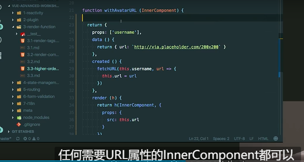
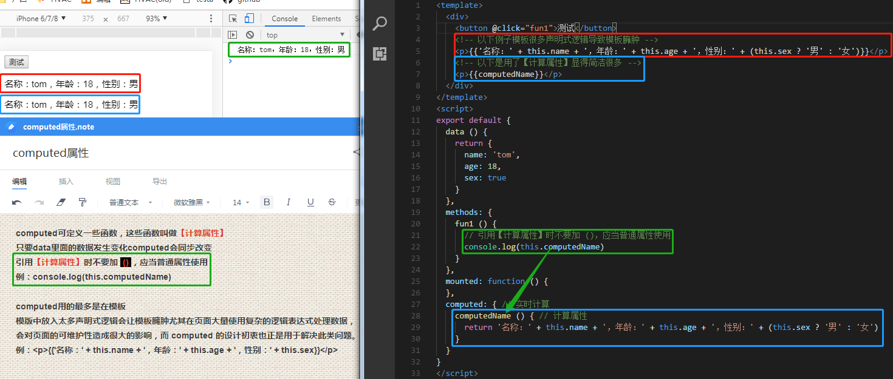
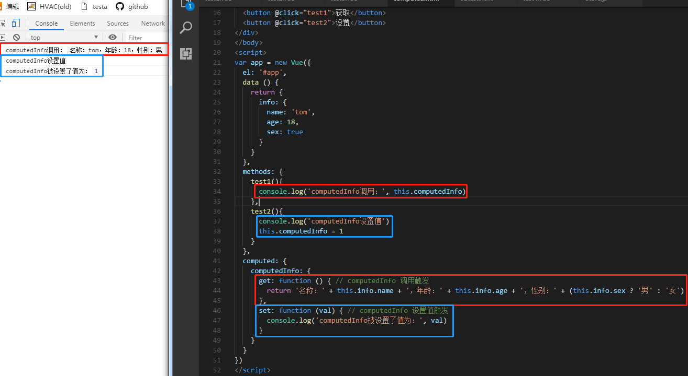
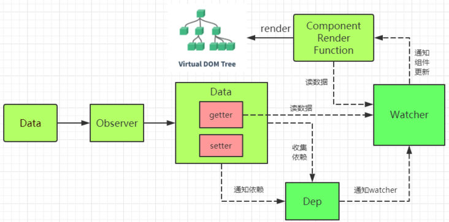
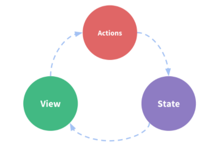
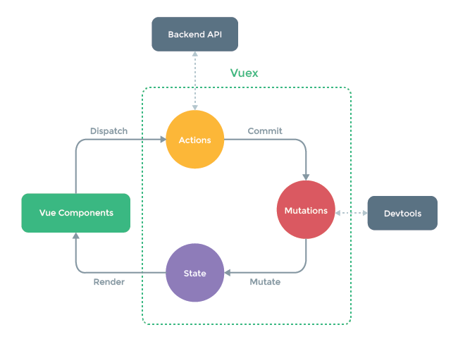

# vue

## 基础
[官方文档地址戳这](https://cn.vuejs.org/)

### 编译
#### webpack
Webpack 是一个强大的模块打包工具，适用于各种前端项目。
#### vue loader
Vue Loader 是专门为处理 Vue 单文件组件而设计的 Webpack 插件，简化了 Vue 项目的开发流程。

### 路由

1. Hash 模式\
定义：Hash 模式依赖于 URL 中的 hash（#）部分。当 URL 中包含 # 时，浏览器不会重新加载页面。Vue Router 会监听 hash 的变化，从而实现路由跳转。\
特点：\
兼容性好：由于使用 hash，几乎所有浏览器都支持。\
不需要服务器配置：因为 hash 部分不会被发送到服务器，所以不需要额外的服务器配置。\
示例 URL：<http://example.com/#/home>\
使用场景：适合对 SEO 要求不高的项目，或在不方便配置服务器的情况下使用。

2. History 模式\
定义：History 模式使用 HTML5 的 History API 来实现路由。这种模式下，URL 看起来更干净，不包含 hash。\
特点：\
更好的可读性：URL 更加美观，如 <http://example.com/home>。\
需要服务器支持：需要服务器配置以确保路由能够正确处理。例如，当用户直接访问某个子页面时，服务器需要返回主页面的 HTML，而不是404错误。\
示例 URL：<http://example.com/home>\
使用场景：适合需要考虑 SEO 的项目，或者希望提供更友好的用户体验的应用。

如何选择\
简单项目：如果是小型应用或快速原型，可以选择 Hash 模式，简单易用。\
较大型项目：如果项目需要良好的 SEO 和更友好的 URL 结构，建议使用 History 模式，但要确保服务器配置得当。


### 目录

#### @符号
@代表src目录下，类似于. 代表当前目录  .. 代表父级目录
```
import store from '@/store'
```

### 组件
#### slots插槽
插槽（slots）是一种强大的功能，允许你在组件中插入内容。这使得组件更具灵活性和可重用性。

#### Vue.extend( options ) (将废除)
vue2的在3里面废除了

#### Vue.use
Vuex 通过 `store` 选项，提供了一种机制将状态从根组件“注入”到每一个子组件中（需调用 `Vue.use(Vuex)`）：

#### Vue.mixin(options)

#### vue-avatar头像组件
InnderComponent


#### computed计算属性
computed设计初衷是为了抽出页面中复杂的处理数据逻辑表达式
```js
 例：<p>{{'名称：' + this.name + '，年龄：' + this.age + '，性别：' + (this.info.sex ? '男' : '女')}}</p>
```


一般都只用 getter ，以上内容就是 getter 的默认模式
很少用到 setter ，起码我做业务暂时没遇到，面试倒会有人会问
下面举个例子说说 setter



很多时候都会拿 Computed 与 Watch 对比(比如面试会问)
这两个都可以实现相同效果但过程有点不一样可以根据实际情况来用。

Computed特点：
需要主动调用，具有缓存能力只有数据再次改变才会重新渲染，
否则就会直接拿取缓存中的数据。

Watch特点：
无论在哪只要被绑定数据发生变化Watch就会响应，
这个特点很适合在异步操作时用上。

参考文档 \
[vue的computed计算属性](https://www.cnblogs.com/konghaowei/p/10893404.html)（https://www.cnblogs.com/konghaowei/p/10893404.html）

#### install

```js
import HUtils from './h-utils'
import HTable from './h-table'

const components = [
  HColorPicker,
  HTable
]

const install = function (Vue) {
  if (install.installed) return
  Vue.use(VueLazyload)
  Vue.use(Vue2Filters)
  Vue.use(VueMomentLib)
  Vue.use(VueClipboard)
  Vue.use(VueQr)
  Vue.use(VueAMap)
  Vue.use(HColorPicker)
  Vue.use(HUtils)
  components.map(component => {
    Vue.component(component.name, component)
  })
}

VueAMap.initAMapApiLoader({
  key: '7b60fe06561d020bb6f5f798f2eed9f9',
  plugin: ['AMap.Autocomplete', 'AMap.PlaceSearch', 'AMap.Scale', 'AMap.OverView', 'AMap.ToolBar', 'AMap.MapType', 'AMap.PolyEditor', 'AMap.CircleEditor', 'AMap.Geocoder', 'AMap.MouseTool', 'AMap.Geolocation'],
  // 默认高德 sdk 版本为 1.4.4
  v: '1.4.4'
})

// auto install
if (typeof window !== 'undefined' && window.Vue) {
  install(window.Vue)
}

export default {
  install
}


import * as option from './option'

const install = Vue => {
  Object.defineProperty(Vue.prototype, '$role', {
    value: option
  })
}

export default {
  install
}
```


#### $options

Mixins
与vuex的区别
vuex：用来做状态管理的，里面定义的变量在每个组件中均可以使用和修改，在任一组件中修改此变量的值之后，其他组件中此变量的值也会随之修改。
Mixins：可以定义共用的变量，在每个组件中使用，引入组件中之后，各个变量是<font color='red'>相互独立</font>的，值的修改在组件中不会相互影响。

与公共组件的区别
组件：在父组件中引入组件，相当于在父组件中给出一片独立的空间供子组件使用，然后根据props来传值，但本质上两者是相对独立的。
Mixins：则是在引入组件之后与组件中的对象和方法进行合并，相当于扩展了父组件的对象与方法，可以理解为形成了一个新的组件。

#### h函数
vue3新特性\
h函数就是vue中的createElement方法，这个函数作用就是创建虚拟dom，追踪dom变化的

#### async
场景：一个用同步的思维来解决异步问题，当前端接口调用需要等到接口返回值以后渲染页面时\
async关键字，放在函数前面，用于表示函数是异步函数，async函数返回的是一个promise 对象\
await关键字，只能放在async函数里面，await后面函数运行完并且有了返回结果之后，才继续执行下面的代码

```js
// 获取所有支付渠道
async $_getPaymentChannelList () {
  const { data = [] } = await this.$api.payment
    .getPaymentChannelList({
    })
    .catch(() => {
      this.paymentChannelList = []
    })
  this.paymentChannelList = data.filter(item => {
    return [
      // 'aliscanpay', // 支付宝扫码支付
      // 'fubeiwechatpay', // 微信当面付
      'alipay', // 支付宝 app
      'micropay', // 微信 app
      'unionpay', // 银联
      'alipay_miniprogram', // 支付宝小程序
      'xcxmicro', // 微信小程序
      'xcxmicro_duplicate', // delivery 小程序
      'xcxcoffeepay', // 麦咖啡小程序
      'sweetpay', // 甜品店小程序
      'tiktokpay' // 抖音小程序
    ].includes(item.platform)
  })
}
```

#### vue响应式
比较难！！https://segmentfault.com/a/1190000019700618
数据劫持 / 数据代理（侦测数据的变化）
依赖收集（收集视图依赖了哪些数据）
发布订阅模式（数据变化时，自动“通知”需要更新的视图部分，并进行更新）

在Javascript中，如何侦测一个对象的变化？
第一种：Object.defineProperty 
第二种：ES6的Proxy

详细描述：
第一种：Vue通过设定对象属性的 setter/getter 方法来监听数据的变化，通过getter进行依赖收集，而每个setter方法就是一个观察者，在数据变更的时候通知订阅者更新视图。
注意：
无法检测到对象属性的添加或删除(如data.location.a=1)。
	如果是删除属性，可以用vm.$delete实现
	如果是新增属性，
	1）可以使用 Vue.set(location, a, 1) 方法向嵌套对象添加响应式属性;
	2）也可以给这个对象重新赋值，比如data.location = {...data.location,a:1}
Object.defineProperty 不能监听数组的变化，需要进行数组方法的重写

第二种：Proxy
代码不仅精简，而且还是实现一套代码对对象和数组的侦测都适用。不过`Proxy`兼容性不太好



#### 过滤器
自定义过滤器
​	本地过滤器
​	全局过滤器

#### Vue.directive（自定义指令）


#### Vue.$mount()手动挂载
Vue 的`$mount()`为手动挂载，在项目中可用于延时挂载（例如在挂载之前要进行一些其他操作、判断等），之后要手动挂载上。new Vue时，el和$mount并没有本质上的不同
```js
export default new Vue({
  router,
  store,
  render: h => h(App)
}).$mount('#app')

new Vue({el: '#app', store: store})
new Vue({el: '#app', store})//es6写法，等同于上面
```

### vue2和3区别
源码层面：
|版本|区别|
|----|----|
|vue2	|javascript 使用flow进行类型检测
|vue3	|源码使用typescript进行重构，vue对typescript支持更加友好了

性能层面
|版本|区别|
|----|----|
|vue2	|使用object.defineProperty来劫持数据的setter和getter方法，对象改变需要借助api去深度监听
|vue3	|使用Proxy来实现数据劫持，删除了一些api($on,$once,$off) fiter等，优化了Block tree,solt,diff 算法等

api方面
|版本|区别|
|----|----|
|vue2	|OptionsAPI 在options里写data,methods,created等描述组件对象，多个逻辑可能在不不同地方，代码内聚性低
|vue3	|CompositionAPI 将模块相关代码统一放在一个地方处理，不需要在多个options里查找

hook函数增加代码复用性\
vue2使用mixins进行代码逻辑共享，mixins也是由一大堆options组成，如果有多个mixins则可能造成命名冲突等问题。\
vue3可以通过hook函数 将一部分独立的逻辑抽离出去，并且也是响应式的

代码写法方面\
vue3支持在template中写多个根，vue2只能有一个\
当内部有异步函数，需要使用到await的时候，可以直接使用，不需要在setup前面加async\
生命周期方面（大多生命周期前加on）

|vue2	|vue3	|生命周期
|----|----|----|
|beforeCreate()	|setup()	|组件开始创建数据实例之前
|created()	|setup()	|组件数据创建数据实例完成
|beforeMount()	|onBeforeAMount()	|DOM挂载之前
|mounted()	|onMounted()	|DOM挂载完成（页面完成渲染）
|beforeUpdate()	|onBeforeUpdate()	|组件数据更新之前
|undated()	|onUpdated()	|组件数据更新之后
|beforeDestroy()	|onBeforeunmount()	|组件销毁之前
|destroyed()	|onUnmounted()	|组件销毁之后


# vueX

## vueX 状态管理

#### 描述
Vuex 是一个专为 Vue.js 应用程序开发的状态管理模式

参考文档\
[Vuex官方文档](https://vuex.vuejs.org/zh/)(<https://vuex.vuejs.org/zh/>)

##### 和store区别

1、Vuex 的状态存储是响应式的。当 Vue 组件从 store 中读取状态的时候，若 store 中的状态发生变化，那么相应的组件也会相应地得到高效更新\
2、不能直接改变 store 中的状态。改变 store 中的状态的唯一途径就是显式地提交 (commit) mutation。这样使得我们可以方便地跟踪每一个状态的变化

#### 使用

##### 场景

使用：如果是中大型单页应用，很可能会考虑如何更好地在组件外部管理状态
不使用：如果不是大型单页应用，Vuex 可能是繁琐冗余的，小应用简单的 [store 模式 (opens new window)](https://cn.vuejs.org/v2/guide/state-management.html#简单状态管理起步使用)就足够了。

##### 代码

```js
import Vue from 'vue'
import Vuex from 'vuex'

Vue.use(Vuex)

const store = new Vuex.Store({
  state: {
    count: 0
  },
  mutations: {
    increment (state) {
      state.count++
    }
  }
})

//查询 store.state 来获取状态对象
console.log(store.state.count) // -> 1
//修改 store.commit 方法触发状态变更
store.commit('increment')


```

#### 核心概念

state，驱动应用的数据源；
view，以声明方式将 state 映射到视图；
actions，响应在 view 上的用户输入导致的状态变化。





```js
const store = new Vuex.Store({
  state: {
    // 存放状态
  },
  getters: {
    // state的计算属性
  },
  mutations: {
    // 更改state中状态的逻辑，同步操作
  },
  actions: {
    // 提交mutation，异步操作
  },
  // 如果将store分成一个个的模块的话，则需要用到modules。
   //然后在每一个module中写state, getters, mutations, actions等。
  modules: {
    a: moduleA,
    b: moduleB,
  }
});
```


##### store

Vuex 通过 `store` 选项，提供了一种机制将状态从根组件“注入”到每一个子组件中

##### state

###### mapState 辅助函数

当一个组件需要获取多个状态的时候，将这些状态都声明为计算属性会有些重复和冗余。为了解决这个问题，我们可以使用 mapState 辅助函数帮助我们生成计算属性

```js
// 在单独构建的版本中辅助函数为 Vuex.mapState
import { mapState } from 'vuex'
export default {
  computed: mapState({
    // 箭头函数可使代码更简练
    count: state => state.count,
    // 传字符串参数 'count' 等同于 `state => state.count`
    countAlias: 'count',
    // 为了能够使用 `this` 获取局部状态，必须使用常规函数
    countPlusLocalState (state) {
      return state.count + this.localCount
    }
  })
}

computed: {
  localComputed () { /* ... */ },
  // 使用对象展开运算符将此对象混入到外部对象中
  ...mapState({
    // ...
  })
}
```

##### getters

从 store 中的 state 中派生出一些状态,Vuex 允许我们在 store 中定义“getter”（可以认为是 store 的计算属性）

```js
const store = new Vuex.Store({
  state: {
    todos: [
      { id: 1, text: '...', done: true },
      { id: 2, text: '...', done: false }
    ]
  },
  getters: {
    //属性
    doneTodos: state => {
      return state.todos.filter(todo => todo.done)
    }，
    //方法 getter 在通过方法访问时，每次都会去进行调用，而不会缓存结果
    getTodoById: (state) => (id) => {	
      return state.todos.find(todo => todo.id === id)
    }
  }
})
//属性访问
store.getters.doneTodos // -> 1
//方法访问
store.getters.getTodoById(2) // -> { id: 2, text: '...', done: false }
```

###### mapGetters 辅助函数

```js
import { mapGetters } from 'vuex'
export default {
  computed: {
  // 使用对象展开运算符将 getter 混入 computed 对象中
    ...mapGetters([
      'doneTodosCount',
      'anotherGetter',
      // ...
    ])
  }
}
//重命名getter属性，使用对象形式
...mapGetters({
  // 把 `this.doneCount` 映射为 `this.$store.getters.doneTodosCount`
  doneCount: 'doneTodosCount'
})
```

##### Mutation（commit）
更改 Vuex 的 store 中的状态的唯一方法是提交 mutation
每个 mutation 都有一个字符串的 **事件类型 (type)** 和 一个 **回调函数 (handler)**
这个回调函数就是我们实际进行状态更改的地方，并且它会接受 state 作为第一个参数

mutation 必须是**同步函数**

```js
const store = new Vuex.Store({
  state: {
    count: 1
  },
  mutations: {
    increment (state) {//increment就是类型
      // 修改store数据
      state.count++
    }
  }
})
//用type和commit方法唤醒handler
store.commit('increment')
```

###### payload 载荷

第一个参数是state，第二个参数是载荷

```js
//一种
mutations: {
  increment (state, n) {
    state.count += n
  }
}
store.commit('increment', 10)//提交载荷
//二种
mutations: {
  increment (state, payload) {
    state.count += payload.amount
  }
}
store.commit('increment', {amount: 10})
//三种
store.commit({//整体作为载荷，整个对象都作为载荷传给 mutation 函数，因此 handler 保持不变
  type: 'increment',
  amount: 10
})
```

###### mapMutations  辅助函数

###### 组件中提交mutation

```js
// 方法一
this.$store.commit('xxx')
// 方法二
import { mapMutations } from 'vuex'
export default {
  methods: {
    ...mapMutations([
      'increment', // 将 `this.increment()` 映射为 `this.$store.commit('increment')`
      // `mapMutations` 也支持载荷：
      'incrementBy' // 将 `this.incrementBy(amount)` 映射为 `this.$store.commit('incrementBy', amount)`
    ]),
    ...mapMutations({
      add: 'increment' // 将 `this.add()` 映射为 `this.$store.commit('increment')`
    })
  }
}
```

##### action（dispatch）
Action 类似于 mutation，不同在于：
1、Action 提交的是 mutation，而不是直接变更状态。
2、Action 可以包含任意异步操作。

Action 函数接受一个与 store 实例具有相同方法和属性的 context 对象，因此你可以调用 `context.commit` 提交一个 mutation，或者通过 `context.state` 和 `context.getters` 来获取 state 和 getters。当我们在之后介绍到 Modules 时，你就知道 context 对象为什么不是 store 实例本身了。

```js
const store = new Vuex.Store({
  state: {
    count: 0
  },
  mutations: {
    increment (state) {
      state.count++
    }
  },
  actions: {
    //写法一
    increment (context) {
      context.commit('increment')
    }
    //写法二 参数解构
    increment ({ commit }) {
      commit('increment')
    }
  }
})
//Action 通过 store.dispatch 方法触发
store.dispatch('increment')
// 以载荷形式分发
store.dispatch('incrementAsync', {amount: 10})
// 以对象形式分发
store.dispatch({type: 'incrementAsync',amount: 10})
```

```js
//看一个更加实际的购物车示例，涉及到调用异步 API 和分发多重 mutation：
actions: {
  checkout ({ commit, state }, products) {
    // 把当前购物车的物品备份起来
    const savedCartItems = [...state.cart.added]
    // 发出结账请求，然后乐观地清空购物车
    commit(types.CHECKOUT_REQUEST)
    // 购物 API 接受一个成功回调和一个失败回调
    shop.buyProducts(
      products,
      // 成功操作
      () => commit(types.CHECKOUT_SUCCESS),
      // 失败操作
      () => commit(types.CHECKOUT_FAILURE, savedCartItems)
    )
  }
}
```

###### mapActions  辅助函数

###### 组件中分发action

```js
//方法一
this.$store.dispatch('xxx')
//方法二
import { mapActions } from 'vuex'
export default {
  methods: {
    ...mapActions([
      'increment', // 将 `this.increment()` 映射为 `this.$store.dispatch('increment')`
      // `mapActions` 也支持载荷：
      'incrementBy' // 将 `this.incrementBy(amount)` 映射为 `this.$store.dispatch('incrementBy', amount)`
    ]),
    ...mapActions({
      add: 'increment' // 将 `this.add()` 映射为 `this.$store.dispatch('increment')`
    })
  }
}
```

###### 组合action

```js
//方法三 组合action
actions: {
  actionA ({ commit }) {
    return new Promise((resolve, reject) => {
      setTimeout(() => {
        commit('someMutation')
        resolve()
      }, 1000)
    })
  },
  actionB ({ dispatch, commit }) {
    return dispatch('actionA').then(() => {//调用actionA
      commit('someOtherMutation')
    })
  }
}

actions: {
  async actionA ({ commit }) {
    commit('gotData', await getData())
  },
  async actionB ({ dispatch, commit }) {
    await dispatch('actionA') // 等待 actionA 完成
    commit('gotOtherData', await getOtherData())
  }
}
```


##### module

由于使用单一状态树，应用的所有状态会集中到一个比较大的对象。当应用变得非常复杂时，store 对象就有可能变得相当臃肿。

为此Vuex 允许我们将 store 分割成**模块（module）**。每个模块拥有自己的 state、mutation、action、getter、甚至是嵌套子模块——从上至下进行同样方式的分割

```js
const moduleA = {
  state: () => ({ ... }),
  mutations: { ... },
  actions: { ... },
  getters: { ... }
}
const moduleB = {
  state: () => ({ ... }),
  mutations: { ... },
  actions: { ... }
}
const store = new Vuex.Store({//嵌套modules
  modules: {
    a: moduleA,
    b: moduleB
  }
})

store.state.a // -> moduleA 的状态
store.state.b // -> moduleB 的状态
```

###### 局部状态

```js
const moduleA = {
  actions: {
    //对于模块内部的 action，局部状态通过 context.state 暴露出来，根节点状态则为 context.rootState
    incrementIfOddOnRootSum ({ state, commit, rootState }) {
      if ((state.count + rootState.count) % 2 === 1) {
        commit('increment')
      }
    }
  }
}
```

###### 命名空间

######  模块动态注册

```js
import Vuex from 'vuex'
const store = new Vuex.Store({ /* 选项 */ })
// 注册模块 `myModule`
store.registerModule('myModule', {
})
// 注册嵌套模块 `nested/myModule`
store.registerModule(['nested', 'myModule'], {
})
```

###### 保留 state

在注册一个新 module 时，你很有可能想保留过去的 state，例如从一个服务端渲染的应用保留 state。你可以通过 `preserveState` 选项将其归档：`store.registerModule('a', module, { preserveState: true })`。

当你设置 `preserveState: true` 时，该模块会被注册，action、mutation 和 getter 会被添加到 store 中，但是 state 不会。这里假设 store 的 state 已经包含了这个 module 的 state 并且你不希望将其覆写。

######  模块重用

#### 插件（subscribe）

###### 插件内提交mutation

```js
const myPlugin = store => {
  // 当 store 初始化后调用
  store.subscribe((mutation, state) => {
    // 每次 mutation 之后调用
    // mutation 的格式为 { type, payload }
  })
}
const store = new Vuex.Store({
  // ...
  plugins: [myPlugin]
})
```

###### 生成 State 快照

###### 内置 Logger 插件

```js
//引入
import createLogger from 'vuex/dist/logger'
const store = new Vuex.Store({
  plugins: [createLogger()]
})
//配置
const logger = createLogger({
  collapsed: false, // 自动展开记录的 mutation
  filter (mutation, stateBefore, stateAfter) {
    // 若 mutation 需要被记录，就让它返回 true 即可
    // 顺便，`mutation` 是个 { type, payload } 对象
    return mutation.type !== "aBlocklistedMutation"
  },
  actionFilter (action, state) {
    // 和 `filter` 一样，但是是针对 action 的
    // `action` 的格式是 `{ type, payload }`
    return action.type !== "aBlocklistedAction"
  },
  transformer (state) {
    // 在开始记录之前转换状态
    // 例如，只返回指定的子树
    return state.subTree
  },
  mutationTransformer (mutation) {
    // mutation 按照 { type, payload } 格式记录
    // 我们可以按任意方式格式化
    return mutation.type
  },
  actionTransformer (action) {
    // 和 `mutationTransformer` 一样，但是是针对 action 的
    return action.type
  },
  logActions: true, // 记录 action 日志
  logMutations: true, // 记录 mutation 日志
  logger: console, // 自定义 console 实现，默认为 `console`
})
```

## 项目结构

```bash
├── index.html
├── main.js
├── api
│   └── ... # 抽取出API请求
├── components
│   ├── App.vue
│   └── ...
└── store
    ├── index.js          # 我们组装模块并导出 store 的地方
    ├── actions.js        # 根级别的 action
    ├── mutations.js      # 根级别的 mutation
    └── modules
        ├── cart.js       # 购物车模块
        └── products.js   # 产品模块
```

## 严格模式

开启严格模式，仅需在创建 store 的时候传入 `strict: true`

在严格模式下，无论何时发生了状态变更且不是由 mutation 函数引起的，将会抛出错误。这能保证所有的状态变更都能被调试工具跟踪到

```js
const store = new Vuex.Store({
  strict: true
})

//生产环境不要使用严格模式，会造成性能损失
const store = new Vuex.Store({
  strict: process.env.NODE_ENV !== 'production'
})
```


## window 对象

定义全局变量与在 window 对象上直接定义属性差别。

1、全局变量不能通过 delete 操作符删除；而 window 属性上定义的变量可以通过 delete 删除

```
var num=123;
window.str="string";
delete num;
delete str;
console.log(num); //123

console.log(str); //str is not defined
//全局变量不能通过 delete 删除，因为通过 var 定义全局变量会有一个名为 [Configurable] 的属性，默认值为 false，所以这样定义的属性不可以通过 delete 操作符删除
```

2、访问未声明的变量会抛出错误，但是通过查询 window 对象，可以知道某个可能未声明的变量是否存在。

```
var newValue=oldValue; // 报错：oldValue is not defined
var newValue=window.oldValue; // 不会报错
console.log(newValue); // undefined
```

3、有些自执行函数里面的变量，想要外部也访问到的话，在 window 对象上直接定义属性。

