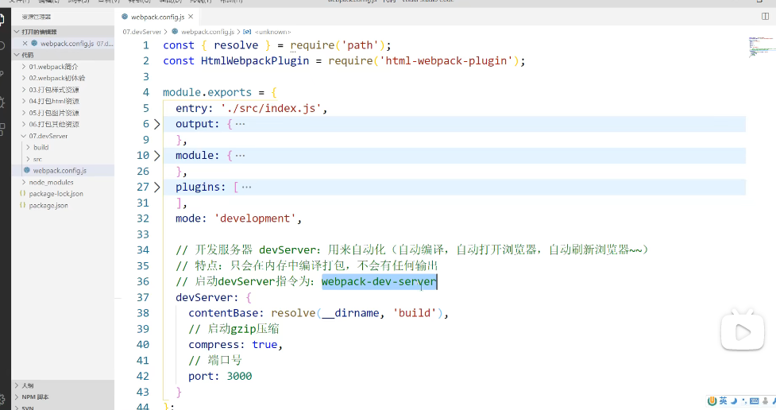
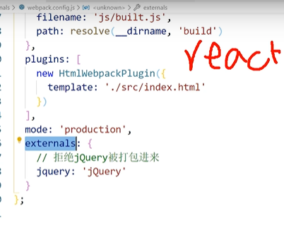
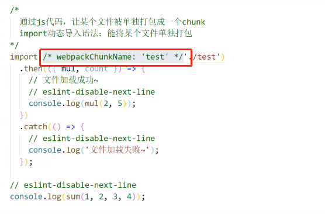
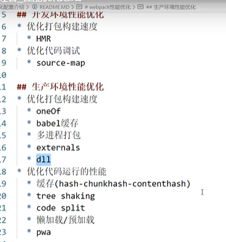
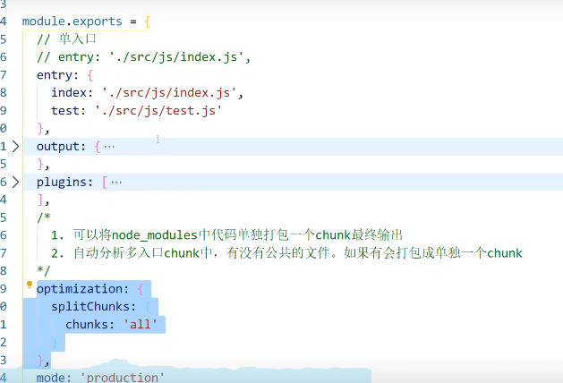
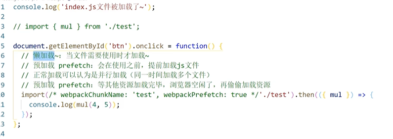

# webpack

## 概念

### chunk

chunk就是将一个大文件拆分出来的一部分代码，拆分成小的就为了提高浏览器加载速度的。chunk-vendors一般是你引用的第三方库的代码

## 打包

### ① 命令

webpack-dev-server ：会将打包结果输出出去

npx webpack-dev-server：只会在内存中编译打包，没有输出



### ② 拒绝打包 externals



### ③ 多进程打包

thread-loader

1. 剥离万象项目的代码模块(太一、南风、游戏运营后台、渠道商)，这一块已经有专人处理
2. 借助`webpack-bundle-analyzer`分析打包的情况(数量、体积)
   main.js文件太大，引入组件太多（路由动态加载，公共组件开发哪里使用哪里引用，不要注册到main.js
3. ）
4. 生产环境 结合externals属性，对vue全家桶使用CDN，不打包这些
5. loadash按需打包
6. HardSourceWebpackPlugin优化二次打包速度
7. optimization 公共代码抽离
8. 启用DllPlugin和DllReferencePlugin预编译库文件，新建webpack.dll.conf.js文件，二次打包无变化 不打包
9. 开启Gzip压缩（之前已开启）
10. UglifyJsPlugin配置代码压缩
11. image-webpack-loader配置图片压缩

### ④ dll 打包

使用dll技术，对某些库（第三方库jquery、vue）进行单独打包

https://blog.csdn.net/weixin_39773218/article/details/97494099

### ⑤ 单独打包

**在默认配置下，main.js中异步加载或间接异步加载的模块，都会被另外打包生成一个js文件。**

import动态导入语法：能将某个文件单独打包



### ⑥ 打包优化



## loader

可以转换不同代码

loader 用于对模块的源代码进行转换。loader 可以使你在 `import` 或 "load(加载)" 模块时预处理文件

loader 可以将文件从不同的语言（如 TypeScript）转换为 JavaScript 或将内联图像转换为 data URL。loader 甚至允许你直接在 JavaScript 模块中 `import` CSS 文件

## 插件

### 1、SplitChunks插件

是Webpack中一个提取或分离代码的插件，主要作用是提取公共代码，防止代码被重复打包，拆分过大的js文件，合并零散的js文件，SplitChunks插件的作用就是通过配置让Webpack去帮你提取公共代码




懒加载、预加载



#### 实战

##### ① SplitChunks实战入口文件

发现chunk-vendors.js的大小有点大了，有1.91MB，还是项目初始化时需要加载的js文件，大小过大会导致首屏加载时间过长。要优化一下，由两种方法

第一种用externals来优化

第二种用SplitChunks优化。例如要把*element*从*chunk-vendors.js*提取出来，要在`cacheGroups`中配置：

```text
element: {
    chunks: 'all',
    name: `element-ui`,
    test: /[\\/]element-ui[\\/]/,
    priority: 0,
},
```

其中要注意`priority`选项，要把element单独提取出来，**`priority`的值必须比vendors方案中的`priority`的值大**，不然提取不出来。

打包后可看到element被打包生成新的*element-ui.js*文件，chunk-vendors.js大小变成1.27MB，比原来的1.91MB有减小

##### ② SplitChunks实战非入口文件


#### 参考链接：

https://zhuanlan.zhihu.com/p/152097785?from_voters_page=true

### 2、webpack-bundle-analyzer插件

可以可视化分析打包后的文件,打包后，会在浏览器自动打开[http://127.0.0.1:8888/](https://link.zhihu.com/?target=http%3A//127.0.0.1%3A8888/)，内容如下所示

```text
npm install webpack-bundle-analyzer --save-dev
```

```javascript
const BundleAnalyzerPlugin = require('webpack-bundle-analyzer').BundleAnalyzerPlugin;
module.exports={
    configureWebpack:config =>{
        return {
            plugins:[
                new BundleAnalyzerPlugin()
            ]
        }
    }
}
```


## 原理

chunk 有两种形式：

- `initial(初始化)` 是入口起点的 main chunk。此 chunk 包含为入口起点指定的所有模块及其依赖项。
- `non-initial` 是可以延迟加载的块。可能会出现在使用 [动态导入(dynamic imports)](https://webpack.docschina.org/guides/code-splitting/#dynamic-imports) 或者 [SplitChunksPlugin](https://webpack.docschina.org/plugins/split-chunks-plugin/) 时


# PWA 

PWA 全称为 Progressive Web App，中文译为渐进式 Web APP，其目的是通过各种 Web 技术实现与原生 App 相近的用户体验。

 Web 应用与原生应用的对比差距，比如离线缓存、沉浸式体验等等


 # vite
前端打包工具
https://vite.dev/guide/