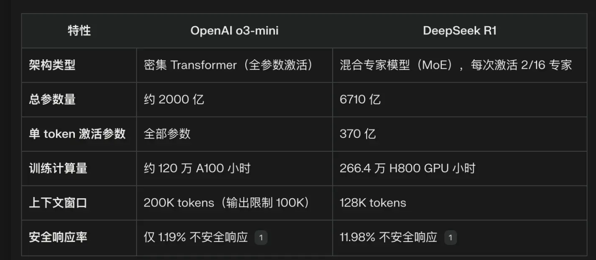
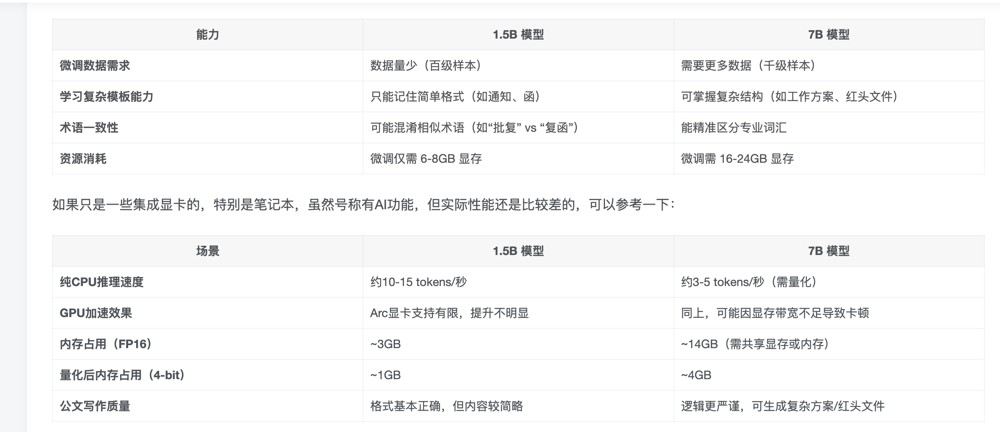
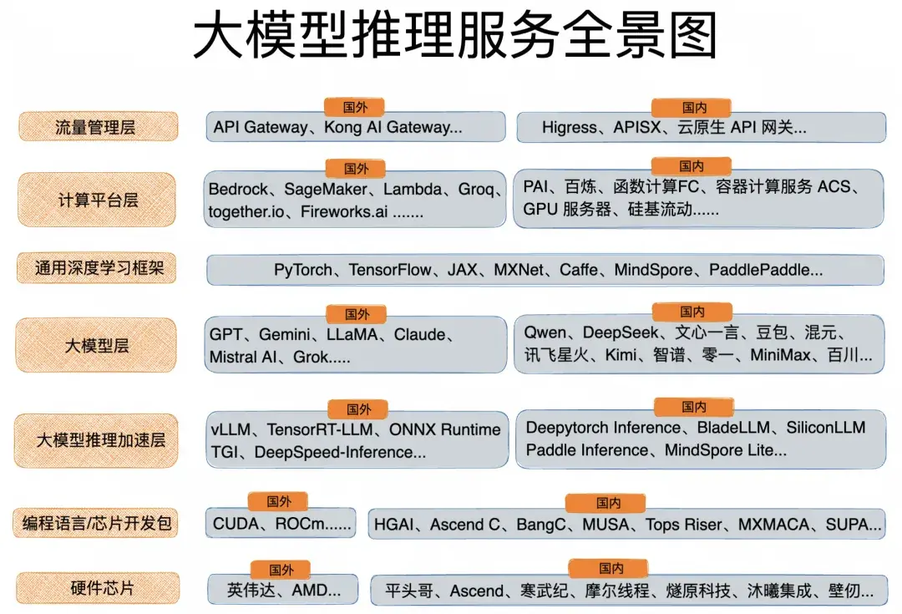

# 人工智能

## 机器学习
### 无监督学习
### 半监督学习
有特征值、无目标值
### 监督学习（常用）
### 强化学习

### Scikit-learn 
专门针对机器学习应用而发展起来的开源框架(算法库)\
可以实现数据预处理、分类、回归、降维以及模型评估等机器学习算法

[Scikit-learn官网](https://scikit-learn.org/stable/index.html)<https://scikit-learn.org/stable/index.html>

## 线性回归
## 逻辑回归

## 方向
### 自然语言处理
### 图像处理

## ollama
本地运行大型语言模型（LLM）的工具，支持多种开源模型

## 蒸馏技术
蒸馏的全称叫做知识蒸馏，英文叫做Knowledge Distillation。这个概念最早出现在2015年《Distilling the Knowledge in a Neural Network》（一篇叫做《在神经网络中的知识蒸馏》）论文里。文章里具体介绍了什么是蒸馏：教师模型通过一些技术把能力和知识，传授给学生模型的过程，叫做蒸馏。 所以蒸馏的并不是大模型架构和代码，它只是蒸馏的大模型里面包含的知识(knowledge)。所以要强调Distllation是知识蒸馏，不是整个架构的抄袭。

## deepseek
DeepSeek使用英伟达的H800芯片训练时，使用英伟达底层硬件指令PTX（Parallel Thread Execution）语言，而非高级编程语言CUDA。\
这样意味着DeepSeek绕过了CUDA，使用更底层的编程语言做优化。
不太对
PTX依赖CUDA

## AIGC
AI Generated Content人工智能生成内容，
指的是利用人工智能技术自动生成的文本、图像、音频等数字内容的总称。

AIGC的核心技术

自然语言处理（NLP）：用于理解和生成文本内容，应用于智能写作、自动摘要、聊天机器人等领域。

计算机视觉：用于图像和视频的生成与处理，应用于自动绘图、视频合成、图像增强等场景。

生成对抗网络（GAN）：通过生成器和判别器的对抗训练，生成高质量的图像、音频等内容。

深度学习模型：如Transformer、GPT系列等，用于处理复杂的内容生成任务。

## GPU编程
### CUDA 
底层C++

CUDA是NVIDIA公司所开发的GPU编程模型，它提供了GPU编程的简易接口，基于CUDA编程可以构建基于GPU计算的应用程序。CUDA提供了对其它编程语言的支持，如C/C++，Python，Fortran等语言

PTX

参考文档
【CUDA编程入门极简教程】https://zhuanlan.zhihu.com/p/34587739

## 量化 去量化
量化 
精度降低，减少了模型的存储需求和计算负担，通过降低数值精度提高了推理效率。

去量化 
精度恢复，确保在某些操作中能维持更高的计算精度。

## AI应用
图转3D
算命
AI视频

自然语言
图片
视频

## 人工智能面试

参考文档 
【人工智能算法面试大总结-总目录】https://blog.csdn.net/zzh516451964zzh/article/details/126857351

### Transformer专题
以下是关于 Transformer 及其各个组件的详细解释：

#### 1. **什么是 Transformer？**
Transformer 是一种基于自注意力机制的模型架构，最初由 Vaswani 等人在 2017 年提出，主要用于处理序列数据（如机器翻译）。它与传统的 RNN 和 CNN 不同，完全依赖于注意力机制来捕捉序列中的全局依赖关系。Transformer 的设计分为 **编码器（Encoder）** 和 **解码器（Decoder）** 两部分，可以并行计算并具有较强的长程依赖建模能力。

#### 2. **Transformer中的 Encoder**
Transformer 的编码器由多个相同的层堆叠而成，每一层包括两个主要部分：
- **多头自注意力机制（Multi-Head Self-Attention）**：用于捕捉输入序列中各个词之间的关系。
- **前馈神经网络（Feed Forward Network）**：对每个位置的表示进行非线性转换，增强模型的表达能力。

每层都有两个子层，分别通过 **残差连接** 和 **层归一化** 进行连接。编码器的作用是接收输入序列（如源语言句子），并通过多个编码器层将其转换为一个上下文相关的表示。

#### 3. **Transformer中的 Decoder**
Transformer 的解码器与编码器类似，但它的设计中加入了一个额外的子层：
- **自注意力机制**：类似编码器中的自注意力，但解码器在这个阶段会“遮蔽”（Mask）未来的位置信息。
- **编码-解码注意力（Encoder-Decoder Attention）**：解码器与编码器的输出进行交互，帮助解码器生成当前时刻的输出。
- **前馈神经网络**：对每个位置的表示进行非线性转换。

解码器的目标是生成目标序列（如翻译后的句子）。

#### 4. **Transformer在训练与测试阶段Decoder的输入、输出是什么？**
- **训练阶段：**
  - **输入**：解码器的输入是目标序列的前缀（通常是一个带有偏移的目标词），比如在机器翻译中，解码器接收到目标语言的部分翻译。
  - **输出**：解码器会生成一个输出序列，每个位置的输出是当前时刻生成的词的概率分布。
  
- **测试阶段：**
  - **输入**：解码器的输入是起始标记（如 `<START>`），然后每生成一个词，解码器会将前一个生成的词作为输入。
  - **输出**：解码器依次生成一个序列，直到输出结束标记（如 `<END>`）。

#### 5. **Transformer Encoder和Decoder有哪些不同？**
- **输入/输出的不同**：编码器处理的是输入序列，而解码器生成的是输出序列（例如翻译后的句子）。
- **解码器多了一个编码-解码注意力**：解码器在生成每个词时，不仅关注自己的输入（自注意力），还需要关注编码器的输出（编码-解码注意力）。
- **遮蔽机制**：解码器的自注意力机制是遮蔽的，防止模型“看到”未来的信息，而编码器则不需要遮蔽机制。

#### 6. **什么是 Transformer 中的 Embedding？**
**Embedding** 是将离散的词汇（如词汇表中的单词）转换为连续的向量表示的过程。Transformer 中的 **词嵌入（Word Embedding）** 将每个输入的词映射到一个固定维度的向量空间。在编码器和解码器的输入中，输入的单词都会通过词嵌入转化为向量，作为后续处理的输入。

#### 7. **什么是 Positional Embedding？**
由于 Transformer 不使用卷积或递归结构，因此它缺少传统序列模型中内建的顺序信息。为了让模型理解单词之间的位置关系，**Positional Embedding** 被添加到词嵌入中，提供每个词的位置信息。通常，位置嵌入是通过一个预定义的函数（如正弦和余弦函数）生成的，能够给模型提供序列中的位置信息。

#### 8. **什么是 Transformer 中的 Attention？**
**Attention** 是 Transformer 模型的核心机制，用于计算输入序列中各个位置之间的关系。基本思想是通过“注意”某些输入词来生成当前词的表示，而不是像传统的 RNN 那样顺序地处理。自注意力机制可以让模型在处理当前词时，同时关注到输入序列中其他词的信息。

#### 9. **Transformer Attention 中的 Q、K、V 是什么？**
- **Q（Query）**：查询向量，表示当前处理的位置所查询的上下文信息。
- **K（Key）**：键向量，用于与查询向量进行相似度计算。
- **V（Value）**：值向量，包含要传递给当前词的信息。

注意力机制的核心是计算查询向量和键向量之间的相似度（通常是点积），然后使用这个相似度加权值向量，最终得到当前词的表示。

#### 10. **Transformer 中 Attention 的实现步骤？**
1. **计算注意力分数**：通过点积计算查询向量 Q 和键向量 K 之间的相似度。
2. **应用缩放因子**：为了避免点积值过大，通常会对相似度进行缩放（除以键的维度的平方根）。
3. **应用 Softmax**：对相似度应用 Softmax 操作，得到每个位置的权重。
4. **加权值向量**：根据计算出的权重对值向量 V 进行加权平均，得到最终的输出。

#### 11. **什么是 Transformer 中的 Multi-Head Attention？**
**Multi-Head Attention** 是将多个注意力头（多个不同的 Q、K、V 组合）并行计算，并将它们的结果拼接在一起。每个头关注输入的不同部分，通过多个视角捕捉信息，增强模型的表达能力。最终将各个头的输出拼接并通过线性变换得到最终的结果。

#### 12. **什么是 Transformer 中的 Mask Multi-Head Attention？**
**Mask Multi-Head Attention** 是一种修改版的多头注意力，主要用于解码器部分。它通过遮蔽（mask）机制避免模型在生成序列时看到未来的信息，确保生成过程的自回归特性。通过设置掩码矩阵，解码器的每个位置只能“看到”当前位置及之前的位置。

#### 13. **什么是 Transformer 中的 Feed Forward Networks？**
**Feed Forward Networks** 是 Transformer 中的一个组件，位于每个编码器和解码器的层中，位于自注意力机制之后。它通常由两个全连接层组成，其中一个是激活函数（如 ReLU）非线性变换。这个网络用于对每个位置的表示进行独立处理，增强模型的表达能力。每个位置的计算是独立的，因此该层是位置无关的。

### 特征工
#### 1. **特征工程**
特征工程是指对原始数据进行处理、转换、选择等一系列操作，以使数据更好地适应机器学习模型。主要包括：
- **特征选择**：挑选最相关的特征来减少冗余，防止过拟合。
- **特征提取**：从原始数据中提取出新的特征。
- **特征缩放**：包括标准化和归一化，将特征值缩放到相似的范围。
- **编码类别特征**：如 one-hot 编码、标签编码等。
- **处理缺失值**：如填补缺失值或删除缺失值行。
- **特征降维**：使用PCA（主成分分析）等方法减少特征的维度。

#### 2. **遇到缺值的处理方法**
处理缺失值的方法有：
- **删除法**：直接删除包含缺失值的样本或特征，适用于缺失值较少的情况。
- **填补法**：用均值、中位数、众数或其他统计值来填补缺失值，或者使用预测模型（如 KNN、回归）来填补。
- **插值法**：对时序数据，可以使用插值（如线性插值）方法填补缺失值。
- **使用模型**：如使用树模型或深度学习模型来预测缺失值。

#### 3. **机器学习中解决样本不均衡问题的方法**
- **过采样（Over-sampling）**：通过复制少数类样本或生成新的少数类样本（如 SMOTE 方法）。
- **欠采样（Under-sampling）**：减少多数类样本的数量。
- **调整类权重**：在模型训练中增加少数类样本的权重，减少多数类样本的权重。
- **生成对抗网络（GAN）**：通过生成对抗网络来生成更多少数类样本。

#### 4. **深度学习中解决样本不均衡问题的方法**
- **损失函数加权**：给不同类样本设定不同的损失权重，使模型更关注少数类。
- **数据增强**：通过旋转、缩放、裁剪等方式增强少数类样本的数量。
- **过采样和欠采样**：同样可以应用过采样（如 SMOTE）和欠采样技术，但深度学习中更依赖于数据增强和调整损失函数。
- **迁移学习**：在不均衡数据集上，可以尝试迁移学习，使用在大数据集上训练的模型。

#### 5. **如何解决训练样本少的问题**
- **数据增强**：对现有数据进行各种变换，如旋转、平移、翻转、缩放等（尤其在图像和文本领域）。
- **迁移学习**：利用已有的大型数据集训练好的模型，进行迁移学习。
- **合成数据**：使用生成模型（如 GAN）或其他方法生成合成数据。
- **半监督学习**：结合标注数据和未标注数据，通过自训练等方法提高模型泛化能力。

#### 6. **常见的特征筛选方法**
- **过滤法（Filter）**：根据特征与目标变量的相关性（如皮尔逊相关系数、卡方检验、信息增益等）筛选特征。
- **包裹法（Wrapper）**：通过选择一组特征训练模型，评估模型的性能，并根据性能选择特征（如递归特征消除，RFE）。
- **嵌入法（Embedded）**：在模型训练过程中选择特征，例如 L1 正则化（Lasso回归）等。

#### 7. **特征选择的目的**
特征选择的目的是提高模型的性能，减少计算成本，防止过拟合，增强模型的可解释性。通过选择最相关和最有信息量的特征，模型能够更加专注于关键的特征，从而提高泛化能力。

#### 8. **训练时出现 NaN 的原因**
- **数据异常**：如数据集中存在无效值（如无穷大、NaN、缺失值等）。
- **梯度爆炸或梯度消失**：在深度学习模型中，特别是深层神经网络中，梯度可能变得过大或过小，导致 NaN。
- **不合适的学习率**：学习率过大可能导致权重更新过快，造成数值溢出。
- **不稳定的模型架构**：某些网络层（如批归一化、激活函数等）可能在不恰当的初始化或计算中导致 NaN。

#### 9. **如何找出相似性高的特征并去掉**
- **相关性分析**：通过计算特征间的相关系数（如皮尔逊相关系数），找出高度相关的特征。
- **主成分分析（PCA）**：通过降维方法将特征投影到主成分空间，去除冗余特征。
- **L1 正则化**：Lasso 回归使用 L1 正则化来选择最重要的特征，可以将一些冗余特征的系数压缩为零。

### 模型优化
#### 1. **模型压缩方法**  
模型压缩（Model Compression）是一系列技术，旨在减少神经网络的大小、计算量以及内存消耗，同时保持模型的性能。常见的模型压缩方法包括：

- **剪枝（Pruning）：** 剪枝是通过去除网络中某些不重要的权重（通常是小于某个阈值的权重）来减小模型规模。剪枝后的网络往往稀疏，减少了计算复杂度。
  
- **低秩近似（Low-Rank Approximation）：** 通过将矩阵分解为低秩矩阵，减少模型参数的存储需求，同时保持其表示能力。
  
- **量化（Quantization）：** 将浮点数权重映射为较低精度的数据类型（如整数），从而减少模型存储空间并加速计算。
  
- **知识蒸馏（Knowledge Distillation）：** 通过训练一个小模型（学生模型）来模仿一个大模型（教师模型）的行为，从而将教师模型的知识传递到学生模型中。

#### 2. **模型压缩的作用与意义**
模型压缩的主要作用是：
- **减少存储需求：** 压缩后的模型占用更少的内存，便于在内存有限的设备上部署。
- **加速推理：** 压缩后的模型计算复杂度降低，可以提高推理速度，减少响应时间。
- **节省计算资源：** 在计算资源受限的环境中，压缩后的模型能够减少计算负担，适应边缘设备和移动设备。
- **部署到嵌入式设备：** 压缩使得大规模深度神经网络可以部署到硬件资源有限的设备中，如物联网设备、智能手机、嵌入式设备等。

#### 3. **低秩近似**
低秩近似通过将高维的矩阵表示为低秩矩阵的乘积，减少了模型的参数量，从而压缩模型的大小和加速计算。常见的方法有奇异值分解（SVD）和矩阵分解，它们可以有效地减小模型的复杂度，特别适用于卷积层和全连接层的矩阵。

#### 4. **剪枝与稀疏约束**
- **剪枝（Pruning）：** 是通过移除网络中一些权重接近零的连接，减少参数量。可以是基于权重的剪枝（删除小于某个阈值的权重）或结构化剪枝（删除整个神经元或卷积核）。
  
- **稀疏约束（Sparse Regularization）：** 通过正则化（如L1正则化）将模型的权重变得稀疏，从而减少参数量，达到模型压缩的效果。

#### 5. **参数量化方法**
参数量化将浮点数权重转换为更低精度的表示（如8位整数），以减小模型存储大小并加速计算。常见的量化方法有：
- **固定点量化：** 将浮点数权重转换为整数表示。
- **动态范围量化：** 使用较小的整数范围表示浮点数。
- **二值化：** 将权重和激活值限制为只有两个取值（如±1），以进一步减少计算量和存储需求。

#### 6. **二值网络（Binary Networks）**
二值网络是指将神经网络中的权重和/或激活值限制为二进制值（如±1或0/1）。这种方法极大地减少了存储和计算量，但通常会带来一定的精度损失。二值化方法包括权重二值化和激活二值化，通常采用特定的优化算法来最小化精度损失。

#### 7. **知识蒸馏**
知识蒸馏是一种将大模型（教师模型）中的知识传递到小模型（学生模型）中的技术。小模型通过模仿大模型的行为（如输出的概率分布），在保持较小规模的同时，能接近教师模型的性能。蒸馏过程通常通过优化学生模型的损失函数，使其尽量接近教师模型的输出。

#### 8. **降低网络复杂度但不影响精度的方法**
- **分离卷积（Depthwise Separable Convolution）：** 用两个小卷积替代标准卷积，从而大大减少参数量和计算量，常见于轻量化网络（如MobileNet）。
  
- **知识蒸馏：** 通过小模型模仿大模型，减少模型复杂度而不显著影响精度。
  
- **低秩近似：** 通过对卷积核或权重矩阵进行低秩分解，减少计算量和存储需求。
  
- **剪枝：** 在保证精度的前提下移除不重要的神经元或卷积核，减少计算复杂度。

#### 9. **模型优化加速方法**
- **量化：** 通过减少模型中参数的精度（如从32位浮点数到8位整数），加速推理速度并减少内存消耗。
  
- **编译优化：** 使用专门的编译器（如TensorRT、XLA）优化模型执行路径，提升执行效率。
  
- **硬件加速：** 使用GPU、TPU或专用硬件（如FPGA、ASIC）加速神经网络的推理过程。

#### 10. **TensorRT加速原理**
TensorRT是NVIDIA推出的一款推理加速库，专门用于优化深度学习模型在NVIDIA GPU上的推理性能。其主要原理包括：
- **层融合：** 将多个计算操作融合为单个操作，减少内存访问和计算量。
- **精度降低：** 使用低精度计算（如FP16、INT8）来提高计算速度，同时尽量保持精度。
- **内存优化：** 优化内存布局，减少内存占用和带宽需求。
- **动态图优化：** 根据硬件特性动态调整执行图，以提升推理速度。

TensorRT通过上述优化方法使得深度学习模型在推理时能够更快地运行，特别是在GPU上。

## 全景图

