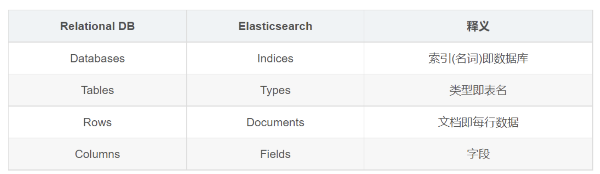

# Elasticsearch

## 描述

### 数据库和ES对比

参考文档\
[【使用kibana操作elasticsearch（es）】](https://www.cnblogs.com/liuqijia/p/11507494.html)<https://www.cnblogs.com/liuqijia/p/11507494.html>

[【【ES专题】ElasticSearch快速入门】](https://blog.csdn.net/qq_32681589/article/details/134106958?spm=1001.2014.3001.5501)<https://blog.csdn.net/qq_32681589/article/details/134106958?spm=1001.2014.3001.5501>

## 使用场景
用户画像

## 概念
### 节点
### 角色
### 索引
#### 创建
#### 查询
#### 删除

## 原理
### 正排索引
将文档按顺序排列并进行编号的索引结构

### 倒排索引
根据单词或短语建立的索引结构

### 类型 6.x之后版本已弃用
### 文档

