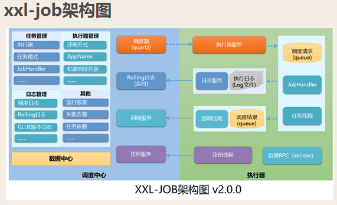
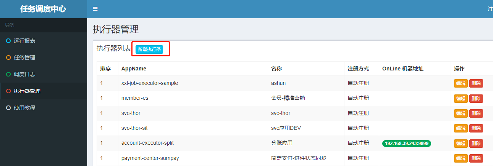
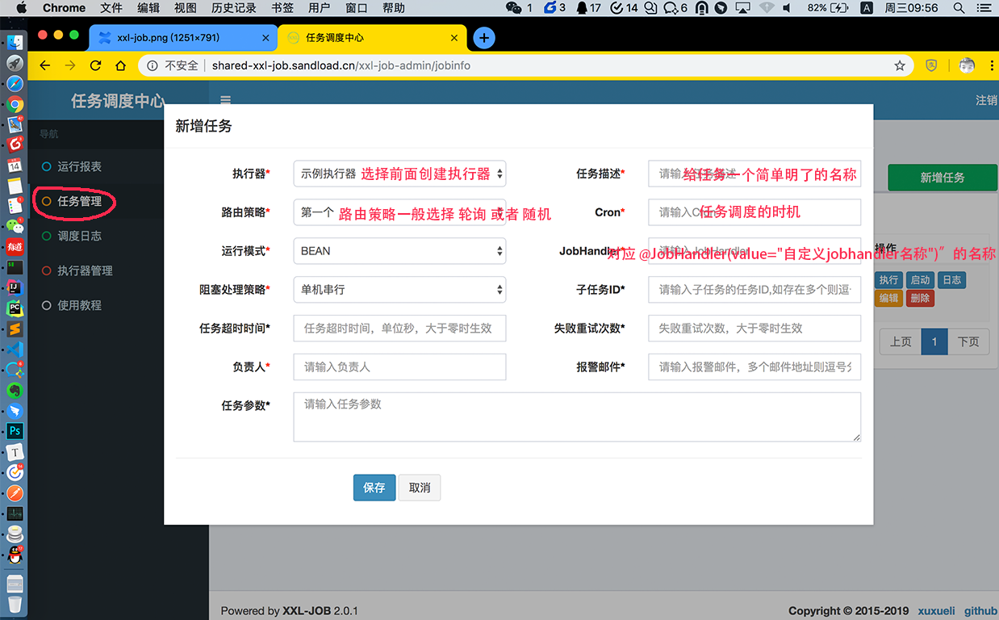

# xxl-job

## 基础

XXL-Job官网是大众点评员工徐雪里于2015年发布的分布式任务调度平台，其核心设计目标是开发迅速、学习简单、轻量级、易扩展。现已开放源代码并接入多家公司线上产品线，开箱即用。

官网地址：<http://www.xuxueli.com/xxl-job>\
源码地址：\
　①、GitHub：<https://github.com/xuxueli/xxl-job>\
　②、码云：<https://gitee.com/xuxueli0323/xxl-job>



## 代码

### 1、环境搭建

本地启动

<https://www.cnblogs.com/ysocean/p/10541151.html>

### 2、旧版使用

web页面地址
```java
<https://localhost:8080/xxl-job-admin/>
```


1、先新增一个执行器，一个服务对应一个执行器



2、引入依赖

```xml
<!-- xxl-job-core -->
        <dependency>
            <groupId>com.xuxueli</groupId>
            <artifactId>xxl-job-core</artifactId>
            <version>2.0.1</version>
        </dependency>
```

3、配置文件

```java
#xxl配置
xxl.job.admin.addresses=http://212.64.91.223:31872/xxl-job-admin
#执行器的名称 在管理后台创建执行器
xxl.job.executor.appname=xxl-job-executor-xxxx
xxl.job.executor.ip=${spring.cloud.client.ip-address}
xxl.job.executor.port=9888
xxl.job.executor.logpath=/data/applogs/xxl-job/jobhandler
xxl.job.executor.logretentiondays=-1
#xxl.job.accessToken=
```

```java
@Configuration
@ComponentScan(basePackages = "cn.tong.payment.center.lcswpay.jobhandler")
public class XxlJobConfig {
    private Logger logger = LoggerFactory.getLogger(XxlJobConfig.class);

    @Value("${xxl.job.admin.addresses}")
    private String adminAddresses;

    @Value("${xxl.job.executor.appname}")
    private String appName;

    @Value("${xxl.job.executor.ip}")
    private String ip;

    @Value("${xxl.job.executor.port}")
    private int port;

    @Value("${xxl.job.accessToken}")
    private String accessToken;

    @Value("${xxl.job.executor.logpath}")
    private String logPath;

    @Value("${xxl.job.executor.logretentiondays}")
    private int logRetentionDays;


    @Bean(initMethod = "start", destroyMethod = "destroy")
    public XxlJobSpringExecutor xxlJobExecutor() {
        logger.info(">>>>>>>>>>> xxl-job config init.");
        XxlJobSpringExecutor xxlJobSpringExecutor = new XxlJobSpringExecutor();
        xxlJobSpringExecutor.setAdminAddresses(adminAddresses);
        xxlJobSpringExecutor.setAppName(appName);
        xxlJobSpringExecutor.setIp(ip);
        xxlJobSpringExecutor.setPort(port);
        xxlJobSpringExecutor.setAccessToken(accessToken);
        xxlJobSpringExecutor.setLogPath(logPath);
        xxlJobSpringExecutor.setLogRetentionDays(logRetentionDays);

        return xxlJobSpringExecutor;
    }

}

```

```java
/**
*
* 开发步骤：
* 1、继承"IJobHandler"：“com.xxl.job.core.handler.IJobHandler”；
* 2、注册到Spring容器：添加“@Component”注解，被Spring容器扫描为Bean实例；
* 3、注册到执行器工厂：添加“@JobHandler(value="自定义jobhandler名称")”注解，注解value值对应的是调度中心新建任务的JobHandler属性的值。
* 4、执行日志：需要通过 "XxlJobLogger.log" 打印执行日志；
*/
@Component
@JobHandler("orderAllocteJobHandler")
public class OrderAllocteJobHandler extends IJobHandler {

    @Resource
    private PaymentAllocateService orderAllocateService;

    private static final String MESSAGE = "success count:";

    @Override
    public ReturnT<String> execute(String param) throws Exception {
        		// do something... 调你的业务逻辑
                return ReturnT.SUCCESS;
    }
}
```

添加任务调度



exmple

```java
@Component
@JobHandler("dataconfig.announcement.publish")
public class AnnouncementPublishJob extends IEdenSingleThreadJob<AnnouncementConfig> {

    static final DateTimeFormatter YYYY_MM_DD_HH_MM_SS = DateTimeFormatter.ofPattern("yyyy-MM-dd HH:mm:ss");

    @Autowired
    AnnouncementConfigMapper announcementConfigMapper;

    @Override
    protected List<AnnouncementConfig> selectData(String param) {
        return announcementConfigMapper.listAppointmentConfig(currentInHour());
    }

    @Override
    protected void exec(AnnouncementConfig announcementConfig, String param) {
        //仅仅为了更新状态, 这里直接new一个对象, 将更新的字段写入
        AnnouncementConfig config = new AnnouncementConfig();
        config.setId(announcementConfig.getId());
        config.setPublishStatus(PublishStatusEnum.PUBLISHED.getStatus());
        announcementConfigMapper.updateById(config);
    }


    /**
     * 当前时间; 精确到小时
     * @return
     */
    private String currentInHour() {
        LocalDateTime now = LocalDateTime.now();
        LocalDateTime hourTime = now.minusSeconds(now.getSecond())
                .minusMinutes(now.getMinute());
        return YYYY_MM_DD_HH_MM_SS.format(hourTime);
    }


}
```

### 3、2.0.3版本使用

修改了这些内容：https://www.oschina.net/news/129776/xxl-job-2-3-0-released

```java
@Slf4j
@Component
public class TongTask2 {
    private static Logger logger = LoggerFactory.getLogger(TongTask2.class);

    @XxlJob("tongTaskJobHandler")
    public void tongTaskJobHandler(){
        System.out.println("tong task execute...");
        logger.info("tong task execute...");
        //用这个替代之前的XxlJobLogger，打印出来的日志可以在web端日志里面看到
        XxlJobHelper.log("tong task execute...");
    }
}
```

## 接口
### 登录 /login
### 新增 /jobinfo/add
### 删除 /jobinfo/remove
### 修改 /jobinfo/update
### 启动 /jobinfo/start