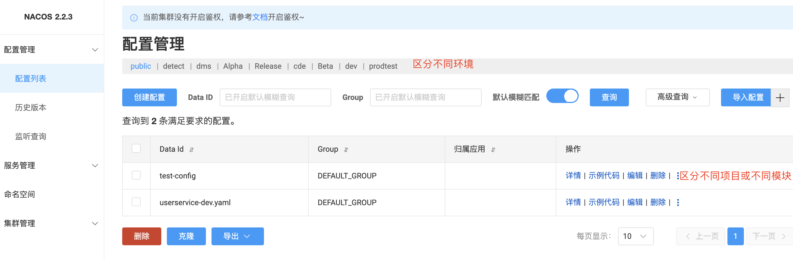

# naco
## 基础
一个更易于构建云原生应用的动态服务发现、配置管理和服务管理平台。\
https://nacos.io/zh-cn/

## 安装
待补充
## web界面介绍
配置管理


## java项目使用
导包
```xml
        <dependency>
            <groupId>com.alibaba.cloud</groupId>
            <artifactId>spring-cloud-starter-alibaba-nacos-config</artifactId>
        </dependency>
        <dependency>
            <groupId>com.alibaba.cloud</groupId>
            <artifactId>spring-cloud-starter-alibaba-nacos-discovery</artifactId>
        </dependency>
```
配置
```yml
# bootstrap.yml
spring:
  profiles:
    active: local
  application:
    name: tong
  cloud:
    nacos:
      config:
        group: TONG_GROUP
        extension-configs:
          - data-id: tong.properties
            group: TONG_GROUP
            refresh: true
        enabled: true
        shared-configs:
          - data-id: mysql.properties
            group: TONG_GROUP
            refresh: true
          - data-id: rabbitmq.properties
            group: TONG_GROUP
            refresh: true
          - data-id: redis.properties
            group: TONG_GROUP
            refresh: true
          - data-id: xxljob.properties
            group: TONG_GROUP
            refresh: true
      discovery:
        enabled: true
        group: TONG_GROUP
      username: nacos
      password: pwd
---

spring:
  config:
    activate:
      on-profile: local
  cloud:
    nacos:
      discovery:
        server-addr: http://127.0.0.1:8848
        namespace: tong_dev
      config:
        server-addr: http://127.0.0.1:8848
        namespace: tong_dev
---
spring:
  config:
    activate:
      on-profile: dev
  cloud:
    nacos:
      discovery:
        server-addr: http://127.0.0.1:8848
        namespace: tong_dev
      config:
        server-addr: http://127.0.0.1:8848
        namespace: tong_dev
---
spring:
  config:
    activate:
      on-profile: qa
  cloud:
    nacos:
      discovery:
        server-addr: http://127.0.0.1:8848
        namespace: tong_qa
      config:
        server-addr: http://127.0.0.1:8848
        namespace: tong_qa

---
spring:
  cloud:
    nacos:
      discovery:
        server-addr:
        namespace: tong_pro
      config:
        server-addr:
        namespace: tong_pro
  config:
    activate:
      on-profile: qro
```


## 灰度发布 todo


## 多服务配置统一nacos一个思路
https://blog.csdn.net/qq_24950043/article/details/124071691