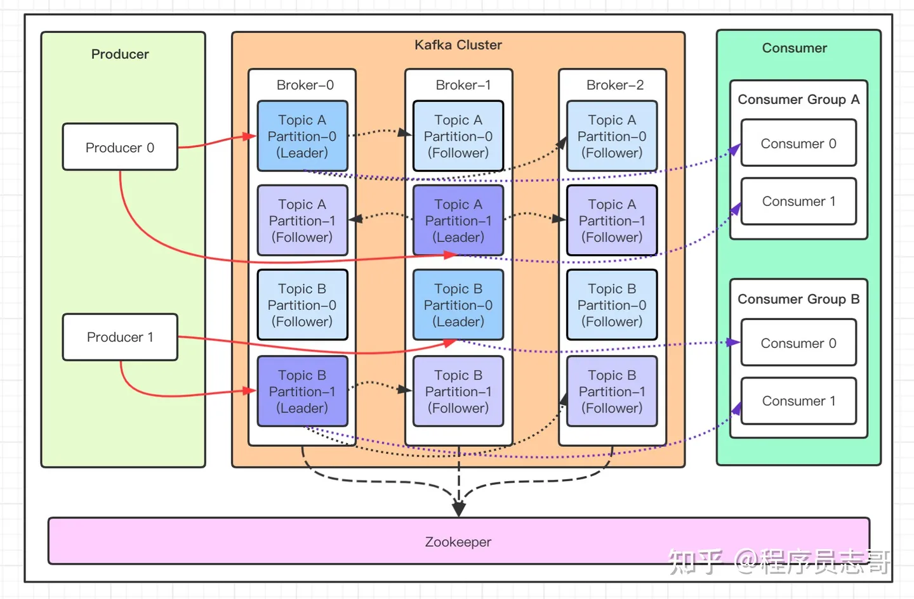
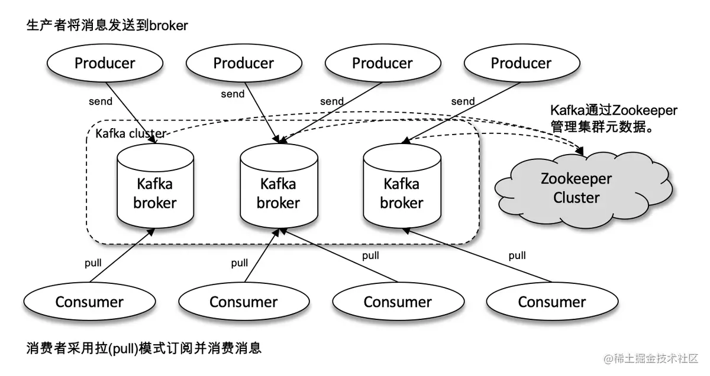
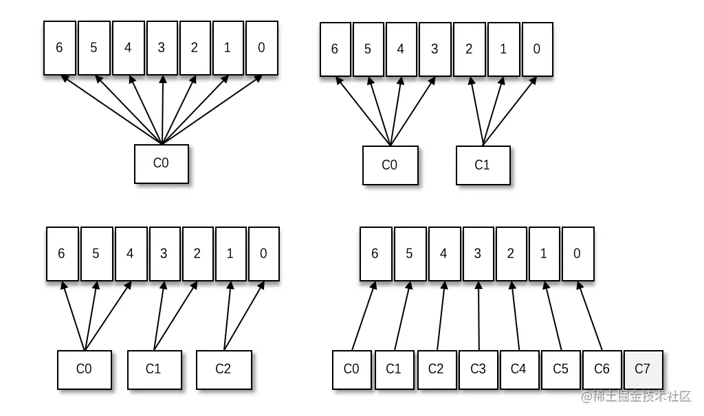
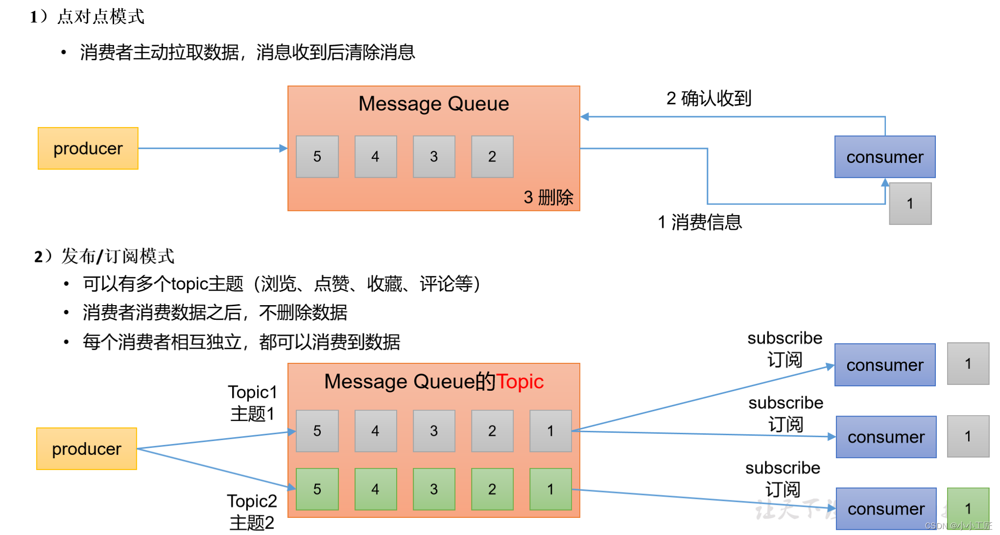
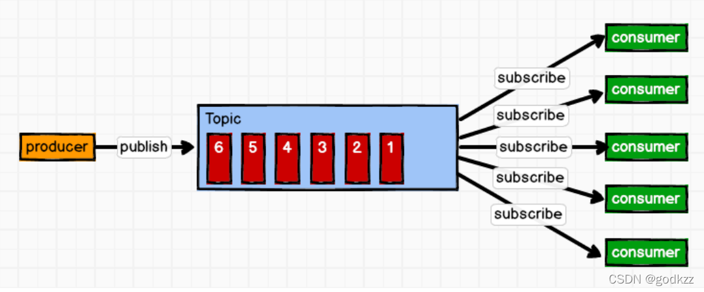

# kafka

## 基础
kafka 在2.8版本开始可以不用zookeeper

参考文档 \
<https://juejin.cn/post/7146133960865611806?searchId=202403122210197FB546636F4654883876>\
<https://blog.csdn.net/qq_47658874/article/details/122730520>\
<https://www.cnblogs.com/rainple/p/15914065.html>

0.7版本 只提供了最基础的消息队列功能

0.8版本 引入了副本机制，至此kafka成为了一个真正意义上完备的分布式高可靠消息队列解决方案

0.9版本 增加了基础的安全认证/权限功能;使用java重写了新版本消费者API;引入了kafka connect组件

0.10版本 引入了**kafka stream** 正式升级成分布式流处理平台

0.11版本 提供了幂等性producer API 以及事务API;对kafka消息做了重构

### 特点
可靠性：具有副本及容错机制。\
可扩展性：kafka无需停机即可扩展节点及节点上线。\
持久性：数据存储到磁盘上，持久性保存。\
性能：kafka具有高吞吐量。达到TB级的数据，也有非常稳定的性能。\
速度快：顺序写入和零拷贝技术使得kafka延迟控制在毫秒级。

### 官网地址

### 基本概念

#### 结构图




#### 生产者(producer)

#### 消费者(consumer)

#### 消费组(consumer group)
每个消费者都有一个对应的消费组。当消息发布到主题后，只会被投递给订阅它的每个消费组中的一个消费者。

消费者数量比分区多会导致有消费者分不到分区\
消费者分区分配策略：RangeAssignor、RoundRobinAssignor、StickyAssignor（0.11）。




#### 服务代理节点(broker)
可以看成是一个独立的kafka服务实例，多个broker组成了kafka集群

#### 主题(topic)
生产者将消息发送特定的topic主题，消费者订阅topic主题进行消费

#### 分区(partition)
主题是一个逻辑上的概念，它还可以细分为多个分区，一个分区只属于单个主题，很多时候也会把分区称为主题分区（Topic-Partition）。同一主题下的不同分区包含的消息是不同的，分区在存储层面可以看作一个可追加的日志（Log）文件，消息在被追加到分区日志文件的时候都会分配一个特定的偏移量（offset）。

同一个分区中的多个副本必须分布在不同的 broker 中，这样才能提供有效的数据冗余。

注意：\
某一个主题下的分区数，对于消费该主题的同一个消费组下的消费者数量，应该小于等于该主题下的分区数。\
如：某一个主题有4个分区，那么消费组中的消费者应该小于等于4，而且最好与分区数成整数倍 1 2 4 这样。同一个分区下的数据，在同一时刻，不能同一个消费组的不同消费者消费。

总结：分区数越多，同一时间可以有越多的消费者来进行消费，消费数据的速度就会越快，提高消费的性能。


#### 偏移量(offset)
offset 是消息在分区中的唯一标识，Kafka 通过它来保证消息在分区内的顺序性，不过 offset 并不跨越分区，也就是说，Kafka 保证的是分区有序而不是主题有序。

#### 副本(replia)
使用副本机制确保消息的可靠性和容错性。每个分区可以有多个副本，其中一个是领导者副本（Leader Replica），其余是追随者副本（Follower Replica）。


控制消息保存在几个broker（服务器）上，一般情况下副本数等于broker的个数。

一个broker服务下，不可以创建多个副本因子。创建主题时，副本因子应该小于等于可用的broker数。

副本因子操作以分区为单位的。每个分区都有各自的主副本和从副本；

主副本叫做leader，从副本叫做 follower（在有多个副本的情况下，kafka会为同一个分区下的所有分区，设定角色关系：一个leader和N个 follower），处于同步状态的副本叫做in-sync-replicas(ISR);

follower通过拉的方式从leader同步数据。
消费者和生产者都是从leader读写数据，不与follower交互。

副本因子的作用：让kafka读取数据和写入数据时的可靠性。

副本因子是包含本身，同一个副本因子不能放在同一个broker中。

如果某一个分区有三个副本因子，就算其中一个挂掉，那么只会剩下的两个中，选择一个leader，但不会在其他的broker中，另启动一个副本（因为在另一台启动的话，存在数据传递，只要在机器之间有数据传递，就会长时间占用网络IO，kafka是一个高吞吐量的消息系统，这个情况不允许发生）所以不会在另一个broker中启动。

如果所有的副本都挂了，生产者如果生产数据到指定分区的话，将写入不成功。

lsr表示：当前可用的副本。

#### zookeeper

是Kafka集群的协调服务，负责管理和维护集群的元数据、状态信息以及进行分布式协调。\
是 Kafka 用来负责集群元数据的管理、控制器 的选举等操作的

Kafka使用ZooKeeper主要有以下几个方面的功能：

统一协调：ZooKeeper负责协调Kafka集群中各个Broker之间的工作和通信。它维护了整个集群的元数据信息，包括Broker的状态、Topic的配置信息、消费者组的偏移量等。

Leader选举：Kafka采用分布式副本机制来确保高可用性和数据冗余。ZooKeeper负责协助进行Leader选举过程，当一个Broker宕机或不可用时，ZooKeeper会帮助Kafka选择新的Leader副本来接管该分区的读写请求。

动态扩展：Kafka集群可以动态地扩展，增加或删除Broker节点。ZooKeeper负责监控和管理Broker的上下线状态，并将这些变更通知给其他Broker和消费者。

消费者组管理：ZooKeeper存储并跟踪消费者组的偏移量信息。每个消费者在消费消息时，会将自己的偏移量提交到ZooKeeper中，以便在发生故障或重启后能够继续从上次消费的位置开始。

总结来说，ZooKeeper在Kafka中扮演着重要的角色，提供了集群的元数据管理、分布式协调、Leader选举以及消费者组管理等功能，确保了Kafka集群的高可用性、可靠性和灵活性。

后面可能会不再需要zookeeper
参考文档 https://juejin.cn/post/7341840038964002835#heading-3


### 可视化工具

kafka tool
官网 https://www.kafkatool.com/download.html
使用教程 https://blog.csdn.net/weixin_40861707/article/details/105975886

kafka eagle


bin/kafka-topics.sh  --list --zookeeper zookeeper_node01:2181,zookeeper_node02:2182,zookeeper_node03:2183

kafka-topics.sh  --list --zookeeper 127.0.0.1:2181,127.0.0.1:2182,127.0.0.1:2183


### 常用命令
```
创建主题topic
kafka-topics.sh --create --bootstrap-server 127.0.0.1:9093 --replication-factor 1 --partitions 1 --topic topic_tong2
kafka-topics.sh --create --bootstrap-server 127.0.0.1:9093 --replication-factor 1 --partitions 2 --topic topic_tong3
kafka-topics.sh --create --bootstrap-server 127.0.0.1:9093 --replication-factor 1 --partitions 1 --topic topictong1


删除主题
kafka-topics.sh --bootstrap-server 127.0.0.1:9093 --delete --topic topic_tong2

分区扩容

查询所有主题topic
kafka-topics.sh  --bootstrap-server 127.0.0.1:9093 --list --exclude-internal

消费
kafka-console-consumer.sh --bootstrap-server 127.0.0.1:9093 --topic topic_tong2  --from-beginning 

指定分区指定偏移量消费
kafka-console-consumer.sh --bootstrap-server localhost:9092 --topic topic_tong2 --partition 0 --offset 1


分组消费
kafka-console-consumer.sh --bootstrap-server 127.0.0.1:9093 --topic topic_tong2 --group tong2-group
kafka-console-consumer.sh --bootstrap-server 127.0.0.1:9093 --topic topictong3 --group tong3-group


查看消费者列表
kafka-consumer-groups.sh --bootstrap-server 127.0.0.1:9093 --list

kafka-console-consumer.sh --bootstrap-server 127.0.0.1:9093 --topic topic_tong2  --consumer-property group.id=tong2-group-id

持续批量拉取消息
kafka-verifiable-consumer.sh --group-id test_consumer  --bootstrap-server  localhost:9092   --topic test_create_topic4 

查询消费组详情
kafka-consumer-groups.sh --bootstrap-server xxxxx:9090  --describe --group test2_consumer_group
kafka-consumer-groups.sh --bootstrap-server xxxxx:9090  --describe --all-groups


```

参考文档
https://cloud.tencent.com/developer/article/1844234


## 消息传递模式
### 点对点模式（一对一 消费者主动拉取数据，消息收到后消息清除）
消费者主动拉取数据，消息收到后清楚消息


点对点模式（Point-to-Point，P2P）：\
在点对点模式中，有一个生产者（Producer）将消息发送到一个特定的队列（Queue）。\
只有一个消费者（Consumer）可以接收和处理队列中的消息。\
消息在队列中存储，一旦被消费者接收，就会从队列中删除。\
这种模式适用于一对一的通信，其中生产者和消费者之间有直接的关联，通常用于任务分发和处理。


### 发布/订阅模式（一对多 消费者消费数据之后不会清除消息）
可以有多个topic主题（浏览、点赞、收藏、评论等）\
消费者消费数据之后，不删除数据\
每个消费者相互独立，都可以消费到数据


发布/订阅模式（Publish/Subscribe，Pub/Sub）：\
在发布/订阅模式中，生产者将消息发布到一个主题（Topic）而不是队列。\
多个消费者可以订阅一个或多个主题，以接收相关的消息。\
消息广播给所有订阅了相应主题的消费者，每个消费者都会收到一份消息的拷贝。\
这种模式适用于一对多的通信，其中消息的发送者不需要关心谁会接收消息，通常用于事件处理、日志记录和实时通知等场景。




## 客户端消费
### 分区消费
### 分组消费


## kafka ui
https://github.com/kafbat/kafka-ui?tab=readme-ov-file


## kafka tool
参考文档
https://blog.csdn.net/weixin_40861707/article/details/105975886

## 消息过期
kafka默认的消息过期时间为168h(7天)

### 全局消息过期配置
```
cd  /opt/kafka/config/

默认的是在server.properties 文件里面

修改和配置项如下：

log.retention.hours=168 (配置该参数即可)
log.cleanup.policy=delete （默认，可不配置）

修改配置后重启kafka服务生效 需要重启kafka服务，造成服务短暂的不可用！
```

### 指定topic设置过期时间

## 消息丢失
1. 生产者生产数据不丢失
```
发送消息方式
生产者发送给kafka数据，可以采用同步方式或异步方式

同步方式：

发送一批数据给kafka后，等待kafka返回结果：
生产者等待10s，如果broker没有给出ack响应，就认为失败。
生产者重试3次，如果还没有响应，就报错.

异步方式：

发送一批数据给kafka，只是提供一个回调函数：
先将数据保存在生产者端的buffer中。buffer大小是2万条 。
满足数据阈值或者数量阈值其中的一个条件就可以发送数据。
发送一批数据的大小是500条。
注：如果broker迟迟不给ack，而buffer又满了，开发者可以设置是否直接清空buffer中的数据。

ack机制（确认机制）
生产者数据发送出去，需要服务端返回一个确认码，即ack响应码；ack的响应有三个状态值0,1，-1

0：生产者只负责发送数据，不关心数据是否丢失，丢失的数据，需要再次发送

1：partition的leader收到数据，不管follow是否同步完数据，响应的状态码为1

-1：所有的从节点都收到数据，响应的状态码为-1

如果broker端一直不返回ack状态，producer永远不知道是否成功；producer可以设置一个超时时间10s，超过时间认为失败。
```

2. broker中数据不丢失
```
在broker中，保证数据不丢失主要是通过副本因子（冗余），防止数据丢失。
```

3. 消费者消费数据不丢失
```
在消费者消费数据的时候，只要每个消费者记录好offset值即可，就能保证数据不丢失。也就是需要我们自己维护偏移量(offset)，可保存在 Redis 中。
```


## 底层原理
https://www.cnblogs.com/itlz/p/14292104.html

## java中使用
```
@KafkaListener 是 Spring Kafka 提供的注解，用于标记一个方法作为 Kafka 消息监听器。通过在方法上添加 @KafkaListener 注解，可以让该方法监听指定的 Kafka 主题（Topic）并处理接收到的消息。@KafkaListener 注解有一些参数，用来配置监听器的行为和属性。以下是 @KafkaListener 注解的主要参数含义：

topics：指定要监听的 Kafka 主题（可以是一个字符串数组），用于告知监听器监听哪些主题发送的消息。

id：指定监听器的 id，用于在应用中区分不同的监听器。默认为自动生成的唯一值。

groupId：指定消费者组的 id，用于将监听器加入指定的消费者组。

containerFactory：指定使用的 KafkaListenerContainerFactory bean 的名称，在 Spring 配置中定义了如何创建 Kafka 容器工厂。

concurrency：指定监听器的并发线程数，用于设置监听器的并发消费者数量。

autoStartup：指定是否在启动时自动启动监听器，默认为 true。设为 false 时需要手动启动监听器。

topicPattern：用于匹配多个主题的正则表达式，可以替代 topics 参数。

errorHandler：指定错误处理器，用于处理消息监听过程中的异常情况。

clientIdPrefix：为每个监听器生成的消费者客户端 ID 添加前缀，用于在集群中唯一标识每个消费者。

properties：用于设置 Kafka 消费者的其他属性，比如 max.poll.records、fetch.min.bytes 等。

通过配置这些参数，可以对 @KafkaListener 注解进行灵活的配置，以满足不同场景下的消息监听需求。根据具体的业务场景和需求，可以选择合适的参数设置来实现消息的可靠消费和处理。

```


```java

@Slf4j
@RestController
@RequestMapping("/kafka")
public class KafkaTmpController {

    @Autowired
    private KafkaTemplate<String, String> kafkaTemplate;


    // 点对点 发布
    @GetMapping("/send1")
    public void send1() {
        kafkaTemplate.send("topictong1", "hello kafka");
    }

    // 发布订阅 发布
    @GetMapping("/send2")
    public void send2() {
        ListenableFuture<SendResult<String, String>> listenableFuture = kafkaTemplate.send("topic2", "send tong message2");
        // 获取发布结果
        try {
            log.info("producer: {}", listenableFuture.get().toString());
        } catch (Exception e) {
            throw new RuntimeException(e);
        }
    }

    // 可以通过Kafka库中的AdminClient类实现对Topic的删除。 todo

    // 分区 生产
    @GetMapping("/send3")
    public void send3() {
        ListenableFuture<SendResult<String, String>> listenableFuture = kafkaTemplate.send("topictong3", 1, null, "send tong message3");
        // 获取发布结果
        try {
            log.info("producer: {}", listenableFuture.get().toString());
        } catch (Exception e) {
            throw new RuntimeException(e);
        }
    }

    // 分组 生产
    @GetMapping("/send4")
    public void send4() {
        ProducerRecord<String, String> record = new ProducerRecord<>("topictong4", "send tong message4");
        ListenableFuture<SendResult<String, String>> listenableFuture = kafkaTemplate.send(record);
        // 获取发布结果
        try {
            log.info("producer: {}", listenableFuture.get().toString());
        } catch (Exception e) {
            throw new RuntimeException(e);
        }
    }

}
```

```java

@Slf4j
@Service
public class KafkaTmpListener {


    // 点对点 消费
    @KafkaListener(topics = "topictong1")
    public void listen(String input) {
        log.info("input value: {}", input);
    }


    // 发布订阅 消费

    /**
     * id 监听器的id
     * topics 主题
     */
//    @KafkaListener(id = "id2", topics = "topic_tong2")
//    public void listen2(String data) {
//        log.info("consumer: {}", data);
//    }

    // 分区 消费
//    @KafkaListener(topicPartitions = {
//            @TopicPartition(topic = "topictong3", partitions = {"0", "1"}),
//            @TopicPartition(topic = "topictong3", partitions = "0",
//                    partitionOffsets = @PartitionOffset(partition = "0", initialOffset = "0"))
//    })
    @KafkaListener(topicPartitions = {
            @TopicPartition(topic = "topictong3", partitions = {"0", "1"})
    })
    public void listenToPartition(@Payload String message,
                                  @Header(KafkaHeaders.RECEIVED_PARTITION_ID) int partition) {
        System.out.println("Received message3 from partition " + partition + ": " + message);
    }

    // 分组 消费
    @KafkaListener(topics = "topictong4", groupId = "tong4-group")
    public void listenToGroup4(String message) {
        System.out.println("Received message4: " + message);
    }

    @KafkaListener(topics = "topictong5", groupId = "tong5-group")
    public void listenToGroup5(String message) {
        System.out.println("Received message5: " + message);
    }

}

```

```yml
spring:
  kafka:
    # 指定kafka server的地址，集群配多个，中间，逗号隔开
    bootstrap-servers:
      - 127.0.0.1:9092
      - 127.0.0.1:9093
      - 127.0.0.1:9094
    # kafka生产者配置
    producer:
      # 写入失败时，重试次数。当leader失效，一个repli节点会替代成为leader节点，此时可能出现写入失败，
      # 当retris为0时，produce不会重复。retirs重发，此时repli节点完全成为leader节点，不会产生消息丢失。
      retries: 0
      # 每次批量发送消息的数量,produce积累到一定数据，一次发数据量
      # 当将多个记录被发送到同一个分区时， Producer 将尝试将记录组合到更少的请求中。
      # 这有助于提升客户端和服务器端的性能。这个配置控制一个批次的默认大小（以字节为单位）。16384是缺省的配置（16K）
      batch-size: 16384
      # produce积累数据一次发送，缓存大小达到buffer.memory就发送数据
      # #Producer 用来缓冲等待被发送到服务器的记录的总字节数，33554432是缺省配置
      buffer-memory: 33554432
      #默认情况下消息是不压缩的，此参数可指定采用何种算法压缩消息，可取值：none,snappy,gzip,lz4。snappy压缩算法由Google研发，
      #这种算法在性能和压缩比取得比较好的平衡；相比之下，gzip消耗更多的CPU资源，但是压缩效果也是最好的。通过使用压缩，我们可以节省网络带宽和Kafka存储成本。
      #如果不开启压缩，可设置为none（默认值），比较大的消息可开启
      compressionType: none
      #procedure要求leader在考虑完成请求之前收到的确认数，用于控制发送记录在服务端的持久化，其值可以为如下：
      #acks = 0 如果设置为零，则生产者将不会等待来自服务器的任何确认，该记录将立即添加到套接字缓冲区并视为已发送。在这种情况下，
      #    无法保证服务器已收到记录，并且重试配置将不会生效（因为客户端通常不会知道任何故障），为每条记录返回的偏移量始终设置为-1。
      #acks = 1 这意味着leader会将记录写入其本地日志，但无需等待所有副本服务器的完全确认即可做出回应，在这种情况下，如果leader在确认记录后
      #    立即失败，但在将数据复制到所有的副本服务器之前，则记录将会丢失。
      #acks = all 这意味着leader将等待完整的同步副本集以确认记录，这保证了只要至少一个同步副本服务器仍然存活，记录就不会丢失，这是最强有力的保证，
      #    这相当于acks = -1的设置。
      #可以设置的值为：all, -1, 0, 1
      acks: all
      # 指定消息key和消息体的编解码方式
      key-serializer: org.apache.kafka.common.serialization.StringSerializer
      value-serializer: org.apache.kafka.common.serialization.StringSerializer
      #      value-serializer: org.springframework.kafka.support.serializer.JsonSerializer
      # 连接超时时间
      properties:
        request.timeout.ms: 30000
```