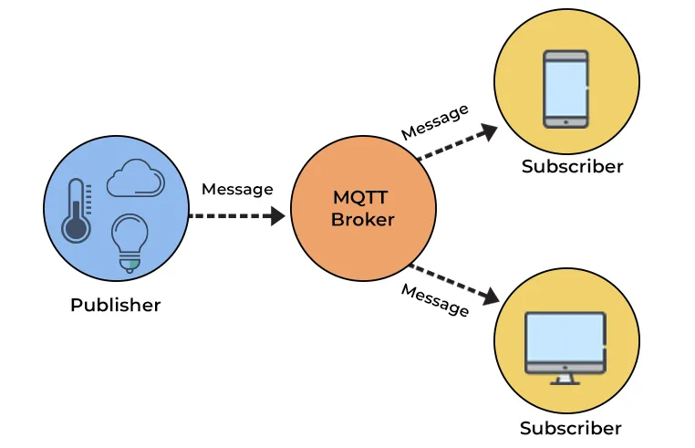

# mqtt

## 基础
MQTT（Message Queuing Telemetry Transport，消息队列遥测传输协议），是一种基于发布/订阅（publish/subscribe）模式的"轻量级"通讯协议，该协议构建于TCP/IP协议上，由IBM在1999年发布。MQTT最大优点在于，可以以极少的代码和有限的带宽，为连接远程设备提供实时可靠的消息服务。作为一种低开销、低带宽占用的即时通讯协议，使其在物联网、小型设备、移动应用等方面有较广泛的应用。

### 基本概念
#### 结构图


#### Broker（代理服务器）
MQTT 系统中负责接收和分发消息的服务器，是 MQTT 系统的核心组件。

#### Publisher（发布者）
向 Broker 发布消息的客户端，可以选择一个或多个主题进行消息发布。

#### Subscriber（订阅者）
订阅感兴趣的主题，并接收相关消息的客户端。

#### Topic（主题）
用来标识消息的分类和结构。Publisher 将消息发布到特定的主题上，Subscriber 订阅特定的主题以接收相关消息。

#### 消息
MQTT传输的消息分为：主题（Topic）和负载（payload）两部分：\
（1）Topic，可以理解为消息的类型，订阅者订阅（Subscribe）后，就会收到该主题的消息内容（payload）；\
（2）payload，可以理解为消息的内容，是指订阅者具体要使用的内容。


### MQTT 的消息传递流程的详细步骤

客户端连接：Publisher 或 Subscriber 通过 TCP/IP 连接到 Broker。\
客户端注册：客户端发送 CONNECT 报文到 Broker，包含客户端的身份认证信息、协议版本号等。\
会话建立：Broker 接收到 CONNECT 报文后，根据客户端的身份认证信息进行验证，并为客户端创建对应的会话。\
主题订阅：Subscriber 发送 SUBSCRIBE 报文到 Broker，指定订阅的主题。\
订阅确认：Broker 收到 SUBSCRIBE 报文后，在订阅列表中将 Subscriber 加入，并返回 SUBACK 报文给 Subscriber。\
消息发布：Publisher 发送 PUBLISH 报文到 Broker，包含消息的主题和内容。\
消息分发：Broker 收到 PUBLISH 报文后，根据主题将消息分发给订阅了该主题的所有 Subscriber。\
消息传递：Subscriber 收到经过分发的消息后，进行相应的处理。\
客户端断开：客户端发送 DISCONNECT 报文到 Broker，表明断开连接。

### MQTT 的消息质量等级
MQTT 定义了三种消息质量等级，用于确保消息的可靠传递：\
最多一次（At Most Once）：消息发布后，不进行任何确认和重传机制，消息可能会丢失或重复。\
至少一次（At Least Once）：消息发布后，接收者必须返回一个确认消息（PUBACK）给发布者，如果发布者没有收到确认消息，则会重传消息，确保至少一次的消息传递。\
只有一次（Exactly Once）：消息发布和传递过程中进行了多次握手和确认，确保消息只被传递一次。\
通过选择合适的质量等级，可以根据实际需求平衡消息传递的可靠性和性能。

参考文档 
https://developer.aliyun.com/article/1359775


## 客户端工具
### MQTTX
https://mqttx.app/web-client

### MQTT Explorer

参考文档 
https://www.emqx.com/zh/blog/mqtt-client-tools

## JAVA中使用MQTT
```java
private MqttClient mqttClient;
// 发送消息
mqttClient.publish(topic, message);
// 订阅主题
mqttClient.subscribe(topicFilter, qos);

mqttClient.isConnected();

mqttClient.disconnect();

mqttClient.connect(config)
```
