# rabbitmq

## 基础

### 官网地址
> <https://www.rabbitmq.com/>

### 基本概念

#### 结构图
> 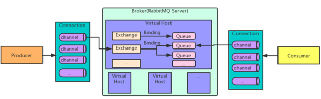

#### ① 代理(broker)
> 用来处理数据的消息队列服务器实体\
> broker 是指一个或多个 erlang node 的逻辑分组，且 node 上运行着 RabbitMQ 应用程序。cluster 是在 broker 的基础之上，增加了 node 之间共享元数据的约束
#### ② 虚拟主机(vhost)
> 由RabbitMQ服务器创建的虚拟消息主机，拥有自己的权限机制，一个broker里可以开设多个vhost，用于不同用户的权限隔离，vhost之间是也完全隔离的。
#### ③  AMQP协议
> Advanced Message Queuing Protocol 高级消息队列协议\
> ① Server： 又称Broker，接收客户端的连接，实现AMQP实体服务\
> ② Connection： 连接，应用程序跟Broker的连接\
> ③ channel： 网络信道，几乎所有的操作都在channel中进行，channel是进行消息读写的通道。客户端可以建立多个channel，每个channel代表一个会话任务。\
> ④ Message： 消息，服务器与应用程序之间传递的数据，由Properties和Body组成。Properties可以对消息进行修饰，比如消息的优先级，延迟等高级特性；Body消息内容。\
> ⑤ Virtual host： 虚拟主机，用于进行逻辑隔离，最上层的消息路由。一个Virtual host里面可以有若干个Exchange和Queue，同一个Virtual host里面不能有相同名称的Exchange或Queue。\
> ⑥ Exchange： 交换机，接收消息，根据路由键转发消息到绑定的队列。\
> ⑦ Bingding： Exchange和Queue之间的虚拟连接，bingding中可以包含路由key。\
> ⑧ Routing key： 一个路由规则，虚拟机可用它来确定如何路由一个特定的消息。\
> ⑨ Queue： 也称为Message Queue，消息队列，保存消息并将它转发给消费者。

#### ④ 交换机类型
> 直接（Direct）：直接交换机通过消息上的路由键直接对消息进行分发。\
> 扇出（Fanout）：一个扇出交换机会将消息发送到所有和它进行绑定的队列上。\
> 主题（Topic）：这个交换机会将路由键和绑定上的模式进行通配符匹配。\
> 消息头（Headers）：消息头交换机使用消息头的属性进行消息路由。
> <br/>
> <br/>
> 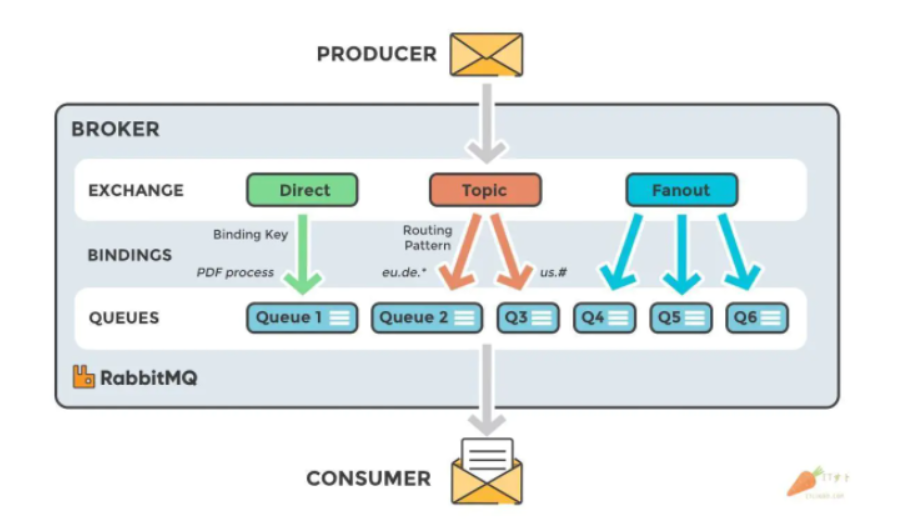
> <br/>
> ##### 1、direct exchange
> > 需要精准匹配routing_key
> ##### 2、topic exchange
> > 允许模糊匹配routing_key,注意*和#，可以用来实现组播
> > 路由关键字可包含任意多的单词，但最高限制是255字节。
> > 绑定的关键字必须有相同的格式。topic交换机和direct交换的逻辑是相似的–拥有特定的路由关键字的消息将被发送到所有匹配关键字的队列。然而，绑定关键字有两个特殊的情况：
> > （1）* (星号) 可以代替一个完整的单词.
> > （2）# (井号) 可以代替零个或多个单词.
> ##### 3、fanout exchange
> > 没有routing_key的概念，广播所以binding的queue

#### ⑤ Features 功能？？

> D：d 是 durable 的缩写，代表这个队列中的消息支持持久化。
> AD：ad 是 autoDelete 的缩写。代表当前队列的最后一个消费者退订时被自动删除。注意：此时不管队列中是否还存在消息，队列都会删除。
> excl：是 exclusive 的缩写。代表这是一个排他队列。如果一个队列被声明为排他队列，该队列仅对首次声明它的连接可见，并在连接断开时自动删除。这里需要注意三点：其一，排他队列是基于连接可见的，同一连接的不同信道是可以同时访问同一个连接创建的排他队列的。其二，“首次”，如果一个连接已经声明了一个排他队列，其他连接是不允许建立同名的排他队列的，这个与普通队列不同。其三，即使该队列是持久化的，一旦连接关闭或者客户端退出，该排他队列都会被自动删除的。这种队列适用于只限于一个客户端发送读取消息的应用场景。
> Args：是 arguments 的缩写。代表该队列配置了 arguments 参数。
> 
> TTL：是 x-message-ttl 的缩写。设置队列中的所有消息的生存周期(统一为整个队列的所有消息设置生命周期), 也可以在发布消息的时候单独为某个消息指定剩余生存时间，单位毫秒。
> Exp：Auto Expire，是 x-expires 配置的缩写。当队列在指定的时间没有被访问(consume, basicGet, queueDeclare…)就会被删除，Features=Exp。注意这里是删除队列，不是队列中的消息。
> Lim：说明该队列配置了 x-max-length。限定队列的消息的最大值长度，超过指定长度将会把最早的几条删除掉。
> Lim B：说明队列配置了 x-max-length-bytes。限定队列最大占用的空间大小， 一般受限于内存、磁盘的大小。
> DLX：说明该队列配置了 x-dead-letter-exchange。当队列消息长度大于最大长度、或者过期的等，将从队列中删除的消息推送到指定的交换机中去而不是丢弃掉。

> DLK：x-dead-letter-routing-key 的缩写，将删除的消息推送到指定交换机的指定路由键的队列中去。
> Pri：x-max-priority 的缩写，优先级队列。表明该队列支持优先级，先定义最大优先级值(定义最大值一般不要太大)，在发布消息的时候指定该消息的优先级， 优先级更高（数值更大的）的消息先被消费。
> Ovfl：x-overflow 的缩写。队列中的消息溢出时，如何处理这些消息。要么丢弃队列头部的消息，要么拒绝接收后面生产者发送过来的所有消息。有两个配置项：drop-head，代表丢弃队列头部的消息，默认行为；reject-publish 设置队列中的消息溢出后,该队列的行为:”拒绝接收”(所有消息)。
> ha-all：镜像队列。all 表示镜像到集群上的所有节点，ha-params 参数忽略。

#### ⑥ connection
> 应用程序和 RMQ 之间建立 long-lived connection
> Connection 会占用 OS 文件句柄资源

#### ⑦ channel
> 应⽤程序对 RMQ 提交的操作都是基于 channel 的，当使⽤多线程处理时，每个线程应当占⽤⼀个 channel，这样是线程安全的，需要避免线程间共享，这会造成 channel 上的 frame 乱序等问题，⽬前不少客户端库还提供了 channel pool 机制
> channel 底层数据结构是Erlang 轻量量级进程，会占⽤用内存资源

#### ⑧ channel和connection关系
> connection是单个的连接\
> channel是在connection基础上，由多个connection组成的（channel是双向的）

#### ①  生产者（Producer）
> 发送消息的应用

#### ② 连接（Connection）
> 连接RabbitMQ和应用服务器的TCP连接

#### ③ 通道（Channel）
> 连接里的一个虚拟通道。当你通过消息队列发送或者接收消息时，这个操作都是通过通道进行的

#### ④ 交换机（Exchange）
> 交换机负责从生产者那里接收消息，并根据交换类型分发到对应的消息列队里。要实现消息的接收，一个队列必须到绑定一个交换机

#### ⑤ 路由键（Routing Key）
> 路由键是供交换机查看并根据键来决定如何分发消息到列队的一个键。路由键可以说是消息的目的地址

#### ⑥ 消息（Message）
> 由生产者通过RabbitMQ发送给消费者的信息

#### ⑦ 绑定（Binding）
> 绑定是队列和交换机的一个关联连接

#### ⑧ 队列（Queue）
> 存储消息的缓存

#### ⑨ 消费者（Consumer）
> 接收消息的应用

### 消息投递路径

producer->broker ->exchange->queue->consumer

① 消息从producer 到exchange会返回一个confirmCallback\
② 消息从exchange->queue 投递失败则会返回一个returnCallback\
如果消息没有路由到queue,则丢弃消息（默认）\
如果消息没有路由到queue 返回给消息发送方，returnCallback

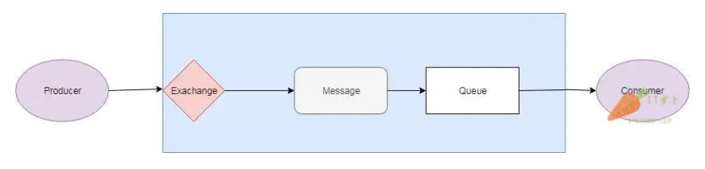

RabbitMQ里的消息流程
> 生产者（producer）把消息发送给交换机。当你创建交换机的时候，你需要指定类型。交换机的类型接下来会讲到。\
> 交换机（exchange）接收消息并且负责对消息进行路由。根据交换机的类型，消息的多个属性会被使用，例如路由键。\
> 绑定（binding）需要从交换机到队列的这种方式来进行创建。在这个例子里，我们可以看到交换机有到两个不同队列的绑定。交换机根据消息的属性来把消息分发到不同的队列上。\
> 消息（message）消息会一直留在队列里直到被消费。\
> 消费者（consumer）处理消息。


### 镜像队列(Mirror Queue)
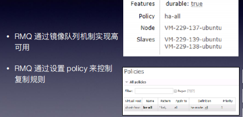

### 消费者利用率(Consumer utilisation)
消费者使⽤率：⼀段时间内处理消息的能⼒，反映了消费端的性能，越接近100% 越佳
Prefetch count: 在⽹络延时较⼤时，适当调⼤该值效果会⽐较明显

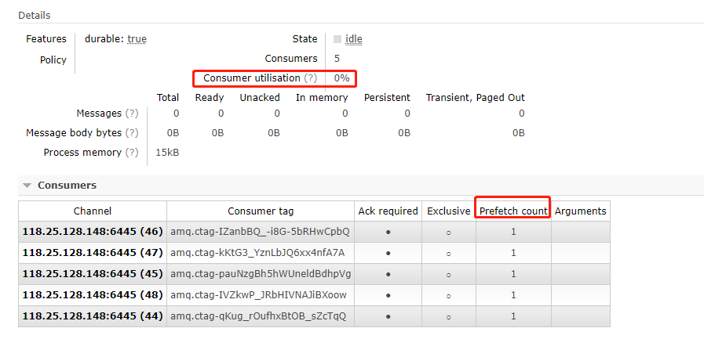


### 死信机制(Dead Letter)

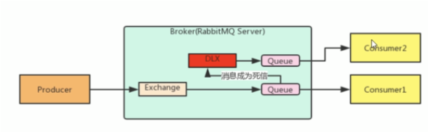

成为死信三种情况：\
1、队列消息长度到达限制\
2、消费者拒接消息，basicNack/basicReject 并且不把消息重新放入原目标队列，requeue=false\
3、原队列存在消息过期设置，消息到达超时时间未被消费\
队列绑定死信交换机

声明死信队列属性 DLX (x-dead-letter-exchange), DLK (x-dead-letter-routing-key)\
TTL 可以是队列级别或消息级别

死信队列不需要消费者\
注意：进⼊死信队列的消息依旧遵循 FIFO 进⾏重新分发，即使已经到了过期时间


### 延迟队列

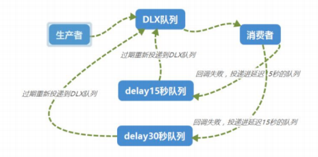


### 幂等


生产者消费者不用同一个连接工厂，防止有一个阻塞，影响所有

### 消费端限流

消费端确认模式设置为手动后
rabbitmq:listener-container 中配置prefetch属性，设置消费端一次拉取多少条消息

### TTL(time to live)（存活/过期时间）

当消息到达存活时间后
还没有被消费，会被自动清除
（可以对消息设置过期时间，也可以对整个队列设置过期时间，同时设置了这两个时间，就以短的时间算）
一般都是对队列整体设置过期时间
（消息过期后，只有消息在队列顶端，才会判断是否真正过期（在队列里看到移出掉））
应用场景：多久之内没有支付就订单失效

### 特点

#### 优点

1、解耦
2、异步

发送短信，发送邮件等等

3、削峰

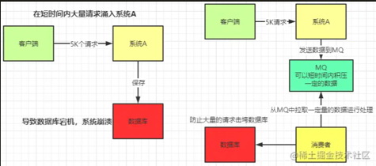

#### 缺点

1、系统可用性降低。依赖服务也多，服务越容易挂掉。需要考虑MQ瘫痪的情况
2、系统复杂性提高。需要考虑消息丢失、消息重复消费、消息传递的顺序性
3、业务一致性。主业务和从属业务一致性的处理

#### 使用场景

##### ① 解耦

⽤用户⽀支付后送积分，推送消息等

##### ② 错峰流控

缓解 web 流量和 DB 写能力不匹配

##### ③ 最终⼀致性

数据写⼊缓存，通过 MQ 持久化到 DB

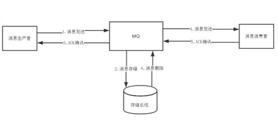

##### ④ 广播


## 安装

注意：erlang要和rabbitmq版本对应，否则可能安装失败

web页面启动：

rabbitmq-plugins.bat enable rabbitmq_management命令），windows\linux下如果启动不成功，可能是没有在管理员的权限下进行运行。开启和关闭RabbitMQ的命令分别为net start\stop RabbitMQ。

## web界面介绍

### 1、overview

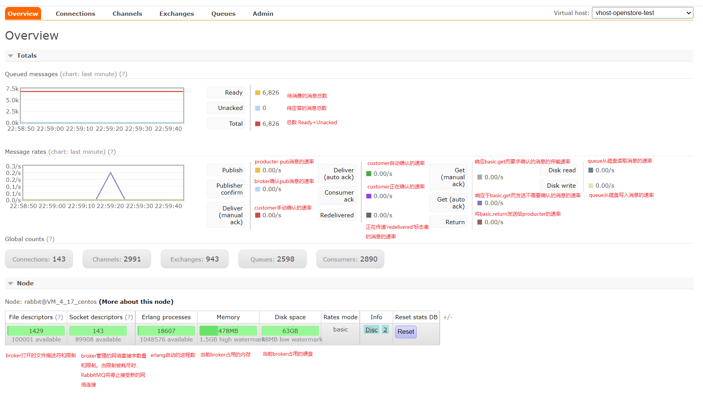

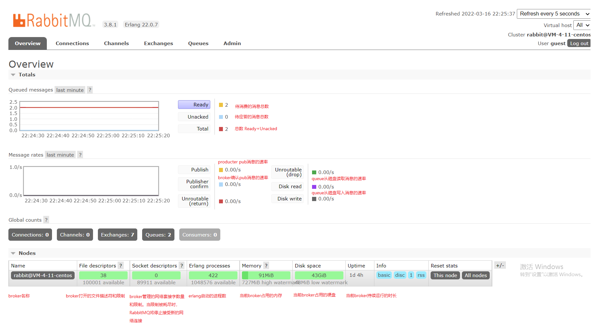

Publish：producter pub消息的速率。\
Publisher confirm：broker确认pub消息的速率。\
Deliver(manual ack)：customer手动确认的速率。\
Deliver( auto ack)：customer自动确认的速率。\
Consumer ack：customer正在确认的速率。\
Redelivered：正在传递'redelivered'标志集的消息的速率。\
Get (manual ack)：响应basic.get而要求确认的消息的传输速率。\
Get (auto ack)：响应于basic.get而发送不需要确认的消息的速率。\
Return：将basic.return发送给producter的速率。\
Disk read：queue从磁盘读取消息的速率。\
Disk write：queue从磁盘写入消息的速率。

### 2、connection

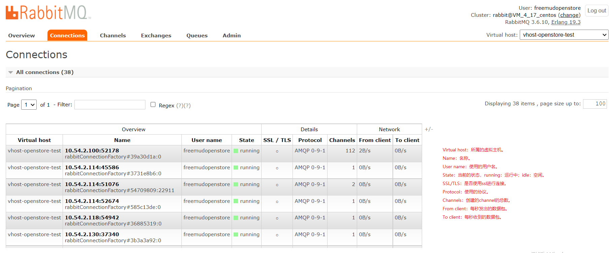

Virtual host：所属的虚拟主机。\
Name：名称。\
User name：使用的用户名。\
State：当前的状态，running：运行中；idle：空闲。\
SSL/TLS：是否使用ssl进行连接。\
Protocol：使用的协议。\
Channels：创建的channel的总数。\
From client：每秒发出的数据包。\
To client：每秒收到的数据包。

### 3、channels

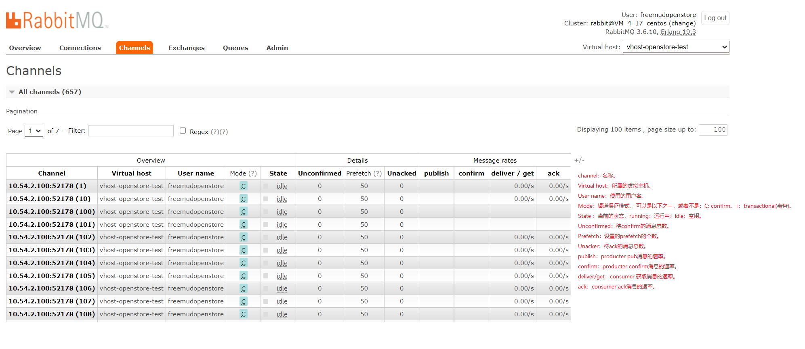

channel：名称。\
Virtual host：所属的虚拟主机。\
User name：使用的用户名。\
Mode：渠道保证模式。 可以是以下之一，或者不是：C: confirm。T：transactional(事务)。\
State ：当前的状态，running：运行中；idle：空闲。\
Unconfirmed：待confirm的消息总数。\
Prefetch：设置的prefetch的个数。\
消费端确认模式设置为手动后，rabbitmq:listener-container 中配置**prefetch**属性，设置消费端一次拉取多少条消息

Unacker：待ack的消息总数。\
publish：producter pub消息的速率。\
confirm：producter confirm消息的速率。\
deliver/get：consumer 获取消息的速率。\
ack：consumer ack消息的速率。

### 4、exchanges

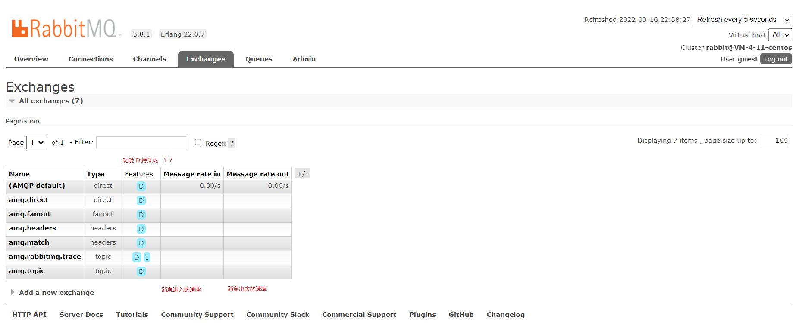

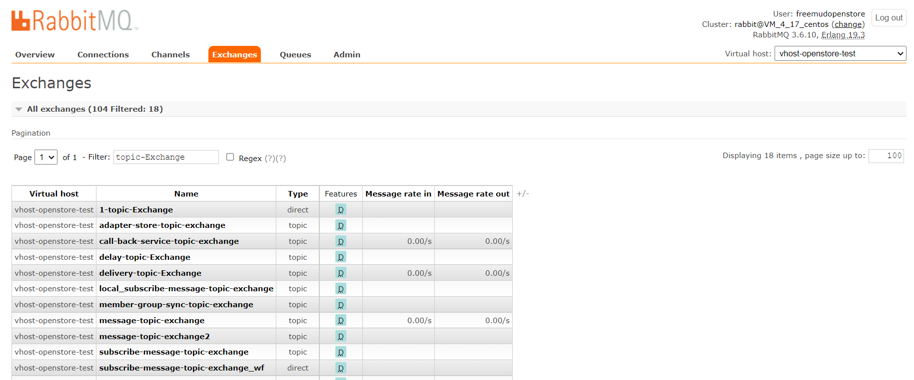

Name：名称。\
Type：exchange type，具体的type可以查看[RabbitMq系列之一：基础概念](https://www.jianshu.com/p/5319b06f2e80)。
Features：功能。 可以是以下之一，或者不是：D: 持久化。T：Internal，存在改功能表示这个exchange不可以被client用来推送消息，仅用来进行exchange和exchange之间的绑定，否则可以推送消息也可以绑定。\
Message rate in：消息进入的速率。\
Message rate out：消息出去的速率。

### 5、queue

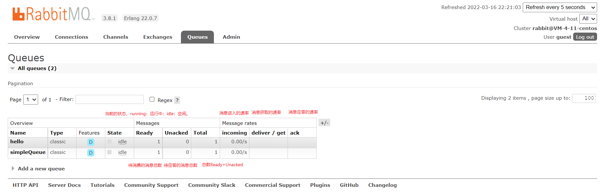

Name：名称。\
Features：功能。 可以是以下之一，或者不是：D: 持久化。\
State：当前的状态，running：运行中；idle：空闲。\
Ready：待消费的消息总数。\
Unacked：待应答的消息总数。\
Total：总数 Ready+Unacked。\
incoming：消息进入的速率。\
deliver/get：消息获取的速率。\
ack：消息应答的速率。

### 6、admin

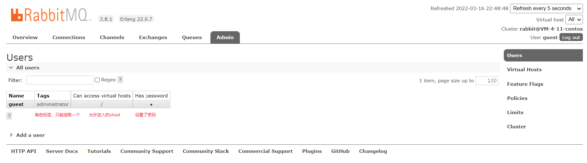

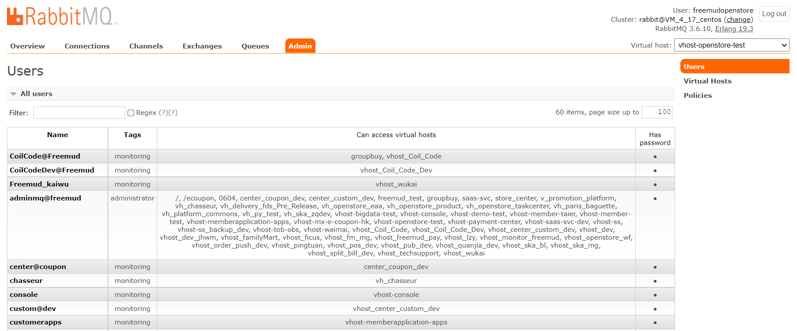

Name：名称。\
Tags：角色标签，只能选取一个。\
Can access virtual hosts：允许进入的vhost。\
Has password：设置了密码。


### 7、清空队列消息

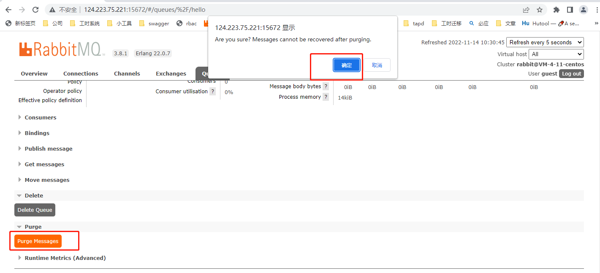

## java项目使用

### 1、基础配置

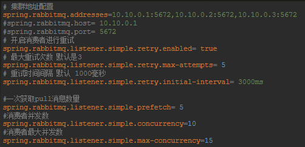

```yml
spring:
  rabbitmq:
    host: 127.0.0.1 #ip
    port: 5672      #端口
    username: guest #账号
    password: guest #密码
    virtualHost:    #链接的虚拟主机
    addresses: 127.0.0.1:5672     #多个以逗号分隔，与host功能一样。
    requestedHeartbeat: 60 #指定心跳超时，单位秒，0为不指定；默认60s
    publisherConfirms: true  #发布确认机制是否启用
    publisherReturns: #发布返回是否启用
    connectionTimeout: #链接超时。单位ms。0表示无穷大不超时
    ### ssl相关
    ssl:
      enabled: #是否支持ssl
      keyStore: #指定持有SSL certificate的key store的路径
      keyStoreType: #key store类型 默认PKCS12
      keyStorePassword: #指定访问key store的密码
      trustStore: #指定持有SSL certificates的Trust store
      trustStoreType: #默认JKS
      trustStorePassword: #访问密码
      algorithm: #ssl使用的算法，例如，TLSv1.1
      verifyHostname: #是否开启hostname验证
    ### cache相关
    cache:
      channel:
        size: #缓存中保持的channel数量
        checkoutTimeout: #当缓存数量被设置时，从缓存中获取一个channel的超时时间，单位毫秒；如果为0，则总是创建一个新channel
      connection:
        mode: #连接工厂缓存模式：CHANNEL 和 CONNECTION
        size: #缓存的连接数，只有是CONNECTION模式时生效
    ### listener
    listener:
       type: #两种类型，SIMPLE，DIRECT
       ## simple类型
       simple:
         concurrency: #最小消费者数量
         maxConcurrency: #最大的消费者数量
         transactionSize: #指定一个事务处理的消息数量，最好是小于等于prefetch的数量
         missingQueuesFatal: #是否停止容器当容器中的队列不可用
         ## 与direct相同配置部分
         autoStartup: #是否自动启动容器
         acknowledgeMode: #表示消息确认方式，其有三种配置方式，分别是none、manual和auto；默认auto
         prefetch: #指定一个请求能处理多少个消息，如果有事务的话，必须大于等于transaction数量
         defaultRequeueRejected: #决定被拒绝的消息是否重新入队；默认是true（与参数acknowledge-mode有关系）
         idleEventInterval: #container events发布频率，单位ms
         ##重试机制
         retry:
           stateless: #有无状态
           enabled:  #是否开启
           maxAttempts: #最大重试次数,默认3
           initialInterval: #重试间隔
           multiplier: #对于上一次重试的乘数
           maxInterval: #最大重试时间间隔
       direct:
         consumersPerQueue: #每个队列消费者数量
         missingQueuesFatal:
         #...其余配置看上方公共配置
     ## template相关
     template:
       mandatory: #是否启用强制信息；默认false
       receiveTimeout: #`receive()`接收方法超时时间
       replyTimeout: #`sendAndReceive()`超时时间
       exchange: #默认的交换机
       routingKey: #默认的路由
       defaultReceiveQueue: #默认的接收队列
       ## retry重试相关
       retry:
         enabled: #是否开启
         maxAttempts: #最大重试次数
         initialInterval: #重试间隔
         multiplier: #失败间隔乘数
         maxInterval: #最大间隔
```

建议配置:
channel=100左右
channel.checkout-timeout=3000
retry.maxAttempts=10

监控
机器指标  cpu  内存 磁盘 网络
机器: 堆积消费数量，队列的TPS
踩过的坑
ack 一定要注意 ，防止消息阻塞

连接时不要用guestt用户

### 2、@RabbitListener原理

### 3、消息丢失！！

#### 一、生产者消息丢失

##### 1、amqp提供的事务机制（效率低）

##### 2、发送确认模式（publish confirms）

###### ① 添加配置

```java
spring.rabbitmq.publisher-confirms=true //表示没有发送到交换机会回调给指定方法
spring.rabbitmq.publisher-returns=true //表示exchange分发给queue失败回调指定方法
```

###### ② 异步重试

```java
@Bean
@Primary
public RabbitTemplate rabbitTemplate(CachingConnectionFactory connectionFactory, @Autowired RabbitProperties rabbitProperties, @Autowired ObjectProvider<RabbitRetryTemplateCustomizer> retryTemplateCustomizers) {
    RabbitTemplate template = new RabbitTemplate(connectionFactory);
 template.setMessageConverter(new Jackson2JsonMessageConverter());
 template.afterPropertiesSet();
 template.setMandatory(true);
 template.setConfirmCallback(new RabbitTemplate.ConfirmCallback() {
        @Override
 public void confirm(CorrelationData correlationData, boolean ack, String cause) {
            if (!ack) {//表示没有发送成功可以从correlationData拿消息id，保存到对应的数据库进行异步重试
                }
        }
    });
 template.setReturnCallback(new RabbitTemplate.ReturnCallback() {
        @Override
 public void returnedMessage(Message message, int replyCode, String replyText, String exchange, String routingKey) {
            //发送queue失败，保存到对应的数据库进行异步重试
 }
    });
 return template;
}
```

###### ③ 发送消息需要捕捉异常持久化到库

AmqpConnectException  
AmqpTimeoutException

#### 二、消费者消息丢失

######  ① 添加配置

```java
#手动ack配置
spring.rabbitmq.listener.simple.acknowledge-mode=manual  
```

###### ② 消费者实现ChannelAwareMessageListener接口

```java
public class FreshStoreCacheListener implements ChannelAwareMessageListener {

 @Override
 public void onMessage(Message message, Channel channel) throws Exception {
       //message.getMessageProperties().getDeliveryTag() mq消息id，false表示当前消费者的这个消息被消费
    channel.basicAck(message.getMessageProperties().getDeliveryTag(),false,);
 }
}
```


1. Client -> confirm.select (channel 处于 confirm mode)
2. Broker -> confirm.select-ok
3. Broker -> basic.ack (返回包含 delivery-tag 来标识确认的消息)


### 4、消费者获取消息

在RabbitMQ中消费者有2种方式获取队列中的消息:

#### a)  basic.consume （推荐）

一种是通过basic.consume命令，订阅某一个队列中的消息,channel会自动在处理完上一条消息之后，接收下一条消息。（同一个channel消息处理是串行的）。除非关闭channel或者取消订阅，否则客户端将会一直接收队列的消息。

#### b)  basic.get

另外一种方式是通过basic.get命令主动获取队列中的消息，但是绝对不可以通过循环调用basic.get来代替basic.consume，这是因为basic.get RabbitMQ在实际执行的时候，是首先consume某一个队列，然后检索第一条消息，然后再取消订阅。如果是高吞吐率的消费者，最好还是建议使用basic.consume。

简单概括：
consume是只要队列里面还有消息就一直取。
get是只取了队列里面的第一条消息。
因为get开销大，如果需要从一个队列取消息的话，首选consume方式，慎用循环get方式。


```java

__FILENAME__:/data/log/orderbackstage/order-service-backstage.log__SOURCE__:10.50.1.40__CONTENT__:2022-10-27 22:44:28.126 ERROR [,4e7c04a134c1ae15,4e7c04a134c1ae15,false] 4891 --- [nio-9941-exec-9] orderCheckSingle exception:

org.springframework.amqp.AmqpIOException: java.io.IOException
at org.springframework.amqp.rabbit.support.RabbitExceptionTranslator.convertRabbitAccessException(RabbitExceptionTranslator.java:70)
at org.springframework.amqp.rabbit.connection.RabbitAccessor.convertRabbitAccessException(RabbitAccessor.java:113)
at org.springframework.amqp.rabbit.core.RabbitTemplate.doExecute(RabbitTemplate.java:2116)
at org.springframework.amqp.rabbit.core.RabbitTemplate.execute(RabbitTemplate.java:2062)
at org.springframework.amqp.rabbit.core.RabbitTemplate.execute(RabbitTemplate.java:2042)
at org.springframework.amqp.rabbit.core.RabbitAdmin.initialize(RabbitAdmin.java:604)
at org.springframework.amqp.rabbit.core.RabbitAdmin.lambda$null$10(RabbitAdmin.java:532)
at org.springframework.retry.support.RetryTemplate.doExecute(RetryTemplate.java:287)
at org.springframework.retry.support.RetryTemplate.execute(RetryTemplate.java:164)
at org.springframework.amqp.rabbit.core.RabbitAdmin.lambda$afterPropertiesSet$11(RabbitAdmin.java:531)
at org.springframework.amqp.rabbit.connection.CompositeConnectionListener.onCreate(CompositeConnectionListener.java:36)
at org.springframework.amqp.rabbit.connection.CachingConnectionFactory.createConnection(CachingConnectionFactory.java:757)
at org.springframework.amqp.rabbit.connection.ConnectionFactoryUtils.createConnection(ConnectionFactoryUtils.java:214)
at org.springframework.amqp.rabbit.core.RabbitTemplate.doExecute(RabbitTemplate.java:2089)
at org.springframework.amqp.rabbit.core.RabbitTemplate.execute(RabbitTemplate.java:2062)
at org.springframework.amqp.rabbit.core.RabbitTemplate.send(RabbitTemplate.java:1009)
at org.springframework.amqp.rabbit.core.RabbitTemplate.convertAndSend(RabbitTemplate.java:1075)
at org.springframework.amqp.rabbit.core.RabbitTemplate.convertAndSend(RabbitTemplate.java:1068)
at cn.tong.amqp.MQService.convertAndSend(MQService.java:67)
at com.tong.service.UnequalLogService.syncOrderUnequalLogQueue(UnequalLogService.java:41)
at com.tong.service.UnequalLogService$$FastClassBySpringCGLIB$$8f8e7e88.invoke(<generated>)
at org.springframework.cglib.proxy.MethodProxy.invoke(MethodProxy.java:218)
at org.springframework.aop.framework.CglibAopProxy$CglibMethodInvocation.invokeJoinpoint(CglibAopProxy.java:771)
at org.springframework.aop.framework.ReflectiveMethodInvocation.proceed(ReflectiveMethodInvocation.java:163)
at org.springframework.aop.framework.CglibAopProxy$CglibMethodInvocation.proceed(CglibAopProxy.java:749)
at org.springframework.transaction.interceptor.TransactionAspectSupport.invokeWithinTransaction(TransactionAspectSupport.java:367)
at org.springframework.transaction.interceptor.TransactionInterceptor.invoke(TransactionInterceptor.java:118)
at org.springframework.aop.framework.ReflectiveMethodInvocation.proceed(ReflectiveMethodInvocation.java:186)
at org.springframework.aop.framework.CglibAopProxy$CglibMethodInvocation.proceed(CglibAopProxy.java:749)
at org.springframework.aop.interceptor.ExposeInvocationInterceptor.invoke(ExposeInvocationInterceptor.java:95)
at org.springframework.aop.framework.ReflectiveMethodInvocation.proceed(ReflectiveMethodInvocation.java:186)
at org.springframework.aop.framework.CglibAopProxy$CglibMethodInvocation.proceed(CglibAopProxy.java:749)
at org.springframework.aop.framework.CglibAopProxy$DynamicAdvisedInterceptor.intercept(CglibAopProxy.java:691)
at com.tong.service.UnequalLogService$$EnhancerBySpringCGLIB$$ee122ea3.syncOrderUnequalLogQueue(<generated>)
at com.tong.service.OrderService.sendUnequalLogRequest(OrderService.java:4355)
at com.tong.service.OrderService.checkTotalAmountForTakeout(OrderService.java:3544)
at com.tong.service.OrderService.checkMethodForTakeout(OrderService.java:3266)
at com.tong.service.OrderService.checkMethod(OrderService.java:3148)
at com.tong.service.OrderService$$FastClassBySpringCGLIB$$acb8c8eb.invoke(<generated>)
at org.springframework.cglib.proxy.MethodProxy.invoke(MethodProxy.java:218)
at org.springframework.aop.framework.CglibAopProxy$CglibMethodInvocation.invokeJoinpoint(CglibAopProxy.java:771)
at org.springframework.aop.framework.ReflectiveMethodInvocation.proceed(ReflectiveMethodInvocation.java:163)
at org.springframework.aop.framework.CglibAopProxy$CglibMethodInvocation.proceed(CglibAopProxy.java:749)
at org.springframework.transaction.interceptor.TransactionAspectSupport.invokeWithinTransaction(TransactionAspectSupport.java:367)
at org.springframework.transaction.interceptor.TransactionInterceptor.invoke(TransactionInterceptor.java:118)
at org.springframework.aop.framework.ReflectiveMethodInvocation.proceed(ReflectiveMethodInvocation.java:186)
at org.springframework.aop.framework.CglibAopProxy$CglibMethodInvocation.proceed(CglibAopProxy.java:749)
at org.springframework.aop.interceptor.ExposeInvocationInterceptor.invoke(ExposeInvocationInterceptor.java:95)
at org.springframework.aop.framework.ReflectiveMethodInvocation.proceed(ReflectiveMethodInvocation.java:186)
at org.springframework.aop.framework.CglibAopProxy$CglibMethodInvocation.proceed(CglibAopProxy.java:749)
at org.springframework.aop.framework.CglibAopProxy$DynamicAdvisedInterceptor.intercept(CglibAopProxy.java:691)
at com.tong.service.OrderService$$EnhancerBySpringCGLIB$$aed97664.checkMethod(<generated>)
at com.tong.controller.OrderDashboardController.orderCheckSingle$original$SMwFsQCg(OrderDashboardController.java:171)
at com.tong.controller.OrderDashboardController.orderCheckSingle$original$SMwFsQCg$accessor$43gZuzV5(OrderDashboardController.java)
at com.tong.controller.OrderDashboardController$auxiliary$GJ4sGdqu.call(Unknown Source)
at org.apache.skywalking.apm.agent.core.plugin.interceptor.enhance.InstMethodsInter.intercept(InstMethodsInter.java:86)
at com.tong.controller.OrderDashboardController.orderCheckSingle(OrderDashboardController.java)
at sun.reflect.NativeMethodAccessorImpl.invoke0(Native Method)
at sun.reflect.NativeMethodAccessorImpl.invoke(NativeMethodAccessorImpl.java:62)
at sun.reflect.DelegatingMethodAccessorImpl.invoke(DelegatingMethodAccessorImpl.java:43)
at java.lang.reflect.Method.invoke(Method.java:498)
at org.springframework.web.method.support.InvocableHandlerMethod.doInvoke(InvocableHandlerMethod.java:190)
at org.springframework.web.method.support.InvocableHandlerMethod.invokeForRequest(InvocableHandlerMethod.java:138)
at org.springframework.web.servlet.mvc.method.annotation.ServletInvocableHandlerMethod.invokeAndHandle(ServletInvocableHandlerMethod.java:105)
at org.springframework.web.servlet.mvc.method.annotation.RequestMappingHandlerAdapter.invokeHandlerMethod(RequestMappingHandlerAdapter.java:878)
at org.springframework.web.servlet.mvc.method.annotation.RequestMappingHandlerAdapter.handleInternal(RequestMappingHandlerAdapter.java:792)
at org.springframework.web.servlet.mvc.method.AbstractHandlerMethodAdapter.handle(AbstractHandlerMethodAdapter.java:87)
at org.springframework.web.servlet.DispatcherServlet.doDispatch(DispatcherServlet.java:1040)
at org.springframework.web.servlet.DispatcherServlet.doService(DispatcherServlet.java:943)
at org.springframework.web.servlet.FrameworkServlet.processRequest(FrameworkServlet.java:1006)
at org.springframework.web.servlet.FrameworkServlet.doPost(FrameworkServlet.java:909)
at javax.servlet.http.HttpServlet.service(HttpServlet.java:652)
at org.springframework.web.servlet.FrameworkServlet.service(FrameworkServlet.java:883)
at javax.servlet.http.HttpServlet.service(HttpServlet.java:733)
at org.apache.catalina.core.ApplicationFilterChain.internalDoFilter(ApplicationFilterChain.java:231)
at org.apache.catalina.core.ApplicationFilterChain.doFilter(ApplicationFilterChain.java:166)
at org.apache.tomcat.websocket.server.WsFilter.doFilter(WsFilter.java:53)
at org.apache.catalina.core.ApplicationFilterChain.internalDoFilter(ApplicationFilterChain.java:193)
at org.apache.catalina.core.ApplicationFilterChain.doFilter(ApplicationFilterChain.java:166)
at brave.servlet.TracingFilter.doFilter(TracingFilter.java:65)
at org.apache.catalina.core.ApplicationFilterChain.internalDoFilter(ApplicationFilterChain.java:193)
at org.apache.catalina.core.ApplicationFilterChain.doFilter(ApplicationFilterChain.java:166)
at com.alibaba.druid.support.http.WebStatFilter.doFilter(WebStatFilter.java:124)
at org.apache.catalina.core.ApplicationFilterChain.internalDoFilter(ApplicationFilterChain.java:193)
at org.apache.catalina.core.ApplicationFilterChain.doFilter(ApplicationFilterChain.java:166)
at org.springframework.web.filter.RequestContextFilter.doFilterInternal(RequestContextFilter.java:100)
at org.springframework.web.filter.OncePerRequestFilter.doFilter(OncePerRequestFilter.java:119)
at org.apache.catalina.core.ApplicationFilterChain.internalDoFilter(ApplicationFilterChain.java:193)
at org.apache.catalina.core.ApplicationFilterChain.doFilter(ApplicationFilterChain.java:166)
at org.springframework.web.filter.FormContentFilter.doFilterInternal(FormContentFilter.java:93)
at org.springframework.web.filter.OncePerRequestFilter.doFilter(OncePerRequestFilter.java:119)
at org.apache.catalina.core.ApplicationFilterChain.internalDoFilter(ApplicationFilterChain.java:193)
at org.apache.catalina.core.ApplicationFilterChain.doFilter(ApplicationFilterChain.java:166)
at org.springframework.cloud.sleuth.instrument.web.ExceptionLoggingFilter.doFilter(ExceptionLoggingFilter.java:50)
at org.apache.catalina.core.ApplicationFilterChain.internalDoFilter(ApplicationFilterChain.java:193)
at org.apache.catalina.core.ApplicationFilterChain.doFilter(ApplicationFilterChain.java:166)
at brave.servlet.TracingFilter.doFilter(TracingFilter.java:82)
at org.springframework.cloud.sleuth.instrument.web.LazyTracingFilter.doFilter(TraceWebServletAutoConfiguration.java:138)
at org.apache.catalina.core.ApplicationFilterChain.internalDoFilter(ApplicationFilterChain.java:193)
at org.apache.catalina.core.ApplicationFilterChain.doFilter(ApplicationFilterChain.java:166)
at org.springframework.web.filter.CharacterEncodingFilter.doFilterInternal(CharacterEncodingFilter.java:201)
at org.springframework.web.filter.OncePerRequestFilter.doFilter(OncePerRequestFilter.java:119)
at org.apache.catalina.core.ApplicationFilterChain.internalDoFilter(ApplicationFilterChain.java:193)
at org.apache.catalina.core.ApplicationFilterChain.doFilter(ApplicationFilterChain.java:166)
at org.apache.catalina.core.StandardWrapperValve.invoke(StandardWrapperValve.java:202)
at org.apache.catalina.core.StandardContextValve.invoke(StandardContextValve.java:97)
at org.apache.catalina.authenticator.AuthenticatorBase.invoke(AuthenticatorBase.java:542)
at org.apache.catalina.core.StandardHostValve.invoke$original$3XxBrFN3(StandardHostValve.java:143)
at org.apache.catalina.core.StandardHostValve.invoke$original$3XxBrFN3$accessor$uNkhv27f(StandardHostValve.java)
at org.apache.catalina.core.StandardHostValve$auxiliary$YcmYtahz.call(Unknown Source)
at org.apache.skywalking.apm.agent.core.plugin.interceptor.enhance.InstMethodsInter.intercept(InstMethodsInter.java:86)
at org.apache.catalina.core.StandardHostValve.invoke(StandardHostValve.java)
at org.apache.catalina.valves.ErrorReportValve.invoke(ErrorReportValve.java:92)
at org.apache.catalina.core.StandardEngineValve.invoke(StandardEngineValve.java:78)
at org.apache.catalina.connector.CoyoteAdapter.service(CoyoteAdapter.java:343)
at org.apache.coyote.http11.Http11Processor.service(Http11Processor.java:374)
at org.apache.coyote.AbstractProcessorLight.process(AbstractProcessorLight.java:65)
at org.apache.coyote.AbstractProtocol$ConnectionHandler.process(AbstractProtocol.java:868)
at org.apache.tomcat.util.net.NioEndpoint$SocketProcessor.doRun(NioEndpoint.java:1590)
at org.apache.tomcat.util.net.SocketProcessorBase.run(SocketProcessorBase.java:49)
at java.util.concurrent.ThreadPoolExecutor.runWorker(ThreadPoolExecutor.java:1149)
at java.util.concurrent.ThreadPoolExecutor$Worker.run(ThreadPoolExecutor.java:624)
at org.apache.tomcat.util.threads.TaskThread$WrappingRunnable.run(TaskThread.java:61)
at java.lang.Thread.run(Thread.java:748)
Caused by: java.io.IOException: null
at com.rabbitmq.client.impl.AMQChannel.wrap(AMQChannel.java:129)
at com.rabbitmq.client.impl.AMQChannel.wrap(AMQChannel.java:125)
at com.rabbitmq.client.impl.AMQChannel.exnWrappingRpc(AMQChannel.java:147)
at com.rabbitmq.client.impl.ChannelN.queueDeclare(ChannelN.java:968)
at com.rabbitmq.client.impl.ChannelN.queueDeclare(ChannelN.java:46)
at org.springframework.amqp.rabbit.connection.PublisherCallbackChannelImpl.queueDeclare(PublisherCallbackChannelImpl.java:348)
at sun.reflect.NativeMethodAccessorImpl.invoke0(Native Method)
at sun.reflect.NativeMethodAccessorImpl.invoke(NativeMethodAccessorImpl.java:62)
at sun.reflect.DelegatingMethodAccessorImpl.invoke(DelegatingMethodAccessorImpl.java:43)
at java.lang.reflect.Method.invoke(Method.java:498)
at org.springframework.amqp.rabbit.connection.CachingConnectionFactory$CachedChannelInvocationHandler.invoke(CachingConnectionFactory.java:1184)
at com.sun.proxy.$Proxy304.queueDeclare(Unknown Source)
at org.springframework.amqp.rabbit.core.RabbitAdmin.declareQueues(RabbitAdmin.java:709)
at org.springframework.amqp.rabbit.core.RabbitAdmin.lambda$initialize$12(RabbitAdmin.java:606)
at org.springframework.amqp.rabbit.core.RabbitTemplate.invokeAction(RabbitTemplate.java:2151)
at org.springframework.amqp.rabbit.core.RabbitTemplate.doExecute(RabbitTemplate.java:2110)
... 121 common frames omitted
Caused by: com.rabbitmq.client.ShutdownSignalException: channel error; protocol method: #method<channel.close>(reply-code=406, reply-text=PRECONDITION_FAILED - inequivalent arg 'x-dead-letter-exchange' for queue 'fm_order_state_push_rapttl_queue' in vhost 'fm_mg': received the value 'fm_order_exchange' of type 'longstr' but current is none, class-id=50, method-id=10)
at com.rabbitmq.utility.ValueOrException.getValue(ValueOrException.java:66)
at com.rabbitmq.utility.BlockingValueOrException.uninterruptibleGetValue(BlockingValueOrException.java:36)
at com.rabbitmq.client.impl.AMQChannel$BlockingRpcContinuation.getReply(AMQChannel.java:502)
at com.rabbitmq.client.impl.AMQChannel.privateRpc(AMQChannel.java:293)
at com.rabbitmq.client.impl.AMQChannel.exnWrappingRpc(AMQChannel.java:141)
... 134 common frames omitted
Caused by: com.rabbitmq.client.ShutdownSignalException: channel error; protocol method: #method<channel.close>(reply-code=406, reply-text=PRECONDITION_FAILED - inequivalent arg 'x-dead-letter-exchange' for queue 'fm_order_state_push_rapttl_queue' in vhost 'fm_mg': received the value 'fm_order_exchange' of type 'longstr' but current is none, class-id=50, method-id=10)
at com.rabbitmq.client.impl.ChannelN.asyncShutdown(ChannelN.java:517)
at com.rabbitmq.client.impl.ChannelN.processAsync(ChannelN.java:341)
at com.rabbitmq.client.impl.AMQChannel.handleCompleteInboundCommand(AMQChannel.java:182)
at com.rabbitmq.client.impl.AMQChannel.handleFrame(AMQChannel.java:114)
at com.rabbitmq.client.impl.AMQConnection.readFrame(AMQConnection.java:739)
at com.rabbitmq.client.impl.AMQConnection.access$300(AMQConnection.java:47)
at com.rabbitmq.client.impl.AMQConnection$MainLoop.run(AMQConnection.java:666)
... 1 common frames omitted
```

## 使用场景
**解耦 削峰 填谷**
## 难点

消息重复
造成重复的原因：网络不可达
做幂等,每条消息都设唯一ID,存日志表防止重复消费


面试题整理
https://www.bilibili.com/video/BV1f94y167vh/?spm_id_from=333.788&vd_source=9a81f56beba8d749b133042ede3fcf02

项目中用过哪些消息队列 选型的原因
大量消息堆积在mq
如何限流