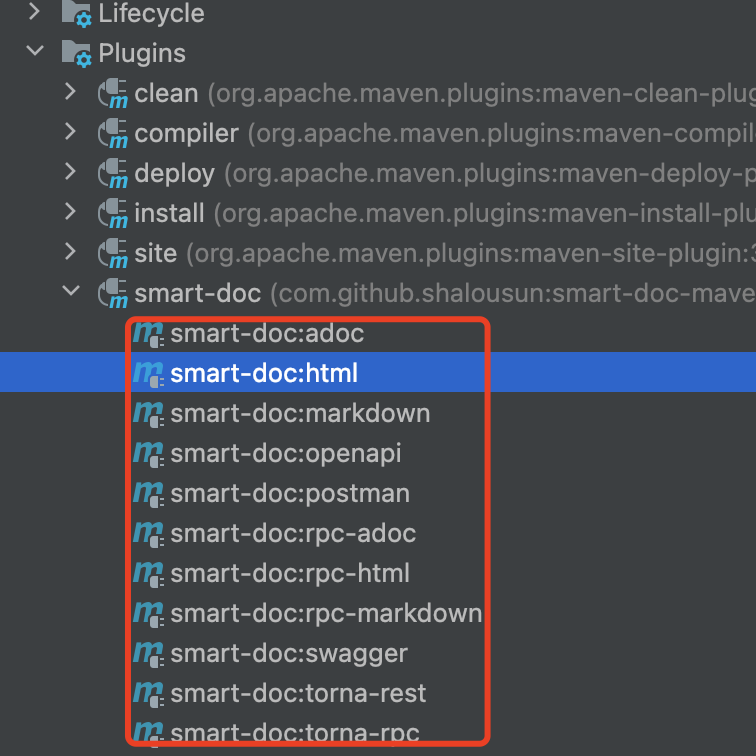
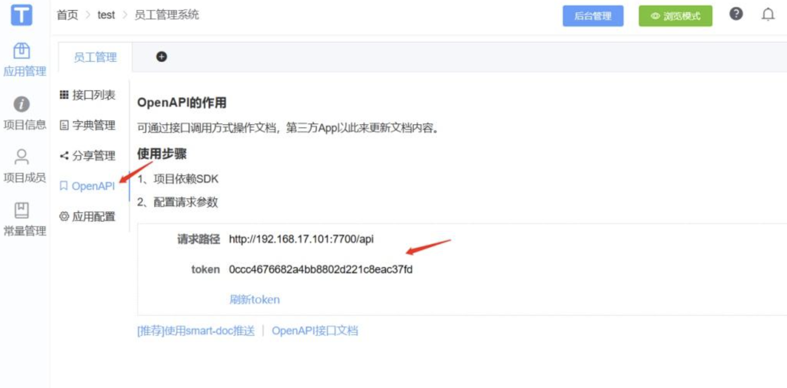
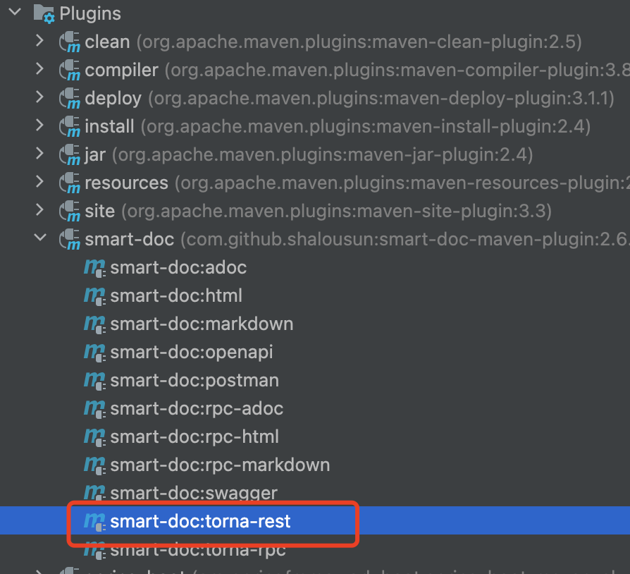

# smart-doc
## smart-doc
### 描述
> 根据接口源码分析生成文档，不使用注解侵入业务代码

### 配置
步骤一 项目的resources文件夹下新建文件smart-doc.json
> ```json
> {
>     "projectName": "项目名称",                        // 配置自己的项目名称，不设置则插件自动获取pom中的projectName
>     "outPath": "src/main/resources/static/doc",      // 指定文档的输出路径
>     "appToken": "c16931fa6590483fb7a4e85340fcbfef",  // torna平台appToken
>     "openUrl": "http://localhost:7700/api",          // torna平台地址，填写自己的私有化部署地址。
>     "debugEnvName":"本地环境",                        // torna环境名称。
>     "debugEnvUrl":"http://127.0.0.1:8080",           // 推送torna配置接口服务地址，测试的接口所在的服务器的url
>     "tornaDebug": false,                             // 启用会推送日志
>     "replace": true                                  // 推送torna时替换旧的文档。改动还是会推送过去覆盖的，这个功能主要是保证代码删除了，torna上没有删除。
> }
> ```

步骤二 项目的pom文件plugins添加smart-doc插件
> ```xml
> <plugin>
>     <groupId>com.github.shalousun</groupId>
>     <artifactId>smart-doc-maven-plugin</artifactId>
>     <version>2.6.3</version>
>     <configuration>
>         <!--指定生成文档的使用的配置文件,配置文件放在自己的项目中-->
>         <configFile>./src/main/resources/smart-doc.json</configFile>
>         <!--指定项目名称，推荐使用动态参数，例如${project.description}-->
>         <!--如果smart-doc.json中和此处都未设置projectName，2.3.4开始，插件自动采用pom中的projectName作为设置-->
>         <projectName>${project.description}</projectName>
>     </configuration>
>     <executions>
>         <execution>
>             <!--如果不需要在执行编译时启动smart-doc，则将phase注释掉-->
>             <phase>package</phase>
>         </execution>
>     </executions>
> </plugin>
> ```
### 生成文档
idea maven里面的插件生成文件
> smart-doc.json 配置"allInOne": true后，生成的文档中只会包含一个index.html文件。如果设置为false，生成的接口文档会包括api.html、dict.html和error.html多个文件，一般推荐为true

\
生成Postman文档，导入Posman就可以在postman测试接口

## torna
### 描述
> 官网\
> <https://torna.cn/>\
> <https://torna.cn/dev/>
### 搭建
> todo
## smart-doc推送torna

smart-json里面的 appToken、openUrl对应下图
> 

smart-doc推送torna
方法一 idea maven插件执行

方法二 执行脚本
```java
// 使用 Maven 构建项目的命令
mvn -DskipTests=true clean install
// 使用 Maven 插件生成 "Smart-doc" 的 "torna-rest" 文档的命令
mvn -Dfile.encoding=UTF-8 smart-doc:torna-rest -pl :start -am
```
命令详细描述\
mvn -DskipTests=true clean install
> mvn 是运行 Maven 命令的命令行前缀。\
> -DskipTests=true 是设置 Maven 属性，跳过执行测试用例。\
> clean 是一个 Maven 生命周期阶段，它会清理之前构建生成的文件。\
> install 是一个 Maven 生命周期阶段，它会**将构建生成的包安装到本地 Maven 仓库中**，以便后续可以在其他项目中引用。

mvn -Dfile.encoding=UTF-8 smart-doc:torna-rest -pl :start -am
> mvn 是运行 Maven 命令的命令行前缀。\
> -Dfile.encoding=UTF-8 是设置 Maven 属性，指定编码为 UTF-8。\
> smart-doc:torna-rest 是执行 smart-doc 插件的 torna-rest 目标，用于生成 "torna-rest" 文档。\
> -pl :start 是限制只在 start 模块中执行该命令，而不是整个项目。\
> -am 表示同时构建依赖模块。

## 参考文档
<https://smart-doc-group.github.io/#/zh-cn/?id=smart-doc>\
<https://zhuanlan.zhihu.com/p/610924383?utm_id=0>


