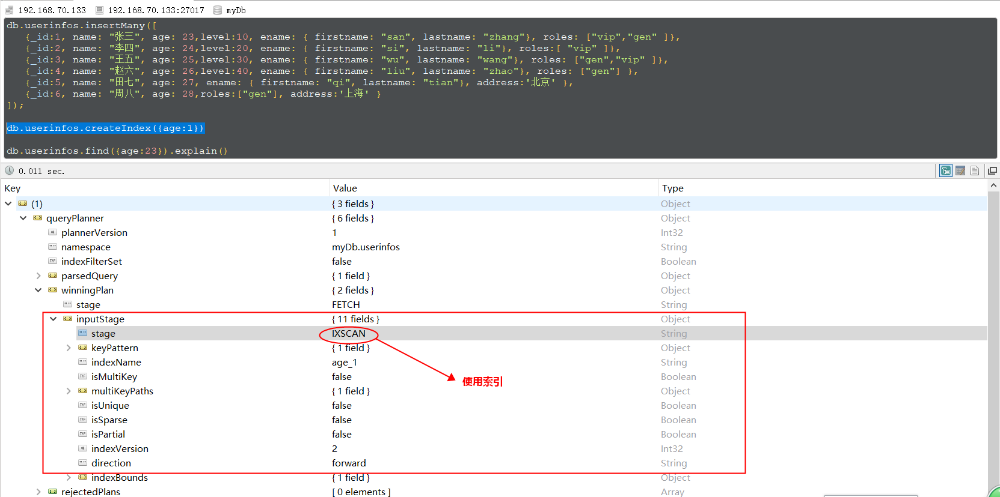
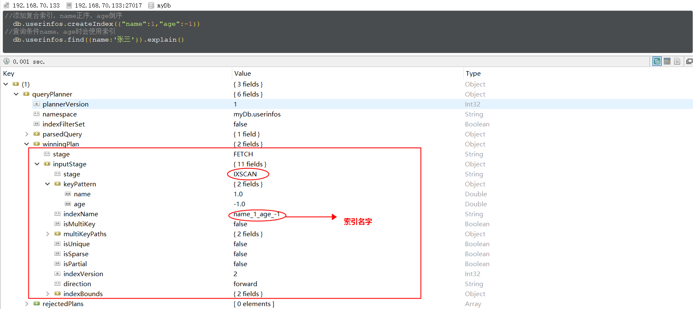
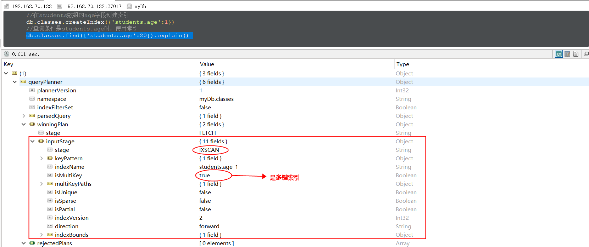
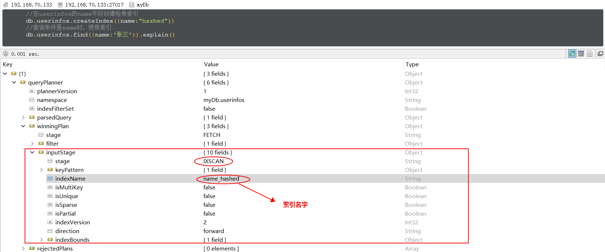
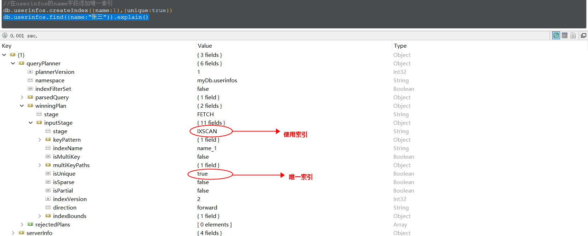
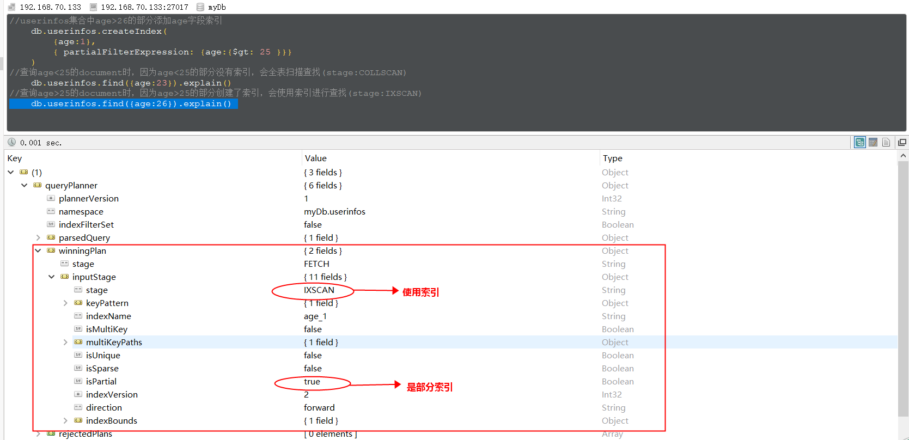
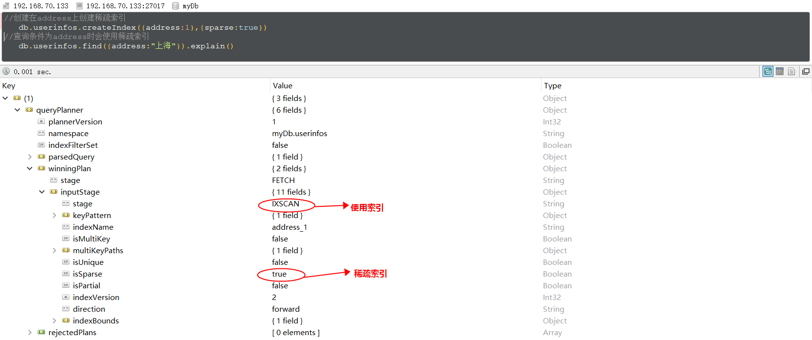

# mongodb

## 基础
MongoDB是一个NoSQL的非关系型数据库 ，支持海量数据存储，高性能的读写。

### 源码(c++)

### 默认端口27017

### 使用场景

### 数据类型

### 对比数据库
|  SQL术语/概念   | MongoDB术语/概念  | 解释/说明 |
|  ----          | ----            | ----     |
|database    |database	   |数据库
|table	     |collection   |数据库表/集合
|row	     |document	   |数据记录行/文档
|column	     |field	       |数据字段/域
|index    	 |index	       |索引
|table joins |	 	       |表连接,MongoDB不支持
|primary key |primary key  | 主键,MongoDB自动将_id字段设置为主键


## 常用语句

### mongodb操作

### 数据库操作
#### 1、切换、建库语句
```sql
use 【数据库名称】
```

#### 2、查看当前正在使用的数据库
```sql
db;
```

#### 3、查询数据库
```sql
show dbs;
show databases;
```

#### 4、查看语句执行计划 explain


### 集合操作（表操作）
#### 1、创建集合
```sql
db.createCollection(name)
```

#### 2、查询集合
```
show collections;
show tables;
```

#### 3、删除集合
```sql
db.集合名称.drop()
```

#### 4、集合规范
```
集合名不能是空字符串""。
集合名不能含有\0字符（空字符)，这个字符表示集合名的结尾。
集合名不能以"system."开头，这是为系统集合保留的前缀。
用户创建的集合名字不能含有保留字符。有些驱动程序的确支持在集合名里面包含，这是因为某些系统生成的集合中包含该字符。除 非你要访问这种系统创建的集合，否则千万不要在名字里出现$。
```

### 文档操作（行操作）
#### 1、创建文档
文档的数据结构和JSON基本一样,所有存储在集合中的数据都是 BSON 格式。

JSON是纯文字的，应用很广泛；

BSON长得很JSON，二进制JSON，目前只用于MongoDB；
```sql
db.comment.insert({bson数据})

db.comment.insert({
  "articleid": "100000",
  "_id": "1",
  "content": "今天天气真好，阳光媚",
  "userid": "1001",
  "nickname": "Rose",
  "createdatetime": new Date(),
  "likenum": NumberInt(10),
  "state": null
})

```

#### 2、批量创建文档
插入时指定了 _id ，则主键就是该值。 如果某条数据插入失败，将会终止插入，但已经插入成功的数据不会回滚掉
```sql
db.comment.insertMany([
    {
        "_id": "2",
        "articleid": "100001",
        "content": "我夏天空腹喝凉开水，冬天喝温开水",
        "userid": "1005",
        "nickname": "伊人憔悴",
        "createdatetime": new Date("2019-08-05T23:58:51.485Z"),
        "likenum": NumberInt(888),
        "state": "1"
    },
    {
        "_id": "3",
        "articleid": "100001",
        "content": "我一直喝凉开水，冬天夏天都喝。",
        "userid": "1004",
        "nickname": "杰克船长",
        "createdatetime": new Date("2019-08-06T01:05:06.321Z"),
        "likenum": NumberInt(666),
        "state": "1"
    },
    {
        "_id": "4",
        "articleid": "100001",
        "content": "专家说不能空腹吃饭，影响健康。",
        "userid": "1003",
        "nickname": "凯撒",
        "createdatetime": new Date("2019-08-06T08:18:35.288Z"),
        "likenum": NumberInt(2000),
        "state": "1"
    },
    {
        "_id": "5",
        "articleid": "100001",
        "content": "研究表明，刚烧开的水千万不能喝，因为烫嘴。",
        "userid": "1003",
        "nickname": "凯撒",
        "createdatetime": new Date("2019-08-06T11:01:02.521Z"),
        "likenum": NumberInt(3000),
        "state": "1"
    }
]);

```

#### 3、查询文档
##### 1、条件查询
```sql
db.comment.find()
db.comment.find({})
db.comment.find({userid:'1003'})
db.comment.findOne({userid:'1003'})

投影查询 
不显示所有字段，只显示指定的字段 比如下面的只显示_id、userid、nickname
db.comment.find({userid:"1003"},{userid:1,nickname:1})
id也不显示像这样
db.comment.find({userid:"1003"},{userid:1,nickname:1,_id:0})
不带条件查询_id、userid、nickname
db.comment.find({},{userid:1,nickname:1})
```

##### 2、条件连接查询
```sql
AND 
db.comment.find({$and:[{likenum:{$gte:NumberInt(700)}},{likenum:{$lt:NumberInt(2000)}}]})
OR
db.comment.find({$or:[ {userid:"1003"} ,{likenum:{$lt:1000} }]})
```

##### 3、分页查询
```sql
查询记录数
db.comment.count({userid:"1003"})

分页查询
db.comment.find().skip(0).limit(2)
db.comment.find().skip(2).limit(2)

```

##### 4、排序查询
1 和 -1 来指定排序的方式，其中 1 为升序排列，而 -1 是用 于降序排列
```sql
db.comment.find().sort({userid:-1,likenum:1})
```
skip(), limilt(), sort()三个放在一起执行的时候，执行的顺序是先 sort(), 然后是 skip()，最后是显示的 limit()，和命令编写顺序无关。

##### 5、模糊查询（正则）
```sql
查询内容包含“开水的”
db.comment.find({content:/开水/})
查询内容以“专家”开头的
db.comment.find({content:/^专家/})
```

##### 6、比较查询
```sql
db.集合名称.find({ "field" : { $gt: value }}) // 大于: field > value
db.集合名称.find({ "field" : { $lt: value }}) // 小于: field < value
db.集合名称.find({ "field" : { $gte: value }}) // 大于等于: field >= value
db.集合名称.find({ "field" : { $lte: value }}) // 小于等于: field <= value
db.集合名称.find({ "field" : { $ne: value }}) // 不等于: field != value

db.comment.find({likenum:{$gt:NumberInt(700)}})

```

##### 7、包含查询
```sql
包含
db.comment.find({userid:{$in:["1003","1004"]}})
不包含
db.comment.find({userid:{$nin:["1003","1004"]}})
```


#### 4、修改文档
```sql
覆盖修改
db.comment.update({_id:"1"},{likenum:NumberInt(1001)})

局部修改
db.comment.update({_id:"2"},{$set:{likenum:NumberInt(889)}})

批量修改
修改一条数据
db.comment.update({userid:"1003"},{$set:{nickname:"凯撒2"}})
修改所有符合条件的数据
db.comment.update({userid:"1003"},{$set:{nickname:"凯撒大帝"}},{multi:true})
修改符合条件的第一条数据
db.comment.update({userid:"1003"},{$set:{nickname:"凯撒大帝"}})
列增长值修改
db.comment.update({_id:"3"},{$inc:{likenum:NumberInt(1)}})

```

#### 5、删除文档
```sql
db.集合名称.remove(条件)

删除全部数据
db.comment.remove({})

db.comment.remove({_id:"1"})

```


#### 6、文档规范
```
集合如果不存在，则会隐式创建
mongo中的数字，默认情况下是double类型，如果要存整型，必须使用函数NumberInt(整型数字)，否则取出来就有问题了。
插入当前日期使用 new Date()
插入的数据没有指定 _id ，会自动生成主键值
如果某字段没值，可以赋值为null，或不写该字段。

文档中的键/值对是有序的。
文档中的值不仅可以是在双引号里面的字符串，还可以是其他几种数据类型（甚至可以是整个嵌入的文档)。
MongoDB区分类型和大小写。
MongoDB的文档不能有重复的键。
文档的键是字符串。除了少数例外情况，键可以使用任意UTF-8字符。

键不能含有\0 (空字符)。这个字符用来表示键的结尾。
和$有特别的意义，只有在特定环境下才能使用。
以下划线"_"开头的键是保留的(不是严格要求的)。
```

参考文档 https://blog.csdn.net/m0_65818274/article/details/134190196

### 索引操作
```sql
创建索引,值1表示正序排序，-1表示倒序排序
db.userinfos.createIndex({age:-1})

查看userinfos中的所有索引
db.userinfos.getIndexes()

删除特定一个索引
db.userinfos.dropIndex({name:1,age:-1})

删除所有的索引(主键索引_id不会被删除)
db.userinfos.dropIndexes()

如果我们要修改一个索引的话，可以先删除索引然后在重新添加。

索引类型
单键索引
    1.内嵌对象的某一字段作为索引
    在ename.firstname字段上添加索引
    db.userinfos.createIndex({"ename.firstname":1})
    使用ename.firstname字段的索引查询
    db.userinfos.find({"ename.firstname":"san"})

    2.整个内嵌对象作为索引
    给整个ename字段添加索引
    db.userinfos.dropIndexes()
    使用ename字段的索引查询
    db.userinfos.createIndex({"ename":1})

复合索引
    添加复合索引，name正序，age倒序
    db.userinfos.createIndex({"name":1,"age":-1}) 
    过滤条件为name，或包含name的查询会使用索引(索引的第一个字段)
    db.userinfos.find({name:'张三'}).explain()
    db.userinfos.find({name:"张三",level:10}).explain()
    db.userinfos.find({name:"张三",age:23}).explain()

    查询条件为age时，不会使用上边创建的索引,而是使用的全表扫描
    db.userinfos.find({age:23}).explain()

多键索引
    db.classes.createIndex({'students.age':1})
    造多键索引数据
    db.classes.insertMany([
        {
            "classname":"class1",
            "students":[{name:'jack',age:20},
                        {name:'tom',age:22},
                        {name:'lilei',age:25}]
        },
        {
            "classname":"class2",
            "students":[{name:'lucy',age:20},
                        {name:'jim',age:23},
                        {name:'jarry',age:26}]
        }]
    )

哈希索引
    db.userinfos.createIndex({"name":"hashed"}) 

索引属性
唯一索引
    在userinfos的name字段添加唯一索引
    db.userinfos.createIndex({name:1},{unique:true})

局部索引
    userinfos集合中age>25的部分添加age字段索引
    db.userinfos.createIndex(
        {age:1},
        { partialFilterExpression: {age:{$gt: 25 }}}
    )
    查询age<25的document时，因为age<25的部分没有索引，会全表扫描查找(stage:COLLSCAN)
    db.userinfos.find({age:23})
    查询age>25的document时，因为age>25的部分创建了索引，会使用索引进行查找(stage:IXSCAN)
    db.userinfos.find({age:26})

稀疏索引
　　db.userinfos.createIndex({address:1},{sparse:true})

TTL索引
    添加测试数据
    db.logs.insertMany([
       {_id:1,createtime:new Date(),msg:"log1"},
       {_id:2,createtime:new Date(),msg:"log2"},
       {_id:3,createtime:new Date(),msg:"log3"},
       {_id:4,createtime:new Date(),msg:"log4"}
       ])
       //在createtime字段添加TTL索引，过期时间是120s
       db.logs.createIndex({createtime:1}, { expireAfterSeconds: 120 })
    logs中的document在创建后的120s后过期，会被mongoDB自动删除
```
单键索引

复合索引

多键索引

哈希索引


唯一索引

局部索引

稀疏索引


参考文档 
https://www.cnblogs.com/wyy1234/p/11032163.html

## 事务
在 MongoDB 中，对单个文档的操作都是原子的。因为可以在单个文档结构中使用内嵌文档和数据获得数据之间的关系，所以不必跨多个文档和集合进行范式化，这种
结构特性，避免了很多场景中的对多文档事务的需求。

对于需要多个文档进行原子读写的场景，MongoDB 中引入了多文档事务和分布式事务。

在4.0版本中，MongoDB支持副本集上的多文档事务；

在4.2版本中，MongoDB 引入了分布式事务，增加了对分片集群上多文档事务的支持，并合并了对副本集上多文档事务的现有支持，事务可以跨多个操作、集合、数据库、文档和分片使用，这种方式事务的实现主要是借助于两阶段提交协议（2PC）实现的。

## 索引
### 类型
#### 单列索引
#### 复合索引
#### 多键索引
在文档中有些字段是数组，为了提高这些数组查询效率，提供了多键索引
#### 哈希索引
哈希索引(hashed Indexes)就是将field的值进行hash计算后作为索引，其强大之处在于实现O(1)查找，当然用哈希索引最主要的功能也就是实现定值查找，对于经常需要排序或查询范围查询的集合不要使用哈希索引。

### 属性
#### 唯一索引
唯一索引(unique indexes)用于为collection添加唯一约束，即强制要求collection中的索引字段没有重复值。添加唯一索引的语法：

#### 局部索引
局部索引(Partial Indexes)顾名思义，只对collection的一部分添加索引。创建索引的时候，根据过滤条件判断是否对document添加索引，对于没有添加索引的文档查找时采用的全表扫描，对添加了索引的文档查找时使用索引。

#### 稀疏索引
稀疏索引(sparse indexes)在有索引字段的document上添加索引，如在address字段上添加稀疏索引时，只有document有address字段时才会添加索引。而普通索引则是为所有的document添加索引，使用普通索引时如果document没有索引字段的话，设置索引字段的值为null。
#### TTL索引
TTL索引(TTL indexes)是一种特殊的单键索引，用于设置document的过期时间，mongoDB会在document过期后将其删除，TTL非常容易实现类似缓存过期策略的功能

## 底层原理


## JAVA中使用mongodb
```java
@Autowired
protected MongoTemplate mongoTemplate;


```