# mysql

## 基础
开源关系型数据库

官网 https://www.mysql.com/

### 源码(C++)

### 默认端口3306

### 使用场景
一千万的数据怎么查询\
https://juejin.cn/post/7216650471746437157

一般来讲，单一数据库实例的数据的阈值在1TB之内

### 目录结构

### 数据类型
#### 数值类型
- **整数类型**
  - `TINYINT`：1字节，范围 -128 到 127 或 0 到 255（UNSIGNED）
  - `SMALLINT`：2字节，范围 -32,768 到 32,767 或 0 到 65,535（UNSIGNED）
  - `MEDIUMINT`：3字节，范围 -8,388,608 到 8,388,607 或 0 到 16,777,215（UNSIGNED）
  - `INT` 或 `INTEGER`：4字节，范围 -2,147,483,648 到 2,147,483,647 或 0 到 4,294,967,295（UNSIGNED）
  - `BIGINT`：8字节，范围 -9,223,372,036,854,775,808 到 9,223,372,036,854,775,807 或 0 到 18,446,744,073,709,551,615（UNSIGNED）
- **浮点数类型**
  - `FLOAT`：4字节，单精度浮点数
  - `DOUBLE`：8字节，双精度浮点数
- **定点数类型**
  - `DECIMAL(M, D)` 或 `NUMERIC(M, D)`：精确浮点数，其中 M 是总位数，D 是小数点后的位数

#### 字符串类型
- **字符类型**
  - `CHAR(M)`：固定长度字符类型，M 最多 255 字符
  - `VARCHAR(M)`：可变长度字符类型，M 最多 65,535 字符
- **文本类型**
  - `TINYTEXT`：最大长度 255 字符
  - `TEXT`：最大长度 65,535 字符
  - `MEDIUMTEXT`：最大长度 16,777,215 字符
  - `LONGTEXT`：最大长度 4,294,967,295 字符
- **二进制类型**
  - `BINARY(M)`：固定长度二进制字符串，M 最多 255 字节
  - `VARBINARY(M)`：可变长度二进制字符串，M 最多 65,535 字节
- **二进制大对象类型**
  - `TINYBLOB`：最大长度 255 字节
  - `BLOB`：最大长度 65,535 字节
  - `MEDIUMBLOB`：最大长度 16,777,215 字节
  - `LONGBLOB`：最大长度 4,294,967,295 字节

#### 日期和时间类型
- `DATE`：日期值，格式为 'YYYY-MM-DD'
- `TIME`：时间值，格式为 'HH:MM:SS'
- `DATETIME`：日期和时间值，格式为 'YYYY-MM-DD HH:MM:SS'
- `TIMESTAMP`：时间戳，存储自 1970-01-01 00:00:00 UTC 以来的秒数
- `YEAR`：年份值，格式为 4 位 'YYYY' 或 2 位 'YY'（70-69 表示 1970-2069）

#### 布尔类型
- `BOOLEAN`：布尔类型，实际上是 `TINYINT(1)` 的同义词，0 表示 FALSE，非 0 表示 TRUE

#### 枚举和集合类型
- **枚举类型**
  - `ENUM('value1', 'value2', ...)`：枚举类型，存储一个预定义值的集合中的单个值
- **集合类型**
  - `SET('value1', 'value2', ...)`：集合类型，存储一个预定义值的集合中的多个值的组合

#### 空间类型
- `GEOMETRY`：几何数据类型
- `POINT`：点类型
- `LINESTRING`：线字符串类型
- `POLYGON`：多边形类型
- `MULTIPOINT`：多个点类型
- `MULTILINESTRING`：多个线字符串类型
- `MULTIPOLYGON`：多个多边形类型
- `GEOMETRYCOLLECTION`：几何集合类型

#### JSON 数据类型
- `JSON`：用于存储 JSON 格式的数据

#### 自定义类型
- **自定义类型**：可以通过 `CREATE TYPE` 语句来定义自定义类型


## 常用语句

### mysql操作

#### 1、查看mysql 服务有哪些ip地址在连接

```sql
select * from information_schema.processlist
```


#### 2、连接数查看

```sql
mysql> show status like 'Threads%';  
+-------------------+-------+  
| Variable_name     | Value |  
+-------------------+-------+  
| Threads_cached    | 58    |  
| Threads_connected | 57    |   ###这个数值指的是打开的连接数  
| Threads_created   | 3676  |  
| Threads_running   | 4     |   ###这个数值指的是激活的连接数，这个数值一般远低于connected数值  
+-------------------+-------+  
   
Threads_connected 跟show processlist结果相同，表示当前连接数。准确的来说，Threads_running是代表当前并发数  
   
这是是查询数据库当前设置的最大连接数  
mysql> show variables like '%max_connections%';  
+-----------------+-------+  
| Variable_name   | Value |  
+-----------------+-------+  
| max_connections | 1000  |  
+-----------------+-------+  
   
可以在/etc/my.cnf里面设置数据库的最大连接数  
[mysqld]  
max_connections = 1000  
```

#### 3、查看mysql版本

```sql
 select version();
```

#### 4、查看语句消耗资源情况

是`MySQL`提供可以用来分析当前会话中`SQL`语句执行的资源消耗情况。可以用于`SQL`的调优测量。默认情况下，参数处于关闭状态，并保存最近 15 次的运行结果

```sql
Show profiles;

# 开启
set profiling = 1;

SHOW PROFILE FOR QUERY 1

SHOW PROFILE cpu,block io FOR QUERY 1

```


### 数据库操作

#### 1、终止执行语句

```sql
show processlist;
kill  它的id
```

#### 2、查看语句执行计划 explain

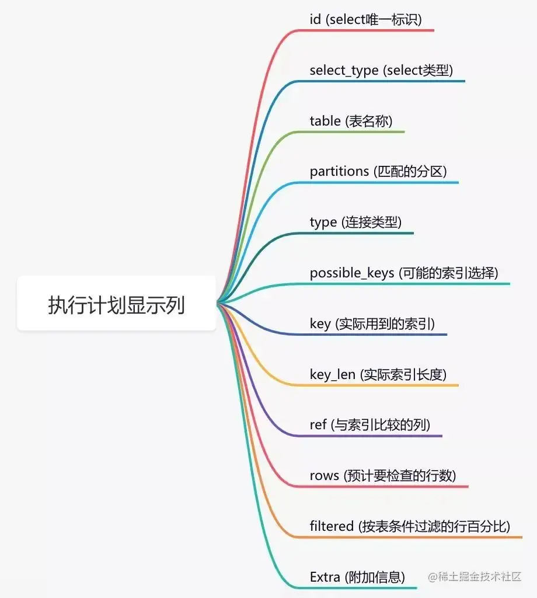

key_len表示使用的索引长度，key_len可以衡量索引的好坏，key_len越小 索引效果越好

#### 3、查看线程执行情况

数据库连接过多\
有一条sql语句的执行时间过长\
锁表（锁表 state 显示lock）

```sql
show processlist
```

#### 4、sql 执行顺序

order by 执行顺序在select之后，可以使用select的虚拟表

### 表操作

#### 1、创建表

```sql
CREATE TABLE `label` (
  `id` bigint(20) NOT NULL AUTO_INCREMENT COMMENT '主键id',
  `name` varchar(25) DEFAULT NULL COMMENT '标签名',
  `remark` varchar(255) DEFAULT NULL COMMENT '使用说明',
  `create_user` varchar(20) DEFAULT NULL COMMENT '创建人',
  `update_user` varchar(20) DEFAULT NULL COMMENT '更新人',
  `create_time` datetime DEFAULT NULL COMMENT '创建时间',
  `update_time` datetime DEFAULT NULL ON UPDATE CURRENT_TIMESTAMP COMMENT '更新时间',
  `is_deleted` tinyint(4) DEFAULT '0' COMMENT '是否被删除: 0:没删 ;1: 被删了',
  PRIMARY KEY (`id`)
) ENGINE=InnoDB AUTO_INCREMENT=1513418847613530114 DEFAULT CHARSET=utf8mb4 COMMENT='标签表';

CREATE TABLE `operation_log` (
  `id` bigint(20) NOT NULL AUTO_INCREMENT COMMENT '主键id',
  `partner_id` varchar(50) DEFAULT NULL COMMENT '品牌id',
  `partner_name` varchar(50) DEFAULT NULL COMMENT '品牌名称',
  `type` tinyint(4) DEFAULT NULL,
  `store_code` varchar(50) DEFAULT NULL COMMENT '门店编号',
  `store_name` varchar(100) DEFAULT NULL COMMENT '门店名称',
  `product_id` varchar(50) DEFAULT NULL COMMENT '商品编号',
  `product_name` varchar(100) DEFAULT NULL COMMENT '商品名',
  `order_code` varchar(255) DEFAULT NULL COMMENT '订单号',
  `ip` varchar(50) DEFAULT NULL COMMENT 'ip',
  `user_agent` varchar(200) DEFAULT NULL,
  `application` varchar(50) DEFAULT NULL COMMENT '应用',
  `module` varchar(50) DEFAULT NULL COMMENT '模块',
  `action` varchar(50) DEFAULT NULL COMMENT '操作事件',
  `action_desc` varchar(255) DEFAULT NULL COMMENT '操作事件中文描述',
  `content` varchar(1000) DEFAULT NULL COMMENT '操作内容',
  `create_user` varchar(50) DEFAULT NULL COMMENT '创建人',
  `create_time` datetime DEFAULT NULL COMMENT '创建时间',
  PRIMARY KEY (`id`),
  KEY `idx_action` (`action`)
) ENGINE=InnoDB  DEFAULT CHARSET=utf8mb4;

```

#### 2、添加索引

```sql
ALTER TABLE card ADD INDEX idx_partnerCode (partnerCode);
# 唯一索引
ALTER TABLE `partner` ADD unique(`app_id`);     
ALTER TABLE `project_config` ADD unique(`project_code`);  
# 联合索引

# 联合唯一索引
alter table t_aa add unique index(aa,bb);

# 联合主键
alter table tb_name add primary key (字段1,字段2,字段3);

ALTER TABLE jw_resource ADD UNIQUE KEY(resource_name, resource_type);
```

#### 3、表修改名字

```sql
ALTER TABLE log RENAME TO operation_log;
```

#### 4、表添加字段

```sql
ALTER TABLE operation_log
ADD type tinyint(4) DEFAULT NULL COMMENT '类型',
ADD store_code VARCHAR(50) DEFAULT NULL COMMENT '门店编号',
ADD store_name VARCHAR(100) DEFAULT NULL COMMENT '门店名称',
ADD product_id VARCHAR(50) DEFAULT NULL COMMENT '商品编号',
ADD product_name VARCHAR(100) DEFAULT NULL COMMENT '商品名',
ADD order_code VARCHAR(255) DEFAULT NULL COMMENT '订单号';
```

例如

```sql
ALTER TABLE `coupon_info` ADD COLUMN `city_code` VARCHAR(200) DEFAULT NULL COMMENT '城市编号'
```

#### 5、表修改字段名字

```sql
ALTER TABLE order_delivery MODIFY province_name VARCHAR(100) DEFAULT NULL COMMENT '省份名称';
```

#### 6、查询

##### ① group by

select的参数和group by的一致

##### ② 查询数量

count(*)包括了所有的列，相当于行数，在统计结果的时候，不会忽略列值为NULL  

count(1)包括了忽略所有列，用1代表代码行，在统计结果的时候，不会忽略列值为NULL  

count(列名)只包括列名那一列，在统计结果的时候，会忽略列值为空（这里的空不是只空字符串或者0，而是表示null）

如果列为主键，count(列名)效率优于count\
如果列不为主键，count(1)效率优于count(列名)\
如果表中存在主键，count(主键列名)效率最优 \
如果表中只有一列，则count(*)效率最优\
如果表有多列，且不存在主键，则count(1)效率优于count(*)

```sql
# 一分钟内订单量
select count(1) from orders where channel='206' and create_time>=DATE_SUB(NOW(),INTERVAL 1 MINUTE);
```

##### ④ having count

```sql
# 表里面 name出现次数大于2的
SELECT * FROM t_user GROUP BY userName HAVING COUNT(userName)>=2 HAVING COUNT是分组后数据比较 

select `value`,count(*) as count from report_config group by `value` having count>1;
```


#### 7、表联查

##### ① 内连接

https://www.cnblogs.com/buxingzhelyd/p/7853454.html

1、UPDATE

```sql
  UPDATE receipt INNER JOIN (SELECT msid FROM receipt WHERE TotalIncome is null) r ON (receipt.msid=r.msid) SET TotalIncome=10           
```

2、LEFT JOIN

左右数据比 1：多时

关联字段 右边有两个或多个 和左边有一样的时候  拼接总数会增加

左拼不是总数和左边一致

```sql
SELECT * FROM user u LEFT JOIN dept d on u.sn=d.sn
```

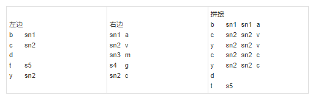

### 常用SQL
```sql
# 一对多表 统计数量
SELECT 
    a.doctor_id, 
    COUNT(DISTINCT b.parent_id) AS parent_count,  -- 计算每个医生对应的家长数量
    COUNT(DISTINCT c.baby_id) AS baby_count       -- 计算每个医生对应的宝贝数量
FROM 
    a
LEFT JOIN b ON a.doctor_id = b.doctor_id  -- 连接医生与家长
LEFT JOIN c ON b.parent_id = c.parent_id  -- 连接家长与宝贝
GROUP BY a.doctor_id;


```

### 存储过程

SQL 语句需要先编译然后执行，而存储过程(Stored Procedure)是一组为了完成特定功能 的 SQL 语句集，经编译后存储在数据库中，用户通过指定存储过程的名字并给定参数(如 果该存储过程带有参数)来调用执行它。 存储过程是可编程的函数，在数据库中创建并保存，可以由 SQL 语句和控制结构组成。当 想要在不同的应用程序或平台上执行相同的函数，或者封装特定功能时，存储过程是非常有 用的。数据库中的存储过程可以看做是对编程中面向对象方法的模拟，它允许控制数据的访 问方式。

存储过程的优点:

增强 SQL 语言的功能和灵活性; 标准组件式编程; 较快的执行速度; 减少网络流量; 作为一种安全机制来充分利用。


## 事务

### 锁机制

MySQL中的锁是在服务器层或者存储引擎层实现的

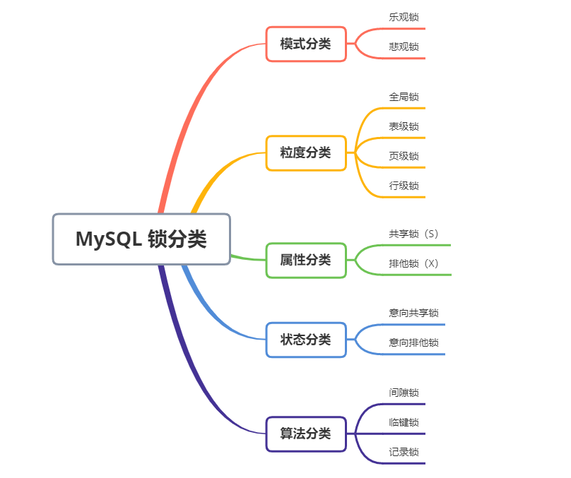

共享锁（读锁）
排它锁 （写锁）

### 事务基本特性

事务基本特性ACID分别是：\
**原子性**指的是一个事务中的操作要么全部成功，要么全部失败。\
**一致性**指的是数据库总是从一个一致性的状态转换到另外一个一致性的状态。比如A转账给B100块钱，假设中间sql执行过程中系统崩溃A也不会损失100块，因为事务没有提交，修改也就不会保存到数据库。\
**隔离性**指的是一个事务的修改在最终提交前，对其他事务是不可见的。\
**持久性**指的是一旦事务提交，所做的修改就会永久保存到数据库中。

### 事务隔离级别

默认隔离级别 REPEATABLE-READ

SELECT @@global.tx_isolation;


隔离性有4个隔离级别分别是\
**第一种隔离级别：Read uncommitted(读未提交)**\
如果一个事务已经开始写数据，则另外一个事务不允许同时进行写操作，但允许其他事务读此行数据，该隔离级别可以通过“排他写锁”，但是不排斥读线程实现。这样就避免了更新丢失，却可能出现脏读，也就是说事务B读取到了事务A未提交的数据\
**解决了更新丢失，但还是可能会出现脏读**\
**第二种隔离级别：Read committed(读提交)**\
如果是一个读事务(线程)，则允许其他事务读写，如果是写事务将会禁止其他事务访问该行数据，该隔离级别避免了脏读，但是可能出现不可重复读。事务A事先读取了数据，事务B紧接着更新了数据，并提交了事务，而事务A再次读取该数据时，数据已经发生了改变。\
**解决了更新丢失和脏读问题**\
**第三种隔离级别：Repeatable read(可重复读取)**\
可重复读取是指在一个事务内，多次读同一个数据，在这个事务还没结束时，其他事务不能访问该数据(包括了读写)，这样就可以在同一个事务内两次读到的数据是一样的，因此称为是可重复读隔离级别，读取数据的事务将会禁止写事务(但允许读事务)，写事务则禁止任何其他事务(包括了读写)，这样避免了不可重复读和脏读，但是有时可能会出现幻读。(读取数据的事务)可以通过“共享读镜”和“排他写锁”实现。\
**解决了更新丢失、脏读、不可重复读、但是还会出现幻读**\
**第四种隔离级别：Serializable(可序化)**\
提供严格的事务隔离，它要求事务序列化执行，事务只能一个接着一个地执行，但不能并发执行，如果仅仅通过“行级锁”是无法实现序列化的，必须通过其他机制保证新插入的数据不会被执行查询操作的事务访问到。序列化是最高的事务隔离级别，同时代价也是最高的，性能很低，一般很少使用，在该级别下，事务顺序执行，不仅可以避免脏读、不可重复读，还避免了幻读\
**解决了更新丢失、脏读、不可重复读、幻读(虚读)**

 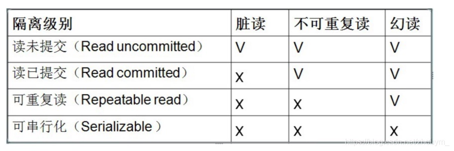


## 索引

### 类型

索引结构和查找算法 https://blog.csdn.net/zengdeqing2012/article/details/118309221

#### btree

插入满了会有分裂操作，来保证树的深度不高

不方便范围查找，要遍历整个左子树

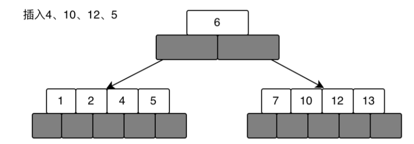

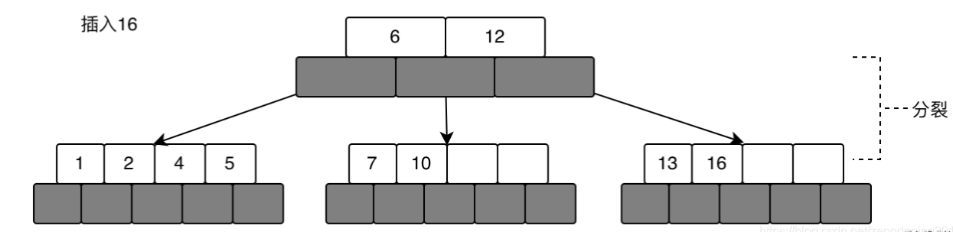

#### b+tree

优缺\
索引提高了查询效率，但是每次修改和删除都要重新维护索引，修改删除性能会稍微降低

索引字段挑选\
用于查询的字段 唯一性较高的字段 使用比较频繁的字段 适合用来做索引，频繁修改的字段不适合

原理\
非叶子节点不存数据，只存索引，空间利用更高效\
叶子节点之间有双向链表，方便范围查找，只找到叶子节点所有左边的


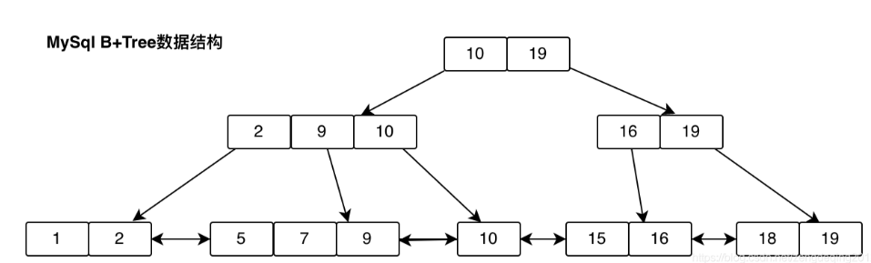


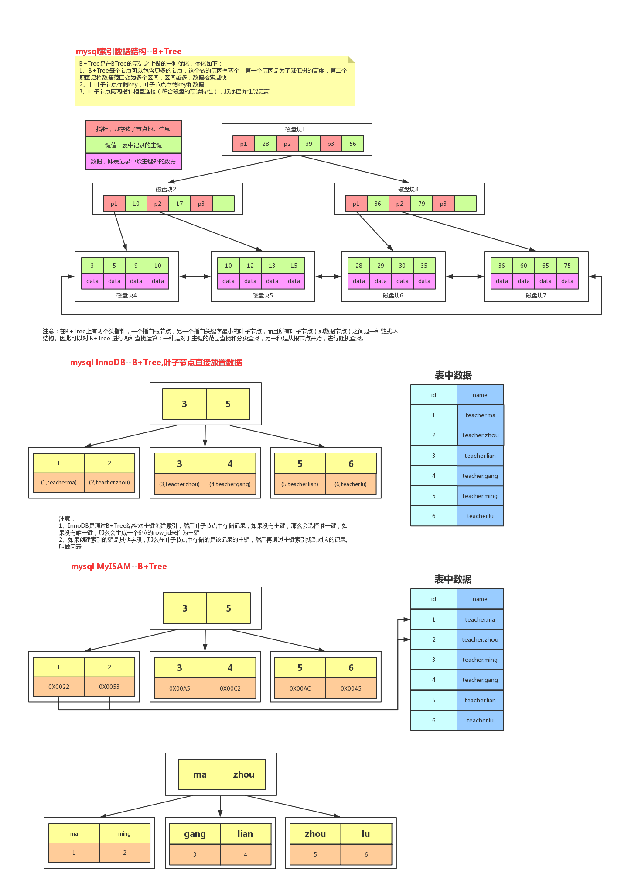


#### Hash索引


#### 单列索引

#### 联合索引 待处理

MySQL可以使用多个字段同时建立一个索引，叫做联合索引。在联合索引中，如果想要命中索引，需要按照建立索引时的字段顺序挨个使用，否则无法命中索引。


### 常见问题

#### 索引失效

##### 1、全值匹配(最好的)

##### 2、最佳左前缀法则

从索引最左列开始，并且不跳过索引中的列

跳过第一个，会索引失效\
跳过中间一个，只有第一个生效\
语句中索引列顺序可以颠倒，不影响从左到右的判断

##### 3、索引列上使用函数会索引失效

不使用计算、类型转换等函数，会导致索引失效

##### 4、>和<范围条件右边的索引失效

组合索引中

a=0,b=0,c=0条件正常使用索引

a=0,b>0,c=0会导致c索引失效

##### 5、!=和<>会索引失效

##### 6、or会

1.有or必全有索引;\
2.复合索引未用左列字段;\
3.like以%开头;\
4.需要类型转换;\
5.where中索引列有运算;\
6、is not null


#### 索引优化

在实际业务中，id >= 100000一般情况都是错误的，因为很多时候要带上各种筛选条件。所以如果有超过1000W数据做查询，最好的办法有2种：\
1、前端强制让缩小查询范围，超过X页后，让缩小范围查询，不让继续翻页。\
2、如果是MySQL、PostgreSQL等数据库，用ShardingJDBC之类的进行表拆分，设置好分表的键和数据源配置，单表数据量可以控制在100W内。比如1000W数据量，可以拆成20个表


优化

 order by 字段建立索引

jion on  字段建立索引 都可以提高点性能

索引失效 Or   isnull语句啥的


1.回表：

2.覆盖索引：

3.最左匹配:

4.索引下推：索引下推在非主键索引上的优化，可以有效减少回表的次数，大大提升了查询的效率。


## 主从复制-读写分离

### 基础

主库负责写、从库负责读；读写分离前提是数据库主从复制

### 形式

一主一从\
一主多从\
多主一从\
双主复制\
级联复制

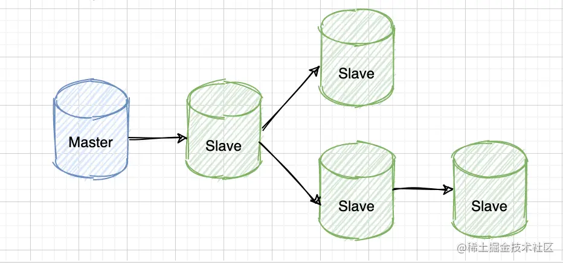

### 类型

异步复制：容易丢数据\
同步复制：性能差\
半同步复制\
延迟复制

1、基于语句的复制：主服务器上面执行的语句在从服务器上面再执行一遍，在 MySQL-3.23 版本以后支持\
2、基于行的复制：把主服务器上面改变后的内容直接复制过去，而不关心到底改变该内容是由哪条语句引发的，在 `MySQL-5.0` 版本以后引入。\
3、混合类型的复制：MySQL 默认使用 基于语句的复制，当 基于语句的复制 会引发问题的时候就会使用 基于行的复制，MySQL 会自动进行选择。

https://juejin.cn/post/6967224081410162696

### 优缺

负载均衡，容灾备份，高可用，高扩展

成本增加，数据延迟，写入变慢

### 原理

​	说到读写分离，我们先了解下什么是主从复制。\
​	主从复制，是用来建立一个和主数据库完全一样的数据库环境，称为从数据库，主数据库一般是准实时的业务数据库。一台服务器充当主服务器，而另外一台服务器充当从服务器。\
​	此时主服务器会将更新信息写入到一个特定的二进制文件中，并会维护文件的一个索引用来跟踪日志循环，这个日志可以记录并发送到从服务器的更新中去。\
一台从服务器连接到主服务器时，从服务器会通知主服务器从服务器的日志文件中读取最后一次成功更新的位置。然后从服务器会接收从哪个时刻起发生的任何更新，然后锁住并等到主服务器通知新的更新。\
读写分离简单俩说就是基于主从复制架构，一个主库，有多个从库，主库主要负责写，写完后主库会自动把数据给同步给从库。

#### 复制过程

1. MySQL master 将数据变更写入二进制日志( **binary log** )
2. slave将master的binary log拷贝到它的中继日志（ **relay log** ）
3. slave重做中继日志中的事件，将数据变更反映它自己的数据

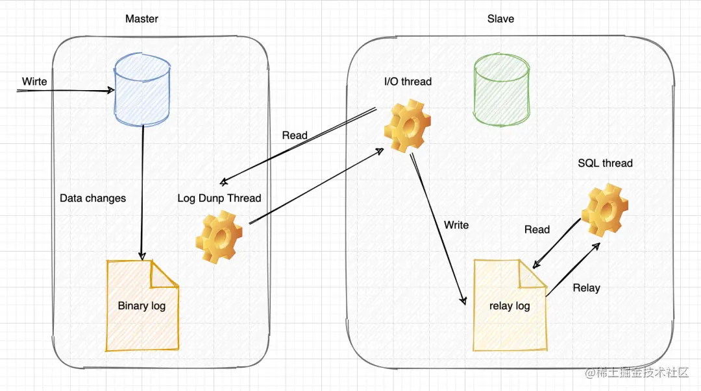

#### 涉及线程

1、主库log dump线程\
2、从库I/O线程\
3、从库sql线程

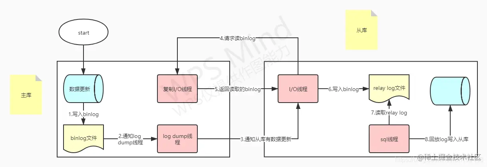

https://juejin.cn/post/7129390559168299039

### 实际操作

#### 1、docker主从搭建

##### ① 使用docker拉取mysql

```sql
docker pull mysql:5.7.37
```

##### ② 创建配置文件

```sql
mkdir -p /usr/local/mysql/master/data
mkdir -p /usr/local/mysql/master/conf
mkdir -p /usr/local/mysql/slave/data
mkdir -p /usr/local/mysql/slave/conf

cd /usr/local/mysql/master/conf
touch my.cnf
vim /usr/local/mysql/master/conf/my.cnf

cd /usr/local/mysql/slave/conf
touch my.cnf
vim /usr/local/mysql/slave/conf/my.cnf
```

master配置my.cnf内容如下

```sql
[mysqld]

#[必须]服务器唯一ID，默认是1
server-id=1

#打开Mysql日志，日志格式为二进制
log-bin=/var/lib/mysql/binlog

#每次执行写入就与硬盘同步
sync-binlog=1

#关闭名称解析
skip-name-resolve

#只保留7天的二进制日志，以防磁盘被日志占满
expire-logs-days = 7

#需要同步的二进制数据库名
binlog-do-db=test

#不备份的数据库
binlog-ignore-db=information_schema
binlog-ignore-db=performation_schema
binlog-ignore-db=sys
binlog-ignore-db=mysql

!includedir /etc/mysql/conf.d/
!includedir /etc/mysql/mysql.conf.d/
```

slave配置my.cnf内容如下

```sql

[mysqld]

#配置server-id，让从服务器有唯一ID号
server-id=2

#开启从服务器二进制日志
log-bin=/var/lib/mysql/binlog

#打开mysql中继日志，日志格式为二进制
relay_log=/var/lib/mysql/mysql-relay-bin

#设置只读权限
read_only=1

#使得更新的数据写进二进制日志中
log_slave_updates=1

#如果salve库名称与master库名相同，使用本配置
replicate-do-db=test

!includedir /etc/mysql/conf.d/
!includedir /etc/mysql/mysql.conf.d/

```

##### ③ 创建容器

创建master容器

```sql
docker run -d -p 3311:3306 --name mysql-master -v /usr/local/mysql/master/data:/var/lib/mysql -v /usr/local/mysql/master/conf/my.cnf:/etc/mysql/my.cnf -v /etc/localtime:/etc/localtime -e MYSQL_ROOT_PASSWORD=123456 mysql:5.7.37
```

```sql
# 查看容器
docker ps
# 查看所有容器
docker ps -a
# 启动容器
docker start [CONTAINER ID]
# 进入容器
docker exec -it mysql-master bash 
# 进入MySQL
mysql -uroot -p123456
# 查看日志和状态
show master status;  

# 创建新用户
use mysql;
create user 'backup' identified by '123456';
GRANT ALL on test.* to backup@'%' identified by '123456';
GRANT REPLICATION SLAVE ON *.* TO 'backup'@'%' identified by '123456';
# 刷一下权限
flush privileges;

# 查看用户？？？？

# 创建数据库和表
create database `test` default character set utf8mb4 collate utf8mb4_general_ci;
use test;
CREATE TABLE `user`  (
  `id` int(11) NOT NULL AUTO_INCREMENT,
  `name` varchar(255) CHARACTER SET utf8mb4 COLLATE utf8mb4_general_ci NULL DEFAULT NULL,
  `age` int(11) NULL DEFAULT NULL,
  PRIMARY KEY (`id`) USING BTREE
) ENGINE = InnoDB AUTO_INCREMENT = 3 CHARACTER SET = utf8mb4 COLLATE = utf8mb4_general_ci ROW_FORMAT = Dynamic;
INSERT INTO `user` VALUES (1, 'zhangsan', 28);
INSERT INTO `user` VALUES (2, 'lisi', 30);
```

创建slave容器

```sql
docker run -d -p 3312:3306 --name mysql-slave -v /usr/local/mysql/slave/data:/var/lib/mysql -v /usr/local/mysql/slave/conf/my.cnf:/etc/mysql/my.cnf -v /etc/localtime:/etc/localtime -e MYSQL_ROOT_PASSWORD=123456 mysql:5.7.37  
```

```sql
docker exec -it mysql-slave bash
mysql -uroot -p123456

# 停止slave的IO线程
stop slave;
# 配置master库信息
change master to master_host='xx.xx.xx.xx',master_port=3311,master_user='backup',master_password='123456',master_log_file='binlog.000003',master_log_pos=154;
# 开启slave的IO线程
start slave;

show slave status\G;
```

命令 change master to 参数说明\
​	执行 change master to命令后的信息保存在 /var/lib/mysql/master.info 和 relay-log.info 两个文件中\
​	master_host: 主库的 **IP地址**\
​	master_user: 访问主库进行主从复制的 **用户名** ( 上面在主库创建的 )\
​	master_password: 访问主库进行主从复制的用户名对应的 **密码**\
​	master_log_file: 从哪个 **日志文件** 开始同步 ( 即下图的 **File** )\
​	master_log_pos: 从指定日志文件的哪个 **位置** 开始同步 ( 即下图的 **Position** )（master_log_pos=0时系统会自动配成154）

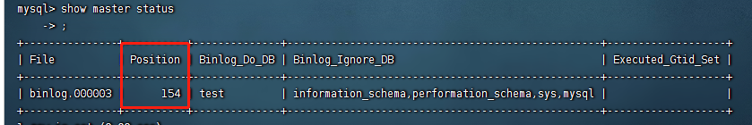

主从同步是否就绪参数

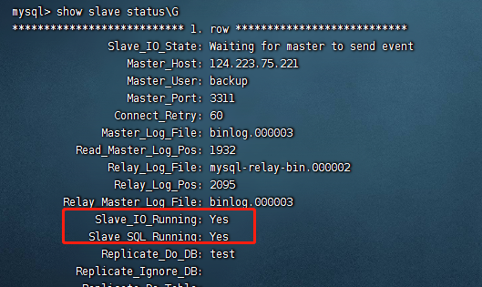

资料 https://blog.csdn.net/weixin_48319193/article/details/125453036

#### 2、java读写分离

sharding-jdbc：mysql-demo 写过了

replication 记得试下


### 资料

https://juejin.cn/post/6844904191731695623

## 分库分表

### 拆分之前考虑

归档后数据数量

数据增长量 每月七八百万 类似这种需要拆分

分片数

考虑每个表的数据量、tps、qps等 压测取合适值

拆分键

hash取模计算位置

### 拆分常用方法(数据分片)
概念：按照一定规则，将数据集划分成相对独立数据子集\
核心手段：对关系型数据库进行分库和分表\
垂直分片（纵向拆分）：按功能拆分 order、user\
水平分片（横向拆分）：拆分成多个表或者库 order_1、order_2

#### 1、取模-暴力法

此方案采用前面推算出3年后约20亿用户量，进行取模轮流放置。\
好处：做法比较简单，数据分布均衡\
坏处：当数据量超过20亿的情况下，不易扩展。在数据量较小的情况下，资源有些浪费。

比如：\
预计两年后订单量5亿，分20个库，单库2500w\
采用取模 members % 20 \
主键采用雪花算法

#### 2、hash方式

对数据进行hash计算再取模Hash(Key)%N，N一般是设备数\
​优缺：实现简单，但设备扩容大部分数据都需要迁移

#### 3、一致性哈希(推荐)
此方案采用一致性哈希算法，定义一个2^32次方个桶的空间，约等于42亿的数据量。\
​介绍: https://blog.csdn.net/u011305680/article/details/79721030

好处：数据量可以无上限，数据分布均衡，在扩展库数量时，仅少量数据迁移。\
坏处：实现上较复杂，dba操作麻烦

问题：hash冲突怎么处理？？

实现：测试代码搜这个ConsistentHashingWithoutVirtualNode

原理：\
​	数据按照特征值和节点映射到首尾相接的hash环，数据顺时针找第一个节点作为存储节点\
​	优缺：设备扩容只影响hash环相邻的节点，不需要大规模数据迁移

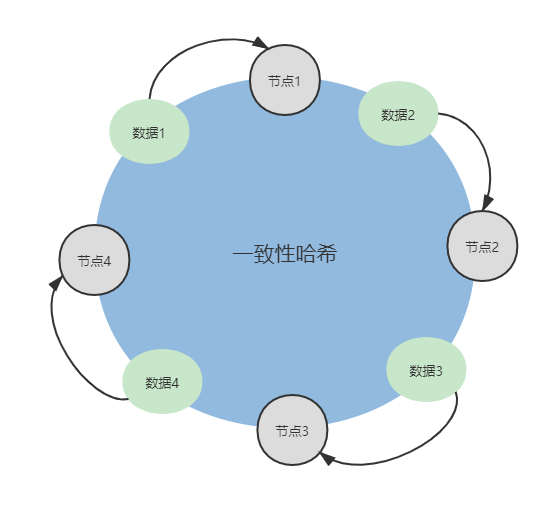

#### 4、区间划分(推荐)
时间：从memberId中取出时间戳，按时间缀划分区间，memberId中不从在时间戳的（导入的老数据），按数值区间划分。\
好处：无限扩展，无须迁移数据\
坏处：数据不均衡

后两位字母：比喻取memberId后两位进行划分。\
好处：数据分布相对均衡\
坏处：扩展时，有部分数据迁移


​	根据具体业务，按时间戳、使用频率、Id范围等等分

​	优缺：不是很好把握数据分布均匀

评估：\
​	动态扩展，数据增长增加节点是否方便\
​	负载均衡，数据分布是否均衡\
​	可用性，节点故障，数据能否转移到其他节点


#### 5、云产品：TDSQL、DRDS(超级推荐)
​	好处：无风险、改造少、稳定、好扩展、价格与自建相差不多\
​	云产品2分片：3500/月\
​	自建配置：

费用：1900 + 800*3  预计= 4000/月

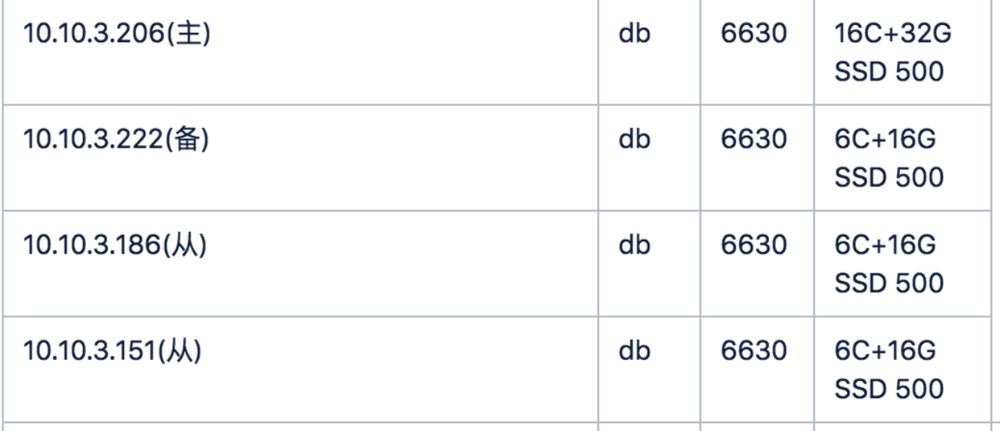


### 分库分表需要解决的问题！！！

#### 1、分布式事务???

补偿事务，例如TCC

记录日志

#### 2、分布式主键冲突

① 用redis的incr命令生成主键

② 用UUID生成主键

③ 用snowake算法生成主键

#### 3、跨库join

尽量避免


门店

商品

会员 有按memberId分10个库

订单 全家是三个月前归档，历史库

券码 有按券号分库？？

支付 有集群


### 故障转移？？

MHA (Master High Availability) mysql高可用程序

资料 https://zhuanlan.zhihu.com/p/396007930

### 数据迁移

配置\
两种：一种默认第一个是master，后面的是slave;二种是指定多个master(type区分)\
例子\
spring.datasource.url=jdbc:mysql:replication://10.53.10.7:6630,10.53.10.22:6630,10.53.10.18:6630/fm_mg_user?useUnicode=true&characterEncoding=utf8&serverTimezone=GMT%2B8

基于replication实现读写分离转至元数据结尾

数据源配置使用replication

```sql
jdbc:mysql:replication://10.53.10.2:3306,10.53.10.1:3306/console_product?…
```

第一个为主库，后面为从库\
需要使用@Transactional(readonly=true) 控制为只读事务，则会走从库

```sql
public interface BasisStoreConfigMapper {
    //只读，走从库
    @Transactional(readOnly = true)
    List<BasisStoreConfigDto> list(@Param("partnerId") String partnerId);
    //没有加事务标记，则会走主库
    Integer batchUpdate(@Param("list")List<BasisStoreConfig> list);
}
```


mycat??

## 八、分区表

一张表，物理层面分区

分区特性可以将一张表从物理层面根据一定的规则将数据划分为多个分区，多个分区可以单独管理，甚至存放在不同的磁盘/文件系统上，提升效率。


## 底层原理

### 结构图

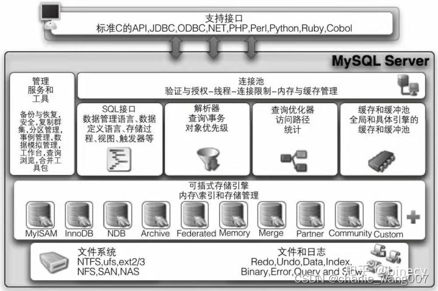

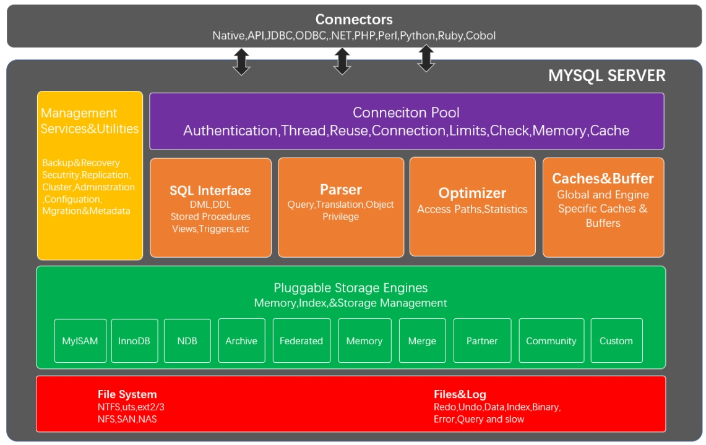


连接器\
​	负责跟客户端建立连接，获取权限，维持和管理连接\
​	用户密码验证、查询权限信息、分配对应的权限\
​	太长时间没动静，会自动断开，用wait_timeout控制，默认8小时\
连接分为两类：长连接（ 推荐使用，但是要周期性断开长连接）、短连接 \
词法分析：mysql会对输入的字符串识别每部分代表什么意思 表名 id名一类的\
语法分析：根据语法规则判断sql是否满足语法规则、优化使用索引 表连接顺序等

### 存储引擎

mysql存储引擎

**InnoDB**

（1）灾难恢复性比较好；

（2）**支持事务**。默认的事务隔离级别为可重复度，通过MVCC（并发版本控制）来实现的。

（3）使用的锁粒度为**行级锁**，可以支持更高的并发；

（4）支持**外键**；

（5）配合一些热备工具可以支持在线热备份；

（6）在InnoDB中存在着缓冲管理，通过缓冲池，将索引和数据全部缓存起来，加快查询的速度；

（7）对于InnoDB类型的表，其数据的物理组织形式是聚簇表。所有的数据按照主键来组织。数据和索引放在一块，都位于B+数的叶子节点上；

**MyISAM**

在5.5版本之前，MyISAM是MySQL的默认存储引擎，该存储引擎并发性差，不支持事务，所以使用场景比较少，主要特点为：

（1）**不支持事务**；

（2）**不支持外键**，如果强行增加外键，不会提示错误，只是外键不其作用；

（3）对数据的查询缓存只会缓存索引，不会像InnoDB一样缓存数据，而且是利用操作系统本身的缓存；

（4）默认的锁粒度为表级锁，所以并发度很差，加锁快，锁冲突较少，所以不太容易发生死锁；

（5）支持全文索引（MySQL5.6之后，InnoDB存储引擎也对全文索引做了支持），但是MySQL的全文索引基本不会使用，对于全文索引，现在有其他成熟的解决方案，比如：ElasticSearch，Solr，Sphinx等。

（6）数据库所在主机如果宕机，MyISAM的数据文件容易损坏，而且难恢复；

二、InnoDB和MyISAM的对比

1、由于锁粒度的不同，InnoDB比MyISAM支持更高的并发；

2、InnoDB为行级锁，MyISAM为表级锁，所以InnoDB相对于MyISAM来说，更容易发生死锁，锁冲突的概率更大，而且上锁的开销也更大，因为需要为每一行加锁；

3、在备份容灾上，InnoDB支持在线热备，有很成熟的在线热备解决方案；

4、查询性能上，MyISAM的查询效率高于InnoDB，因为InnoDB在查询过程中，是需要维护数据缓存，而且查询过程是先定位到行所在的数据块，然后在从数据块中定位到要查找的行；而MyISAM可以直接定位到数据所在的内存地址，可以直接找到数据；

5、SELECT COUNT(*)语句，如果行数在千万级别以上，MyISAM可以快速查出，而InnoDB查询的特别慢，因为MyISAM将行数单独存储了，而InnoDB需要朱行去统计行数；所以如果使用InnoDB，而且需要查询行数，则需要对行数进行特殊处理，如：离线查询并缓存；

6、MyISAM的表结构文件包括：.frm(表结构定义),.MYI(索引),.MYD(数据)；而InnoDB的表数据文件为:.ibd和.frm(表结构定义)；

**InnoDB适合增删改 MyISAM适合查询？？**

myisam引擎是5.1版本之前的默认引擎，支持全文检索、压缩、空间函数等，但是不支持事务和行级锁，所以一般用于有大量查询少量插入的场景来使用，而且myisam不支持外键，并且索引和数据是分开存储的。

innodb是基于聚簇索引建立的，和myisam相反它支持事务、外键，并且通过MVCC来支持高并发，索引和数据存储在一起

**Memory**

InnoDB:支持事务处理，支持外键，支持崩溃修复能力和并发控制。如果需要对事务的完整 性要求比较高(比如银行)，要求实现并发控制(比如售票)，那选择 InnoDB 有很大的优势。 如果需要频繁的更新、删除操作的数据库，也可以选择 InnoDB，因为支持事务的提交(commit) 和回滚(rollback)。

 MyISAM:插入数据快，空间和内存使用比较低。如果表主要是用于插入新记录和读出记录，那么选择 MyISAM 能实现处理高效率。如果应用的完整性、并发性要求比较低，也可以使 用。

 MEMORY:所有的数据都在内存中，数据的处理速度快，但是安全性不高。如果需要很快的 读写速度，对数据的安全性要求较低，可以选择 MEMOEY。它对表的大小有要求，不能建 立太大的表。所以，这类数据库只使用在相对较小的数据库表。


redo日志(innodb存储引擎日志文件)\
修改数据时，innodb记录到redo log中，更新内存，然后合适的时候操作到磁盘\
Redo log是固定大小，循环写的过程\
可以保证数据库异常重启，之前的记录也不会丢失（crash-safe）


### innodb存储结构

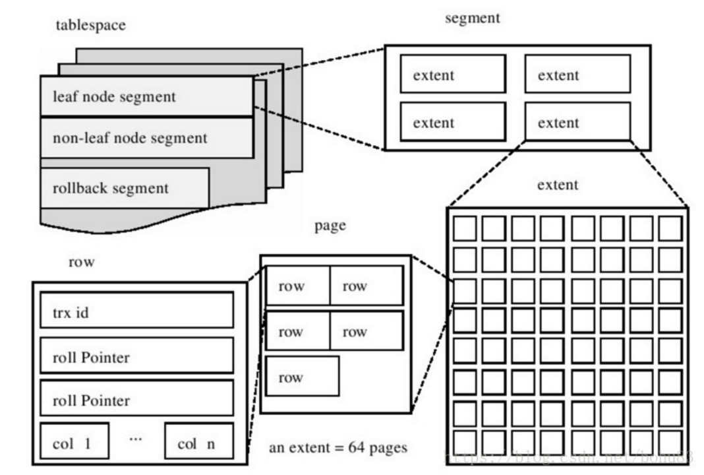

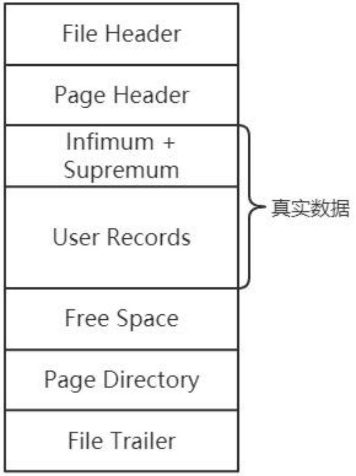

### 行结构

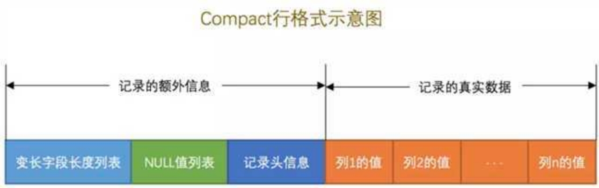


### 一级索引

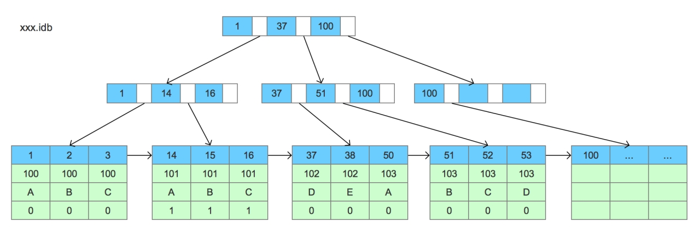

### 二级索引

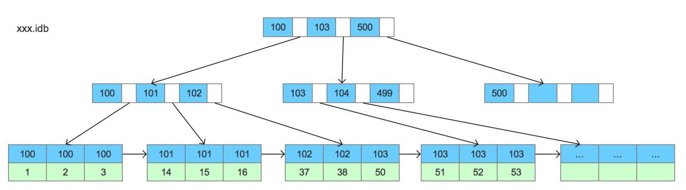

### 组合索引

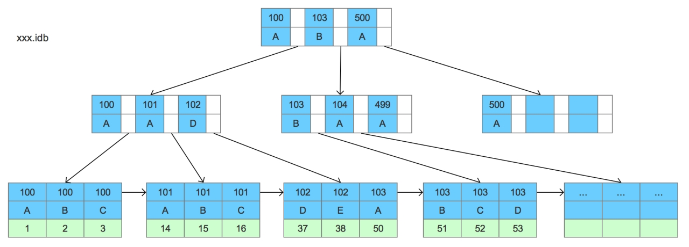


选择离散性高的字段建立索引 

组合索引：离散性高的字段放前面 

前缀索引：varchar字段可以指定索引长度

离散性计算：count(distinct left(列名, 索引长度))/count(*)

SELECT  count( DISTINCT ( thirdPartyCode ) ) / count( * ) thirdPartyCode,  count( DISTINCT ( unionId ) ) / count( * ) unionId FROM  customer_center0.member_channel;

SELECT  count( DISTINCT LEFT ( receiveName, 3 ) ) / count( * ) AS l3,  count( DISTINCT LEFT ( receiveName, 4 ) ) / count( * ) AS l4,  count( DISTINCT LEFT ( receiveName, 5 ) ) / count( * ) AS l5,  count( DISTINCT LEFT ( receiveName, 6 ) ) / count( * ) AS l6,  count( DISTINCT LEFT ( receiveName, 7 ) ) / count( * ) AS l7,  count( DISTINCT LEFT ( receiveName, 8 ) ) / count( * ) AS l8,  count( DISTINCT LEFT ( receiveName, 9 ) ) / count( * ) AS l9,  count( DISTINCT LEFT ( receiveName, 10 ) ) / count( * ) AS l10,  count( DISTINCT LEFT ( receiveName, 11 ) ) / count( * ) AS l11,  count( DISTINCT LEFT ( receiveName, 12 ) ) / count( * ) AS l12 FROM  customer_center.delivery_address;


### 索引覆盖

in的参数个数建议小于200200以内使用index dive，超过200使用index statistics（不准确）

### 工具

slow log


sql审计 腾讯云、druid

### sql执行过程

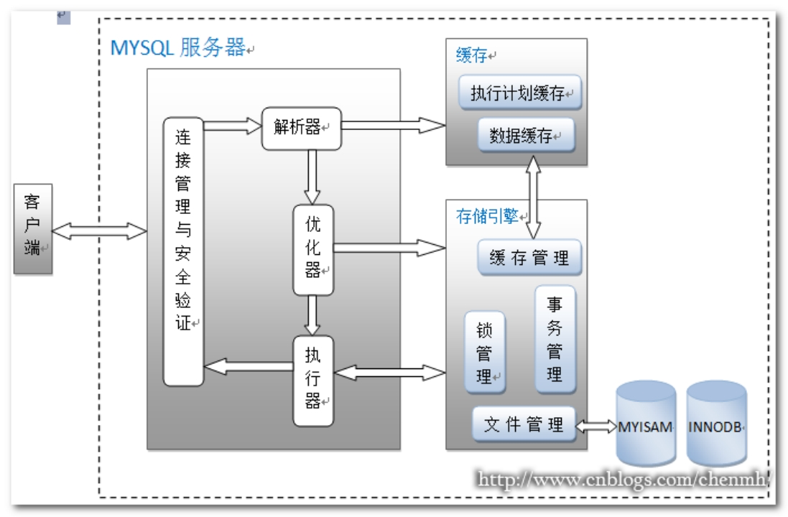


druid连接池问题

test-on-borrow=true获取连接时执行validationQuery检测连接是否有效，这个配置会降低性能。

## 常见问题

### 字符集😂

​	mysql 中的utf8 是阉割版的 utf8，它最多只用 3 个字节存储字符，所以存储不了表情，完整的 utf8 字符集，最多可以用 4 个字节来存储字符，这个字符集名字叫 utf8mb4

```sql
ALTER TABLE operate_log MODIFY `op_info` text CHARACTER SET utf8mb4  COMMENT '修改后的信息';
```

资料 https://oitboy.com/detail?id=21

### 行转列 列转行

https://www.cnblogs.com/xiaoxi/p/7151433.html


1、**mysql比较低得版本，受毫秒影响，保存到数据库datetime的时间不准**

java date类型要清除掉毫秒部分

calendar.clear(Calendar.MILLISECOND);

否则保存到数据库会四舍五入导致时间不准

2、查询缓存缺点

一、查询缓存失效比较频繁，只要表更新，缓存就会清空

二、缓存对应新更新的数据命中率比较低

版本

com.mysql.jdbc.Driver 是 mysql-connector-java 5中的， 

com.mysql.cj.jdbc.Driver 是 mysql-connector-java 6中的

mysql5.7以下版本兼容bug

https://hacpai.com/article/1594267824908

any_value  sql_mode=only_full_group_by


订单分库分片算法


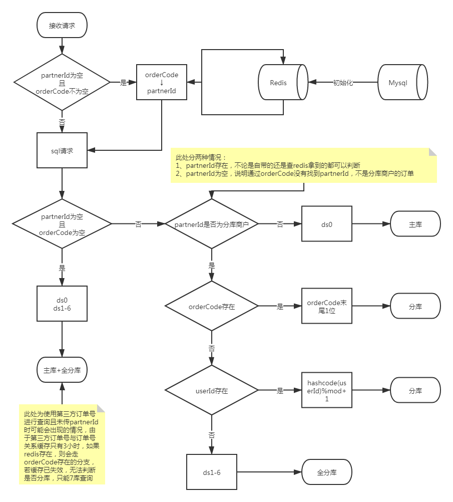


## 性能优化

### 性能瓶颈

#### 1、数据库连接

​	mysql默认100个连接，单机1500连接

#### 2、数据量

​	单库数据量5000万以内性能较好
​	单表数据量500万-1000万之间性能较好

#### 3、硬件问题

​	服务磁盘空间有限制，并发压力下所有请求访问同一个节点，会对磁盘IO影响很大

### 优化

1、参数优化
2、缓存、索引
3、读写分离
4、分库分表

优化成本：硬件>系统配置>数据库表结构>SQL及索引。
优化效果：硬件<系统配置<数据库表结构<SQL及索引。

创建列abc索引，语句like c% 会导致索引失效，like abc% 才有效
文档：

http://blog.itpub.net/31555484/viewspace-2565387/

https://juejin.cn/post/7151548964964139021


- 优化的原因

```
1、经常会出现慢sql
2、数据库连接超时
3、由于表锁等原因 数据无法提交 造成生产事故

```

- 从哪几个方面操刀呢

```
1、sql自身 （索引，有效）
2、数据库表结构
3、系统配置
4、硬件
```

- 数据准备

```
下载：http://dev.mysql.com/doc/sakila/en/sakila-installation.html

导入数据：http://dev.mysql.com/doc/index-other.html
```

- 如何发现有问题的sql

  - 查看时否开启慢查询日志

  ```sql
   show variables like 'slow_query_log';
  ```

  - 是否将位使用索引的sql记录慢sql中

  ```sql
  show variables like '%log%';
  ```

  - 开启

  ```sql
  set global slow_query_log=on;
  set global log_queries_not_using_indexes=on
  ```

  - 记录慢查询的时间

  ```sql
  show variables like 'long_query_time';
  set global long_query_time=0; 
  ```

  - 设置慢sql写入文件位置

  ```sql
  set global slow_query_log_file='D:\dev mysql\data\slow_query.log';
  ```

- 分析慢sql查询工具

  - tp-query-digest
  - [安装路径](https://blog.csdn.net/banche163/article/details/103847851) 的链接。

```sql
1、tp-query-digest 
2、分析慢sql
perl pt-query-digest.pl "D:\dev\mysql\data\SH-BW-H-NB-slow.log";
3、将分析结果输出到文档
perl pt-query-digest.pl "D:\dev\mysql\data\SH-BW-H-NB-slow.log" > slow_report.log
4、分析最近12小时的慢sql
perl pt-query-digest  --since=12h  "D:\dev\mysql\data\SH-BW-H-NB-slow.log" > slow_report2.log
5、指定分析一段时间内的慢sql
  perl pt-query-digest.pl "D:\dev\mysql\data\SH-BW-H-NB-slow.log" --since "2020-03-08 09:30:00" --until "2020-03-08 09:59:00" > slow_report3.log

```

- 分析工具的参数介绍

  - 第一部分：总体统计结果

    ```sql
    1、说明：
         Overall：总共有多少条查询
         Time range：查询执行的时间范围
         unique：唯一查询数量，即对查询条件进行参数化以后，总共有多少个不同的查询
         total：总计   min：最小   max：最大  avg：平均
         95%：把所有值从小到大排列，位置位于95%的那个数，这个数一般最具有参考价值
         median：中位数，把所有值从小到大排列，位置位于中间那个数
    2、具体参数
          # 该工具执行日志分析的用户时间，系统时间，物理内存占用大小，虚拟内存占用大小
          # 340ms user time, 140ms system time, 23.99M rss, 203.11M vsz
          # 工具执行时间
          # Current date: Fri Nov 25 02:37:18 2016
          # 运行分析工具的主机名
          # Hostname: localhost.localdomain
          # 被分析的文件名
          # Files: slow.log
          # 语句总数量，唯一的语句数量，QPS，并发数
          # Overall: 2 total, 2 unique, 0.01 QPS, 0.01x concurrency ________________
          # 日志记录的时间范围
          # Time range: 2016-11-22 06:06:18 to 06:11:40
          # 属性               总计      最小    最大    平均    95%  标准    中等
          # Attribute          total     min     max     avg     95%  stddev  median
          # ============     ======= ======= ======= ======= ======= ======= =======
          # 语句执行时间
          # Exec time             3s   640ms      2s      1s      2s   999ms      1s
          # 锁占用时间
          # Lock time            1ms       0     1ms   723us     1ms     1ms   723us
          # 发送到客户端的行数
          # Rows sent              5       1       4    2.50       4    2.12    2.50
          # select语句扫描行数
          # Rows examine     186.17k       0 186.17k  93.09k 186.17k 131.64k  93.09k
          # 查询的字符数
          # Query size           455      15     440  227.50     440  300.52  227.50
     
    ```

  - 第二部分: 查询分组统计结果 默认按响应时间降序

    ```sql
    1、说明
          Rank：所有语句的排名，默认按查询时间降序排列，通过--order-by指定
          Query ID：语句的ID，（去掉多余空格和文本字符，计算hash值）
          Response：总的响应时间
          time：该查询在本次分析中总的时间占比
          calls：执行次数，即本次分析总共有多少条这种类型的查询语句
          R/Call：平均每次执行的响应时间
          V/M：响应时间Variance-to-mean的比率
          Item：查询对象
    2、具体参数
          # Profile
          # Rank Query ID                            Response time Calls R/Call V/M 
          # ==== =================================== ============= ===== ====== ====
          #    1 0xE77769C62EF669AA7DD5F6760F2D2EBB   0.0028 38.4%     1 0.0028  0.00 SHOW VARIABLES
          #    2 0xCD7FE690D641EFD65711E90D12B02134   0.0026 36.1%     1 0.0026  0.00 SELECT customer
          #    3 0x751417D45B8E80EE5CBA2034458B5BC9   0.0006  8.2%     1 0.0006  0.00 SHOW DATABASES
          #    4 0x803984638D651F405C13F591095F7AB8   0.0006  8.1%     1 0.0006  0.00 SELECT film
          #    5 0x898255B1BE4F8C3044AE35A182869033   0.0004  5.4%     2 0.0002  0.00 ADMIN INIT DB
          # MISC 0xMISC                               0.0003  3.7%     2 0.0001   0.0 <1 ITEMS>
    
    ```

  - 第三部分:每一种查询的详细统计结果

    ```sql
    1、说明
          由下面查询的详细统计结果，最上面的表格列出了执行次数、最大、最小、平均、95%等各项目的统计。
          ID：查询的ID号，和上图的Query ID对应
          Databases：数据库名
          Users：各个用户执行的次数（占比）
          Query_time distribution ：查询时间分布, 长短体现区间占比。
          Explain：SQL语句
          
    2、具体示例
          # Query 2: 0 QPS, 0x concurrency, ID 0xCD7FE690D641EFD65711E90D12B02134 at byte 1836
          # Scores: V/M = 0.00
          # Time range: all events occurred at 2021-03-08T15:53:49
          # Attribute    pct   total     min     max     avg     95%  stddev  median
          # ============ === ======= ======= ======= ======= ======= ======= =======
          # Count         12       1
          # Exec time     36     3ms     3ms     3ms     3ms     3ms       0     3ms
          # Lock time     77     2ms     2ms     2ms     2ms     2ms       0     2ms
          # Rows sent      5       1       1       1       1       1       0       1
          # Rows examine  36     599     599     599     599     599       0     599
          # Query size     9      48      48      48      48      48       0      48
          # String:
          # Databases    sakila
          # Hosts        localhost
          # Users        root
          # Query_time distribution
          #   1us
          #  10us
          # 100us
          #   1ms  ################################################################
          #  10ms
          # 100ms
          #    1s
          #  10s+
          # Tables
          #    SHOW TABLE STATUS FROM `sakila` LIKE 'customer'\G
          #    SHOW CREATE TABLE `sakila`.`customer`\G
          # EXPLAIN /*!50100 PARTITIONS*/
          select * from customer where first_name ='LINDA'\G
    
    ```

- 那些sql 需要优化

  - 查询次数多且每次查询占用时间长的SQL(digest分析的前几个查询);
  - IO大的sql 扫秒行数较多Rows examine 项
  - 未命中索引 digest分析中Row examine 和 Rows Send的对比

- 熟悉下Explian

  主要关注 key、type possile_keys、rows、extra

  - key

    - system 表只有一行记录，这个是const的特例，一般不会出现，可以忽略
    - const 表示通过索引一次就找到了，const用于比较primary key或者unique索引。因为只匹配一行数据，所以很快

     ```sql
    explain select * from  user_test where id = 1;
     ```

    - eq_ref 使用唯一索引或主键进行匹配，用于联接操作时，确保联接条件是唯一的。性能较好，直接定位所需行。

     ```sql
     EXPLAIN SELECT * FROM actor a LEFT JOIN film_actor fa on a.actor_id = fa.actor_id WHERE fa.film_id = 2;
    
     ```

    - ref 非唯一索引，等值匹配，可能有多行命中

    ```sql
    ## 去掉主键索引
    ALTER TABLE user_test DROP PRIMARY KEY;
    ## 换成普通索引
    ALTER TABLE user_test add index idx_id(id);
    ## sql
    explain select * from  user_test where id = 1;
    ```

    - range ，它是索引上的范围查询，它会在索引上扫码特定范围内的值。

    ```sql
    ## 给时间加上索引
    ALTER TABLE payment ADD INDEX idx_payment_data (payment_date);
    
    ## sql
    EXPLAIN SELECT * FROM payment WHERE   payment_date >= '2005-05-12' ANd payment_date <= '2005-06-18';
    ```

    - index  索引上的全集扫描，例如：InnoDB 的 count

    ```sql
     SELECT count(*) FROM payment
    ```

    - all 全表扫描 效率最差的

  - possible_leys 线上可用在这张表上的索引

  - rows 扫描行数

  - extra

    - Using filesort：MySQL 对数据使用一个外部的文件内容进行了排序，而不是按照表内的索引进行排序读取。
    - Using temporary：使用临时表保存中间结果，也就是说 MySQL 在对查询结果排序时使用了临时表，常见于order by 或 group by。
    - Using index：表示 SQL 操作中使用了覆盖索引（Covering Index），避免了访问表的数据行，效率高。
    - Using index condition：表示 SQL 操作命中了索引，但不是所有的列数据都在索引树上，还需要访问实际的行记录。 5.6之前是没有的 主要运用了索引下推
    - 补充 1、不使用索引下推：
      获取下一行，首先读取索引信息，然后根据索引将整行数据读取出来。
      然后通过where条件判断当前数据是否符合条件，符合返回数据。
      2、
      获取下一行的索引信息。
      检查索引中存储的列信息是否符合索引条件，如果符合将整行数据读取出来，如果不符合跳过读取下一行。
      用剩余的判断条件，判断此行数据是否符合要求，符合要求返回数据。

    


- 优化讲解

  - 组合索引顺序

  ```sql
  ## 组合索引一个优点 可以避免回表（进行索引覆盖） 减少回表查询次数一点避免过多的索引创建 
  a, (a, b) 、(a,c) 、（a, b, c）  
  ALTER TABLE address ADD INDEX  idx_ad_ph_city_id (address, phone, district);
  ## 补充 离散度大的列放到联合索引的前面 离散度大的列 可选择性
  SELECT count(DISTINCT address), count(DISTINCT district), count(DISTINCT phone) FROM address;
  
  ## 配送实践  这里提现组合索引的好处
  ALTER TABLE delivery ADD INDEX idx_partiner_id_create_date (partner_id, create_date); 
    
  ```

  - grop by (a, b)

    - a b 都是普通索引
    - a b 是组合索引
    - b a 互换
    - where 条件包含 索引

  - order by 

    - 值查询用于排序的索引字段

    - 查询用于排序的索引字段和主键之外的字段 

    - where + order by 

      - 排序字段在多个索引中
      - 排序字段在一个索引中,并且WHERE条件和ORDER BY使用相同的索引
      - where 条件字段和排序字段在一个索引中（组合索引）
      - 排序字段顺序与索引列顺序不一致 （等值查询 和 范围查询）

      ```sql
      ALTER TABLE address ADD INDEX  idx_ct_ph(city_id, phone);
      EXPLAIN SELECT  * FROM  address  WHERE city_id = 200  ORDER BY phone;
      EXPLAIN SELECT  * FROM  address  WHERE city_id > 200  ORDER BY phone;
      ```

   - 强制走索引

    ```sql
   SELECT
   * 
   FROM
       delivery
       FORCE INDEX(idx_create_date)
   WHERE
       1 = 1 
       AND partner_id = '1418' 
       AND create_date BETWEEN '2021-01-01 00:00:00' 
       AND '2021-01-12 23:59:59' 
       LIMIT 44900,
       100;
    ```


## MVCC
事务隔离级别的无锁实现方式，用于提高事务的并发性能

脏读是单条数据问题(两次读取过程中，该数据被修改)

幻读是表级别的问题(两次读取过程中，插入了一条数据)，需要表锁，也就是采用串行化方式解决
### 隐藏列
DB_TRX_ID 当前列是被哪个事务ID维护了(比如当前如果执行的是插入就把插入用到的事务ID保存进来)\
DB_ROLL_PTR 记录的是上一个事务操作的指针数据，便于回滚到上一个事务

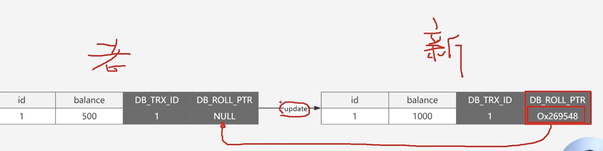

操作过的事务都会存在undolog里面
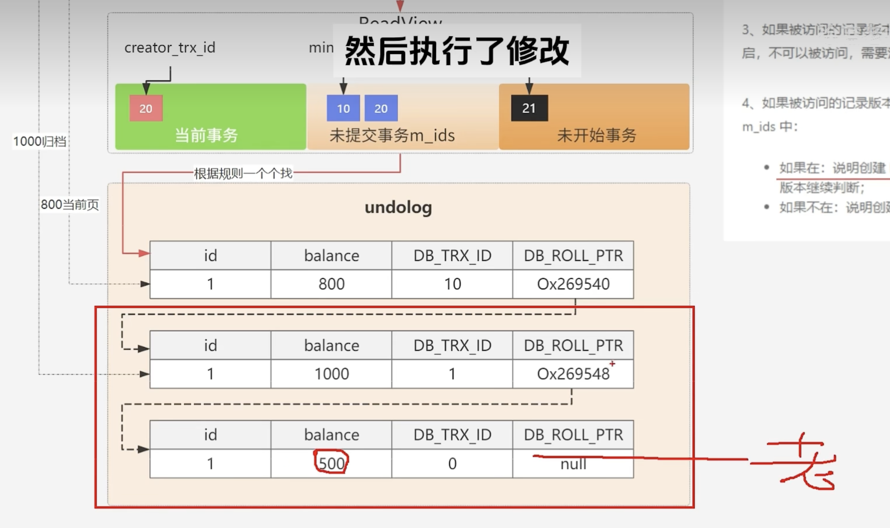

每次查询都会创建一个readView
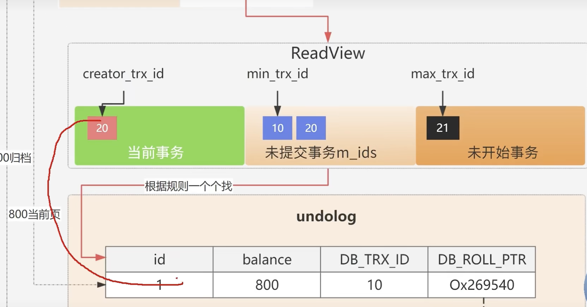

用undolog里面保存的各个历史数据事务ID和readView中的做对比，找到已经提交的最新的事务ID,然后读取里面的数据

这个对比的过程其实就是个乐观锁的机制


参考 https://www.bilibili.com/video/BV1Hr421p7EK/?spm_id_from=333.337.search-card.all.click&vd_source=a6e6cf37c2f2d7febbd5dbafc3f13ba3

## 面试题

MySql

164.数据库的三范式是什么？

165.一张自增表里面总共有 7 条数据，删除了最后 2 条数据，重启 mysql 数据库，又插入了一条数据，此时 id 是几？

166.如何获取当前数据库版本？

167.说一下 ACID 是什么？

168.char 和 varchar 的区别是什么？

169.float 和 double 的区别是什么？

170.mysql 的内连接、左连接、右连接有什么区别？

171.mysql 索引是怎么实现的？

172.怎么验证 mysql 的索引是否满足需求？

173.说一下数据库的事务隔离？

174.说一下 mysql 常用的引擎？

175.说一下 mysql 的行锁和表锁？

176.说一下乐观锁和悲观锁？

177.mysql 问题排查都有哪些手段？

178.如何做 mysql 的性能优化？

数据库索引类型

mysql存储引擎

InnoDB

MyISAM

Memory


## 参考文档

https://mp.weixin.qq.com/s/fAT21N79gjeLDacbbyoKRw


分库分表
[为什么要分库分表（设计⾼并发系统的时候，数据库层⾯该如何设计）？⽤过哪些分库分表中间件？不
同的分库分表中间件都有什么优点和缺点？你们具体是如何对数据库如何进⾏垂直拆分或⽔平拆分的？] [现在有⼀个未分库分表的系统，未来要分库分表，如何设计才可以让系统从未分库分表动态切换到分库
分表上？] [如何设计可以动态扩容缩容的分库分表⽅案？] [分库分表之后，id 主键如何处理？]
读写分离
[如何实现 MySQL 的读写分离？MySQL 主从复制原理是啥？如何解决 MySQL 主从同步的延时问题？]


## 工具

### 数据可视化模拟试图

https://www.cs.usfca.edu/~galles/visualization/Algorithms.html

### 日志表结构工具
https://dbdiagram.io/home


## 版本问题
mysql低版本 
timestamp 不能保存超过2038-01-19 03:14:07\
因timestamp为4字节，因此最大值为 2147483647 （同int的最大值），换算为时间则为 2038-01-19 03:14:07（UTC时间），即北京时间2038-01-19 11:14:07\
而datetime为8个字节，存储时间可超过9999年，理论上足够用\
https://cloud.tencent.com/developer/article/2359246

