# redis

## 一、基础

c语言编写的

### 1、特点

快的原因\
绝大部分请求是纯粹的内存操作（非常快速）, cpu不是redis性能瓶颈，redis的瓶颈是根据机器的内存和网络带宽\
​采用单线程，避免了不必要频繁的上下文切换和竞争条件\
​非阻塞I/O多路复用机制

### 2、持久化

rdb\
aof

### 3、部署模式

单机模式\
主从模式\
哨兵模式\
集群模式

### 4、数据类型

#### 常用命令

##### 切换db

```sql
select 6

set fm_mg_store:business:store:calendar_201002 0
```


#### 一、string(字符串)

底层数据结构：动态字符串（sds）

常用命令：

```sql
get
set
incr
decr
...

SET key value                   设置key=value
GET key                         或者键key对应的值
GETRANGE key start end          得到字符串的子字符串存放在一个键
GETSET key value                设置键的字符串值，并返回旧值
GETBIT key offset               返回存储在键位值的字符串值的偏移
MGET key1 [key2..]              得到所有的给定键的值
SETBIT key offset value         设置或清除该位在存储在键的字符串值偏移
SETEX key seconds value         键到期时设置值
SETNX key value                 设置键的值，只有当该键不存在
SETRANGE key offset value       覆盖字符串的一部分从指定键的偏移
STRLEN key                      得到存储在键的值的长度
MSET key value [key value...]   设置多个键和多个值
MSETNX key value [key value...] 设置多个键多个值，只有在当没有按键的存在时
PSETEX key milliseconds value   设置键的毫秒值和到期时间
INCR key                        增加键的整数值一次
INCRBY key increment            由给定的数量递增键的整数值
INCRBYFLOAT key increment       由给定的数量递增键的浮点值
DECR key                        递减键一次的整数值
DECRBY key decrement            由给定数目递减键的整数值
APPEND key value                追加值到一个键


操作管理命令
DEL key                         如果存在删除键
DUMP key                        返回存储在指定键的值的序列化版本
EXISTS key                      此命令检查该键是否存在
EXPIRE key seconds              指定键的过期时间
EXPIREAT key timestamp          指定的键过期时间。在这里，时间是在Unix时间戳格式
PEXPIRE key milliseconds        设置键以毫秒为单位到期
PEXPIREAT key milliseconds-timestamp        设置键在Unix时间戳指定为毫秒到期
KEYS pattern                    查找与指定模式匹配的所有键
MOVE key db                     移动键到另一个数据库
PERSIST key                     移除过期的键
PTTL key                        以毫秒为单位获取剩余时间的到期键。
TTL key                         获取键到期的剩余时间。
RANDOMKEY                       从Redis返回随机键
RENAME key newkey               更改键的名称
RENAMENX key newkey             重命名键，如果新的键不存在
TYPE key                        返回存储在键的数据类型的值。


操作使用示例
redis 127.0.0.1:6379> set baidu http://www.baidu
OK
redis 127.0.0.1:6379> append baidu .com
(integer) 20
redis 127.0.0.1:6379> get baidu
"http://www.baidu.com"
redis 127.0.0.1:6379> set visitors 0
OK
redis 127.0.0.1:6379> incr visitors
(integer) 1
redis 127.0.0.1:6379> incr visitors
(integer) 2
redis 127.0.0.1:6379> get visitors
"2"
redis 127.0.0.1:6379> incrby visitors 100
(integer) 102
redis 127.0.0.1:6379> get visitors
"102"
redis 127.0.0.1:6379> type baidu
string
redis 127.0.0.1:6379> type visitors
string
redis 127.0.0.1:6379> ttl baidu
(integer) -1
redis 127.0.0.1:6379> rename baidu baidu-site
OK
redis 127.0.0.1:6379> get baidu
(nil)
redis 127.0.0.1:6379> get baidu-site
"http://www.baidu.com"

1.在创建一个key value 的时候同时设置过期时间
比如: set key1 value1 EX 60 表示: 我们想要将这个 key value 放到redis中,并在其中保存60秒.
set key2 value2 PX 60 表示:我们想要将这个key value放到redis中,并在其中保存 60毫秒
2.对于已经存在的key value, 
比如: 事先有 set key3 value3
我们想为 key3 设置一个过期时间, 我们可以采用以下命令:  
expire  key3 60  表示: 我们要对已经存在的kye3 设置为 在 60秒之后(无效,或者被删除)
我们可以查看一个key当前的 存活(有效?)时间.
使用ttl key4 即可查看剩余有效时间.


```

#### 二、hash(字典)

```sql
类似C#中的dict类型或者C++中的hash_map类型。

Redis Hash对应Value内部实际就是一个HashMap，实际这里会有2种不同实现，这个Hash的成员比较少时Redis为了节省内存会采用类似一维数组的方式来紧凑存储，而不会采用真正的HashMap结构，对应的value redisObject的encoding为zipmap,当成员数量增大时会自动转成真正的HashMap,此时encoding为ht。

应用场景
假设有多个用户及对应的用户信息，可以用来存储以用户ID为key，将用户信息序列化为比如json格式做为value进行保存。


相关命令
HDEL
HDEL key field[field...] 删除对象的一个或几个属性域，不存在的属性将被忽略
HEXISTS
HEXISTS key field 查看对象是否存在该属性域
HGET
HGET key field 获取对象中该field属性域的值
HGETALL
HGETALL key 获取对象的所有属性域和值
HINCRBY
HINCRBY key field value 将该对象中指定域的值增加给定的value，原子自增操作，只能是integer的属性值可以使用
HINCRBYFLOAT
HINCRBYFLOAT key field increment 将该对象中指定域的值增加给定的浮点数
HKEYS
HKEYS key 获取对象的所有属性字段
HVALS
HVALS key 获取对象的所有属性值
HLEN
HLEN key 获取对象的所有属性字段的总数
HMGET
HMGET key field[field...] 获取对象的一个或多个指定字段的值
HSET
HSET key field value 设置对象指定字段的值
HMSET
HMSET key field value [field value ...] 同时设置对象中一个或多个字段的值
HSETNX
HSETNX key field value 只在对象不存在指定的字段时才设置字段的值
HSTRLEN
HSTRLEN key field 返回对象指定field的value的字符串长度，如果该对象或者field不存在，返回0.
HSCAN
HSCAN key cursor [MATCH pattern] [COUNT count] 类似SCAN命令


使用示例
127.0.0.1:6379> hset person name jack
(integer) 1
127.0.0.1:6379> hset person age 20
(integer) 1
127.0.0.1:6379> hset person sex famale
(integer) 1
127.0.0.1:6379> hget person name 
"jack"
127.0.0.1:6379> hgetall person
1) "name"
2) "jack"
3) "age"
4) "20"
5) "sex"
6) "famale"
127.0.0.1:6379> hkeys person
1) "name"
2) "age"
3) "sex"
127.0.0.1:6379> hvals person
1) "jack"
2) "20"
3) "famale"

```


#### 三、list(列表)

```sql
Redis列表是简单的字符串列表，可以类比到C++中的std::list，简单的说就是一个链表或者说是一个队列。可以从头部或尾部向Redis列表添加元素。列表的最大长度为2^32 - 1，也即每个列表支持超过40亿个元素。

Redis list的实现为一个双向链表，即可以支持反向查找和遍历，更方便操作，不过带来了部分额外的内存开销，Redis内部的很多实现，包括发送缓冲队列等也都是用的这个数据结构。

应用场景
Redis list的应用场景非常多，也是Redis最重要的数据结构之一，比如twitter的关注列表、粉丝列表等都可以用Redis的list结构来实现，再比如有的应用使用Redis的list类型实现一个简单的轻量级消息队列，生产者push，消费者pop/bpop。

相关命令
BLPOP
BLPOP key1 [key2 ] timeout 取出并获取列表中的第一个元素，或阻塞，直到有可用
BRPOP
BRPOP key1 [key2 ] timeout 取出并获取列表中的最后一个元素，或阻塞，直到有可用
BRPOPLPUSH
BRPOPLPUSH source destination timeout 从列表中弹出一个值，它推到另一个列表并返回它;或阻塞，直到有可用
LINDEX
LINDEX key index 从一个列表其索引获取对应的元素
LINSERT
LINSERT key BEFORE|AFTER pivot value 在列表中的其他元素之后或之前插入一个元素
LLEN
LLEN key 获取列表的长度
LPOP
LPOP key 获取并取出列表中的第一个元素
LPUSH
LPUSH key value1 [value2] 在前面加上一个或多个值的列表
LPUSHX
LPUSHX key value 在前面加上一个值列表，仅当列表中存在
LRANGE
LRANGE key start stop 从一个列表获取各种元素
LREM
LREM key count value 从列表中删除元素
LSET
LSET key index value 在列表中的索引设置一个元素的值
LTRIM
LTRIM key start stop 修剪列表到指定的范围内
RPOP
RPOP key 取出并获取列表中的最后一个元素
RPOPLPUSH
RPOPLPUSH source destination 删除最后一个元素的列表，将其附加到另一个列表并返回它
RPUSH
RPUSH key value1 [value2] 添加一个或多个值到列表
RPUSHX
RPUSHX key value 添加一个值列表，仅当列表中存在


使用示例

redis 127.0.0.1:6379> lpush list1 redis
(integer) 1
redis 127.0.0.1:6379> lpush list1 hello
(integer) 2
redis 127.0.0.1:6379> rpush list1 world
(integer) 3
redis 127.0.0.1:6379> llen list1
(integer) 3
redis 127.0.0.1:6379> lrange list1 0 3
1) "hello"
2) "redis"
3) "world"
redis 127.0.0.1:6379> lpop list1
"hello"
redis 127.0.0.1:6379> rpop list1
"world"
redis 127.0.0.1:6379> lrange list1 0 3
1) "redis"


```


#### 四、set(集合)

```sql
可以理解为一堆值不重复的列表，类似数学领域中的集合概念，且Redis也提供了针对集合的求交集、并集、差集等操作。
set 的内部实现是一个 value永远为null的HashMap，实际就是通过计算hash的方式来快速排重的，这也是set能提供判断一个成员是否在集合内的原因。

应用场景
Redis set对外提供的功能与list类似是一个列表的功能，特殊之处在于set是可以自动排重的，当你需要存储一个列表数据，又不希望出现重复数据时，set是一个很好的选择，并且set提供了判断某个成员是否在一个set集合内的重要接口，这个也是list所不能提供的。

又或者在微博应用中，每个用户关注的人存在一个集合中，就很容易实现求两个人的共同好友功能。

相关命令
SADD
SADD key member [member ...] 添加一个或者多个元素到集合(set)里
SACRD
SCARD key 获取集合里面的元素数量
SDIFF
SDIFF key [key ...] 获得队列不存在的元素
SDIFFSTORE
SDIFFSTORE destination key [key ...] 获得队列不存在的元素，并存储在一个关键的结果集
SINTER
SINTER key [key ...] 获得两个集合的交集
SINTERSTORE
SINTERSTORE destination key [key ...] 获得两个集合的交集，并存储在一个集合中
SISMEMBER
SISMEMBER key member 确定一个给定的值是一个集合的成员
SMEMBERS
SMEMBERS key 获取集合里面的所有key
SMOVE
SMOVE source destination member 移动集合里面的一个key到另一个集合
SPOP
SPOP key [count] 获取并删除一个集合里面的元素
SRANDMEMBER
SRANDMEMBER key [count] 从集合里面随机获取一个元素
SREM
SREM key member [member ...] 从集合里删除一个或多个元素，不存在的元素会被忽略
SUNION
SUNION key [key ...] 添加多个set元素
SUNIONSTORE
SUNIONSTORE destination key [key ...] 合并set元素，并将结果存入新的set里面
SSCAN
SSCAN key cursor [MATCH pattern] [COUNT count] 迭代set里面的元素


使用示例
redis> SADD myset "Hello"
(integer) 1
redis> SADD myset "World"
(integer) 1
redis> SMEMBERS myset
1) "World"
2) "Hello"
redis> SADD myset "one"
(integer) 1
redis> SISMEMBER myset "one"
(integer) 1
redis> SISMEMBER myset "two"
(integer) 0


使用集合数据结构的典型用例是朋友名单的实现：
redis 127.0.0.1:6379> sadd friends:leto ghanima paul chani jessica
(integer) 4
redis 127.0.0.1:6379> sadd friends:duncan paul jessica alia
(integer) 3
redis 127.0.0.1:6379> sismember friends:leto jessica
(integer) 1   #不管一个用户有多少个朋友，我们都能高效地（O(1)时间复杂度）识别出用户X是不是用户Y的朋友
redis 127.0.0.1:6379> sismember friends:leto vladimir
(integer) 0
redis 127.0.0.1:6379> sinter friends:leto friends:duncan    #我们可以查看两个或更多的人是不是有共同的朋友
1) "paul"
2) "jessica"
redis 127.0.0.1:6379> sinterstore friends:leto_duncan friends:leto friends:duncan # 可以在一个新的关键字里存储结果
(integer) 2

```


#### 五、sorted set / zset(有序集合)

```sql

Redis有序集合类似Redis集合，不同的是增加了一个功能，即集合是有序的。一个有序集合的每个成员带有分数，用于进行排序。

Redis有序集合添加、删除和测试的时间复杂度均为O(1)(固定时间，无论里面包含的元素集合的数量)。列表的最大长度为2^32- 1元素(4294967295，超过40亿每个元素的集合)。

Redis sorted set的内部使用HashMap和跳跃表(SkipList)来保证数据的存储和有序，HashMap里放的是成员到score的映射，而跳跃表里存放的是所有的成员，排序依据是HashMap里存的score,使用跳跃表的结构可以获得比较高的查找效率，并且在实现上比较简单。

使用场景
Redis sorted set的使用场景与set类似，区别是set不是自动有序的，而sorted set可以通过用户额外提供一个优先级(score)的参数来为成员排序，并且是插入有序的，即自动排序。当你需要一个有序的并且不重复的集合列表，那么可以选择sorted set数据结构，比如twitter 的public timeline可以以发表时间作为score来存储，这样获取时就是自动按时间排好序的。

又比如用户的积分排行榜需求就可以通过有序集合实现。还有上面介绍的使用List实现轻量级的消息队列，其实也可以通过Sorted Set实现有优先级或按权重的队列。

相关命令
ZADD
ZADD key score1 member1 [score2 member2] 添加一个或多个成员到有序集合，或者如果它已经存在更新其分数
ZCARD
ZCARD key 得到的有序集合成员的数量
ZCOUNT
ZCOUNT key min max 计算一个有序集合成员与给定值范围内的分数
ZINCRBY
ZINCRBY key increment member 在有序集合增加成员的分数
ZINTERSTORE
ZINTERSTORE destination numkeys key [key ...] 多重交叉排序集合，并存储生成一个新的键有序集合。
ZLEXCOUNT
ZLEXCOUNT key min max 计算一个给定的字典范围之间的有序集合成员的数量
ZRANGE
ZRANGE key start stop [WITHSCORES] 由索引返回一个成员范围的有序集合（从低到高）
ZRANGEBYLEX
ZRANGEBYLEX key min max [LIMIT offset count]返回一个成员范围的有序集合（由字典范围）
ZRANGEBYSCORE
ZRANGEBYSCORE key min max [WITHSCORES] [LIMIT] 返回有序集key中，所有 score 值介于 min 和 max 之间(包括等于 min 或 max )的成员，有序集成员按 score 值递增(从小到大)次序排列
ZRANK
ZRANK key member 确定成员的索引中有序集合
ZREM
ZREM key member [member ...] 从有序集合中删除一个或多个成员，不存在的成员将被忽略
ZREMRANGEBYLEX
ZREMRANGEBYLEX key min max 删除所有成员在给定的字典范围之间的有序集合
ZREMRANGEBYRANK
ZREMRANGEBYRANK key start stop 在给定的索引之内删除所有成员的有序集合
ZREMRANGEBYSCORE
ZREMRANGEBYSCORE key min max 在给定的分数之内删除所有成员的有序集合
ZREVRANGE
ZREVRANGE key start stop [WITHSCORES] 返回一个成员范围的有序集合，通过索引，以分数排序，从高分到低分
ZREVRANGEBYSCORE
ZREVRANGEBYSCORE key max min [WITHSCORES] 返回一个成员范围的有序集合，以socre排序从高到低
ZREVRANK
ZREVRANK key member 确定一个有序集合成员的索引，以分数排序，从高分到低分
ZSCORE
ZSCORE key member 获取给定成员相关联的分数在一个有序集合
ZUNIONSTORE
ZUNIONSTORE destination numkeys key [key ...] 添加多个集排序，所得排序集合存储在一个新的键
ZSCAN
ZSCAN key cursor [MATCH pattern] [COUNT count] 增量迭代排序元素集和相关的分数


使用示例
redis 127.0.0.1:6379> zadd dbs 100 redis
(integer) 1
redis 127.0.0.1:6379> zadd dbs 98 memcached
(integer) 1
redis 127.0.0.1:6379> zadd dbs 99 mongodb
(integer) 1
redis 127.0.0.1:6379> zadd dbs 99 leveldb
(integer) 1
redis 127.0.0.1:6379> zcard dbs
(integer) 4
redis 127.0.0.1:6379> zcount dbs 10 99
(integer) 3
redis 127.0.0.1:6379> zrank dbs leveldb
(integer) 1
redis 127.0.0.1:6379> zrank dbs other
(nil)
redis 127.0.0.1:6379> zrangebyscore dbs 98 100
1) "memcached"
2) "leveldb"
3) "mongodb"
4) "redis"
```


## Redis 发布订阅模型

Redis订阅端:

```sql
redis 127.0.0.1:6379> SUBSCRIBE redisChat

Reading messages... (press Ctrl-C to quit)

1)"subscribe"

2)"redisChat"

3)(integer) 1
```

现在，两个客户端都发布在同一个通道名redisChat消息及以上的订阅客户端接收消息。

Redis 发布端

```sql
redis 127.0.0.1:6379> PUBLISH redisChat "Redis is  a great caching technique"(integer) 1

redis 127.0.0.1:6379> PUBLISH redisChat "Learn redis by tutorials point"
```

发布后的消息会被多个订阅端同时接收到

原理：

RedisServer包含两个重要的结构：

1.channels：实际上就是一个key-value的Map结构,key为订阅地频道，value为Client的List

2.patterns:存放模式+client地址的列表

从pubsub_channels中找出跟publish中channel相符的clients-list，然后再去pubsub_patterns中找出每一个相符的pattern和client。向这些客户端发送publish的消息。

在程序终止或者类的实例被销毁的时候，请将订阅者实例注销掉，否则，在redis中一直存在这个订阅者。


## 二、常见问题

### 1、击穿

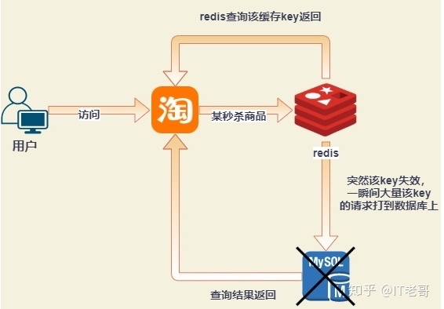


#### 解决方案

Redis 添加布隆过滤器,请求过来就可以经过布隆过滤器过滤一下

#### java解决方案

##### redis分布式锁

```java
// 防止重复点击
Boolean lock = redisCache.opsForValue().setIfAbsent(lockKey,uuid,10,TimeUnit.SECONDS)
if(Objects.equals(lock,Boolean.FALSE)){
	log.info("获取活动锁失败")
	return response;
}
...

```


##### ReentrantLock

```java
static Lock reenLock = new ReentrantLock();
    public List<String> getData04() throws InterruptedException {
        List<String> result = new ArrayList<String>();
        // 从缓存读取数据
        result = getDataFromCache();
        if (result.isEmpty()) {
            if (reenLock.tryLock()) {
                try {
                    System.out.println("我拿到锁了,从DB获取数据库后写入缓存");
                    // 从数据库查询数据
                    result = getDataFromDB();
                    // 将查询到的数据写入缓存
                    setDataToCache(result);
                } finally {
                    reenLock.unlock();// 释放锁
                }

            } else {
                result = getDataFromCache();// 先查一下缓存
                if (result.isEmpty()) {
                    System.out.println("我没拿到锁,缓存也没数据,先小憩一下");
                    Thread.sleep(100);// 小憩一会儿
                    return getData04();// 重试
                }
            }
        }
        return result;
    }
```


### 2、穿透

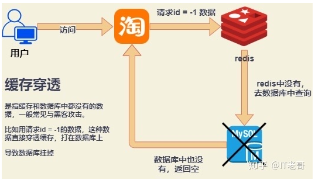

#### 解决方案

对用户做缓存，限制每个用户短时间只能访问一次
查询出来没有的也缓存下，不要一直去查数据库

#### java解决方案

```java
if(redis查出来空值){
	return 没数据
}
if(数据库查询出来是空的){
	缓存空值几分钟
	return 没数据
}
```


### 3、雪崩

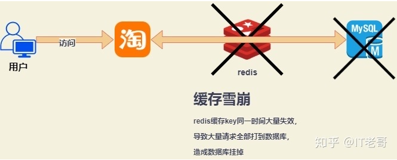

#### 解决方案

各个key过期时间尽量错开

### 4、排查大key

合理的 Key 中 Value 的字节大小，推荐**小于 10 KB**。

过大的 Value 会引发数据倾斜、热点Key、实例流量或 CPU 性能被占满等问题，应从设计源头上避免此类问题带来的性能影响。

#### ① string查大Key命令

```sql
redis-cli --bigkeys
redis-cli -h 127.0.0.1 -p 6379 -a "password" --bigkeys
```

原因：string 类型统计的是 value 的字节数；另外 4 种复杂结构的类型统计的是元素个数，不能直观的看出 value 占用字节数，所以 --bigkeys 对分析 string 类型的大 key 是有用的，而复杂结构的类型还需要一些第三方工具。

#### ② redis4.0后新特性

```
查看key大小
MEMORY USAGE keyname1
```

#### ③ 使用 Rdbtools 工具包

Rdbtools 是 python写的 一个第三方开源工具，用来解析 Redis 快照文件。除了解析 rdb 文件，还提供了统计单个 key 大小的工具。

1、安装

```
git clone https://github.com/sripathikrishnan/redis-rdb-tools
cd redis-rdb-tools sudo && python setup.py install
```

2、使用

从 `dump.rdb` 快照文件统计, 将所有 > 10kb 的 key 输出到一个 csv 文件

```
rdb dump.rdb -c memory --bytes 10240 -f live_redis.csv
```

#### 解决方案
1. 拆分成多个小字符串
```
# 原始大字符串
SET user:1:description "Very long description..."
# 分割后的小字符串片段
SET user:1:description:part1 "Very long"
SET user:1:description:part2 " description..."
```

2. 使用压缩算法\
对于文本型的数据，可以考虑使用Redis支持的压缩功能，如zstd压缩算法，以减小存储空间。
```
SET user:1:description "Compressed description..." ZSTD

注意：需要在客户端应用中进行解压缩，因为Redis本身并不会自动解压缩存储的值。
```

3. 使用其他数据结构\
如果字符串的值具有结构化信息，可以考虑使用其他数据结构，如Hash或List。这样可以更好地组织数据并避免一个键变得过大。
```
HSET user:1:info description "Very long description..."
```

### redis热key问题
增加redis实例

采用二级缓存 将热点key缓存到jvm里面


参考文档\
https://juejin.cn/post/7338645701658574885

电子书推荐
https://zhuanlan.zhihu.com/p/361220843
《Redis设计与实现》
《Redis实战》


### 5、告警

观察哪些


### 6、降级

Redis应用侧配置的坑-默认配置

超时时间目前版本spring中使用的redis客户端默认超时时间是1min，默认redirect次数是5一单redis发生超时中断，则有可能需要等待5*1min=5min时间默认降级不生效，因为上游早就判定超时了应用直接被拖死，因为单请求耗时过长导致线程池耗尽


可用性问题目前版本spring中使用的redis客户端默认的集群拓补自动刷新开关是关闭的redis集群中发生主从切换的话，应用依旧回去请求切换之前的节点如果有一个节点死了，应用由于不会自动刷新集群，所以会有1/n（集群node数量）概率失败


超大Key我们在redis使用过程中或多或少会用到一些Hash，List之类的数据类型，但是如果使用不当可能会造成一些问题redis中的数据结构都是k，v形式的，List，Hash等类型只是v的类型，集群的分片也是基于k来的，所以一个List，一个Hash里面的所有元素都会在一个节点上，可能导致某个节点内存过大，所以设计的时候需要考虑下分散各个节点压力如果集合里面的数据量过大的话，批量获取的场景一定要分页，否则或出现程序上的OOM还有可能对redis的性能造成大的影响超大集合在删除的时候依然会出现性能问题。懒 Redis 是更好的 Redis - OSCHINA - 中文开源技术交流社区 4.0之后可以通过惰性删除来处理这类问题  switch from del() to unklink() for redis >= 4.0 · Issue #158 · colinmollenhour/Cm_Cache_Backend_Redis (github.com)


使用命令不当会导致redis的cpu使用率飙升，产生慢查询keys命令scan分页每页量过大flushAll等批量操作使用RDM工具访问key很多的生产环境redisRDM打开redis会不断去scan key，10000个一页如果key非常多的话，则有可能产生慢查询从而告警


Redission使用过程中的一些问题        redission是一款非常优秀的rediscli，除了实现了基本的redis操作之外，还支持RedLock这种级别的分布式锁，甚至在NAT场景下Redission也能完美兼容cluster，sentinel这类高可用架构，但是有部分版本的Redission在使用过程中出现了连接溢出的情况，在3.16.4版本修复，也就是在网络不稳定的情况下每次发生集群拓补发生变更时，创建slave连接时候不会判断自己是否已经维护了slave的连接，总是重新创建，issue:https://github.com/redisson/redisson/issues/3871pr: https://github.com/redisson/redisson/commit/6bb333299610ff1ef173cc18f584ab799e9eaa14   

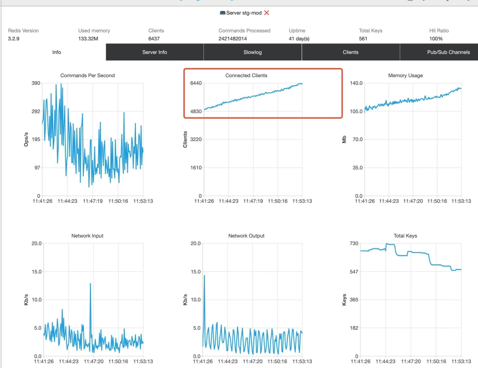

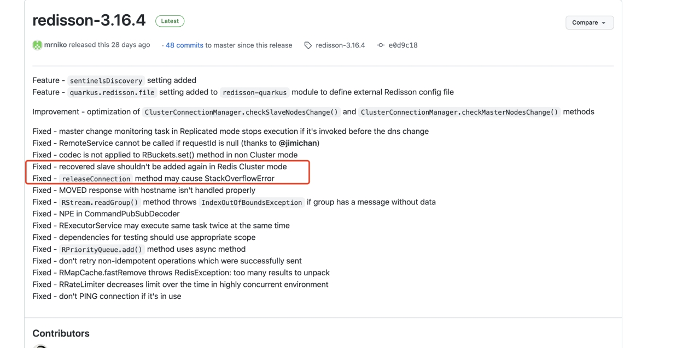

容器化部署后的redis如果出现故障，会发生漂移而早期版本的jedis刷新集群拓补并不是用的初始Url，而是第一次获取的集群列表。这个就导致jedis无法获取到最新的集群列表，从而应用出现无法连接redis的故障，然后就出现了跌停


Redis高可用-sentinel

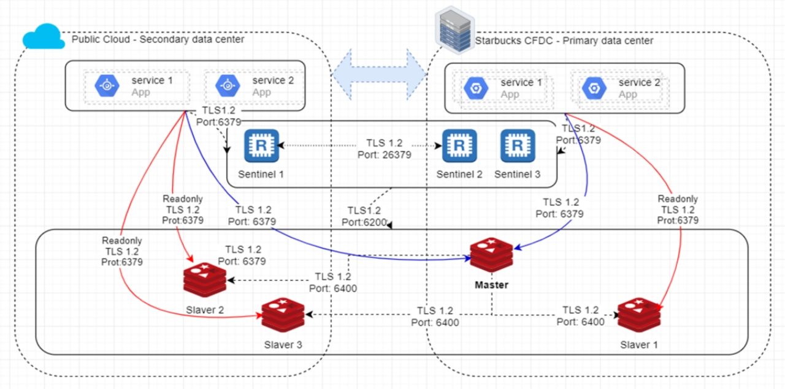

Redis高可用-cluster

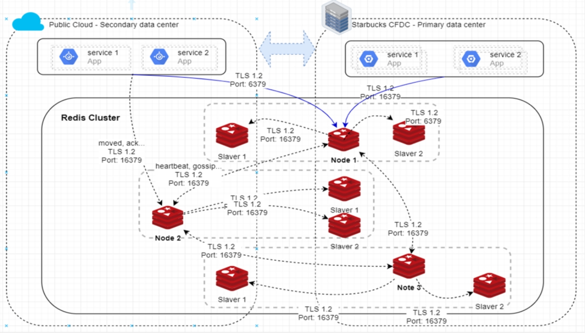

超时时间


集群模式拓补结构自动刷新

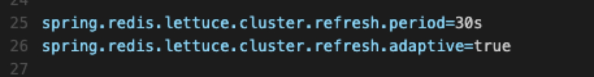


作为缓存使用降级为内存存储优点： 1、性能提高缺点： 1、内存消耗增加，可能引起频繁GC，甚至crash。（需要利用好lru策略） 2、有一致性问题。如果数据发生更新会导致各节点数据不一致，解决成本较高，需要依赖mq或者一致性算法需要的操作： 1、内存缓存设置很低的超时时间，以缓解一致性问题 2、提前做好压测，发生问题时候监控内存消耗以及gc情况降级为数据库优点： 1、一致性问题可以得到保证缺点 1、主从延迟会导致一定时间获取不到最新数据 2、性能降低需要的操作：      1、做好无缓存压测得到tps阈值，发生问题的时候在kong网关配置限流保护db     2、redis恢复后需要删除redis数据，以防脏读


作为分布式锁使用降级为无锁优点： 1、复杂度最低缺点： 1、无法控制并发操作降级为数据库锁优点： 1、功能没有降级，依旧可以达到锁的能力缺点： 1、依赖db，对db连接池会造成一定的压力，可能会耗尽连接池，尽量乐观并发，悲观并发需要单独创建连接池需要的操作: 1、做好db锁的压测 2、不要依赖订单类负载较高的库

作为存储使用做好BCP预案，aliyun逃生使用db做降级存储


应用侧实践案例 - 超时应对

1.对获取redis连接进行拦截，在redis降级情况下直接返回异常，无需等待超时

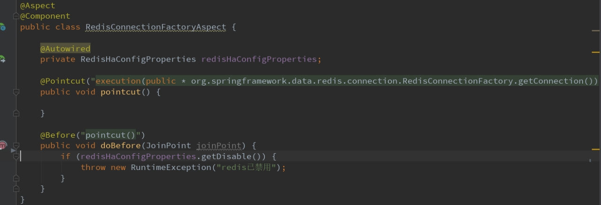


1.对redis操作进行try catch2.当redis异常后从数据库获取数据3.使用redis降级开关对业务进行处理

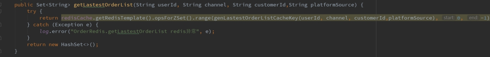

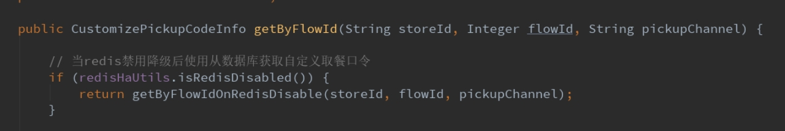

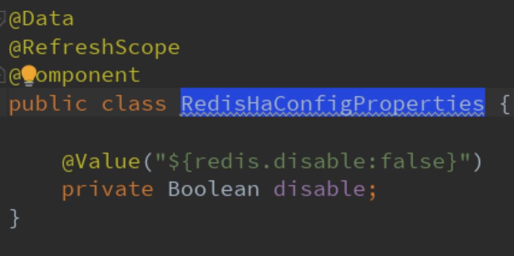


应用侧实践案例 – 分布式锁

1.降级使用数据库锁替代

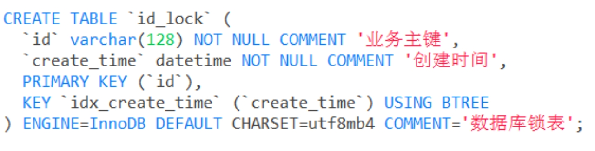

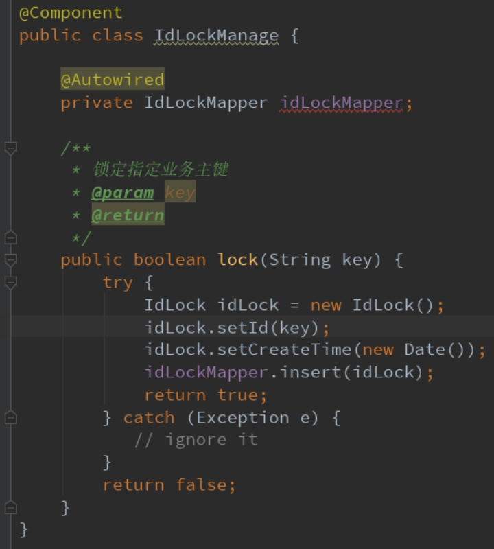


### 7、内存不足
在redis.conf文件\
一、设置最大运行内存\
注释"maxmemory" 参数表示不限制内存使用\
取消注释 "maxmemory" 参数，并将其值设置为期望的运行内存大小。值可以使用单位 K、M、G 来表示，如"1G"表示 1GB 内存。确保设置的内存大小合理，不要超过可用物理内存的限制。

二、配置内存淘汰策略\
"maxmemory-policy"参数

**内存淘汰策略**\
noeviction：不淘汰任何数据，当内存不足时，新增操作会报错，Redis 默认内存淘汰策略；\
allkeys-lru：淘汰整个键值中最久未使用的键值；\
allkeys-random：随机淘汰任意键值;\
volatile-lru：淘汰所有设置了过期时间的键值中最久未使用的键值；\
volatile-random：随机淘汰设置了过期时间的任意键值；\
volatile-ttl：优先淘汰更早过期的键值。\
在 Redis 4.0 版本中又新增了 2 种淘汰机制：\
volatile-lfu：淘汰所有设置了过期时间的键值中，最少使用的键值；\
allkeys-lfu：淘汰整个键值中最少使用的键值。\
其中 allkeys-xxx 表示从所有的键值中淘汰数据，而 volatile-xxx 表示从设置了过期键的键值中淘汰数据。\
所以，现在 Redis 的版本中有 8 种内存淘汰策略。


## 三、性能测试工具
### redis-benchmark
https://redis.io/docs/management/optimization/benchmarks/

## 四、底层原理
C语言编写
### string
动态字符串（SDString）数据结构是一个 C 语言结构体

紧凑存储：直接保存原始字节数据，无额外开销。\
​预分配机制：根据增长模式动态调整容量（如倍增策略），减少内存重新分配次数
```C
struct sdshdr {
    int len;        // 字符串的长度，不包括结尾的空字符
    int free;       // 字符串分配的额外空间，用于扩展，避免频繁的内存分配
    char buf[];     // 字符串的实际内容
};
```
当 len 达到当前内存的极限时，Redis 会进行内存重新分配，通常会增加字符串的容量，使得 free 字段有一定空间，以便下次操作时能够直接扩展。


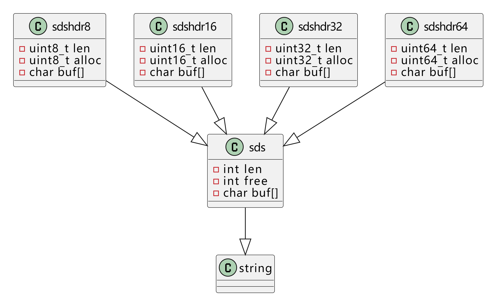
Redis 6.0版本和Redis5.0对比\
Redis 6.0版本中，对于SDS的底层数据结构进行了升级。除了原有的SDS类之外，还有四个新的类：sdshdr8、sdshdr16、sdshdr32、sdshdr64。这些类的命名与其中的成员变量类型相关，分别表示使用8位、16位、32位、64位的无符号整数存储字符串长度和容量\
这样的设计可以根据实际情况选择更合适的底层数据结构，从而减少内存占用。例如，当存储的字符串长度较小时，可以选择使用sdshdr8或sdshdr16，而当存储的字符串长度较大时，则可以使用sdshdr32或sdshdr64


### hash
Redis 中的 Hash 类型通过哈希表（Hash Table）来实现，哈希表是一种基于键值对存储的映射结构。由 字典（dict） 结构和 键值对 组成的。

哈希的两种实现方式,具体使用哪种实现方式取决于哈希中元素的数量
1. 压缩列表（ziplist）\
ziplist是一个经过特殊编码的双向链表，它不存储指向上一个链表节点和指向下一个链表节点的指针，而是存储上一个节点长度和当前节点长度，通过牺牲部分读写性能，来换取高效的内存空间利用率，是一种时间换空间的思想。只用在字段个数少，字段值小的场景里面。\
当 Redis 中的 Hash 类型包含的字段数目较少时，Redis 会使用 压缩列表（ziplist）来存储哈希。压缩列表是一种内存高效的连续块数据结构，专门用于存储小量的键值对。压缩列表是一个链表，每个元素包含了一个值。相对哈希表，它占用更少的内存。

优点：内存占用小，适合小型的哈希（字段数目较少时）。\
缺点：查找、插入、删除的性能较差，因为需要遍历整个压缩列表。

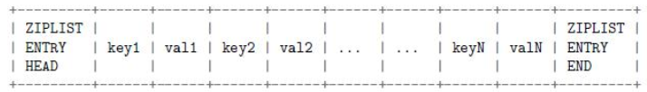

2. 哈希表（hashtable）\
当哈希的字段数量较多时，Redis 会使用 哈希表 来存储哈希数据。哈希表的底层实现和一般的哈希表相同，由多个桶（bucket）组成，每个桶可以存储多个键值对。

优点：查找、插入和删除操作的时间复杂度为 O(1)，非常高效。\
缺点：内存消耗相对较大，尤其是哈希表中的桶数很多时

### list
1. 压缩列表（ziplist） ：当列表元素较少且元素长度较短时采用，将元素紧凑存储在连续内存中，节省内存空间。
2. 双向链表（linkedlist） ：当列表元素数量较多或元素长度较长时使用。双向链表的每个节点包含指向前一个节点和后一个节点的指针，便于在列表两端进行快速的插入和删除操作，时间复杂度为 (O(1))，但随机访问效率较低。
3. 快速列表（quicklist） ：Redis 3.2 版本引入，结合了压缩列表和双向链表的优点。它将双向链表按段切分，每一段使用压缩列表存储数据，既保留了双向链表的快速插入和删除特性，又通过压缩列表节省了内存。

### set
1. 整数数组（intset） ：当集合中的所有元素都是整数值，且元素数量较少时使用。整数集合是一个有序的、无重复元素的整数数组，会根据元素大小自动调整存储类型，以节省内存。
2. 哈希表（hashtable） ：当集合中的元素包含非整数值，或者元素数量较多时使用。哈希表通过哈希函数将元素映射到数组的某个位置，能快速判断元素是否存在于集合中，插入、删除和查找操作的平均时间复杂度为 (O(1))。

### zset
1. 压缩列表（ziplist） ：当有序集合的元素数量较少，且元素的成员和分值都较短时使用。在压缩列表中，元素的成员和分值依次存储，且按分值从小到大排序。
2. 跳跃表（skiplist）  和 哈希表（hashtable） ：当有序集合的元素数量较多，或者元素的成员和分值较长时，Redis 同时使用这两种结构。跳跃表是一种有序的数据结构，通过在每个节点中维护多个指向其他节点的指针，在查找元素时可跳过部分节点，提高查找效率；哈希表用于快速查找元素的分值，使获取元素分值的时间复杂度为 (O(1))。

跳表原理

压缩策略

链表+索引

二分查找

O(logn)

redis为什么使用跳表作为索引，不使用B+树

因为B+树的原理是叶子节点存储数据，非叶子节点存储索引，B+树的每个节点可以存储多个关键字，它将节点大小设置为磁盘页的大小，充分利用了**磁盘预读**的功能。每次读取磁盘页时就会读取一整个节点，每个叶子节点还有指向前后节点的指针，**为的是最大限度的降低磁盘的IO**;

而**Redis是内存中读取数据，不涉及IO**，因为数据在内存中读取耗费的时间是从磁盘的IO读取的百万分之一，因此使用了跳表，利用**空间换时间**的方式，实现简单，且能提高查询效率。

redis为什么使用跳表作为索引，不使用红黑树

选择跳跃表而非红黑树作为有序集合实现方式的原因，并非是基于并发上的考虑，**redis是单线程**，仅仅是因为**跳跃表的实现相较于红黑树更加简洁，内存占用更有优势**。

按照区间查找数据这个操作，红黑树的效率没有跳表高

## 五、java使用

### 注意事项

配置超时时间

### 批量查询

```java
redisCache.getRedisTemplate().opsForValue().multiSet(map);
redisCache.getRedisTemplate().opsForValue().multiGet(keys);
```

```java
# multiSet 需要循环设置过期时间
redisCache.getRedisTemplate().opsForValue().multiSet(map);
for(Map.Entry<String,ProWorldCupHeaderDto> m : map.entrySet()){
    redisCache.getRedisTemplate().expire(m.getKey(), 1L,redisCache.getExpireConfig().getTimeUnit());
}
```


缓存
如何保证 Redis ⾼并发、⾼可⽤？

Redis 的主从复制原理能介绍⼀下么？

Redis 的哨兵原理能介绍⼀下么？
Redis 的持久化有哪⼏种⽅式？

不同的持久化机制都有什么优缺点？

持久化机制具体底层是如何实现的？
Redis 集群模式的⼯作原理能说⼀下么？

在集群模式下，Redis 的 key 是如何寻址的？分布式寻址都有哪些算法？

了解⼀致性 hash 算法吗？

如何动态增加和删除⼀个节点？


如何保证缓存与数据库的双写⼀致性？

Redis 的并发竞争问题是什么？如何解决这个问题？了解 Redis 事务的 CAS ⽅案吗？


springboot发布订阅
```

@Service
public class RedisPublisher {

    @Autowired
    private RedisTemplate<String, Object> redisTemplate;

    public void publish(String channel, String message) {
        redisTemplate.convertAndSend(channel, message);
    }

}


@Component
public class RedisListener implements MessageListener {

    @Override
    public void onMessage(Message message, byte[] pattern) {
        String messageBody = new String(message.getBody());
        System.out.println("Received message: " + messageBody);
    }

}


@Configuration
@EnableRedisRepositories
public class RedisConfig {

    @Bean
    public RedisMessageListenerContainer messageListenerContainer(RedisConnectionFactory redisConnectionFactory, RedisListener newsSubscriber) {
        RedisMessageListenerContainer container = new RedisMessageListenerContainer();
        container.setConnectionFactory(redisConnectionFactory);
        container.addMessageListener(newsSubscriber, new ChannelTopic("news"));
        return container;
    }

}

```