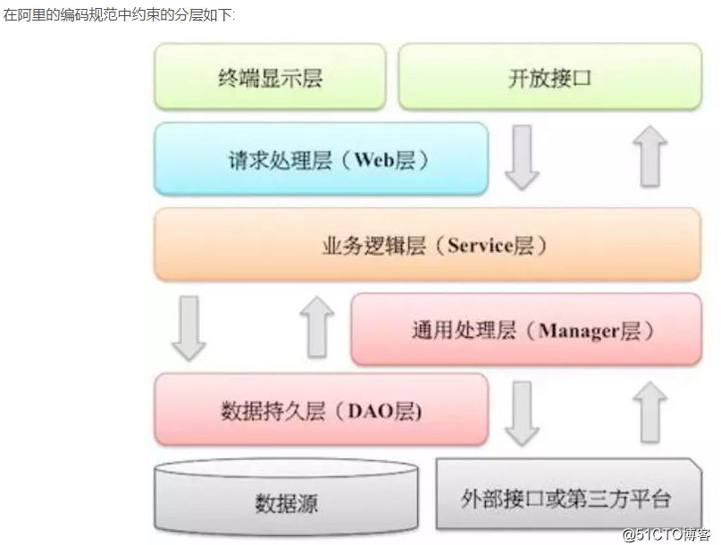

# 架构
## 软件架构风格
### 单体服务
单体服务（Monolithic Service）：在单体服务架构中，整个应用程序被作为一个单一的、紧密耦合的单元进行开发、部署和扩展。所有的功能模块都运行在同一个进程中，共享相同的数据库和资源。这种架构适用于较小规模的应用程序，但随着应用程序的增长和复杂性的提高，单体服务可能会导致开发困难、部署复杂以及难以扩展等问题。

### 分布式
分布式系统是一个通过网络连接的计算单元集合，这些单元共同协作以完成某项任务。它们看起来像一个单独的系统，但实际上是多个独立的计算机和服务在协同工作。\
总的来说 分布式：拆了就行。微服务：细粒度的垂直拆分。

### SOA
**面向服务的架构**已成为连接复杂服务系统的主要解决方案，可以采用单体服务或微服务的方式来实现\
SOA（Service-Oriented Architecture）：SOA是一种面向服务的架构，将应用程序划分为一组相互独立、可重用的服务。每个服务代表一个特定的业务功能，通过标准化的接口进行通信。SOA注重服务的松耦合和可复用性，并通过中间件来实现服务之间的交互。SOA可以在单体服务和微服务之间形成过渡，但SOA本身并不要求使用微服务架构。

### 微服务
微服务（Microservices）：微服务架构是一种将应用程序拆分为一组小型、独立的服务的架构风格。每个服务都运行在自己的进程中，并通过轻量级的通信机制进行交互。微服务架构强调服务的自治性、可替换性和可独立部署性，使得开发团队能够独立地开发、部署和扩展各个服务。微服务架构适用于大型、复杂的应用程序，可以提供更高的可伸缩性和灵活性。\
总的来说 微服务是一种SOA思想的延续，但是强调是"微"

参考文档 


## 云计算服务模型
#### IAAS
IAAS（基础设施即服务）：Infrastructure-as-a-service 提供基础的计算资源，如虚拟机、存储空间和网络等。用户可以通过IAAS获得灵活的计算能力，而无需管理底层的基础设施。IAAS通常由云服务提供商提供，用户可以根据需要按需使用资源，并支付相应的费用。

#### PAAS
PAAS（平台即服务）：Platform-as-a-service 提供一个完整的开发和运行环境，使开发者能够开发、测试和部署应用程序。PAAS包括操作系统、数据库、开发工具和服务器等组件，开发者可以专注于应用程序的开发，而无需关心底层的硬件和软件基础设施。

#### SAAS
SAAS（软件即服务）：Software-as-a-service 以云服务的形式提供软件应用程序。用户可以通过互联网访问和使用应用程序，而无需安装和维护软件。SAAS通常以订阅的方式提供，用户可以根据需要选择使用特定的软件服务，并按照订阅费用进行付费。

## 架构模式
### MVC架构
**模型-视图-控制器（Model-View-Controller，简称MVC）** 是一种软件架构模式，用于实现用户界面和应用程序逻辑的分离。实现可维护、可扩展和可重用的代码结构。在MVC中，
> **模型（Model）** 表示应用程序的数据和业务逻辑\
> **视图（View）** 负责呈现模型的数据给用户\
> **控制器（Controller）** 接收并处理用户的输入，并更新模型和视图


### DDD架构
**领域驱动设计（Domain-Driven Design，简称DDD）** 软件核心复杂性应对之道\
将应用看成是领域之间的组合，让架构调整贯穿整个项目周期，目的是为了复杂业务系统拆分，前期设计的不好，后期会很难拆分，这种设计是04年提出来的，15年往后微服务火了之后才进入大家视野\
DDD和MVC并不是相互排斥的选择，而是可以根据具体情况进行组合使用

#### cola框架
**整洁面向对象架构**\
是阿里巴巴开发的一套 Java 开发框架，用于构建微服务架构、分布式架构和领域驱动设计（DDD）的应用程序。COLA 框架提供了一套约定和最佳实践，帮助开发人员快速构建高质量、可扩展和易维护的应用程序。该框架包含了一系列的设计原则、标准的代码结构和组织方式，以及配套的工具和库。


参考资料\
<https://blog.csdn.net/significantfrank/article/details/110934799>


### 脚手架


## 项目结构
### 常用包名
#### manager
> 描述：通用业务处理层\
> 特征:\
> **三方封装** 对第三方平台封装的层，预处理返回结果及转化异常信息\
> **通用下沉** 对Service层通用能力的下沉，如缓存方案、中间件通用处理\
> **组合多dao** 与DAO层交互，对多个DAO的组合复用。
>
> \
> 


### 项目分层案例
#### 基础分层
> ```java
> |── src.main
>     |── java
>     |    |── com.ontg
>     |        |── [controller]
>     |        |── [service]
>     |        |── [pojo]
>     |        |── [mapper]
>     |        └── StartApplication.java
>     └── resources
>     |    |── [mapper]
>     |    |── application.yml
>     |    └── logback.xml
>     └── pom.xml
> ```

#### 小项目分层
> 虽然放在同一个项目包下、各个module互相不影响，各个module都是单独的小项目\
> 优点: 汇总在一个项目下方便管理\
> 缺点: 部署要特殊处理
> ```java
> |── module1
> |── module2
> ```

#### 公用service分层
> 优点: 多个项目共用service,方法之间共用，减少代码重复冗余\
> 缺点: \
> 代码改动项目之间会互相影响，每次改动需要考虑全面\
> 不断迭代多个项目功能代码写一起太多太乱、不好拆分
> 
> ```java
> |── module1 
>       |—— [controller2]
>       |—— StartApplication1.java
>       └── pom.xml(引用moudule公用包)
> |── module2 
>       |—— [controller2]
>       |—— StartApplication2.java
>       └── pom.xml(引用moudule公用包)
> |── moudule公用包   
>       |—— [service]
>       |—— [mapper]
>       |—— 等等
> ```


参考资料:\
https://zhuanlan.zhihu.com/p/627568742


## UML类图


## 防止灾难性雪崩效应方案
### 降级
超时降级、资源不足时(线程或信号量)降级,降级后可以配合降级接口返回**托底数据**,实现一个fallback方法，当请求后端服务出现异常时，使用fallback方法返回值 （访问发生异常返回托底数据）

### 限流
#### 算法
##### 固定窗口计数器
描述:\
计数器算法是使用计数器在周期内累加访问次数，当达到设定的限流值时，触发限流策略。下一个周期开始时，进行清零，重新计数\
缺点:\
这个算法通常用于QPS限流和统计总访问量，对于秒级以上的时间周期来说，会存在一个非常严重的问题，那就是临界问题


##### 滑动窗口计数器
描述:\
滑动窗口算法是将时间周期分为N个小周期，分别记录每个小周期内访问次数，并且根据时间滑动删除过期的小周期。\
如下图，假设时间周期为1min，将1min再分为2个小周期，统计每个小周期的访问数量，则可以看到，第一个时间周期内，访问数量为75，第二个时间周期内，访问数量为100，超过100的访问则被限流掉了\

当滑动窗口的格子划分地越多，那么滑动窗口的滚动就越平滑，限流的统计就会越精确
##### 漏桶
描述:\
漏桶算法是访问请求到达时直接放入漏桶，如当前容量已达到上限（限流值），则进行丢弃（触发限流策略）。漏桶以固定的速率进行释放访问请求（即请求通过），直到漏桶为空。\

消息队列、jdk的线程池，都有类似的设计。\
(固定速率输出)

##### 令牌桶
令牌桶算法是程序以r（r=时间周期/限流值）的速度向令牌桶中增加令牌，直到令牌桶满，请求到达时向令牌桶请求令牌，如获取到令牌则通过请求，否则触发限流策略

(精细处理，平滑限流)

漏桶算法通过固定速率的流出来控制请求的处理速度，而令牌桶算法则通过固定速率生成令牌来决定是否处理请求。漏桶算法对请求进行了平均化处理，而令牌桶算法可以实现更精细的请求控制

#### sentinel

官网 https://sentinelguard.io/zh-cn/docs/quick-start.html

java项目使用
导包
```xml
        <dependency>
            <groupId>com.alibaba.cloud</groupId>
            <artifactId>spring-cloud-starter-alibaba-sentinel</artifactId>
        </dependency>
        <dependency>
            <groupId>com.alibaba.csp</groupId>
            <artifactId>sentinel-datasource-apollo</artifactId>
        </dependency>
```
配置
```java
# 限流配置
# app.id是项目本身就有的, 默认走的是application
spring.cloud.sentinel.datasource.default-flow.apollo.namespaceName=application
# 默认可以在application中配置flowRules
spring.cloud.sentinel.datasource.default-flow.apollo.flowRulesKey=flowRules
# 标记改配置是限流规则
spring.cloud.sentinel.datasource.default-flow.apollo.rule-type=flow
    flowRules=[{"resource":"abc","count":20,"grade":1},{"resource":"abc1","count":20,"grade":1}]
    resource为资源
    grade为类型, 1代表qps, 0代表线程数, 建议用1
    count为阈值

# 熔断配置
# app.id是项目本身就有的, 默认走的是application
spring.cloud.sentinel.datasource.default-degrade.apollo.namespaceName=application
# 默认可以在application中配置flowRules
spring.cloud.sentinel.datasource.default-degrade.apollo.flowRulesKey=degradeRules
# 标记改配置是限流规则
spring.cloud.sentinel.datasource.default-degrade.apollo.rule-type=degrade
    degradeRules=[{"resource":"GET:http://localhost:8080/echo","count":0.5,"grade":1,"timeWindow":3},{"resource":"/entrance","count":0.5,"grade":1,"timeWindow":3}]
    resource为资源
    grade为类型, 1代表1秒异常率,0为1秒慢请求数,2为60s异常数;异常率更为通用,没有特殊使用建议用1, 
    count: 当grade为1时, 0.5代表 50%异常率
    timeWindow: 发生熔断后多久会进入半开状态(半开就是尝试请求一下,没问题就关闭这个熔断)


feign fallback和fallbackFactory两者使用推荐
建议使用fallbackFactory, 如果使用了fallback也可以继续使用
原因:fallbackFactory功能更强大, 可以将上游的异常传递到回退类中, 如果回退中需要抛出上游异常,或者打印异常都可以. 拓展性更强一些
当factory每次都返回一个相同的对象,那么factory就约等于fallback

配置文件中增加上报控制台的地址
spring.cloud.sentinel.transport.dashboard = {dashboard-url}
默认与控制台进行交互的端口号是8719 ; 如果有端口冲突,可以修改端口号
spring.cloud.sentinel.transport.port= {port}
```


### 熔断
当失败率(如因网络故障/超时造成的失败率高)达到阀值自动触发降级，熔断器触发的快速失败会进行快速恢复（达到一定失败率指定时间内直接返回托底数据）

resource为资源
grade为类型, 1代表qps, 0代表线程数, 建议用1
count为阈值
resource为资源
grade为类型, 1代表1秒异常率,   0为1秒慢请求数,  2为60s异常数   ;  异常率更为通用,没有特殊使用建议用1,
count: 当grade为1时, 0.5代表 50%异常率
timeWindow: 发生熔断后多久会进入半开状态(半开就是尝试请求一下,没问题就关闭这个熔断)


### 参考资料
路线 https://juejin.cn/post/7162121477934809125

sentinel https://juejin.cn/post/6922713509021253639


## 卡号设计


## 幂等
1、插入删除场景
可以使用分布式唯一id
生成方式
    https://xw.qq.com/cmsid/20220628A08K0S00
    ① redis生成ID (redis的原子操作 INCR、INCRBY)
    ② 雪花算法 (强依赖机器时钟，如果机器时钟回拨，会导致重复或服务不可用)
    ③ 数据库号段模式 (比较主流，从数据库批量获取ID,即从数据获取(1,1000]号段，自增用完之后再去数据库获取)
    ④ Zookeeper生成ID (不太好)
        Zookeeper 的 znode 数据版本来生成序列号，可以生成 32 位和 64 位的数据版本号，客户端可以使用这个版本号来作为唯一的序列号。由于需要依赖 zookeeper，并且是多步调用 API，如果在竞争较大的情况下，可能需要考虑使用分布式锁，故此种生成唯一 ID 的方法的性能在高并发的分布式环境下不甚理想。

    ⑤ 美团 Leaf-segment 方案 (号段的升级)
    ⑥ 滴滴 Tingid 方案 (Leaf-segment的升级)

2、更新场景
数据库乐观锁


## 订单超时未支付取消
https://juejin.cn/post/7181297729979547705


## 延时关单

### kafka时间轮

### rocketMQ延迟消息

### rabbitMQ死信队列

会存在消息阻塞问题

### rabbitmq_delayed_message_exchange插件

解决了消息阻塞问题

### redis zset

等等

https://mp.weixin.qq.com/s/kYr0woa_BZbiFansqyhhhA


b站弹幕人脸遮挡
https://juejin.cn/post/7157955440549036069


## 附近门店

描述：附近门店、附近的人都类似

## 1、Geohash算法


2、redis geo结构 
专门用来存储地理位置

3、基础逻辑
根据用户位置信息等，用es搜索符合条件的门店code
根据code去redis查门店详细信息，缓存没有就去数据库查询并缓存

4、首页高并发处理
双层缓存
    先从caffeine查询数据，不存在就去redis查，也不存在去数据库查，并且同步到缓存
geohash附近门店列表
    经纬度转成geohash字符串，就可以根据前缀匹配门店
    https://juejin.cn/post/6844903491220013069#heading-18
    https://github.com/kungfoo/geohash-java

一层、进程缓存caffeine
优点
没有网络开销，节省内外带宽，响应延迟低
提供线程安全的缓存操作
提供过期策略、回收策略、缓存监控
缺点
单节点，如何保证进程内缓存的数据一致性（使用mq广播机制，通知所有服务同步清除）
使用不合理容易导致内存泄露

二层、redis
使用redis消息监听器容器，门店信息修改时，触发进程内缓存实时修改，保存数据一致性
缺点
缓存服务数据吞吐量大、带宽跑满
门店信息数据较大，读取性能不高

服务器受理能力
大概
    数据库 tps 1000 qps 3000
    web服务器 关键接口tps 6000
mysql单机受理能力
    单个mysql tps参考7000 峰值的7倍


SELECT ACOS(SIN(( PI() / 180 ) * 纬度 ) * SIN(( PI() / 180 ) * 目标纬度 ) + COS(( PI() / 180 ) * 纬度 ) * COS(( PI() / 180 ) * 目标纬度 ) * COS(( PI() / 180 ) * 目标经度 - ( PI() / 180 ) * 经度 )) * 6371 AS distance;


一、文件上传下载
https://sf.163.com/help/documents/105052080335671296


二、设计模式
https://refactoringguru.cn/


三、外网
product hunt 和 indie hackers


## 大数据量用户名不重复设计
redis缓存所有用户名
布隆过滤器 不方便修改，修改用户名原来的用户名也不能删除，否则会影响hash值
红黑树
HyperLogLog 比较适合使用在一些应用级别，接口级别的非精确唯一性统计上，比如统计当前某个页面的 uv, 某个接口的请求 uv （访问量）
```
 PFADD: 添加一个或者多个元素。PFADD key1 v1 v2 v3.O(1).
 
 PFCOUNT: 返回不重复的元素的个数，可以统计多个 key. 同时，返回值是有一定 (0.81%) 错误率的近似值。PFCOUNT key1 key2 key3.O(n).
 
 PFMERGE: 将多个 key 的内容合并到一个 key 中。PFMERGE target key1 key2.O(n),n 是 key 的数量。
 ```
在日常的工作中，大部分情况下我们是走离线大数据那一套东西，将数据通过 kafka 等发送，之后导入 hive, 从 hive 中用 distinct来查找。


## 三高(高并发、高性能、高可用)


## bladex 微服务快速搭建框架

http://bladex.itsmycar.cn/
https://bladex.cn/#/


创建订单后30分钟未付款如何处理？
https://juejin.cn/post/7322037150425071628


## 开源项目
https://cloud.tencent.com/developer/article/2391291


## ID生成方案
## 单体系统
### 自增主键
描述：数据库自动生成一个唯一的整数值，通常是通过自增字段实现。
优点：简单易用，性能较好。
缺点：在分布式系统中可能存在冲突。

## 分布式系统
### UUID（通用唯一标识符）
描述：使用 UUID 算法生成一个128位的唯一值。
优点：全球唯一，适合分布式系统。
缺点：占用空间较大，性能较差（插入时索引可能不连续）。
底层：不同版本的生成策略也不一样，会基于硬件地址（MAC地址）、时间戳和随机因子来生成ID

其实UUID存在不同的版本，不同版本的生成策略也不一样，目前UUID主要有五个版本，下面说明下各自的差异。
UUID版本1：基于时间的UUID

48bit主机的硬件地址（Mac地址）；
60bit时间戳 (14bit作为时间序列)；

最基础的版本，基于当前纳秒级时间戳和机器MAC地址生成，极端环境下可能造成重复值，但除非MAC地址+纳秒级冲突，否则得到的ID全局唯一。
UUID版本2：DCE安全的UUID

48bit主机的硬件地址（Mac地址）；
40bit自定义标识符；
28bit时间戳（6bit作为时间序列）；

在第一个版本的基础上，增加了对DCE（分布式计算环境）安全的支持。也就是允许自定义一个标识符，来区分部署在同一机器上的不同节点，但这个版本几乎很少使用。
UUID版本3：MD5散列的UUID
这种版本没有固定格式，会基于指定的命名空间、名称进行MD5散列计算，从而生成一个唯一的UUID。给定值不变的情况下，得到的UUID不会改变。
UUID版本4：随机生成的UUID

6bit标记版本；
122bit随机数；

这是JDK1.8中默认使用的版本，这个版本完全基于特殊的随机数算法生成，每秒大概能产生十亿个ID，因此具有很高的随机性和唯一性，是目前使用最广泛的版本。
UUID版本5：SHA1哈希的UUID
这个版本和第三个版本类似，只不过将算法从MD5换成了SHA1，用的也比较少，Java中可以基于UUID.nameUUIDFromBytes()方法去实现，一般也很少用。


### 雪花算法（Snowflake）
描述：由 Twitter 提出的分布式唯一ID生成算法，通过时间戳、机器ID和序列号组合生成。
优点：高并发，生成速度快，能生成有序的ID。
缺点：实现较复杂，需要协调各节点的机器ID。

### Hash 值
描述：使用哈希算法对某些列值进行计算，生成唯一的哈希值作为主键。
优点：可以确保唯一性，适合特定业务。
缺点：可能存在哈希冲突，性能受限于哈希算法。

### 根据业务生成

参考文档
https://juejin.cn/post/7406997325716291595?searchId=20240918164447D9BD0923AD7FCA475E12


## 日志系统

收集－能够采集多种来源的日志数据（系统的错误日志+业务的访问日志）
传输－能够稳定的把日志数据传输到日志平台
存储－如何存储日志数据
分析－可以支持 UI 分析
警告－能够提供错误报告，监控机制

### ELK
ElasticSearch、Logstash、Kibana

#### 日志收集
FileBeat也是目前使用较多的日志收集软件，相对于Logstash更加轻量级占用资源更少\
参考文档\
[9 款日志采集&管理工具对比，选型必备！](https://blog.csdn.net/chinesehuazhou2/article/details/129187337)<https://blog.csdn.net/chinesehuazhou2/article/details/129187337>

##### Filebeat
GO语言,Filebeat是一个轻量型日志采集工具，因为Filebeat是Elastic Stack的一部分，因此能够于ELK组件无缝协作。Filebeat占用的内存要比Logstash小很多。性能比较稳健，很少出现宕机。\
参考文档\
[一篇文章搞懂filebeat（ELK）](https://www.cnblogs.com/zsql/p/13137833.html)<https://www.cnblogs.com/zsql/p/13137833.html>

##### Logstash
JAVA语言,日志采集/转换/存储工具,功能更多但是占空间更大更麻烦

##### Fluentd


参考文档
https://blog.csdn.net/zkc7441976/article/details/115868050


https://mirrors.ccs.tencentyun.com/
https://mirror.ccs.tencentyun.com


## 开源日志框架
推荐使用SLF4J

[08] 《一文读懂常用日志框架（Log4j、SLF4J、Logback）有啥区别》
https://cloud.tencent.com/developer/article/1400334


## 兴趣搜索
【多样性重排算法在淘宝首页信息流的创新应用】https://mp.weixin.qq.com/s/ddLJozxOGmA7ag2eEgKKfA


## 电子书
[《复杂软件设计之道》](https://book.douban.com/subject/35216922/)（<https://book.douban.com/subject/35216922/>）\
[《架构整洁之道》](https://book.douban.com/subject/30333919/)（<https://book.douban.com/subject/30333919/>）\
[《软件设计哲学》](https://yingang.github.io/aposd-zh/)（<https://yingang.github.io/aposd-zh/>）

