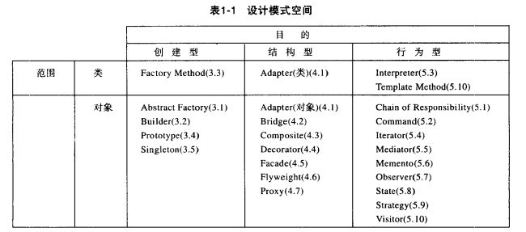

# 设计模式

## 基础

创建型模式(5种)：工厂方法模式、抽象工厂模式、生成器模式、(建造者模式)、原型模式、单例模式。

结构型模式(7种)：适配器模式、装饰器模式、代理模式、外观模式、桥接模式、组合模式、享元模式。

行为型模式(11种)：策略模式、模板方法模式、观察者模式、迭代子模式、责任链模式、命令模式、备忘录模式、状态模式、访问者模式、中介者模式、解释器模式。



## 创建型模式

### 工厂方法模式**
工厂模式关注单个对象的创建，适用于单个对象的创建

### 抽象工厂模式**
抽象工厂模式关注多个相关对象的创建，抽象工厂模式适用于一组相关对象的创建

### 生成器模式
分步骤创建复杂对象，该模式允许你使用相同的创建代码生成不同类型和形式的对象

### 建造者模式
和生成器模式差不多

### 原型模式
原型模式是一种创建型设计模式， 使你能够复制已有对象， 而又无需使代码依赖它们所属的类。

### 单例模式**

#### 使用场景
需要频繁的进行创建和销毁的对象、创建对象时耗时过多或耗费资源过多(即:重量级对象)，但又经常用到的对象、工具类对象、频繁访问数据库或文件的对象(比如数据源、session工厂等)\
频繁获取的配置文件啥的

#### 创建过程
1、创建实例\
2、构造器私有化（外部不能使用构造器创建对象）\
3、返回实例的方法

#### 饿汉式
线程安全，调用效率高，但是不能延时加载
```java
public  class Tong{
    private  static Tong instance = new Tong;
    private Tong(){}
    public static  Tong getInstance(){
        return instance;
    }
}
```
#### 懒汉式
线程安全，调用效率不高，但是能延时加载
```java
public class Tong {
    private static Tong tong;
    private Tong() {

    }
    public static synchronized Tong Tong() {
        if (tong == null) {
            tong=new Tong();
        }
        return tong;
    }
}
```

#### 双重检查式
DCL也就是双重锁判断机制（由于JVM底层模型原因，偶尔会出问题，不建议使用）
```java
public class Tong {
  private static Tong tong;
  private Tong(){}
  public static Tong getInstance(){
      if(tong==null){
          synchronized (Tong.class){
              if(tong==null){
                  tong= new Tong();
              }
          }
      }
      return tong;
  }
}
```

上面的也不好，发生cpu指令重排序的话，还是会有点问题，但是发生概率不怎么高\
volatile版本
```java

class Foo {  
    private volatile Helper helper = null;
    private Foo(){}  
    public Helper getHelper() {  
        if (helper == null) {  
            synchronized (this) {  
                if (helper == null)  
                 //（jvm new对象的过程 申请内存->变量初始化->赋值给helper）
                    helper = new Helper();//指令重排序 上面的顺序乱了，可能会导致对象值不准，volatile可以防止指令重排序
            }  
        }  
        return helper;  
    }  
}  
```


#### 静态内部类实现模式
线程安全，调用效率高，可以延时加载
```java
public class Tong {
    
    private  static class TongInstance{
        private final static Tong tongInstance=new Tong();
    }
    private Tong(){}
    public static Tong getInstance(){
        return TongInstance.tongInstance;
    }
}
```

## 结构型模式

### 适配器模式**
能使接口不兼容的对象能够相互合作

### 桥接模式
可将一个大类或一系列紧密相关的类拆分为抽象和实现两个独立的层次结构， 从而能在开发时分别使用。

### 组合模式
可以使用它将对象组合成树状结构， 并且能像使用独立对象一样使用它们。

### 装饰器模式
通过将对象放入包含行为的特殊封装对象中来为原对象绑定新的行为。

### 代理模式
让你能够提供对象的替代品或其占位符。 代理控制着对于原对象的访问， 并允许在将请求提交给对象前后进行一些处理。

### 外观模式
能为程序库、 框架或其他复杂类提供一个简单的接口。

### 享元模式
它摒弃了在每个对象中保存所有数据的方式， 通过共享多个对象所共有的相同状态， 让你能在有限的内存容量中载入更多对象。


## 行为型模式

### 策略模式**
它能让你定义一系列算法， 并将每种算法分别放入独立的类中， 以使算法的对象能够相互替换。
比如 购物时各种不同优惠策略的场景

```java
// 策略模式

// 1、定义策略接口    
public interface CouponStrategy {
    String getCouponType();
}

// 2、定义策略实现类 
@Service
public class ManJianCouponStrategy implements CouponStrategy {
    @Override
    public String getCouponType() {
        return "manJian";
    }
}

// 3、定义上下文 Context 管理所有策略 切换策略
@Service
public class ZheKouCouponStrategy implements CouponStrategy {
    @Override
    public String getCouponType() {
        return "zhekou";
    }
}

// 4、使用 传给上下文当前选择的策略
public class CouponContext {
    private CouponStrategy couponStrategy;
    public void setCouponStrategy(CouponStrategy couponStrategy) {
        this.couponStrategy = couponStrategy;
    }
    public String chooseCoupon() {
        return couponStrategy.getCouponType();
    }
}


public class TestMain {
    public static void main(String[] args) {
        CouponContext couponContext = new CouponContext();
        String userLevel = "1";
        switch (userLevel) {
            case "1": {
                couponContext.setCouponStrategy(new ZheKouCouponStrategy());
                break;
            }
            case "2": {
                couponContext.setCouponStrategy(new ManJianCouponStrategy());
                break;
            }
        }
        String result = couponContext.chooseCoupon();
        System.out.printf(result);
    }
}

```


### 模板方法模式**
### 观察者模式**
### 迭代子模式
### 责任链模式
#### 使用场景
① oa各个层级审批\
② 对请求进行各个层级拦截处理,例如认证、 授权与验证

### 命令模式
### 备忘录模式
### 状态模式
### 访问者模式
### 中介者模式
### 解释器模式

## 参考资料
<https://refactoringguru.cn/>

<https://www.runoob.com/design-pattern/design-pattern-tutorial.html>

<https://blog.csdn.net/wlddhj/article/details/131071730>

开闭原则\
在面向对象编程领域中，规定“软件中的对象（类，模块，函数等等）应该对于扩展是开放的，但是对于修改是封闭的”，这意味着一个实体是允许在不改变它的源代码的前提下变更它的行为

迪米特法则


Spring 框架中用到了哪些设计模式？
> 工厂设计模式 : Spring使用工厂模式通过 BeanFactory、ApplicationContext 创建 bean 对象。\
> 代理设计模式 : Spring AOP 功能的实现。\
> 单例设计模式 : Spring 中的 Bean 默认都是单例的。\
> 模板方法模式 : Spring 中 jdbcTemplate、hibernateTemplate 等以 Template 结尾的对数据库操作的类，它们就使用到了模板模式。\
> 包装器设计模式 : 我们的项目需要连接多个数据库，而且不同的客户在每次访问中根据需要会去访问不同的数据库。这种模式让我们可以根据客户的需求能够动态切换不同的数据源。\
> 观察者模式: Spring 事件驱动模型就是观察者模式很经典的一个应用。\
> 适配器模式 :Spring AOP 的增强或通知(Advice)使用到了适配器模式、spring MVC 中也是用到了适配器模式适配Controller。

