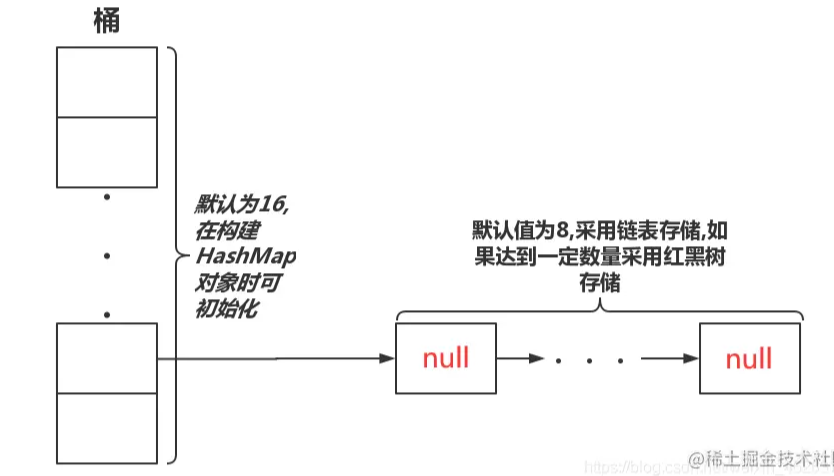
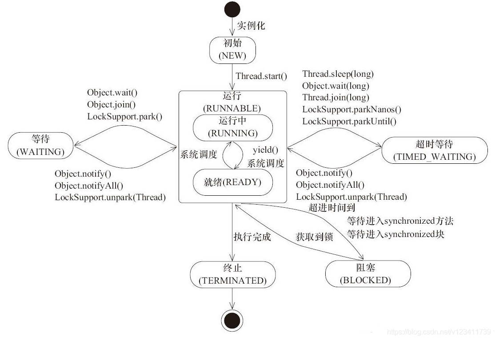
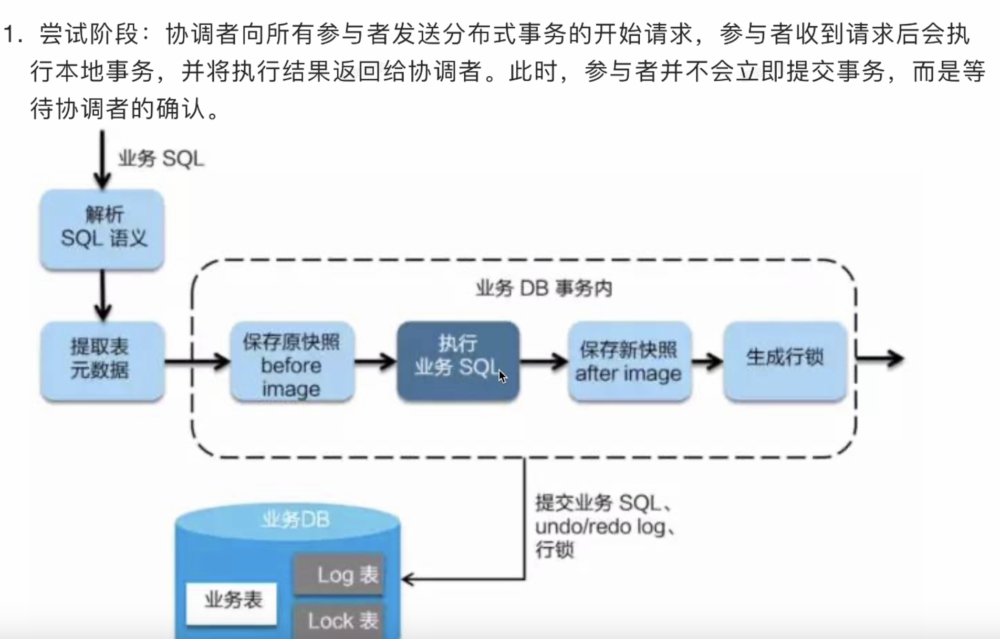
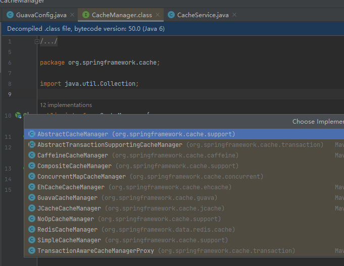
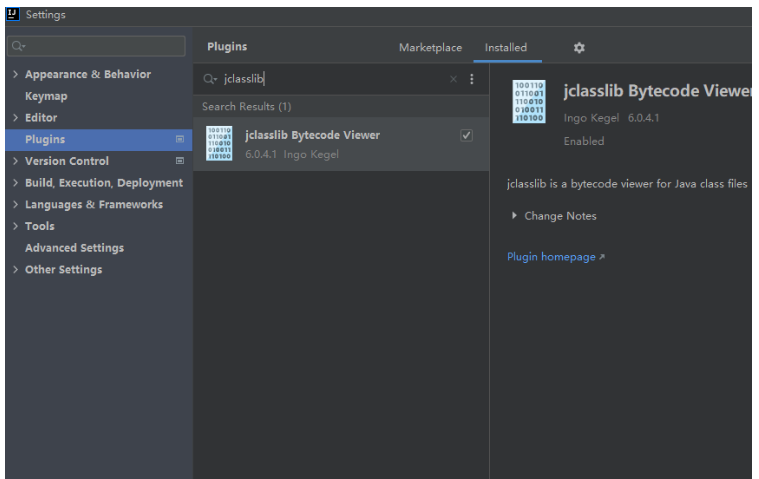

# Java

## 基础

### 继承
不支持多继承\
可以继承父类的属性和方法，实现代码的重用和扩展

### 实现
支持多实现\
实现代码的多态和解耦

### 并发包

### 闭包
闭包让你可以在一个内层函数中访问到其外层函数的作用域\
可以通俗理解成：闭包就是有权访问另一个函数作用域中内部变量或数据的函数\
闭包就是有权访问另一个函数内部变量的函数。\
闭包产生的原因：内部函数存在对外部函数局部变量的引用就会导致闭包。


参考 https://juejin.cn/post/6977648266695409672
## 关键字

### volatile
- 特性:\
  **可见性** 修饰的变量被修改时，其他线程能立刻可见(因为每次都是从内存获取，而不是查询线程缓存)\
  **顺序性** 读写操作都是按顺序执行的，不会指令重排序
- 场景:\
  **控制标识位** 控制多个线程之间的状态如等待、停止等\
  **双重检查锁定模式** 多线程环境下实现延迟单例模式

### final
**final修饰的对象** 对象的引用就不能被修改\
**final修饰list** list不能被重新赋值，即引用不能被修改，但是它里面的元素可以随意修改

## 数据结构

### List
```java
 // list分片
 Lists.partition
```
#### ArrayList
原理: 数组\
特点: 线程不安全


#### LinkedList
原理: 链表\
特点: 线程不安全

#### Vector
原理: \
特点: 线程安全

### Map

#### HashMap
描述:\
特点: 线程不安全\
缺点:
> 元素覆盖，两线程同时插入相同桶中，导致一个元素被另一个元素覆盖\
> 无限循环，一个线程在修改，另一个线程在遍历，可能遍历线程会无限循环

场景:
> 只能在单线程使用，多线程环境下，使用Hashmap进行put操作会引起死循环，导致CPU利用率接近100%，所以在并发情况下不能使用HashMap。

底层:
> 节点类型:\
> jdk1.6-1.7 位桶(数组)+链表\
> jdk1.8 位桶(数组)+链表+红黑树 （链表长度达到8，链表转为红黑树）\
> \
> 把key通过hashCode()生成哈希值\
> 哈希冲突，多个键计算出相同的哈希值，则会把它们以链表的形式存储在数组同一位置，然后遍历链表查找特定键值对，链表长度超过8且hashMap容量超过64会将链表转为红黑树

扩展:\
二叉树
红黑树 自平衡二叉搜索树
时间复杂度O(log n)





#### ConcurrentHashMap

描述: 一个支持高并发更新与查询的哈希表(基于HashMap)\
特点: 线程安全\
场景:
> 多线程高并发场景\
> ConcurrentHashMap是J.U.C包里面提供的一个线程安全并且高效的HashMap，所以ConcurrentHashMap在并发编程的场景中使用的频率比较高。
> 
> ```java 
>   // 常用方法 基本跟hashMap一样
>   map.putIfAbsent("key","value1");
> ```

底层:
  - JDK1.7节点类型:​Segment数组(内部包含HashEntry数组)
  - ​ConcurrnetHashMap 由很多个 Segment 组合，Segment个数初始化后不能改变(默认16个)，每个Segment是类似HashMap结构，每个HashMap内部可以扩容
  - ​分段锁:锁分离技术，减少锁的粒度，Segment数组的意义就是将一个大的table分割成多个小的table来进行加锁，Segment 继承了 ReentrantLock，所以 Segment 内部可以很方便的获取锁，`tryLock() 获取锁`，获取不到使用 scanAndLockForPut 方法继续获取
  - hash冲突解决方式 开放地址法


- JDK1.8节点类型:数组+链表/红黑树+CAS
  - CAS核心算法:执行函数:CAS(V，E，N)
    1. V表示准备要被更新的变量 （内存的值）
    2. E表示我们提供的 期望的值 （期望的原值）
    3. N表示新值 ，准备更新V的值 （新值）
HashEntry对象组成的链表长度`超过8时，或数组长度小于64 就会扩容`，否则链表转换为红黑树，提升性能。底层变更为数组＋链表＋红黑树
  - hash冲突解决方式 链表/红黑树


### Queue
描述:\
特点: 元素按照插入顺序排列，先进先出\
底层:\
场景:
> 适用于按照特定顺序处理元素的场景，例如任务调度、消息传递等


#### ArrayBlockingQueue
描述: 有界阻塞队列\
特点: 线程安全\
底层:
> 内部是定长数组，初始化时确定大小，无法修改\
> 使用可重入锁(ReentrantLock)保证线程安全

#### ConcurrentLinkedQueue
描述: 链接节点并发队列\
特点: 线程安全 可被多个线程同时访问修改\
底层:\
场景: 适合高并发环境队列操作

#### DelayQueue
描述: 延时无界阻塞队列\
特点:
> 线程安全
> 只有延时期满才能获取元素

底层:\
场景:
> 缓存系统
> 定时任务调度系统

#### LinkedBlockingQueue
描述: 链表双向阻塞队列\
特点: 
> 线程安全\
> 队列大小可选，默认是 Integer.MAX_VALUE,内部采用容量可调的数组或链表存储元素，当队列满时，会阻塞插入操作，当队列空时，会阻塞取出操作;LinkedBlockingQueue的存储容量不受限制，但是在实际使用时，**应根据实际场景进行合理的容量设置**，避免内存不足的情况\
> 支持公平性策略，即按照线程请求的顺序来处理队列中的元素
> 提供了多种构造函数和一些方法，如 put、take、offer、poll 等，以便于控制队列的插入和删除行为

底层: 链表\
场景: 
>LinkedBlockingQueue 不应该用于实现生产者-消费者模式的任务处理系统，因为它的容量是有限的，当队列已满时，生产者线程会被阻塞，导致整个系统的性能下降。对于这种情况，更适合使用无界队列，例如 ArrayBlockingQueue。
>


#### LinkedTransferQueue
描述:
> 链表阻塞队列
> 功能和LinkedBlockingQueue类似，更丰富

特点:

#### PriorityQueue
描述:无界队列 
特点:
> - 线程不安全
> - 无序，默认自然排序，可自定义comparator 
底层:数组

#### PriorityBlockingQueue
描述: 无界阻塞队列\
特点:
> 线程安全\
> 无序，默认自然排序，可自定义comparator\
> 队列空获取元素会阻塞线程直到有数据，队列满了插入元素也会阻塞线程直到有空闲\

底层:二叉堆

#### SynchronousQueue
描述: 不存储元素的阻塞队列\
特点:
> 没有容量、不存储元素\
> 每个插入操作必须等待一个对应的删除操作\
> 公平(即按照线程的到达顺序来进行处理)、非公平访问策略(默认)

底层:\
场景: 传递性场景 生产者消费者场景 吞吐量较高

### Set

描述: 无序不可重复集合\
特点:\
底层:\
场景:

#### HashSet
描述:\
特点:\
底层: HashSet 内部使用 HashMap 来存储元素\
场景:

### 参考文档
<https://juejin.cn/post/7156200349685317663>


## 注解
### @Retryable
方法异常重试

```java
    @Retryable(value = Exception.class,maxAttempts = 3,backoff = @Backoff(delay = 100,multiplier = 1))
    public void add(List<ReqVo> add){
        
    }
```

### @Deprecated


## 锁
### 锁状态|偏向锁、轻量级锁、重量级锁
特指synchronized锁状态
1. 偏向锁：\
记录下当前获取锁的线程，如果下次获取锁的线程正好是偏向锁拥有者，就可以直接获取锁\
在以下情况下，偏向锁会被启用：\
无竞争情况：当一个锁对象只有一个线程访问时，不存在竞争情况，这时候可以使用偏向锁来提升性能。\
短时间持有锁：在多线程环境下，某个线程短时间内多次获取同一个锁，偏向锁可以避免每次都进行重量级锁的操作，提高了效率。

2. 轻量级锁：
   
3. 重量级锁：

### 锁特性|可重入锁、非可重入锁

### 共享锁、独占锁

### 公平锁、非公平锁

### 悲观锁、乐观锁

### 自旋锁、非自旋锁

### 可中断锁、不可中断锁


## 线程

### 进程和线程关系

**进程** 静态的，可以启动多个，比如qq.exe，一个程序进入内存，会产生一个主线程\
**线程** 动态的，一个alu只能执行一个（alu 算术逻辑单元 计算机数学大脑 负责运算的组件）

### 线程状态




### 线程创建方式
#### Runnable
实现Runnable接口
```java
// 比较推荐匿名内部类的方式 
public class MyRunnable1 {

    public static void main(String[] args) {
        Thread t = new Thread(new Runnable() {
            @Override
            public void run() {
                System.out.println("MyRunnable1 running...");
            }
        });
        t.start();
    }
}
```

```java
// 直接实现Runnable接口
public class MyRunnable2 implements Runnable {
    public void run() {
        System.out.println("MyRunnable running...");
    }

    public static void main(String[] args) {
        Thread t = new Thread(new MyRunnable2());
        t.start();
    }
}
```


#### Thread
继承Thread类，Thread的底层也还是实现Runnable接口\
弊端是Java是单继承的，类只能单继承(接口可以多继承)
```java
public class MyThread extends Thread {
    public void run() {
        System.out.println("MyThread running...");
    }

    public static void main(String[] args) {
        MyThread t = new MyThread();
        t.start();
    }
}
```

#### Callable
实现Callable接口，搭配FutureTask可以获取异步执行任务结果
```java
public class MyCallable implements Callable<Integer> {
    public Integer call() throws Exception {
        System.out.println("MyCallable running...");
        // 模拟耗时操作
        Thread.sleep(2000);
        return 123;
    }

    public static void main(String[] args) {
        MyCallable callable = new MyCallable();
        FutureTask<Integer> futureTask = new FutureTask<>(callable);

        Thread t = new Thread(futureTask);
        t.start();

        try {
            // 获取任务执行结果
            Integer result = futureTask.get();
            System.out.println("Result: " + result);
        } catch (InterruptedException | ExecutionException e) {
            e.printStackTrace();
        }
    }
}
```

#### 线程池
**不推荐使用Executors创建线程**容易OOM\
推荐使用new ThreadPoolExecutor()的方式,根据服务器核心数自定义线程参数

```java
@Bean("myExecutor")
    public ExecutorService myExecutor() {
        ExecutorService ex = new ThreadPoolExecutor(
                2,
                2,
                0L,
                TimeUnit.MILLISECONDS,
                new LinkedBlockingQueue<>(100),// 指定任务数量
                new CustomThreadFactory(),
                (r, e) -> log.error("异常"));
        return ex;
    }
```

### 线程池
#### 线程池工作流程


#### 线程池类型

##### Executors.newFixedThreadPool
描述: 
> 创建一个指定工作线程数量的线程池。每当提交一个任务就创建一个工作线程，如果工作线程数量达到线程池初始的最大数，则将提交的任务存入到池队列中。

特点:
> 是一个典型且优秀的线程池，它具有线程池提高程序效率和节省创建线程时所耗的开销的优点。但是，**没任务时，不会释放工作线程，占用系统资源**

底层: 
> nThreads参数表示线程池中最多运行两个线程\
> LinkedBlockingQueue线程池任务队列，把任务放这等待执行，用到了不设容量的链表阻塞队列，容易导致内存不足
> ```java
> public static ExecutorService newFixedThreadPool(int nThreads, > ThreadFactory threadFactory) {
>         return new ThreadPoolExecutor(nThreads, nThreads,
>                                       0L, TimeUnit.MILLISECONDS,
>                                       new LinkedBlockingQueue<Runnable>(),
>                                       threadFactory);
>     }
> ```

##### Executors.newCachedThreadPool
描述: 一个可缓存的线程池\
特点:
> 线程池中的**线程数是根据任务的数量动态调整的**，没任务时会释放线程，有任务时才创建工作线程
> 1. 工作线程的创建数量几乎没有限制(其实也有限制的,数目为Interger. MAX_VALUE), 这样可灵活的往线程池中添加线程，同时创建大量线程时，有可能造成系统瘫痪
> 2. 如果长时间没有往线程池中提交任务，即如果工作线程空闲了指定的时间(默认为1分钟)，则该工作线程将自动终止

底层:
>SynchronousQueue任务队列，使用没有存储能力的阻塞队列，主要目的是为了实现一个具有动态调整线程数的线程池\
>如果没有空闲线程可用，SynchronousQueue 的特性决定了任务必须等待一个空闲线程。在这种情况下，线程池会创建一个新的线程来处理任务。
> ```java
> public static ExecutorService newCachedThreadPool() {
>         return new ThreadPoolExecutor(0, Integer.MAX_VALUE,
>                                       60L, TimeUnit.SECONDS,
>                                       new SynchronousQueue<Runnable>());
> }
> ```


##### Executors.newSingleThreadExecutor
> 创建一个单线程化的Executor，即只创建唯一的工作者线程来执行任务，如果这个线程异常结束，会有另一个取代它，保证顺序执行。单工作线程最大的特点是可保证**顺序地执行**各个任务，并且在任意给定的时间不会有多个线程是活动的 。
> PS:至始至终都只有一个线程，那用线程池干嘛呢？直接创建一个新的线程不就可以了嘛，不懂！

##### Executors.newScheduleThreadPool
> 创建一个定长的线程池，而且支持定时的以及周期性的任务执行，类似于Timer。


#### ThreadPoolExecutor
ThreadPoolExecutor 是 Java 标准库 java.util.concurrent 包中的类，用于创建和管理线程池。它是一个灵活和强大的线程池实现，可以通过构造函数进行各种配置，如核心线程数、最大线程数、等待队列类型、拒绝策略等

#### ThreadPoolTaskExecutor
ThreadPoolTaskExecutor 是 Spring 框架中对 java.util.concurrent.ThreadPoolExecutor 的封装和增强。它是 Spring 提供的一个任务执行器，简化了线程池的配置和使用，**底层还是ThreadPoolExecutor**

### 虚拟线程
jdk8之后版本更新的

### 线程相关

#### submit()、execute()区别
> JDK5往后，任务分两类:一类是实现了Runnable接口的类，一类是实现了Callable接口的类。两者都可以被ExecutorService执行，\
> 它们的区别是:\
> execute(Runnable x) 没有返回值。可以执行任务，但无法判断任务是否成功完成。——实现Runnable接口\
> submit(Runnable x) 返回一个future。可以用这个future来判断任务是否成功完成。——实现Callable接口

#### invokeAll()、invokeAny()区别
> invokeAll触发执行任务列表，返回的结果顺序也与任务在任务列表中的顺序一致.所有线程执行完任务后才返回结果。如果设置了超时时间，未超时完成则正常返回结果，如果超时未完成则报异常。\
> invokeAny将第一个得到的结果作为返回值，然后立刻终止所有的线程。如果设置了超时时间，未超时完成则正常返回结果，如果超时未完成则报超时异常。\
> 1、invallkeAll和invokeAny会直接造成主线程阻塞（需要设置超时时间）。等待所有任务执行完成后返回结果，主线程继续执行。\
> 2、submit不会造成主线程阻塞，在后面执行get方法的时候阻塞。超时时间在get里面设置。\
> 3、execute会新开启线程直接执行任务，不会阻塞主线程。但无返回结果。


#### cpu

##### cpu缓存一致性协议
>
>​	cpu负责运算，将运算结果输出到主内存，主内存读写速度不够，cpu在中间加了三级缓存，工业上实践得出，采用三级缓存性价比最好，缓存之间信息同步需要缓存一致性协议
>
>
>
>

##### CPU的*伪共享*

> **当多线程修改互相独立的变量时，如果这些变量共享同一个缓存行，就会无意中影响彼此的性能，这就是伪共享**。

##### cpu乱序执行


1、future类

2、thread.join() 需要等待线程执行完

#### 线程池无界队列引发的内存飙升
<https://juejin.cn/post/6844903769025544206>


## maven

### 清理仓库文件脚本

```java
set REPOSITORY_PATH=E:mymavenmyLocalRepository
rem 正在搜索...
for /f "delims=" %%i in ('dir /b /s "%REPOSITORY_PATH%*lastUpdated*"') do (
    del /s /q %%i
)
rem 搜索完毕
pause
```


## 数据库

### Sharding-Jdbc

#### 基础

> sharding-jdbc是ShardingSphere（分布式数据库生态系统）的一个组成部分，是轻量级java框架
>
> ##### 绑定表
> > 分片规则一致的主表和子表
> ##### 广播表
> > 表结构和数据在数据库中都一致，适用数据量不大但需要与海量数据表进行关联查询的场景，例如字典表

#### 功能

> 数据分片，分布式事务，读写分离等，其中使用最多的就是数据分片

#### 数据分片

##### 分片键
> 用于分片的字段，用于拆分数据库或表的字段

##### 分片算法

​	1、精确分片算法

> 对应PreciseShardingAlgorithm，用于处理使用**单一键**作为分片键的=与IN进行分片的场景。需要配合StandardShardingStrategy使用

​	2、范围分片算法

> 对应RangeShardingAlgorithm，用于处理使用**单一键**作为分片键的BETWEEN AND、>、<、>=、<=进行分片的场景。需要配合StandardShardingStrategy使用。

​	3、复合分片算法

> 对应ComplexKeysShardingAlgorithm，用于处理使用**多键**作为分片键进行分片的场景，包含多个分片键的逻辑较复杂，需要应用开发者自行处理其中的复杂度。需要配合ComplexShardingStrategy使用。

​	4、Hint分片算法

> 对应HintShardingAlgorithm，用于处理使用Hint行分片的场景。需要配合HintShardingStrategy使用

##### 分片策略(分片键+分片算法)

1、标准分片策略

> 对应StandardShardingStrategy。提供对SQL语句中的=, >, <, >=, <=, IN和BETWEEN AND的分片操作支持。StandardShardingStrategy只支持**单分片键**，提供PreciseShardingAlgorithm和RangeShardingAlgorithm两个分片算法。PreciseShardingAlgorithm是必选的，用于处理=和IN的分片。RangeShardingAlgorithm是可选的，用于处理BETWEEN AND, >, <, >=, <=分片，如果不配置RangeShardingAlgorithm，SQL中的BETWEEN AND将按照全库路由处理。

2、复合分片策略

> 对应ComplexShardingStrategy。复合分片策略。提供对SQL语句中的=, >, <, >=, <=, IN和BETWEEN AND的分片操作支持。ComplexShardingStrategy支持多分片键，由于**多分片键**之间的关系复杂，因此并未进行过多的封装，而是直接将分片键值组合以及分片操作符透传至分片算法，完全由应用开发者实现，提供最大的灵活度。

3、行表达式分片策略

> 对应InlineShardingStrategy。使用Groovy的表达式，提供对SQL语句中的=和IN的分片操作支持，只支持**单分片键**。对于简单的分片算法，可以通过简单的配置使用，从而避免繁琐的Java代码开发，如: t_user_$->{u_id % 8} 表示t_user表根据u_id模8，而分成8张表，表名称为t_user_0到t_user_7。

4、Hint分片策略

> 对应HintShardingStrategy。通过Hint指定分片值而非从SQL中提取分片值的方式进行分片的策略

5、不分片策略

> 对应NoneShardingStrategy。不分片的策略。


## 分布式

### 分布式追踪系统 
**自定义日志跟踪系统**
> 手动生成taceId放请求头里在各个服务中使用

**skywalking**
> 开源的应用性能监控和分析系统

Zipkin
> 开源，提供了收集、存储和展示跨多个服务的请求追踪数据的功能。使用Zipkin可以追踪请求在分布式系统中的传输路径，并对请求的性能进行可视化展示

Jaeger
> 开源的端到端的分布式追踪系统

OpenTracing

Dapper
> Google开发的

HTrace
> 在Apache Software Foundation下开源 

X-Trace


### 分布式锁

#### 场景

> 防止重复点击\
> 控制任务调度 （某定时任务某时刻只能执行一次这种）

#### 实现
> setIfAbsent
> 
> ```java
>  String lockKey = RedisConstant.LOCK+id;
>  Boolean lock = redisCache.opsForValue().setIfAbsent(lockKey, id, 10, TimeUnit.SECONDS);
>   if (Objects.equals(lock,Boolean.FALSE)){
>     // 没拿到锁稍后再试  直接返回 或者 休眠重试
>   }
>   // 拿到锁继续执行
> ```

#### 难点
任务没执行完锁过期的情况
> 正常都应该先预估好任务执行时间来设置过期时间，尽量减少这种情况，特殊情况还是发生了的话，可以根据具体场景用以下处理方式\
> **执行中状态标记**: 在缓存加个任务执行状态标记，尝试获取锁时先检查是否有任务在执行中\
> **队列机制**: 获取锁后先把任务放到队列里，从队列中获取待执行任务，任务放在队列中等待，就可以不依赖锁的状态\
> **分布式协调工具**: 使用分布式协调工具如ZooKeeper、etcd或Consul等来实现分布式锁。这些工具提供了更健壮和可靠的分布式锁机制，并能够解决锁过期的问题。它们通常基于分布式一致性算法实现，可以确保锁在任务执行完成前不会过期。

### 分布式事务
#### 特性
> 原子性（Atomicity）：所有事务操作必须被视为一个整体，一旦其中一个操作失败，则整个事务必须回滚，以确保所有节点上的数据状态一致。\
> 一致性（Consistency）：在事务开始和结束时，所有节点的数据必须处于一致状态。这意味着所有参与者必须遵守相同的规则和约束条件，以确保整个事务的一致性。\
> 隔离性（Isolation）：不同的事务应该相互隔离，以避免互相干扰和结果不确定性。\
> 持久性（Durability）：一旦事务提交，所做的更改必须在所有节点上被持久化，以确保数据不会因节点故障或其他原因而丢失。
#### 场景
> 保证订单、库存、支付等一致性可靠性
#### 算法
##### 共识算法
> 用于在分布式系统中达成一致意见的算法。\
> 它们被设计为在存在网络延迟、节点故障和恶意节点的情况下，使得多个节点能够就某个事务或决策达成一致。
##### Paxos
> Paxos是一种经典的共识算法，用于解决分布式一致性问题。它通过一系列提议、承诺和接受阶段来达成共识。
##### Raft
> Raft是一种相对较新的共识算法，与Paxos类似，但比Paxos更易于理解和实现。Raft将共识问题划分为领导者选举、日志复制和安全性三个子问题，并通过这些子问题的机制来实现一致性。
> 1. 名词
>    - 复制状态机
##### Byzantine Fault Tolerance (BFT)算法
> BFT算法是一类针对拜占庭容错问题设计的共识算法。它能够在有恶意节点存在的情况下保证系统的一致性，适用于对安全性要求较高的场景。
##### Practical Byzantine Fault Tolerance (PBFT)算法
> PBFT是一种BFT算法的具体实现，旨在解决拜占庭容错问题。它通过节点之间的互相通信和消息交换来达成一致，要求超过两个-thirds的节点是诚实和正常工作的。

#### 理论
> ##### 两阶段提交
> > 描述: 包含准备阶段、提交阶段\
> > 实现: 
> > 
> > 缺点: 多个服务都依赖事务管理器，系统并发能力下降\
> > 难点: 协调者和参与者之间通信故障怎么处理
> > 
>
> ##### 三阶段提交
> > 描述: 跟二阶段相比第三阶段失败有时也允许提交事务
> > 
>
> ##### AT模式
> > 描述: 二阶段提交的变种，多了**补偿机制**
> >
> >
> >
> ##### TCC模式
> > 描述: 基于补偿机制的分布式协议，通过三个阶段实现事务原子性、一致性
> >
> ##### sega模式
> > 基于事件方式\
> > 基于命令方式

#### 实现
> ##### ali seta
> > 用于对性能要求比较低的场景\
> > 对代码有侵入\
> > 原理：
> > > Ali SETA 将事务分为 TCC 事务和 SAGA 事务两种类型。   todo
> >
> ##### 异步消息补偿
> > 用于对性能要求比较高的场景\
> > 在服务异常时记录下来，或者放入消息队列，异步做补偿机制


## 业务场景
### 秒杀

redis

jmeter压测

。。。。


## 本地缓存

本地缓存方案中的应用进程和缓存进程在同一个进程，没有网络开销，访问速度快，但受限于内存，不适合存储大量数据。本地缓存主要有Guava cache，Caffeine，Encache等，还可以通过HashMap自实现一套本地缓存机制。

### @Cacheable

cacheManager 缓存管理器
cacheResolver 缓存解析器
配置一种缓存时不用指定，多个的时候需要指定使用哪一种缓存

#### 参考文档

https://blog.csdn.net/qq_44936392/article/details/121476927



### guava

#### 描述
guava缓存是谷歌开源的一种本地缓存，缓存是使用本机的内存来存储的，实现原理类似于java老版本ConcurrentHashMap

#### 使用方式
1、导包

```
		<dependency>
			<groupId>com.google.guava</groupId>
			<artifactId>guava</artifactId>
			<version>19.0</version>
		</dependency>
```

2、

#### 缓存清除策略
① 基于存活时间的清除策略
	expireAfterWrite 写缓存后多久过期
	expireAfterAccess 读写缓存后多久过期
	存活时间策略可以单独设置或组合配置
② 基于容量的清除策略
	通过CacheBuilder.maximumSize(long)方法可以设置Cache的最大容量数，当缓存数量达到或接近该最大值时，Cache将清除掉那些最近最少使用的缓存

③ 基于权重的清除 策略
	使用CacheBuilder.weigher(Weigher)指定一个权重函数，并且用CacheBuilder.maximumWeight(long)指定最大总重。

#### 原理
vending用到的
参考文档
https://blog.csdn.net/zw147258369/article/details/125484533

### Caffeine
#### 描述
#### 使用方式

1、导包

```
        <dependency>
            <groupId>com.github.ben-manes.caffeine</groupId>
            <artifactId>caffeine</artifactId>
        </dependency>
```

resource-management-system用到的

### Encache

https://blog.csdn.net/weixin_42072632/article/details/125091305


## 底层

### 字节码插件 jclasslib 




### 动态代理

jdk

cglib

https://juejin.cn/post/6844904036202905614


动态加载是个难题，包你都重新打了，不打包你的class没法加载到虚拟机内存中，重启是免不了的。
通用的方案就是集群，高级一点的，可以看看osgi或spring module

### AQS(AbstractQueuedSynchronizer)
描述：\
**抽象队列同步器**,它维护了一个state（代表了共享资源）和一个FIFO线程等待队列（多线程竞争资源被阻塞时会将线程放入此队列）。
由于state是由volatie修饰的所以该变量的改动都是立即可见的。

```java
// 重要字段
public abstract class AbstractQueuedSynchronizer extends AbstractOwnableSynchronizer implements java.io.Serializable {
    //头节点
    private transient volatile Node head;
    //尾节点
    private transient volatile Node tail;
    //同步状态
    private volatile int state;   
}    

// Node的重要字段
static final class Node {
     //节点状态
    volatile int waitStatus;
   
    //前驱节点
    volatile Node prev;
​
    //后继节点
    volatile Node next;

    //当前节点所代表的线程
    volatile Thread thread;
​
    //等待队列使用时的后继节点指针
    Node nextWaiter;
}
```


使用场景：\
AbstractQueuedSynchronizer 使用了**模板方法模式**，定义了一个算法的骨架，将具体的实现细节延迟到子类中。子类通过继承 AbstractQueuedSynchronizer 并重写其中的方法来实现自定义的同步逻辑。\
它是构建锁或者其他同步组件的基础框架
1. ReentrantLock：可重入锁，它提供了与 synchronized 关键字类似的功能。不同的是，它提供了更高级别的控制，例如可中断的锁获取、公平锁和非公平锁等。ReentrantLock 底层通过 Sync 类实现，而 Sync 类继承自 AbstractQueuedSynchronizer。
2. CountDownLatch：倒计数门闩，用于等待一个或多个线程完成某些操作。CountDownLatch 底层通过 Sync 类实现，而 Sync 类继承自 AbstractQueuedSynchronizer。
3. Semaphore：信号量，用于控制同时访问某个资源的线程数量。Semaphore 底层也通过 Sync 类实现，而 Sync 类继承自 AbstractQueuedSynchronizer。
4. Condition：条件变量，用于在多个线程之间进行通信。Condition 底层通过 Sync 类实现，而 Sync 类继承自 AbstractQueuedSynchronizer。
5. ReentrantReadWriteLock：可重入读写锁，它允许多个线程同时读取共享资源，但只允许一个线程写入共享资源。ReentrantReadWriteLock 底层通过 Sync 类实现，而 Sync 类继承自 AbstractQueuedSynchronizer。

资源共享的方式：\
AQS 定义了两种资源共享的方式 Exclusive（独占，一时间只有一个线程能访问该资源）、Share (共享，一时间可以有多个线程访问资源)
1. 独占\
独占锁，每次只能有一个线程持有锁\
假设state初始状态为0,表示未锁定状态。线程A想使用该资源就把state修改为了1，那么线程B来访问资源时发现state是1并不是0他就会被AQS送入等待队列，直到线程A将该资源设置为0。\
案例\
ReentrantLock

1. 共享\
共享锁，允许多个线程同时获取锁，并发访问共享资源\
假设state初始状态为N,当有线程来访问后N就减少1个，直到N=0 这时就会阻塞新的线程来访问资源。当某一个线程执行完毕后会将state+1，相当于释放了该线程持有的锁。这样新的线程就可以继续访问该资源。\
案例\
ReentrantReadWriteLock，读操作可以有多个线程同时进行，而写操作同一时刻只能有一个线程进行写操作，其他操作都会被阻塞。


参考文档\
https://zhuanlan.zhihu.com/p/367326725
https://juejin.cn/post/7273506068104478760?searchId=20231205153524B87EF780BCDD55DD268A


## kafka

```
 ./kafka-topics.sh --bootstrap-server PLAINTEXT://124.223.75.221:9092 --create --topic topicName2
 ./kafka-topics.sh --bootstrap-server PLAINTEXT://VM-4-11-centos:9092 --create --topic topicName
 ./kafka-topics.sh --bootstrap-server PLAINTEXT://zk:9092 --create --topic topicName
 
```


```
        //将fos.txt文件中所有字符读取回来
        File file = new File("C:\\Users\\fm00894\\Desktop\\新建文件夹 (3)\\1.txt");
        FileInputStream fis = new FileInputStream(file);
        byte[] bytes = new byte[(int)file.length()];
        fis.read(bytes);
        /*
            String提供的构造器
            String(byte[] data,Charset charset)
            将给定的字节数组data中所有的字节按照给定的字符集charset转换为一个字符串
         */
        String line = new String(bytes, StandardCharsets.UTF_8);
//        System.out.println(line);

        fis.close();
```


学习

异步线程，traceid丢失问题

https://tech.meituan.com/2023/04/20/traceid-google-dapper-mtrace.html


## 学习资料

1、网站


2、电子书


多线程事务
https://mp.weixin.qq.com/s/vN6zOECK_PDXltJ8k22h0A


分布式锁
[Zookeeper 都有哪些应⽤场景？] [使⽤ Redis 如何设计分布式锁？使⽤ Zookeeper 来设计分布式锁可以吗？以上两种分布式锁的实现⽅
式哪种效率⽐较⾼？]
分布式事务
[分布式事务了解吗？你们如何解决分布式事务问题的？TCC 如果出现⽹络连不通怎么办？XA 的⼀致性
如何保证？]
分布式会话
[集群部署时的分布式 Session 如何实现？]
⾼可⽤架构
[Hystrix 介绍] [电商⽹站详情⻚系统架构]
[Hystrix 线程池技术实现资源隔离]
[Hystrix 信号量机制实现资源隔离]
[Hystrix 隔离策略细粒度控制] [深⼊ Hystrix 执⾏时内部原理] [基于 request cache 请求缓存技术优化批量商品数据查询接⼝] [基于本地缓存的 fallback 降级机制] [深⼊ Hystrix 断路器执⾏原理] [深⼊ Hystrix 线程池隔离与接⼝限流] [基于 timeout 机制为服务接⼝调⽤超时提供安全保护]
⾼可⽤系统
如何设计⼀个⾼可⽤系统？
限流
如何限流？在⼯作中是怎么做的？说⼀下具体的实现？
熔断
如何进⾏熔断？
熔断框架都有哪些？具体实现原理知道吗？

&emsp;降级  
&ensp;降级  
&nbsp;降级
如何进⾏降级？


官网
https://square.github.io/okhttp/
okhttp3 
  是java语言封装的请求库
流式接口
websocket

undownloadprogress


## 乱七八糟的代码记得整理

```
@EnableFeignClients
@FeignClient(contextId = "ecologyClient", name = "${saas.ecologyClient.feign.name:ECOLOGY-ADMIN-APPLICATION}", url = "${saas.ecologyClient.feign.url}")
public interface EcologyClient {

    @PostMapping(value = "/ecology/api/token/getAppAccessToken")
    EcologyBaseResponse<EcologyGetAppAccessTokenResponse> getAppAccessToken(@RequestBody EcologyGetAppAccessTokenRequest request);
}


@Override
@Cacheable("menu")
public Menu findById(String id) {
    Menu menu = this.getById(id);
    if (menu != null){
        System.out.println("menu.name = " + menu.getName());
    }
    return menu;
}

 Optional<A> firstA= AList.stream()
                          .filter(a -> "小明".equals(a.getUserName()))
                          .findFirst()
                          .ifPresent(a -> {
                              a.setUserName("明明");
                          })

log.info("message: {} response:{}", new Object[]{"查询全部省市区结果",JSON.toJSONString(resp)});


  Method getValueMethod = ReflectionUtils.findMethod(enumClass, validateMethod, String.class);
                Object returnValue = ReflectionUtils.invokeMethod(getValueMethod, null, value.toString());

				@Target({ElementType.METHOD, ElementType.FIELD, ElementType.ANNOTATION_TYPE})
@Retention(RetentionPolicy.RUNTIME)
@Constraint(validatedBy = EnumValueCheck.Validator.class)
public @interface EnumValueCheck {

    String message() default "参数值不在允许的范围内";

    Class<?>[] groups() default {};

    Class<? extends Payload>[] payload() default {};

    /**
     * 枚举类名
     */
    Class<? extends Enum<?>> enumClass();

    /**
     * 校验方法
     */
    String enumMethod() default "isValid";

    @Slf4j
    class Validator implements ConstraintValidator<EnumValueCheck, Object> {

        private Class<? extends Enum<?>> enumClass;
        private String validateMethod;

        @Override
        public void initialize(EnumValueCheck enumValue) {
            validateMethod = enumValue.enumMethod();
            enumClass = enumValue.enumClass();
        }

        @Override
        public boolean isValid(Object value, ConstraintValidatorContext constraintValidatorContext) {
            try {
                Method getValueMethod = ReflectionUtils.findMethod(enumClass, validateMethod, String.class);
                Object returnValue = ReflectionUtils.invokeMethod(getValueMethod, null, value.toString());
                if (returnValue instanceof Boolean) {
                    return (Boolean) returnValue;
                } else {
                    //方法不满足要求，执行降级
                    return Boolean.TRUE;
                }
            } catch (Throwable e) {
                log.error("枚举类校验执行验证降级e:{}", FmStringUtils.chang2OneLine(ExceptionUtils.getFullStackTrace(e)));
            }
            return Boolean.TRUE;
        }

    }
}
```


```
springboot给所有请求加统一前缀
server.servlet.context-path=polaris-center


1、请求重试
<dependency>
    <groupId>com.github.rholder</groupId>
    <artifactId>guava-retrying</artifactId>
    <version>2.0.0</version>
</dependency>

Retryer<Map<String, Object>> retryer = RetryerBuilder.<Map<String, Object>>newBuilder()
        .retryIfResult(result -> !"100".equals(result.get("code").toString()))
        .withStopStrategy(StopStrategies.stopAfterAttempt(5))//重试次数
        .withWaitStrategy(WaitStrategies.fixedWait(100, TimeUnit.MILLISECONDS))//间隔100毫秒一次
        .build();
Map<String, Object> map = retryer.call(getOrderBySessionId(reqVo));


2、Spring Cloud Sleuth？
  Spring Cloud Sleuth是Spring Cloud提供的分布式系统服务链追踪组件
  <dependency>
      <groupId>org.springframework.cloud</groupId>
      <artifactId>spring-cloud-starter-sleuth</artifactId>
  </dependency>

```

# 其他待整理

ForwardingNode  解决扩容时候查询问题
ReservationNode 解决计算时对象为空问题

集群高可用三方软件

proxy、keepalived

VRRP协议
它可以把一个虚拟路由器的责任动态分配到局域网上的 VRRP 路由器中的一台。控制虚拟路由器 IP 地址的 VRRP 路由器称为主路由器，它负责转发数据包到这些虚拟 IP 地址。一旦主路由器不可用，这种选择过程就提供了动态的**故障转移**机制


## CPU标高
## 服务大概多少QPS

http://49.65.100.179:9010/#/login


domain 要钱
godaddy 要钱
namescheap

XO38-FREE

dnspod
https://hostry.com/?d=1

eu.org申请免费域名 免费域名申请教程


表数据量
qps
 微服务架构 = 80%的SOA服务架构思想 + 100%的组件化架构思想 + 80%的领域建模思想

 商品表11w 有效的估计就1w
 门店 5000
 订单表 
    近三个月200w
    2022 1000w
    2021 500w
 订单商品表
    近三个月800w
    2022 5000w
 三个月归档

 
 微服务架构 = 80%的SOA服务架构思想 + 100%的组件化架构思想 + 80%的领域建模思想

 Kubernetes ？？日志采集


## 部署
一、nohup
1、启动
nohup java -jar babyshark.jar > log.file 2>&1 &
0    标准输入（一般是键盘）
1    标准输出（一般是显示屏，是用户终端控制台）
2    标准错误（错误信息输出）

2、关闭进程
ps -aux | grep java
kill -9 pid

案例
nohup java
-javaagent:/data/agent/skywalking-agent.jar
-Dskywalking.agent.service_name=applet-service
-Xms1g
-Xmx1g
-Dspring.profiles.active=uat-Dapollo.configService=http://10.52.16.95
-jar /data//applet-service/applet-service-0.0.1-SNAPSHOT.jar
&>/dev/null &


https://blog.csdn.net/Kiven_ch/article/details/119087048?spm=1001.2014.3001.5506
https://blog.csdn.net/hyzsuccess/article/details/127644291?spm=1001.2014.3001.5506


ldap
```java
package com.ontg.rms.service;

import com.alibaba.fastjson.JSON;
import com.ontg.rms.util.ClassBeanUtil;
import lombok.extern.slf4j.Slf4j;
import org.apache.commons.collections4.CollectionUtils;
import org.apache.commons.lang3.StringUtils;
import org.springframework.stereotype.Service;

import javax.naming.Context;
import javax.naming.NamingEnumeration;
import javax.naming.NamingException;
import javax.naming.directory.SearchControls;
import javax.naming.directory.SearchResult;
import javax.naming.ldap.InitialLdapContext;
import javax.naming.ldap.LdapContext;
import java.lang.reflect.Field;
import java.util.Hashtable;
import java.util.List;

/**
 * ad
 * 接入Ldap
 * http://www.kouti.com/tables/userattributes.htm LDAP的使用
 *
 * https://blog.csdn.net/Marshall_Ma/article/details/123800674 浏览器测试连接
 */
@Slf4j
@Service
public class LdapService {

    private String ldapUrl = "ldap://127.0.0.1:389";

    // 管理员登录账号
    private String bind_dn = "CN=devopsldap,OU=AD同步账户,OU=ontg,DC=office,DC=ontg,DC=cn";
    // 管理员登录密码
    private String bind_passwd = "1234";

    private String search_ou = "ou=ontg,dc=office,dc=ontg,dc=cn";
    private String search_filter = "(&(objectClass=user)(sAMAccountName=%s))";

    public boolean login(String userName, String password) {
        String DN = null;
        try {
            DN = searchDN(userName);
        } catch (Exception e) {
            log.info("登录系统异常-->" + JSON.toJSONString(e));
        }
        // 能连的上就是登录成功
        try {
            if (StringUtils.isNotBlank(DN)) {
                connetLDAP(DN, password);
                return true;
            }
        } catch (Exception e) {
            log.info("登录失败-->" + JSON.toJSONString(e));
        }
        return false;
    }

    public String searchDN(String userName) throws Exception {
        // 管理员登录
        LdapContext ctx = connetLDAP(bind_dn, bind_passwd);
        SearchControls searchControls = new SearchControls();
        searchControls.setSearchScope(SearchControls.SUBTREE_SCOPE);
        // 设置将被返回的Attribute 限制要查询的字段内容
        String[] attrPersonArray = {"dn", "password"};
        searchControls.setReturningAttributes(attrPersonArray);
        NamingEnumeration<SearchResult> answer = ctx.search(search_ou, String.format(search_filter, userName), searchControls);

        // 结果处理
        List<?> o = (List<?>) getFieldValue("entries", ClassBeanUtil.getAllFields(answer.getClass()), answer);
        return CollectionUtils.isEmpty(o) ? null : getFieldValue("DN", ClassBeanUtil.getAllFields(o.get(0).getClass()), o.get(0)).toString();
    }

    public Object getFieldValue(String fieldName, Field[] fields, Object o) throws Exception {
        for (Field field : fields) {
            field.setAccessible(true);
            if (field.getName().equals(fieldName)) {
                return field.get(o);
            }
        }
        return null;
    }

    /**
     * 连接LDAP
     */
    public LdapContext connetLDAP(String userName, String password) throws NamingException {
        String ldapFactory = "com.sun.jndi.ldap.LdapCtxFactory";
        Hashtable env = new Hashtable();
        env.put(Context.INITIAL_CONTEXT_FACTORY, ldapFactory);
        env.put(Context.PROVIDER_URL, ldapUrl);
        env.put(Context.SECURITY_AUTHENTICATION, "simple");
        env.put(Context.SECURITY_PRINCIPAL, userName);
        env.put(Context.SECURITY_CREDENTIALS, password);
        env.put("java.naming.referral", "follow");
        LdapContext ctxTDS = new InitialLdapContext(env, null);
        return ctxTDS;
    }
}

```


## 日志

https://tech.meituan.com/2021/09/16/operational-logbook.html


```java
package com.ontg.polaris.config;

import cn.hutool.core.bean.BeanUtil;
import com.alibaba.fastjson.JSON;
import com.ontg.eden.common.Result;
import com.ontg.polaris.common.enums.LogActionEnum;
import com.ontg.polaris.common.util.RequestUtils;
import com.ontg.polaris.manager.client.request.dataConfig.LogSaveReq;
import com.ontg.polaris.manager.helper.UserHelper;
import com.ontg.polaris.service.LogService;
import lombok.extern.slf4j.Slf4j;
import org.apache.commons.collections4.CollectionUtils;
import org.apache.commons.lang3.StringUtils;
import org.aspectj.lang.ProceedingJoinPoint;
import org.aspectj.lang.annotation.Around;
import org.aspectj.lang.annotation.Aspect;
import org.aspectj.lang.reflect.MethodSignature;
import org.springframework.beans.BeansException;
import org.springframework.beans.factory.annotation.Autowired;
import org.springframework.context.ApplicationContext;
import org.springframework.context.ApplicationContextAware;
import org.springframework.context.expression.BeanFactoryResolver;
import org.springframework.core.LocalVariableTableParameterNameDiscoverer;
import org.springframework.expression.ExpressionParser;
import org.springframework.expression.spel.standard.SpelExpressionParser;
import org.springframework.expression.spel.support.StandardEvaluationContext;
import org.springframework.stereotype.Component;
import org.springframework.web.context.request.RequestAttributes;
import org.springframework.web.context.request.RequestContextHolder;

import javax.servlet.http.HttpServletRequest;
import java.lang.reflect.Method;
import java.util.Collections;
import java.util.HashMap;
import java.util.List;
import java.util.Map;

@Slf4j
@Aspect
@Component
public class LogAspect implements ApplicationContextAware {

    private ApplicationContext applicationContext;
    private LocalVariableTableParameterNameDiscoverer discoverer = new LocalVariableTableParameterNameDiscoverer();

    @Autowired
    private LogService logService;

    @Override
    public void setApplicationContext(ApplicationContext applicationContext) throws BeansException {
        this.applicationContext = applicationContext;
    }

    @Around(value = "@annotation(logRecord)")
    public Object doAround(ProceedingJoinPoint joinPoint, LogRecord logRecord) throws Throwable {
        StandardEvaluationContext context = null;
        String template = null;
        List<LogSaveReq> beforeList = null;

        try {
            // context处理
            context = new StandardEvaluationContext();
            template = logRecord.success();

            // 1、处理请求参数
            MethodSignature signature = (MethodSignature) joinPoint.getSignature();
            this.buildReqParam(context, signature.getMethod(), joinPoint.getArgs());

            // 2、处理方法
            context.setBeanResolver(new BeanFactoryResolver(applicationContext));

            if (logRecord.beforeFunction().length != 0) {
                for (String function : logRecord.beforeFunction()) {
                    if (StringUtils.isBlank(function)) continue;
                    ExpressionParser parser = new SpelExpressionParser();
                    if (template.contains(function)) {
                        String beforeFunctionResult = parser.parseExpression(function).getValue(context, String.class);
                        template = template.replace(function, "'" + beforeFunctionResult + "'");
                    } else {
                        List<?> beforeFunctionResult = parser.parseExpression(function).getValue(context, List.class);
                        beforeList = JSON.parseArray(JSON.toJSONString(beforeFunctionResult), LogSaveReq.class);
                    }
                }
            }
        } catch (Exception e) {
            e.printStackTrace();
            log.info(JSON.toJSONString(e));
        }

        Object result = joinPoint.proceed();

        try {
            Result tmp = (Result) result;
            // 成功时
            if (tmp.isStatus()) {
                // 3、处理响应参数
                if (tmp.getResult() != null) {
                    Map<String, Object> map = new HashMap<>();
                    // todo long类型默认成id
                    try {
                        map.put("id", Long.valueOf(tmp.getResult().toString()));
                    } catch (NumberFormatException e) {
                        e.printStackTrace();
                        BeanUtil.copyProperties(tmp.getResult(), map);
                    }
                    this.buildResultParam(context, map);
                }

                // 4、解析
                ExpressionParser parser = new SpelExpressionParser();
                String logContent = StringUtils.isBlank(template) ? null : parser.parseExpression(template).getValue(context, String.class);
                log.info(logContent);

                // 获取其他信息
                LogSaveReq afterLogInfo = getAfterLogInfo(logRecord, parser, context);

                // 获取ip
                RequestAttributes requestAttributes = RequestContextHolder.getRequestAttributes();
                HttpServletRequest request = (HttpServletRequest) requestAttributes.resolveReference(RequestAttributes.REFERENCE_REQUEST);

                // 获取action
                List<LogSaveReq> actionList = getActionInfo(logRecord.action(), beforeList);

                // 获取操作人
                String userName = UserHelper.getUserName();

                // 保存日志
                if (CollectionUtils.isNotEmpty(actionList)) {
                    for (LogSaveReq action : actionList) {
                        LogSaveReq logSaveReq = adapterLogSaveReq(request, action, logContent, afterLogInfo, userName);
                        if (logSaveReq != null) {
                            new Thread(() -> logService.saveLog(logSaveReq)).start();
                        }
                    }
                }
                context = null;
            }
            // 失败时 todo
        } catch (Exception e) {
            e.printStackTrace();
            log.info(JSON.toJSONString(e));
        }
        return result;
    }

    public List<LogSaveReq> getActionInfo(LogActionEnum action, List<LogSaveReq> beforeList) {
        if (action.getAction() != null) {
            LogSaveReq result = new LogSaveReq();
            result.setApplication(action.getApplication());
            result.setModule(action.getModule());
            result.setAction(action.getAction());
            result.setActionDesc(action.getDesc());
            result.setType(action.getType());
            return Collections.singletonList(result);
        }
        if (CollectionUtils.isNotEmpty(beforeList)) return beforeList;
        return null;
    }

    public LogSaveReq adapterLogSaveReq(HttpServletRequest request, LogSaveReq action, String logContent, LogSaveReq after, String userName) {
        String content = StringUtils.isNotBlank(logContent) && !"null".equals(logContent) ? logContent : action.getContent();
        if (StringUtils.isBlank(content)) return null;
        LogSaveReq result = BeanUtil.copyProperties(action, LogSaveReq.class);

        if (after != null) {
            result.setPartnerId(after.getPartnerId());
            result.setPartnerName(after.getPartnerName());
            result.setStoreCode(after.getStoreCode());
            result.setStoreName(after.getStoreName());
            result.setProductId(after.getProductId());
            result.setProductName(after.getProductName());
            result.setOrderCode(after.getOrderCode());
        }
        result.setIp(RequestUtils.getRequestIp(request));
        result.setContent(content);
        result.setCreateUser(userName);
        return result;
    }

    public LogSaveReq getAfterLogInfo(LogRecord logRecord, ExpressionParser parser, StandardEvaluationContext context) {
        try {
            if (logRecord.afterFunction().length != 0) {
                for (String function : logRecord.afterFunction()) {
                    if (StringUtils.isNotBlank(function))
                        return parser.parseExpression(function).getValue(context, LogSaveReq.class);
                }
            }
        } catch (Exception e) {
            e.printStackTrace();
            log.info("getAfterLogInfo error --->" + JSON.toJSONString(e));
        }
        return null;
    }

    public void buildReqParam(StandardEvaluationContext context, Method method, Object[] args) {
        // 获取方法的参数名
        String[] params = discoverer.getParameterNames(method);
        int index = 0;
        for (String param : params) {
            context.setVariable(param, args[index]);
            index++;
        }
    }

    public void buildResultParam(StandardEvaluationContext context, Map<String, Object> map) {
        if (map.isEmpty()) return;
        for (String key : map.keySet()) {
            context.setVariable(key, map.get(key));
        }
    }

}
```

```java
package com.ontg.polaris.config;

import com.ontg.polaris.common.enums.LogActionEnum;

import java.lang.annotation.*;

@Target({ElementType.METHOD})
@Retention(RetentionPolicy.RUNTIME)
@Inherited
@Documented
public @interface LogRecord {

    /**
     * 操作
     */
    LogActionEnum action() default LogActionEnum.DEFAULT;

    /**
     * 操作日志的文本模板
     */
    String success() default "";

    /**
     * 操作日志失败的文本版本
     */
    String fail() default "";

    /**
     * 操作日志的执行人
     */
    String operator() default "";

    String[] beforeFunction() default {""};

    String[] afterFunction() default {""};

}
```

```java
package com.ontg.polaris.common.config;

import java.lang.annotation.*;

@Target({ElementType.FIELD})
@Retention(RetentionPolicy.RUNTIME)
@Inherited
@Documented
public @interface LogProperty {

    String value() default "";

    String replaceKey() default "";

}
```


## 导出word 
模版在这 note/data/编程语言/java/java.assets/visitRecord.docx
```java
package com.tong.polaris.common.util;

import org.apache.poi.xwpf.usermodel.*;

import java.io.IOException;
import java.io.InputStream;
import java.io.OutputStream;
import java.util.Map;

public class WordUtil {


    /**
     * 依赖
     *   <dependency>
     *       <groupId>org.apache.poi</groupId>
     *       <artifactId>poi-ooxml</artifactId>
     *       <version>3.9</version>
     *   </dependency>
     */

    /**
     * 调用
     *     public void downloadDetail(String id, HttpServletResponse response) {
     *         response.setCharacterEncoding("utf-8");
     *         response.setContentType("application/msword;charset=utf-8");
     *         response.setHeader("Content-Disposition", "attachment;filename=result.docx");
     *
     *         VisitRecordQueryDetailResp detail = dataConfigAtom.queryVisitRecordDetail(new VisitRecordQueryDetailReq(id));
     *         if (detail == null) detail = new VisitRecordQueryDetailResp();
     *         Map<String, Object> dataMap = new HashMap<>();
     *         BeanUtil.copyProperties(detail, dataMap);
     *         dataMap.keySet().forEach(o -> dataMap.putIfAbsent(o, ""));
     *
     *         if (detail.getCommunicateTime() != null){
     *             dataMap.put("communicateTime", new SimpleDateFormat("yyyy-MM-dd").format(detail.getCommunicateTime()));
     *         }
     *         dataMap.put("planStatusStr", new Integer(1).equals(detail.getPlanStatus()) ? "有" : "无");
     *         dataMap.put("visitStatusStr", new Integer(1).equals(detail.getVisitStatus()) ? "是" : "否");
     *         try {
     *             Map<String, String> map = dataMap.entrySet().stream().collect(Collectors.toMap(Map.Entry::getKey, e -> e.getValue().toString()));
     *             ClassPathResource resource = new ClassPathResource("templates/visitRecord.docx");
     *             WordUtil.replaceKeyWords(resource.getStream(), response.getOutputStream(), map);
     *         } catch (Exception e) {
     *             throw new BizException(EdenAbstractResponseEnum.SYSTEM_ERROR);
     *         }
     *     }
     */

    public static void replaceKeyWords(InputStream in, OutputStream out, Map<String, String> map) {

        try {
            XWPFDocument doc = new XWPFDocument(in);
            //替换表格中指定的文字
            for (XWPFTable tab : doc.getTables()) {
                for (XWPFTableRow row : tab.getRows()) {
                    for (XWPFTableCell cell : row.getTableCells()) {
                        //注意，getParagraphs一定不能漏掉,因为一个表格里面可能会有多个需要替换的文字,如果没有这个步骤那么文字会替换不了
                        for (XWPFParagraph p : cell.getParagraphs()) {
                            for (XWPFRun r : p.getRuns()) {
                                String text = r.getText(0);
                                for (String key : map.keySet()) {
                                    if (text.contains("${" + key + "}")) {
                                        if (text != null) {
                                            r.setText(text.replace("${" + key + "}", map.get(key)), 0);
                                        }
                                    }
                                }
                            }
                        }
                    }
                }
            }
            doc.write(out);
        } catch (IOException e) {
            e.printStackTrace();
        }
    }

}

```


opencv
mat转图片
 Imgcodecs.imwrite("/NFS_ts2/mohu.png",matForOCR);


