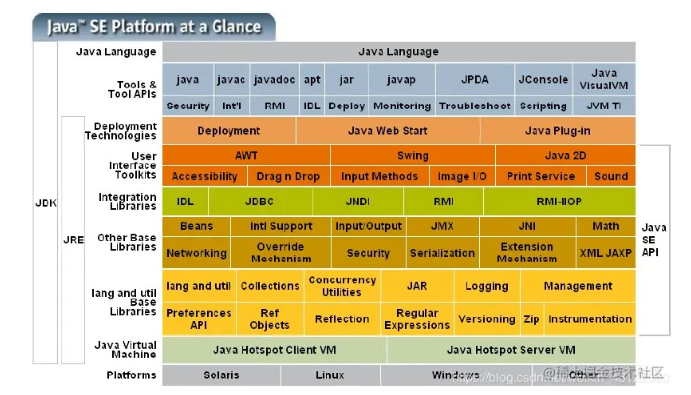

# jdk

## 基本概念

### jdk
**Java开发工具包（Java Development Kit）** 除了提供Java编译器和运行时库以外，还包含了Java类库、调试器和其他一些Java开发工具。JDK是用于开发Java应用程序的完整软件开发包。

### jre 
**Java运行时环境（Java Runtime Environment）** 大部分都是 C 和 C++ 语言编写的，是我们在编译java时所需要的基础的类库，它包括Java虚拟机和Java类库，是用于运行Java应用程序的最小环境。如果您只需要运行Java应用程序，那么就需要安装JRE，而如果您需要开发Java应用程序，则需要安装JDK

### jvm 
**Java虚拟机（Java Virtual Machine）** 是一个执行java字节码的虚拟计算机

### 相互关系


### 详细组成


## 版本特性

### jdk21(长期稳定)


### jdk17(长期稳定)

Collectors.toList() 替换成 .toList()

新特性
https://juejin.cn/post/7177550894316126269


```java
 public static void main(String[] args) {
        // 创建 L128X256MixRandom 随机数生成器
        RandomGeneratorFactory<RandomGenerator> l128X256MixRandom = RandomGeneratorFactory.of("L128X256MixRandom");
        
        // 使用时间戳作为随机数种子
        RandomGenerator randomGenerator = l128X256MixRandom.create(System.currentTimeMillis());
        
        // 生成六位随机数
        int randomNum = randomGenerator.nextInt(900000) + 100000;
        System.out.println("六位随机数: " + randomNum);
    }
```

#### ForkJoinPool
分治法
ForkJoinPool内部中将Task分为两种\
    SubmissionTask：本地线程调用submit方法提交了任务\
    WorkerTask：框架内部fork出来的子任务

使用限制
    ForkJoinPool通过任务拆解的方式提高执行效率，但并非适合所有场景，提交到ForkJoinPool任务应避免执行阻塞I/O,最适用于纯粹的计算任务，纯函数计算这些，计算过程中对象独立且没有外部依赖，可以避免一些阻塞问题

参考文档 
https://blog.csdn.net/liuyu973971883/article/details/107901711

https://cloud.tencent.com/developer/article/2397496

### jdk8(长期稳定)

#### flatMap

```java
    List<List<Integer>> numbers = Arrays.asList(
        Arrays.asList(1, 2, 3),
        Arrays.asList(4, 5, 6),
        Arrays.asList(7, 8, 9)
    );

    List<Integer> flattenedNumbers = numbers.stream()
        .flatMap(List::stream)
        .collect(Collectors.toList());

    System.out.println(flattenedNumbers);
    // 输出结果为：[1, 2, 3, 4, 5, 6, 7, 8, 9]。
```


#### stream 串行流
单线程处理

#### parallelstream 并行流
多线程处理\
Fork/Join + 工作窃取模式

使用注意
parallelstream 用的是ForkJoinPool中的commonPool(共享的、静态的)线程池，如果放一些阻塞的任务会拖垮这个公共的线程池

```
Stream<Integer> stream = new ArrayList<Integer>().parallelStream();
Stream<Integer> stream = new ArrayList<Integer>().stream().parallel();
```


### jdk8升级jdk17

反射+私有 API 调用之伤
在 Java8 中，没有人能阻止你访问特定的包，比如 sun.misc，对反射也没有限制，只要 setAccessible(true) 就可以了。Java9 模块化以后，一切都变了，只能通过 --add-exports和 --add-opens 来打破模块封装
```java
--add-opens 导出特定的包
--add-opens 允许模块中特定包的类路径深度反射访问
比如：

--add-opens java.base/java.lang=ALL-UNNAMED 
--add-opens java.base/java.io=ALL-UNNAMED 
--add-opens java.base/java.math=ALL-UNNAMED 
--add-opens java.base/java.net=ALL-UNNAMED 
--add-opens java.base/java.nio=ALL-UNNAMED 
--add-opens java.base/java.security=ALL-UNNAMED 
--add-opens java.base/java.text=ALL-UNNAMED 
--add-opens java.base/java.time=ALL-UNNAMED 
--add-opens java.base/java.util=ALL-UNNAMED 
--add-opens java.base/jdk.internal.access=ALL-UNNAMED 
--add-opens java.base/jdk.internal.misc=ALL-UNNAMED
```

maven相关
```xml
<maven.compiler.souce>1.8</maven.compiler.source>
<maven.compiler.target>1.8</maven.compiler.target>
改成
<maven.compiler.source>17</maven.compiler.source>
<maven.compiler.target>17</maven.compiler.target>
```

升级 spring-boot-starter-parent 2.1.5.RELEASE==》3.1.3
```xml
<parent>
    <groupId>org.springframework.boot</groupId>
    <artifactId>spring-boot-starter-parent</artifactId>
    <version>3.1.3</version>
    <relativePath/>
</parent>
```

升级 springcloud Greenwich.RELEASE==》2022.0.4
```xml
<dependency>
    <groupId>org.springframework.cloud</groupId>
    <artifactId>spring-cloud-dependencies</artifactId>
    <version>2022.0.4</version>
    <scope>import</scope>
    <type>pom</type>
</dependency>
```

升级 fastjson==》fastjson2 
```xml
<dependency>
    <groupId>com.alibaba.fastjson2</groupId>
    <artifactId>fastjson2</artifactId>
    <version>2.0.40</version>
</dependency>

import com.alibaba.fastjson.annotation.JSONField; 替换为 import com.alibaba.fastjson2.annotation.JSONField;

JSONObject.parseArray 替换为 JSONArray.parseArray

// 升级不支持 todo
@JSONField(serializeUsing = LongCodec.class)

// 没有各种序列化类,比如redis序列化类 待处理 todo
import com.alibaba.fastjson.serializer.SerializeConfig; 
import com.alibaba.fastjson.serializer.SerializerFeature;
import com.alibaba.fastjson.serializer.ToStringSerializer;
import com.alibaba.fastjson.support.config.FastJsonConfig;
import com.alibaba.fastjson.support.spring.FastJsonHttpMessageConverter;
import com.alibaba.fastjson.support.spring.GenericFastJsonRedisSerializer;
import com.alibaba.fastjson.support.spring.FastJsonRedisSerializer
```

添加 hibernate-validator  
从 Java EE 8 开始，Java EE 规范的维护权移交给了 Eclipse 基金会，并更名为 Jakarta EE
```xml 
<dependency>
    <groupId>org.hibernate</groupId>
    <artifactId>hibernate-validator</artifactId>
    <version>8.0.1.Final</version>
</dependency>
hibernate中包含jakarta包
javax.annotation.Resource 替换为 jakarta.annotation.Resource
javax.servlet.http.HttpServletRequest 替换为 jakarta.servlet.http.HttpServletRequest
javax.servlet.http.HttpServletResponse 替换为 jakarta.servlet.http.HttpServletResponse
import javax.validation.constraints.NotBlank; 替换为 import jakarta.validation.constraints.NotBlank;
```

升级lombok
```xml
maven打包报错
class lombok.javac.apt.LombokProcessor (in unnamed module @0x63a6dffd) cannot access class com.sun.tools.javac.processing.JavacProcessingEnvironment (in module jdk.compiler) because module jdk.compiler does not export com.sun.tools.javac.processing to unnamed module @0x63a6dffd
<dependency>
    <groupId>org.projectlombok</groupId>
    <artifactId>lombok</artifactId>
    <version>1.18.12</version>
</dependency>
改成 
<dependency>
    <groupId>org.projectlombok</groupId>
    <artifactId>lombok</artifactId>
    <version>1.18.30</version>
</dependency>
```


升级 mysql
```xml
# Property 'sqlSessionFactory' or 'sqlSessionTemplate' are required报这个异常这些都要升级
<mybatis.spring>3.0.2</mybatis.spring>
<mapper.version>4.2.3</mapper.version>
<druid.version>1.2.19</druid.version>
<mysql.version>8.0.33</mysql.version>
<dependency>
    <groupId>org.mybatis.spring.boot</groupId>
    <artifactId>mybatis-spring-boot-starter</artifactId>
    <version>${mybatis.spring}</version>
</dependency>
 <dependency>
    <groupId>tk.mybatis</groupId>
    <artifactId>mapper-spring-boot-starter</artifactId>
    <version>${mapper.version}</version>
    <exclusions>
        <exclusion>
            <groupId>org.mybatis</groupId>
            <artifactId>mybatis-spring</artifactId>
        </exclusion>
    </exclusions>
</dependency>
<dependency>
    <groupId>com.mysql</groupId>
    <artifactId>mysql-connector-j</artifactId>
    <version>8.1.0</version>
</dependency>
或
 <dependency>
    <groupId>mysql</groupId>
    <artifactId>mysql-connector-java</artifactId>
    <version>8.0.33</version>
</dependency>

# Error creating bean with name 'sqlSessionFactory' defined in class path resource 报这个异常检查下mybatis-spring这个包版本
<dependency>
    <groupId>tk.mybatis</groupId>
    <artifactId>mapper-spring-boot-starter</artifactId>
    <version>${mapper.version}</version>
    <exclusions>
        <exclusion>
            <groupId>org.mybatis</groupId>
            <artifactId>mybatis-spring</artifactId>
        </exclusion>
    </exclusions>
</dependency>
spring.datasource.type=com.alibaba.druid.pool.DruidDataSource
spring.datasource.druid.driver-class=com.mysql.jdbc.Driver 替换为 spring.datasource.druid.driver-class-name=com.mysql.jdbc.Driver
```

升级 redis 2.1.5.RELEASE==》3.1.3
```xml
<dependency>
          <groupId>org.springframework.boot</groupId>
          <artifactId>spring-boot-starter-data-redis</artifactId>
          <version>3.1.3</version>
      </dependency>
redis配置修改
老：
spring.redis.host=127.0.0.1
spring.redis.port=6380
spring.redis.password=pwd
新：
spring.data.redis.host=127.0.0.1
spring.data.redis.port=6380
spring.data.redis.password=pwd
```

升级feign 2.1.0.RELEASE==》4.0.4
```xml
<dependency>
    <groupId>org.springframework.cloud</groupId>
    <artifactId>spring-cloud-starter-openfeign</artifactId>
    <version>4.0.4</version>
</dependency>
@RequestMapping annotation not allowed on @FeignClient interface 去掉@FeignClient上的@RequestMapping。
```

升级xxl-job 2.0.1==》2.4.0
```xml
<dependency>
    <groupId>com.xuxueli</groupId>
    <artifactId>xxl-job-core</artifactId>
    <version>2.4.0</version>
</dependency>
报Could not initialize class org.codehaus.groovy.vmplugin.v7.Java7，可能是由于xxl-job版本过低，升级一下版本就好了
```

添加 guava
```xml
<dependency>
    <groupId>com.google.guava</groupId>
    <artifactId>guava</artifactId>
    <version>32.1.2-jre</version>
</dependency>
import com.google.common.collect.Lists;报这个包不存在引上面的包
```

泛型异常修改 
```java
public <T> List<T> getValueList(Object key) {
    BoundValueOperations<String, List<T>> operations = redisTemplate.boundValueOps(key);
    ObjectMapper mapper = new ObjectMapper();
    return mapper.convertValue(operations.get(), new TypeReference<T>() {
    });
}
改成
public <T> List<T> getValueList(Object key) {
    BoundValueOperations<String, List<T>> operations = redisTemplate.boundValueOps(key);
    ObjectMapper mapper = new ObjectMapper();
    TypeReference<List<T>> typeRef = new TypeReference<>() {};
    return mapper.convertValue(operations.get(), typeRef);
}
推论变量 T 具有不兼容的上限  报这个异常按上面这样改
```

加密类修改
```java
import sun.misc.BASE64Encoder;
BASE64Encoder encoder = new BASE64Encoder();
改成
Base64.Encoder encoder = Base64.getEncoder();

```

去掉apollo
```xml
<dependency>
    <groupId>com.ctrip.framework.apollo</groupId>
    <artifactId>apollo-client</artifactId>
</dependency>
```

升级 nacos 2.1.4.RELEASE==>2022.0.0.0
nacos服务要更新到2.0
```xml
No spring.config.import property has been defined
<!--SpringBoot 2.4版本之后 SpringCloud 2020，需要引入该依赖，才能读取bootstrap文件-->
<dependency>
    <groupId>org.springframework.cloud</groupId>
    <artifactId>spring-cloud-starter-bootstrap</artifactId>
</dependency>

<dependency>
    <groupId>com.alibaba.cloud</groupId>
    <artifactId>spring-cloud-starter-alibaba-nacos-discovery</artifactId>
    <version>2022.0.0.0</version>
</dependency>
<dependency>
    <groupId>com.alibaba.cloud</groupId>
    <artifactId>spring-cloud-starter-alibaba-nacos-config</artifactId>
    <version>2022.0.0.0</version>
</dependency>

去掉多余的nacos包
<dependency>
    <groupId>com.alibaba.nacos</groupId>
    <artifactId>nacos-api</artifactId>
    <version>${nacos.version}</version>
</dependency>
NoClassDefFoundError: com/alibaba/nacos/client/logging/NacosLogging去掉下面这个包就好了
<dependency>
    <groupId>com.alibaba.nacos</groupId>
    <artifactId>nacos-client</artifactId>
    <version>${nacos.version}</version>
</dependency>
<dependency>
    <groupId>com.alibaba.nacos</groupId>
    <artifactId>nacos-common</artifactId>
    <version>${nacos.version}</version>
</dependency>
```

```yml
bootstrap.yaml配置调整(主的不改分环境的改下)
老：
spring:
 profiles:
    active: local
新：
spring:
  config:
    activate:
      on-profile: local
```

循环依赖
```
spring.main.allow-circular-references=true
```


去除swagger
```xml
去掉
<!--swagger-->
<dependency>
    <groupId>io.springfox</groupId>
    <artifactId>springfox-swagger2</artifactId>
</dependency>
<dependency>
    <groupId>io.swagger</groupId>
    <artifactId>swagger-models</artifactId>
</dependency>
<dependency>
    <groupId>io.springfox</groupId>
    <artifactId>springfox-swagger-ui</artifactId>
</dependency>
Error creating bean with name 'documentationPluginRegistry': FactoryBean threw exception on object creation
去掉注解 @EnableSwagger2
去掉
import com.fasterxml.jackson.annotation.JsonFormat;
import io.swagger.annotations.ApiModelProperty;
去掉 
@ApiModelProperty("主键")
@ApiModelProperty(value = TypeEnum.DESC);
```

引入smart-doc
```xml
<dependency>
    <groupId>org.springdoc</groupId>
    <artifactId>springdoc-openapi-starter-webmvc-ui</artifactId>
    <version>2.2.0</version>
</dependency>
<dependency>
    <groupId>org.springdoc</groupId>
    <artifactId>springdoc-openapi-starter-webmvc-api</artifactId>
    <version>2.2.0</version>
</dependency>
```

添加
```xml
import com.google.common.collect.Lists;
import com.google.common.collect.Maps;
import com.google.common.collect.Sets;
swagger-forx啥的去掉没有这个包了 引入下面这个
<dependency>
    <groupId>com.google.guava</groupId>
    <artifactId>guava</artifactId>
    <version>32.1.2-jre</version>
</dependency>
```

Pair类不兼容jdk17
```java
java: 程序包javafx.util不存在
替换成
public static Map.Entry<Date, Date> getStartAndEndDate(int year) {
    LocalDateTime startLocalTime = LocalDateTime.of(LocalDate.now().getYear() - year, 1, 1, 0, 0, 0);
    LocalDateTime endLocalTime = LocalDateTime.of(LocalDate.now().getYear(), 12, 31, 23, 59, 59);
    Date startDate = Date.from(startLocalTime.atZone(ZoneId.systemDefault()).toInstant());
    Date endDate = Date.from(endLocalTime.atZone(ZoneId.systemDefault()).toInstant());
    return new AbstractMap.SimpleEntry<>(startDate, endDate);
}
```

idea 正则全局替换
```
/**
   * 商户号
   */

改写成正则 \/\*\*\n     \* (.*)\n     \*\/
```


java: 无法访问org.apache.hc.client5.http.classic.HttpClient   ;todo 待解决
  找不到org.apache.hc.client5.http.classic.HttpClient的类文件


## 常见问题

window 切换jdk版本不成功
> 找到这个路径，替换里面三个文件为现在jdk的文件
> 
> 
> 不好使的话查看环境变量，把这个路径移到jdk路径下面
> 


## jvm底层

### 底层结构


**运行时数据区域（Runtime Data Areas）**：JVM在运行时划分了不同的数据区域来存储各种数据。\
**方法区（Method Area）**：存储类的结构信息、静态变量、常量池等。在JDK8之前，方法区直接使用永久代(PermGen)，从JDK8开始使用元空间(Metaspace)替代。\
**栈内存（Stack）**：用于存储方法调用和局部变量。每个方法在执行时都会创建一个对应的栈帧，其中包含了方法的参数、局部变量以及操作数栈等信息。\
**本地方法栈（Native Method Stack）**：用于执行本地方法（Native Method）的调用，与栈内存类似。\
**堆内存（Heap）**：用于存储对象实例和数组。所有通过new关键字创建的对象都存储在堆内存中。\
**程序计数器（Program Counter）**：记录当前线程执行的字节码指令的地址或索引。

**类加载器（Class Loader）**：负责将Java字节码加载到JVM中，并转换为可执行的对象。类加载器根据类的名称和路径查找并装载类文件。
> **应用类加载器**，加载我们classpath目录下的所有类文件\
> **扩展类加载器**，加载标准 Java 类库扩展的类，就是你的jre目录下的/lib/ext目录下的所有类\
> **根类加载器（bootstrap classloader）**，扫描 BootClassPath 下的 标准 Java 类库的类加载器。标准 Java 类库限制了一些包路径的类，必须通过根类加载器加载。

**字节码执行引擎（Bytecode Execution Engine）**：负责解释执行或编译执行Java字节码。字节码执行引擎包括解释器（Interpreter）和即时编译器（Just-in-Time Compiler，JIT Compiler）。解释器逐条解释执行字节码指令，而即时编译器将热点代码（Hotspot Code）转换为本地机器码，提高执行效率。\
**垃圾回收器（Garbage Collector）**：负责自动管理内存，回收不再使用的对象。垃圾回收器在堆内存中标记和清理无效的对象，并进行内存整理和内存分配。


**本地方法接口（Native Method Interface）**：允许Java程序调用本地方法，即使用其他编程语言编写的方法。

**JNI（Java Native Interface）**：提供了Java与其他编程语言进行交互的机制，允许Java程序调用C、C++等编写的方法。\
通过以上底层组成部分的合作，JVM实现了Java程序的加载、解释执行或编译执行、内存管理、垃圾回收等核心功能，提供了跨平台的特性和高效的执行环境。


### 线程

线程类型: 应用线程、系统线程 （或者守护线程、非守护线程）

系统线程:\
**Compile Threads**:运行时将字节码编译为本地代码所使用的线程\
**GC Threads**:包含所有和 GC 有关操作\
**Periodic Task Thread**:JVM 周期性任务调度的线程，主要包含 JVM 内部的采样分析\
**Singal Dispatcher Thread**:处理 OS 发来的信号(OS是操作系统)\
**VM Thread**:某些操作需要等待 JVM 到达 **安全点（Safe Point）** ，即堆区没有变化。比如:GC 操作、线程 Dump、线程挂起 这些操作都在 VM Thread 中进行。

### 类实例化
明确的实例化:
> 明确调用`new`。\
> 调用`Class`或者`java.lang.reflect.Constructor`对象的`newInstance`方法。\
> 调用任何现有对象的`clone`。\
> 通过`java.io.ObjectInputStream.getObject()`反序列化。

隐含的实例化:
> 可能是保存命令行参数的`String`对象。\
> 对于Java虚拟机装载的每个类，都会暗中实例化一个Class对象来代表这个类型\
> 当Java虚拟机装载了在常量池中包含`CONSTANT_String_info`入口的类的时候，它会创建新的`String`对象来表示这些常量字符串。\
> 执行包含字符串连接操作符的表达式会产生新的对象。

### 类加载机制


### 对象创建过程
加载类：JVM 会通过类加载器加载对象所属的类。类加载器将字节码文件加载到内存中，并解析生成类的结构信息\
内存分配：JVM 会为对象分配内存空间。通常情况下，对象的内存分配是在堆（Heap）中进行\
初始化属性：为对象的属性分配内存，并进行初始值赋值。这包括对象的成员变量、实例变量以及与对象相关的其他信息。


执行构造方法：调用对象的构造方法进行对象的初始化。构造方法在对象创建过程中被调用，用于完成对象的初始化工作，可以设置初始状态、初始化成员变量等。
返回引用：创建对象后，JVM 将返回一个指向该对象的引用。通过这个引用，可以在程序中操作和访问该对象。

验证类：一旦类被加载，JVM 会对其进行验证，包括文件格式、语义以及其他方面的验证，以确保类符合 JVM 规范和安全要求\
准备阶段：在准备阶段，JVM 会为对象分配内存空间。这通常是在堆内存上进行的，可以使用指针碰撞（Bump the Pointer）或空闲列表（Free List）等算法来实现。在分配内存时，JVM 会考虑到对象头信息的大小，以及对齐等因素。
初始化零值：在分配内存空间后，JVM 会对对象的内存空间进行初始化，将其设置为零值。这些零值可能包括对象头信息、实例变量的默认值等。
设置对象头：JVM 会设置对象的头部信息，包括对象的哈希码、类型指针等。对象头部信息的具体内容取决于 JVM 的实现，通常会包括一些用于实现同步、垃圾回收等功能的信息。
执行构造函数：最后，JVM 会调用对象的构造函数，进行实际的初始化工作。构造函数中可能包括对实例变量赋初值、执行构造函数中的逻辑等。

类加载：在Java程序中，首先需要加载类的定义，即将类的字节码文件加载到内存中。这个过程由类加载器完成。
内存分配：一旦类加载完成，JVM 会为对象分配内存空间。通常情况下，对象的内存分配是在堆（Heap）中进行。
初始化零值：在内存分配后，JVM 会将对象的内存空间初始化为零值。这些零值可能包括对象头信息、实例变量的默认值等。
设置对象头：JVM 在对象的内存空间中会设置对象头部信息，包括对象的哈希码、类型指针等。对象头部信息的具体内容取决于 JVM 的实现，通常会包括一些用于实现同步、垃圾回收等功能的字段。
执行构造方法：在对象内存空间分配和初始化完成后，JVM 会调用对象的构造方法来完成对象的初始化工作。构造方法是用于初始化对象状态的特殊方法。
对象初始化：构造方法执行期间会执行对象的初始化代码，包括对实例变量的赋值、调用其他方法等。
返回对象引用：当对象初始化完成后，JVM 返回一个指向该对象的引用，供程序中其他部分使用。

### 监控工具

> Prometheus

### 垃圾回收
#### 算法


#### 手动垃圾回收
> 代码执行 System.gc()\
> jmap触发\
> jvmti( JVM Tool Interface)

#### System.gc
危害:
> System.gc 其实是做一次 full gc，full gc 会暂停整个进程。如果进程经常被频繁暂停，就要注意超时、并发等问题\
> 通过 -XX:+DisableExplicitGC 禁掉 System.gc

原理: 
> Java 里面的 GC 有一个重要的线程 **VMThread**。在 jvm 里，这个线程会不断轮询它的队列，这个队列里主要是存一些 VM_operation 的动作，比如最常见的就是内存分配失败要求做 GC 操作的请求等，在对 gc 这些操作执行的时候会先将其他业务线程都进入到**安全点**，也就是这些线程从此不再执行任何字节码指令，只有当出了安全点的时候才让他们继续执行原来的指令，因此这其实就是我们说的 **stop the world(STW)**，整个进程相当于静止了。
>

#### 并行的 Full GC
> 并行 Full GC 也同样会做 YGC 和 CMS GC，但是效率高就搞在 CMS GC 是走的 background 的，整个暂停的过程主要是 YGC、CMS_initMark、CMS_remark 几个阶段。\
> background 顾名思义是在后台做的，也就是可以不影响正常的业务线程跑，触发条件比如说 old 的内存占比超过多少的时候就可能触发一次 background 式的 cms gc，这个过程会经历 CMS GC 的所有阶段，该暂停的暂停，该并行的并行，效率相对来说还比较高，毕竟有和业务线程并行的 gc 阶段；\
> 而 foreground 则不然，它发生的场景比如业务线程请求分配内存，但是内存不够了，于是可能触发一次 cms gc，这个过程就必须是要等内存分配到了线程才能继续往下面走的，因此整个过程必须是STW的，因此 CMS GC 整个过程都是暂停应用的，但是为了提高效率，它并不是每个阶段都会走的，只走其中一些阶段，这些省下来的阶段主要是并行阶段。

#### 防止长时间GC

排查顺序
>

参数调优 (参考 『吞吐量』、『停顿时间』和『垃圾回收频率』)
> 内存策略
> > -Xmx:设置堆的最大值\
> > -Xms:设置堆的初始值\
> > -Xmn:表示年轻代的大小\
> > -XX:SurvivorRatio:伊甸区和幸存区的比例等等\
> > IO密集型的可以稍微把「年轻代」空间加大些，因为大多数对象都是在年轻代就会灭亡\
> > 内存计算密集型的可以稍微把「老年代」空间加大些，对象存活时间会更长些
>
> 垃圾回收器、垃圾回收调优参数
> > -XX:+UseG1GC:指定 JVM 使用的垃圾回收器为 G1\
> > -XX:MaxGCPauseMillis:设置目标停顿时间\
> > -XX:InitiatingHeapOccupancyPercent:当整个堆内存使用达到一定比例，全局并发标记阶段 就会被启动等等
>
> 命令
> > jps命令查看Java进程「基础」信息（进程号、主类）。这个命令很常用的就是用来看当前服务器有多少Java进程在运行\
> > jstat命令查看Java进程「统计类」相关的信息（类加载、编译相关信息统计，各个内存区域GC概况和统计）。这个命令很常用于看GC的情况\
> > jinfo命令来查看和调整Java进程的「运行参数」\
> > jmap命令来查看Java进程的「内存信息」。这个命令很常用于把JVM内存信息dump到文件，然后再用MAT( Memory Analyzer tool 内存解析工具)把文件进行分析\
> > jstack命令来查看JVM「线程信息」。这个命令用常用语排查死锁相关的问题\
> > Arthas（阿里开源的诊断工具）\
> > 
>
Thread.sleep(0)\
可数循环:for (int i=0...)\
不可数循环:for(long i=0...)


### 调优
#### jvisualVM
#### arthas
> 阿里阿尔萨斯工具\
> \
> java -jar arthas-boot.jar\
> dashboard 查看大盘数据\
> thread 【线程ID】 查看线程日志\
> thread -b 查看线程阻塞原因日志\
> jad 【类全路径名称 com.tong.TestA】 反编译类代码

#### linux命令排查cpu占用过高
> top 查看cpu占用情况\
> top -H -p 【进程PID】 查看哪些线程消耗cpu高\
> printf '0x%x\n' 【线程ID】 线程ID转换成十六进制\
> jstack 进程PID | grep 16进制线程PID -A 20 查看线程状态、具体异常代码\
>\
> 常见原因\
> 频繁垃圾回收\
> 内存泄漏\
> 线程竞争\
> 代码问题\
> jvm参数设置问题

#### linux命令排查内存飙高
> 查看垃圾回收情况\
> jstat -gc PID 1000 查看GC次数、时间等信息，每隔一秒打印一次(关注OC老年代总容量、OU老年代已经使用容量)\
> jmap -histo PID | head -20 查看堆内存占用空间最大的20个对象类型,可初步查看是哪个对象占用了内存\
> jmap -dump:live,file=/home/my/xushu.hprof 【进程ID】 生成dump文件 \
> 用jvisualVM 查看\
>\
> 常见原因\
> 内存溢出\
> 内存泄漏

#### 频繁minor gc(young gc)
说明新生代空间太小,通过修改-Xmn增大空间降低minor gc频率

#### 频繁full gc 
> **大对象**（比如sql查询未做分页），系统一次性加载过多数据到内存中，大对象进入老年代\
> **内存泄漏** 频繁创建了大对象，但是无法回收（比如IO对象使用完未调用close释放资源），先发生full gc,最终导致OOM\ 
>\
> jstat -gc PID 1000 查看GC次数、时间等信息，每隔一秒打印一次(关注OC老年代总容量、OU老年代已经使用容量)\
> jstat -gcutil -h20 pid 1000 查看堆内存各区域使用率以及GC情况
> jmap -histo pid | head -n20 查看堆内存中存活对象，并按空间排序
> jmap -dump:format=b,file=head pid dump堆内存文件

#### OOM
OOM(out of memery)程序运行过程中无法分配到足够内存空间，导致内存不足抛出OOM异常\
发生的原因
> 内存泄漏
> 内存溢出

一直内存泄漏最终导致内存溢出

内存泄漏
> 内存泄漏 表示就是我们申请了内存，但是该内存一直无法释放；
> 内存泄漏会导致[内存溢出](https://so.csdn.net/so/search?q=内存溢出&spm=1001.2101.3001.7020)问题: 申请内存时，发现申请内存不足，就会报错 ；

内存溢出场景
> 1、对象生命周期过长\
> 2、无限递归\
> 3、大数据集合\
> 4、jvm配置不当

**排查OOM**
> jmap -heap 进程ID 查询堆、新生代等内存以及已用内存\
>\
> 系统已经OOM挂了\
> 提前设置-XX:HeadDumpOnOutOfMemoryError -XX:HeadDumpPath=\
>\
> 系统运行中还未OOM\
> 导出dump文件 jmap -dump:format=b,file=xxxx.hprof 进程ID


### 参考文档
<https://blog.csdn.net/weixin_39633054/article/details/111646187>\
<https://juejin.cn/post/7139741080597037063#comment>\
<https://juejin.cn/post/7034669867286396958>


内存泄露了怎么办？怎么排查？
有哪些Full GC的原因？（说了几个，但是一直在追问）
算法考了一道原创题完全二叉树的复原，查了一下，力扣和牛客上都没有，当时是用BFS写的，复盘了一下，和二叉树的序列化这道题里的反序列化过程比较类似，应该大体上写的没问题。


## mac java
查看安装的所有java版本

/usr/libexec/java_home -V  


## java.lang.OutOfMemoryError: Metaspace 的解决
