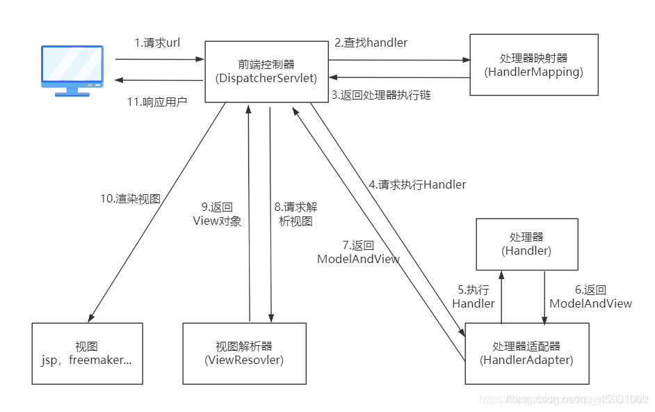
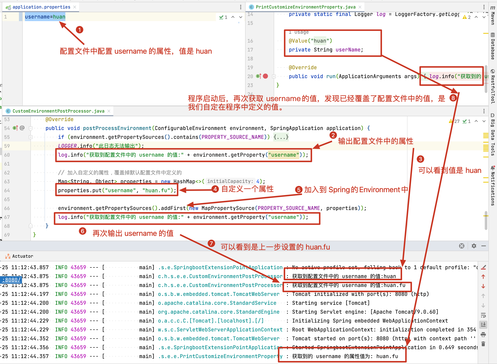
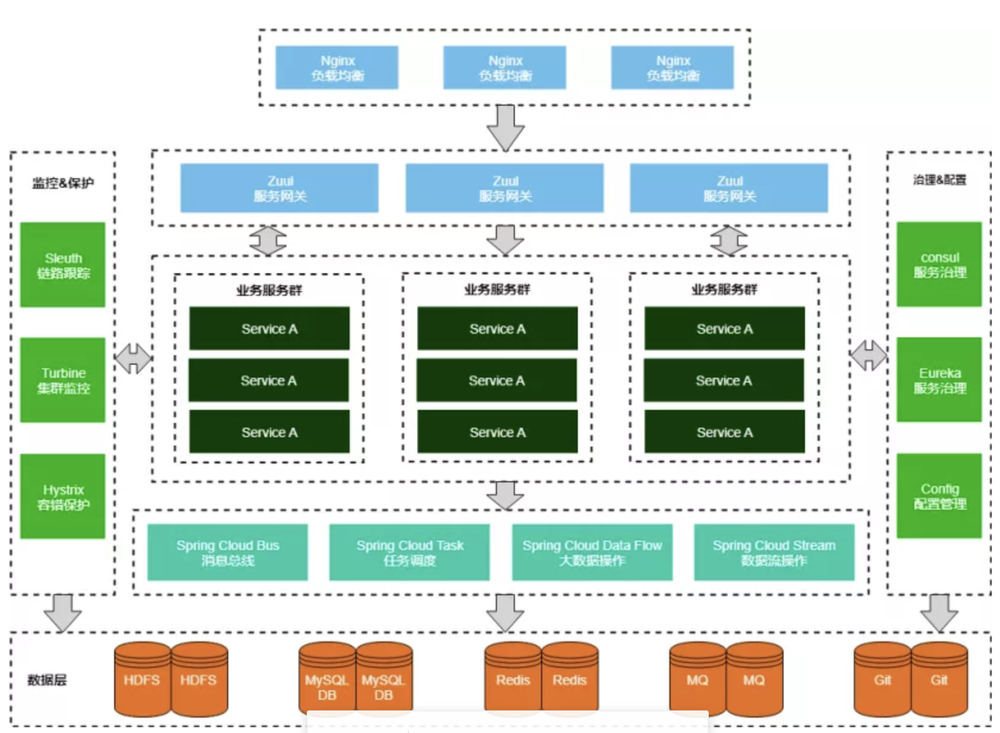
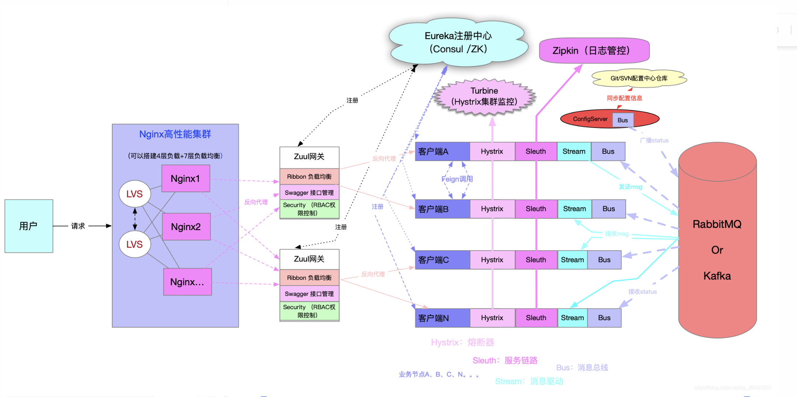
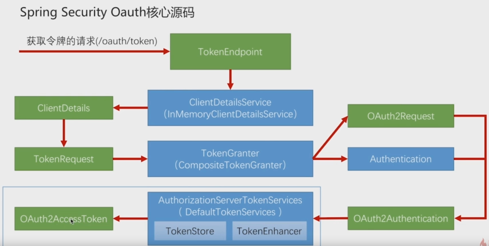

# 全家桶

## spring

### IOC 
控制反转(inversion of control),创建对象的控制权反转到spring框架上\
主要实现方式
> 依赖查找\
> 依赖注入 DI(dependency injection)

IOC容器
> 具有依赖注入功能的容器，可以创建对象的容器，IOC容器负责实例化、定位、配置应用程序中的对象并建立这些对象之间的依赖


### AOP
面向切面编程


### SPI
SPI(Service Provider Interface)是JDK内置的一种服务提供发现机制，可以用来启用框架扩展和替换组件,主要用于框架中开发，例如Dubbo、Spring、Common-Logging，JDBC等采用采用SPI机制，针对同一接口采用不同的实现提供给不同的用户，从而提高了框架的扩展性。

Java内置的SPI通过java.util.ServiceLoader类解析classPath和jar包的META-INF/services/目录 下的以接口全限定名命名的文件，并加载该文件中指定的接口实现类，以此完成调用。

Spring SPI沿用了Java SPI的设计思想，Spring采用的是spring.factories方式实现SPI机制，可以在不修改Spring源码的前提下，提供Spring框架的扩展性。

参考文档
https://juejin.cn/post/7132742686099898398

### 事务
#### ACID特性
> ##### 原子性 (Atomicity）
> 一个事务内涉及到分布式多个节点的所有操作要么一起成功，要么一起失败。
> ##### 一致性 (Consistency)
> (事务结果要和真实结果一致)\
> 跨节点场景下也不能出现中间状态。上面转账的例子中，A和B的数据可能不在一个节点上，转账的全程依然要保持A+B都为100块，不存在其他的结果。
> ##### 隔离性（Isolation）
> 多个事务并发执行时，互相隔离，互不干扰
> ##### 持久性 (Durability)
> 事务提交完成后的数据不仅要在当前节点保存，还应该在分布式场景下有备份，具备高可用性。
#### 隔离级别
> todo
#### 参考文档
<https://juejin.cn/post/7237439385909592122#heading-11>


## springmvc
### MVC
1.模型(Model)

模型封装了数据及对数据的操作，可以直接对数据库进行访问，不依赖视图和控制器，也就是说模型并不关注数据如何展示，只负责提供数据。GUI 程序模型中数据的变化一般会通过观察者模式通知视图，而在 web 中则不会这样。

2.视图(View)

视图从模型中拉取数据，只负责展示，没有具体的程序逻辑。

3.控制器(Controller)

控制器用于控制程序的流程，将模型中的数据展示到视图中。

### 五大核心组件
1.前端控制器 DispatcherServlet
DispatcherServlet本质上是一个Servlet，相当于一个中转站，所有的访问都会走到这个Servlet中，再根据配置进行中转到相应的Handler中进行处理,获取到数据和视图后，在使用相应视图做出响应。

2.处理器映射器 HandlerMapping
HandlerMapping本质上就是一段映射关系，将访问路径和对应的Handler存储为映射关系，在需要时供前端控制器查阅。

3.处理器适配器 HandlerAdapter
本质上是一个适配器，可以根据要求找到对应的Handler来运行。

由于 Handler 涉及到具体的用户业务请求，所以一般情况需要工程师根据业务需求开发 Handler。

4.视图解析器(ViewResolver)
本质上也是一种映射关系，可以将视图名称映射到真正的视图地址。前端控制器调用处理器适配完成后得到model和view，将view信息传给视图解析器得到真正的view。

5.视图渲染(View)
View是一个接口，实现类支持不同的View类型（jsp、freemarker、pdf...）。
本质上就是将handler处理器中返回的model数据嵌入到视图解析器解析后得到的页面中，向客户端做出响应。



DispatcherServlet 控制器入口 负责分发请求\
HandlerMapping 负责根据请求 找到对应的控制器\
Controller 真正处理请求的控制器\
ModelAndView 封装数据信息和视图信息的\
ViewResolver 视图处理器 通过处理找到对应的页面


## springboot
快速创建springboot项目可以使用Spring Initializr\
https://start.spring.io/;

### 核心原理
约定大于配置\
内嵌Tomcat或Jetty等Servlet容器\
通过maven依赖快速整合第三方框架

### 底层原理
#### 启动原理

#### 自动装配原理
SpringBoot项目中 **@SpringBootApplication**组合注解，这个注解是对三个注解进行了封装：
**@SpringBootConfiguration**\
**@EnableAutoConfiguration**\
**@ComponentScan**

**@EnableAutoConfiguration** 主要负责自动装配功能
> 1.这个注解引入了@Import\
> 2.项目启动加载IOC容器时，会解析@Import注解\
> 3.@Import导入了一个deferredImportSelector导入器\
> 4.然后读取所有的 META-INF/spring.factories文件\
> 5.过滤出所有AutoConfigurtionClass类型(符合自动装配条件)的类\
> 6.通过@Condition排除无效自动配置类\
> 7.最后将过滤出的类导入spring容器中

**@ComponentScan**这个注解在Spring中很重要，它对应XML配置中的元素，@ComponentScan的功能其实就是自动扫描并加载符合条件的组件（比如@Component和@Repository等）或者bean定义，最终将这些加载到IoC容器中。


#### 配置底层Environment类
SpringBoot扩展点EnvironmentPostProcessor分析

参考文档
https://zhuanlan.zhihu.com/p/504688075




## spingcloud



参考资料

https://blog.csdn.net/mkmkmkhh/article/details/101996991?utm_medium=distribute.pc_relevant.none-task-blog-baidujs_baidulandingword-2&spm=1001.2101.3001.4242

### 组件
#### Spring Cloud Security


#### Eureka(停更)
服务注册中心
#### Hystrix
1,服务降级\
比如当某个服务繁忙,不能让客户端的请求一直等待,应该立刻返回给客户端一个备选方案\
2,服务熔断\
当某个服务出现问题,卡死了,不能让用户一直等待,需要关闭所有对此服务的访问然后调用服务降级\
3,服务限流\
限流,比如秒杀场景,不能访问用户瞬间都访问服务器,限制一次只可以有多少请求
#### Zuul
#### Ribbon 
可以用LoadBalance代替
#### Feign
现在用openFeign
OpenFeign默认使用ribbon做负载均衡，超时时间是由ribbon控制
#### spring Cloud Alibaba
包含nacos
#### Spring Cloud Zookeeper
#### Spring Cloud Config
#### Spring Cloud Bus
#### Archaius
#### Consul
#### Spring Cloud for Cloud Foundry
#### Spring Cloud Sleuth
#### Spring Cloud Data Flow
#### Spring Cloud Stream
#### Spring Cloud CLI
#### Turbine
#### Spring Cloud Task
#### Spring Cloud Connectors
#### Spring Cloud Cluster
#### Spring Cloud Starters


### 事务传播机制


## spring-batch
轻量级的综合批处理框架\
https://springdoc.cn/spring-batch/

使用时候要新建表 和初始化数据\
初始化数据
```sql
INSERT INTO BATCH_STEP_EXECUTION_SEQ (ID, UNIQUE_KEY) SELECT
	*
FROM
	(
		SELECT
			0 AS ID,
			'0' AS UNIQUE_KEY
	) AS tmp
WHERE
	NOT EXISTS (
		SELECT
			*
		FROM
			BATCH_STEP_EXECUTION_SEQ
	);
 
INSERT INTO BATCH_JOB_EXECUTION_SEQ (ID, UNIQUE_KEY) SELECT
	*
FROM
	(
		SELECT
			0 AS ID,
			'0' AS UNIQUE_KEY
	) AS tmp
WHERE
	NOT EXISTS (
		SELECT
			*
		FROM
			BATCH_JOB_EXECUTION_SEQ
	);
 
INSERT INTO BATCH_JOB_SEQ (ID, UNIQUE_KEY) SELECT
	*
FROM
	(
		SELECT
			0 AS ID,
			'0' AS UNIQUE_KEY
	) AS tmp
WHERE
	NOT EXISTS (SELECT * FROM BATCH_JOB_SEQ);
```

建表语句
```sql
CREATE TABLE `batch_job_execution` (
	`JOB_EXECUTION_ID` BIGINT (20) NOT NULL,
	`VERSION` BIGINT (20) DEFAULT NULL,
	`JOB_INSTANCE_ID` BIGINT (20) NOT NULL,
	`CREATE_TIME` datetime NOT NULL,
	`START_TIME` datetime DEFAULT NULL,
	`END_TIME` datetime DEFAULT NULL,
	`STATUS` VARCHAR (10) DEFAULT NULL,
	`EXIT_CODE` VARCHAR (2500) DEFAULT NULL,
	`EXIT_MESSAGE` VARCHAR (2500) DEFAULT NULL,
	`LAST_UPDATED` datetime DEFAULT NULL,
	`JOB_CONFIGURATION_LOCATION` VARCHAR (2500) DEFAULT NULL,
	PRIMARY KEY (`JOB_EXECUTION_ID`),
	KEY `JOB_INST_EXEC_FK` (`JOB_INSTANCE_ID`),
	CONSTRAINT `JOB_INST_EXEC_FK` FOREIGN KEY (`JOB_INSTANCE_ID`) REFERENCES `batch_job_instance` (`JOB_INSTANCE_ID`)
) ENGINE = INNODB DEFAULT CHARSET = utf8;
 
CREATE TABLE `batch_job_execution_context` (
	`JOB_EXECUTION_ID` BIGINT (20) NOT NULL,
	`SHORT_CONTEXT` VARCHAR (2500) NOT NULL,
	`SERIALIZED_CONTEXT` text,
	PRIMARY KEY (`JOB_EXECUTION_ID`),
	CONSTRAINT `JOB_EXEC_CTX_FK` FOREIGN KEY (`JOB_EXECUTION_ID`) REFERENCES `batch_job_execution` (`JOB_EXECUTION_ID`)
) ENGINE = INNODB DEFAULT CHARSET = utf8;
 
CREATE TABLE `batch_job_execution_params` (
	`JOB_EXECUTION_ID` BIGINT (20) NOT NULL,
	`TYPE_CD` VARCHAR (6) NOT NULL,
	`KEY_NAME` VARCHAR (100) NOT NULL,
	`STRING_VAL` VARCHAR (250) DEFAULT NULL,
	`DATE_VAL` datetime DEFAULT NULL,
	`LONG_VAL` BIGINT (20) DEFAULT NULL,
	`DOUBLE_VAL` DOUBLE DEFAULT NULL,
	`IDENTIFYING` CHAR (1) NOT NULL,
	KEY `JOB_EXEC_PARAMS_FK` (`JOB_EXECUTION_ID`),
	CONSTRAINT `JOB_EXEC_PARAMS_FK` FOREIGN KEY (`JOB_EXECUTION_ID`) REFERENCES `batch_job_execution` (`JOB_EXECUTION_ID`)
) ENGINE = INNODB DEFAULT CHARSET = utf8;
 
CREATE TABLE `batch_job_execution_seq` (
	`ID` BIGINT (20) NOT NULL,
	`UNIQUE_KEY` CHAR (1) NOT NULL,
	UNIQUE KEY `UNIQUE_KEY_UN` (`UNIQUE_KEY`)
) ENGINE = INNODB DEFAULT CHARSET = utf8;
 
CREATE TABLE `batch_job_instance` (
	`JOB_INSTANCE_ID` BIGINT (20) NOT NULL,
	`VERSION` BIGINT (20) DEFAULT NULL,
	`JOB_NAME` VARCHAR (100) NOT NULL,
	`JOB_KEY` VARCHAR (32) NOT NULL,
	PRIMARY KEY (`JOB_INSTANCE_ID`),
	UNIQUE KEY `JOB_INST_UN` (`JOB_NAME`, `JOB_KEY`)
) ENGINE = INNODB DEFAULT CHARSET = utf8;
 
CREATE TABLE `batch_job_seq` (
	`ID` BIGINT (20) NOT NULL,
	`UNIQUE_KEY` CHAR (1) NOT NULL,
	UNIQUE KEY `UNIQUE_KEY_UN` (`UNIQUE_KEY`)
) ENGINE = INNODB DEFAULT CHARSET = utf8;
 
CREATE TABLE `batch_step_execution` (
	`STEP_EXECUTION_ID` BIGINT (20) NOT NULL,
	`VERSION` BIGINT (20) NOT NULL,
	`STEP_NAME` VARCHAR (100) NOT NULL,
	`JOB_EXECUTION_ID` BIGINT (20) NOT NULL,
	`START_TIME` datetime NOT NULL,
	`END_TIME` datetime DEFAULT NULL,
	`STATUS` VARCHAR (10) DEFAULT NULL,
	`COMMIT_COUNT` BIGINT (20) DEFAULT NULL,
	`READ_COUNT` BIGINT (20) DEFAULT NULL,
	`FILTER_COUNT` BIGINT (20) DEFAULT NULL,
	`WRITE_COUNT` BIGINT (20) DEFAULT NULL,
	`READ_SKIP_COUNT` BIGINT (20) DEFAULT NULL,
	`WRITE_SKIP_COUNT` BIGINT (20) DEFAULT NULL,
	`PROCESS_SKIP_COUNT` BIGINT (20) DEFAULT NULL,
	`ROLLBACK_COUNT` BIGINT (20) DEFAULT NULL,
	`EXIT_CODE` VARCHAR (2500) DEFAULT NULL,
	`EXIT_MESSAGE` VARCHAR (2500) DEFAULT NULL,
	`LAST_UPDATED` datetime DEFAULT NULL,
	PRIMARY KEY (`STEP_EXECUTION_ID`),
	KEY `JOB_EXEC_STEP_FK` (`JOB_EXECUTION_ID`),
	CONSTRAINT `JOB_EXEC_STEP_FK` FOREIGN KEY (`JOB_EXECUTION_ID`) REFERENCES `batch_job_execution` (`JOB_EXECUTION_ID`)
) ENGINE = INNODB DEFAULT CHARSET = utf8;
 
CREATE TABLE `batch_step_execution_context` (
	`STEP_EXECUTION_ID` BIGINT (20) NOT NULL,
	`SHORT_CONTEXT` VARCHAR (2500) NOT NULL,
	`SERIALIZED_CONTEXT` text,
	PRIMARY KEY (`STEP_EXECUTION_ID`),
	CONSTRAINT `STEP_EXEC_CTX_FK` FOREIGN KEY (`STEP_EXECUTION_ID`) REFERENCES `batch_step_execution` (`STEP_EXECUTION_ID`)
) ENGINE = INNODB DEFAULT CHARSET = utf8;
 
CREATE TABLE `batch_step_execution_seq` (
	`ID` BIGINT (20) NOT NULL,
	`UNIQUE_KEY` CHAR (1) NOT NULL,
	UNIQUE KEY `UNIQUE_KEY_UN` (`UNIQUE_KEY`)
) ENGINE = INNODB DEFAULT CHARSET = utf8;
```

https://blog.csdn.net/creepbiaozi/article/details/100154145


## spel表达式
SpEL（Spring Expression Language）是 Spring 框架中的一种表达式语言，它提供了一种在运行时对对象图进行查询和操作的强大方式。SpEL可以用于访问对象的属性、调用对象的方法、进行算术和逻辑运算，以及对集合类型进行操作等

字符串
```java
@ApiLog(taskNo = "#str")
public  String test1(String str){
    return str;
}
```

对象
```java
@ApiLog(taskNo = "#requestDto.orderNo")
public void test(DailyPowerRequestDto requestDto){
 
}
```

静态方法
```java
@ApiLog(taskNo = "T(com.dycjr.xiakuan.order.service.impl.DailyPowerServiceImpl).test1(#requestDto.orderNo)")
public void test(DailyPowerRequestDto requestDto){
 
}
 
public static void test1(String str){
    System.out.println(str);
}
```

非静态方法
```java
@ApiLog(taskNo = "new com.dycjr.xiakuan.order.service.impl.DailyPowerServiceImpl().test2(#requestDto.orderNo)")
public void test(DailyPowerRequestDto requestDto){

}

public void test2(String str){
	System.out.println(str);
}
```

枚举
```java
@Getter
@AllArgsConstructor
public enum IsDeleteEnum {
    /**
     * 数据是否删除
     */
    NO(0, "有效"),
    YES(1, "已删除")
    ;
 
    private Integer code;
    private String desc;
 
}

 
@ApiLog(taskNo = "T(com.dycjr.xiakuan.order.enums.IsDeleteEnum).NO.getCode()")
public void doTask(DailyPowerRequestDto requestDto) {
 
}
```

参考文档
https://blog.csdn.net/IWinds/article/details/130990182


## spring security



## spring mongdb
日志配置
```xml
<springProfile name="dev,test">
        <logger name="com.tong" level="DEBUG"/>
        <!--打印mongo语句 下面的两个都行-->
        <logger name="org.springframework.data.mongodb.core" level="DEBUG"/>
        <logger name="org.springframework.data.mongodb.core.MongoTemplate" level="DEBUG" />
    </springProfile>
```
打印出来的日志如下
```
13:35:41.159 DEBUG [service,ccacd130a66bf79b,ccacd130a66bf79b] 41620 --- [p-nio-81-exec-1] o.s.data.mongodb.core.MongoTemplate      : find using query: { "tongname" : 1} fields: Document{{}} for class: class com.tong.TestDetails in collection: tongconllection

```

## ORM框架
### spring-mybatis

### spring-mybatis-plus

### spring-mybatis-flex

### jooq
