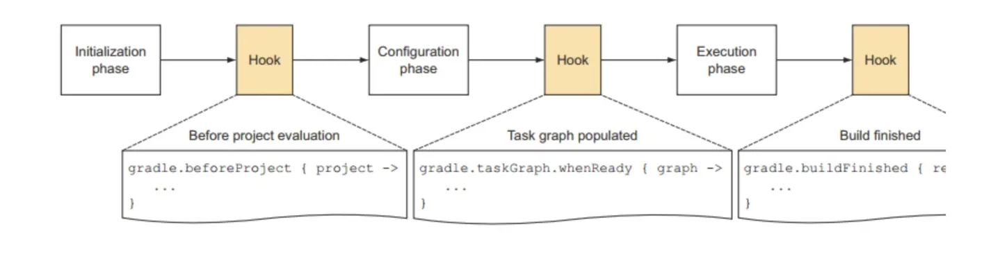

## maven
compile、provided、test、runtime

Maven中的-D（Properties属性）和-P（Profiles配置文件）


## gradle 

### 基础

#### 文件含义
```bash
gradle
|_wrapper
  |_gradle-wrapper.jar
  |_gradle-wrapper.properties
build.gradle
gradlew
gradlew.bat
setting.gradle
```
gradle-wrapper.jar： 这是 Gradle Wrapper JAR 文件，它包含 Gradle Wrapper 的主要逻辑和代码。Gradle Wrapper 是一个用于下载、安装和运行指定 Gradle 版本的工具，可以帮助确保项目的构建过程使用的是项目所需的特定 Gradle 版本。

gradle-wrapper.properties： 这个属性文件定义了 Gradle Wrapper 的配置，包括指定要使用的 Gradle 版本以及下载 Gradle 的地址等信息。

build.gradle.kts：这是 Gradle 构建脚本文件，通常使用 Kotlin DSL（Domain Specific Language）编写。该文件定义了项目的构建配置，包括项目依赖、任务定义、插件应用等。

gradlew 和 gradlew.bat：这是 Gradle Wrapper 脚本文件，用于在项目中运行 Gradle 命令。通过运行 ./gradlew（Linux/macOS）或 gradlew.bat（Windows）命令，可以使用项目中指定的 Gradle 版本来执行构建任务，而不需要手动安装 Gradle。

settings.gradle.kts：这个文件用于定义 Gradle 多项目构建的设置，例如指定根项目名称、包含子项目等。


```java
// build.gradle文件内容
plugins {
    java
    id("org.springframework.boot") version "3.2.4"
    id("io.spring.dependency-management") version "1.1.4"
}

group = "com.example"
version = "0.0.1-SNAPSHOT"

java {
    sourceCompatibility = JavaVersion.VERSION_17
}

repositories {
    mavenCentral()
}

dependencies {
    // 依赖都写在这
    implementation("org.springframework.boot:spring-boot-starter")
    testImplementation("org.springframework.boot:spring-boot-starter-test") {
        exclude(group = "org.junit.vintage", module = "junit-vintage-engine")
    }
    implementation("org.springframework.boot:spring-boot-starter-web")
    testImplementation("org.springframework.boot:spring-boot-starter-test")
    implementation("com.alibaba:fastjson:1.2.76")
    compileOnly("org.projectlombok:lombok:1.18.32")

}

tasks.withType<Test> {
    useJUnitPlatform()
}

```

```java
apply plugin: 'application'
mainClassName = "com.gensci.parasol.admin.AdminApplication"
applicationDefaultJvmArgs = [
        "-Dapollo.configService=https://apollo.net",
        "-Dapollo.configService.username=apollo",
        "-Dapollo.configService.password=123",
        "-Dlog.dir=/Users/xyt/Desktop/fm/log",
        "-Dserver.port=3001"
]
```

#### gradle侧边栏

打包命令
点击Tasks=> build=> bootjar或者Tasks=> build=> build \
生成jar，路径：jar包路径在/build/libs

```bash
Tasks
 |_application
 |_build
 |_build setup
 |_documentation
 |_help
 |_other
 |_verification
Dependencies
 |_compileClasspath
 |_runtimeClasspath
 |_testCompileClasspath
 |_testRuntimeClasspath

```

application： 这个任务通常是用于构建和启动应用程序的任务，可以将项目打包成可执行的应用程序。\
build： 这个任务用于执行整个构建过程，包括编译、打包、测试等操作。\
build setup： 这个任务用于设置构建环境，可能包括下载依赖、配置构建目录等操作。\
documentation： 这个任务用于生成项目的文档，例如 Javadoc 或其他文档格式。\
help： 这个任务通常用于显示有关项目和任务的帮助信息。\
other： 这个分类可能包含项目定义的其他自定义任务。\
verification： 这个任务用于执行项目验证，例如运行测试、检查代码质量等操作。

compileClasspath： 这是编译时类路径，包含编译项目代码所需的依赖项。\
runtimeClasspath： 运行时类路径，包含项目在运行时需要的依赖项。\
testCompileClasspath： 测试编译类路径，包含编译测试代码所需的依赖项。\
testRuntimeClasspath： 测试运行时类路径，包含运行测试时需要的依赖项。

1.implementation，默认的scope。implementation的作用域会让依赖在编译和运行时均包含在内，但是不会暴露在类库使用者的编译时。举例，如果我们的类库包含了gson，那么其他人使用我们的类库时，编译时不会出现gson的依赖。

2.api，和implementation类似，都是编译和运行时都可见的依赖。但是api允许我们将自己类库的依赖暴露给我们类库的使用者。

3.compileOnly和runtimeOnly，这两种顾名思义，一种只在编译时可见，一种只在运行时可见。而runtimeOnly和Maven的provided比较接近。

4.testImplementation，这种依赖在测试编译时和运行时可见，类似于Maven的test作用域。

5.testCompileOnly和testRuntimeOnly，这两种类似于compileOnly和runtimeOnly，但是作用于测试编译时和运行时。


#### 工作流程


初始化阶段
Initiliazation初始化阶段，主要任务是创建项目的层次结构，为每一个项目创建一个Project对象，对应就是执行setting.gradle，一个setting.gradle对应一个setting对象，在setting.gradle中可以直接调用其中的方法,Settings API文档

配置阶段
下一个阶段就是Configration配置阶段,它主要是配置每个Project中的build.gradle,在初始化阶段和配置阶段之间，我们可以加入Hook，这是通过API添加的
Configration阶段完成之后，整个build的project以及内部的Task关系都确定了，我们可以通过gradle的getTaskGraph方法访问,对应的类为TaskExecutionGraph,TaskExecutionGraph API文档
我们知道每个Project都由多个Task组成，每个Task之间都有依赖关系，Configuration阶段会建立一个有向图来描述Task之间的依赖关系，这里也可以添加一个Hook，当有向图建立完成之后进行一些操作
每个build.gradle对应一个Project对象，在初始化阶段创建，这里是Project API文档

执行阶段
最后一个阶段就是执行阶段，这一阶段的主要是执行Task，这里也可以加Hook，当任务执行完之后做一些事情


gradle-groovy

gradle-kotlin

Groovy 是一种动态语言，而 Kotlin 是静态类型。 这表示，使用 Kotlin DSL 时，构建脚本错误可能发生在编译时而不是运行时。

使用动态类型检查，在执行构建脚本之前不会检测到错误


### 多模块配置


https://plugins.gradle.org/


参考文档
https://www.yuque.com/youyi-ai1ik/emphm9/kyhenl?


