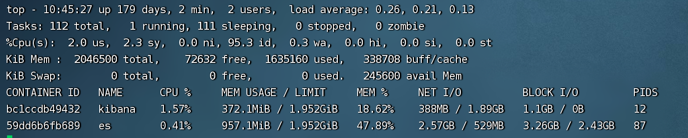
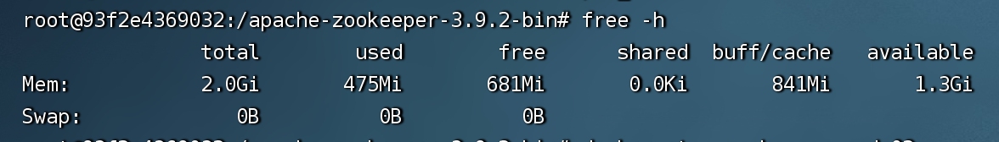
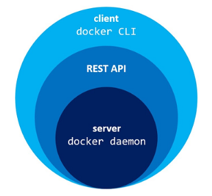

# docker

## 基础
开源容器解决方案，高效、轻量、可移植\
<https://docs.docker.com/>

## 安装
### mac安装docker


## 常用命令

```
启动docker服务 systemctl start docker
重启docker服务 systemctl restart docker
启动docker服务旧版本 service docker start

docker查看日志 docker logs -f -t --tail 10 ca

查看镜像 docker images
获取镜像 docker pull ubuntu:13.10
查找镜像 docker search httpd
运行镜像 docker run httpd
删除镜像 docker rmi hello-world

查看正在运行的容器 docker ps
查看所有的容器 docker ps -a 
启动容器 docker start b750bbbcfd88 
重启容器 docker restart b750bbbcfd88 
停止容器 docker stop b750bbbcfd88
删除容器 
   docker rm -f 1e560fca3906
   docker container rm  <container ID> 
查看容器信息 docker inspect 容器名
进入后台容器 docker exec -it 243c32535da7 /bin/bash 
进入后台容器 用ROOT用户 docker exec -it -u root 容器 bash
退出容器 exit 


根据镜像创建容器 docker run -d --name=testtong --restart=always -p 8011:8080 registry.cn-shanghai.aliyuncs.com/kufang/daservice
根据已有镜像创建容器 docker container run -it -d -p 82:80 --name testtong 1dbc90bf1e40
参考 <https://www.jianshu.com/p/6a9b07c92995>

docker文件拷贝到宿主机 
   docker cp testtomcat：/usr/local/tomcat/webapps/test/js/test.js  /opt
   docker cp daservice:/usr/local/share/tessdata /root/tong/laji

docker 查看挂载目录：docker inspect container_name | grep Mounts -A 20

停止所有容器 docker stop $(docker ps -aq)
开始所有容器 docker rm $(docker ps -aq)
清理掉处于终止状态的容器 docker container prune
后台运行的容器 docker run -itd --name ubuntu-test ubuntu /bin/bash 
导出容器 docker export 1e560fca3906 > ubuntu.tar 
导入容器 cat docker/ubuntu.tar | docker import - test/ubuntu:v1
   镜像导入容器： docker import http://example.com/exampleimage.tgz example/imagerepo
web日志 docker logs -f bf08b7f2cd89

docker cp comonitor.war comonitor:/usr/share/apache-tomcat-7.0.96/webapps 会自动解压 
docker restart comonitor
docker exec -it 7453d7a061a0 /bin/bash 

改镜像地址 vim  /etc/docker/daemon.json 
{
  "registry-mirrors":["https://registry.docker-cn.com"]
}

```
查看容器内存占用\
docker stats 


free -h 



查看docker容器进程
docker container top 【容器名称】


## 部署
### dockerfile

```
docker pull java:8u111
```

```
# 基于哪个镜像
FROM java:8
# 将本地文件夹挂载到当前容器
VOLUME /tmp
# 拷贝文件到容器，handcuffs-reg-0.0.1-SNAPSHOT.jar这里是maven打包后的名字
ADD dtcms-asset-alarm.jar dtcms-asset-alarm.jar
RUN bash -c 'touch /dtcms-asset-alarm.jar'
# 配置容器启动后执行的命令
ENTRYPOINT  ["java","-Djava.security.egd=file:/dev/./urandom","-jar","/dtcms-asset-alarm.jar"]
```

```
[root@localhost test2]# ls
Dockerfile  einvoice.jar
```

```

docker build -t springbootdemo4docker .
```

```
[root@localhost docker]# docker run -d -p 8080:8085 springbootdemo4docker
-d参数是让容器后台运行 
-p 是做端口映射，此时将服务器中的8080端口映射到容器中的8085(项目中端口配置的是8085)端口
```


### docker部署war包

```
https://blog.csdn.net/xiaoye319/article/details/90515996
直接放容器里的webapp下(容器关闭可能war包会消失)，或者挂载目录到webapp
1、docker search tomcat 搜索镜像
2、docker pull docker.io/tomcat 根据tomcat名称拉去镜像
3、docker run -d -p 8088:8080 docker.io/tomcat 使用镜像启动容器


1、安装vim apt-get update && apt-get install vim -y

2、dockerfile文件
FROM 77be327e4b63 （这串数字是我已经创建好一个ubuntu镜像的镜像id，在这里作为tomcat的基础镜像
MAINTAINER hmk
ENV REFRESHED_AT 2020-04-14 

#切换镜像目录，进入/usr目录
WORKDIR /usr
#在/usr/下创建jdk目录,用来存放jdk文件
RUN mkdir jdk
#在/usr/下创建tomcat目录，用来存放tomcat
RUN mkdir tomcat

#将宿主机的jdk目录下的文件拷至镜像的/usr/jdk目录下
ADD jdk1.8.0_231 /usr/jdk/
#将宿主机的tomcat目录下的文件拷至镜像的/usr/tomcat目录下
ADD apache-tomcat-9.0.34 /usr/tomcat/

#设置环境变量
ENV JAVA_HOME=/usr/jdk
ENV JRE_HOME=$JAVA_HOME/jre
ENV CLASSPATH=.:$JAVA_HOME/lib/dt.jar:$JAVA_HOME/lib/tools.jar:$JRE_HOME/lib:$CLASSPATH
ENV PATH=/sbin:$JAVA_HOME/bin:$PATH

#公开端口
EXPOSE 8080
#设置启动命令
ENTRYPOINT ["/usr/tomcat/bin/catalina.sh","run"]


3、构建docker build -t tong/tomcat .


docker run -d --name=einvoice -e "container=docker" --restart=always -p 90:8080 \
-v /hosts:/etc/hosts \
-v /cubedata/NFS_ts:/NFS_ts \
-v /cubedata/logs/einvoice:/usr/share/tomcat/logs \
-e "TZ=Asia/Shanghai" \
-e "DASERVICE_FILEPARSER_DB_HOST=172.16.0.104" \
-e "DASERVICE_FILEPARSER_DB_PORT=3306" \
-e "DASERVICE_FILEPARSER_DB_TABLENAME=fileparser" \
-e "DASERVICE_FILEPARSER_DB_USERNAME=root" \
-e "DASERVICE_FILEPARSER_DB_PASSWORD=ssmedia-11" \
-e "CUBESERVICE_DB_HOST=172.16.0.104" \
-e "CUBESERVICE_DB_PORT=3306" \
-e "CUBESERVICE_DB_TABLENAME=einvoice" \
-e "CUBESERVICE_DB_USERNAME=root" \
-e "CUBESERVICE_DB_PASSWORD=ssmedia-11" \
-e "DASERVICE_HOST=172.16.0.104" \
-e "DASERVICE_PORT=80" \
-e "DASERVICE_ANALYSIS=analysis.do" \
-e "REDIS_HOST=172.16.0.104" \
-e "REDIS_PASSWORD=ssmedia-11" \
-e "REDIS_TIMEOUT=2000" \
-e "EINVOICE_IP=172.16.0.104:90" \
registry.cn-shanghai.aliyuncs.com/kufang/einvoice:1.15.0T

```


### 项目案例

```java
docker run -d --name=daservice -e "container=docker" --privileged=true --device /dev/mem --restart=always -p 84:8070 \
-v /hosts:/etc/hosts \
-v /root/ticketparser:/ticketparser \
-v /NFS_ts:/NFS_ts \
-v /NFS_ts2:/NFS_ts2 \
-v /logs/daservice:/logs \
-e "TZ=Asia/Shanghai" \
registry.cn-shanghai.aliyuncs.com/kufang/daservice:2.1.2T
```

```java
docker run -d --name=testtong --restart=always -p 8011:8080 registry.cn-shanghai.aliyuncs.com/kufang/daservice
```

```java

查看images创建命令
docker history registry.cn-shanghai.aliyuncs.com/kufang/einvoice:2.0.0T 

docker history registry.cn-shanghai.aliyuncs.com/kufang/einvoice:2.0.0T --no-trunc

docker history registry.cn-shanghai.aliyuncs.com/kufang/einvoice:2.0.0T --no-trunc
```

```java
# 部署comonitor服务dockerfile文件例子

docker run -d --name=comonitor -e "container=docker" --privileged=true --device /dev/mem --restart=always -p 87:8080 \
-v /hosts:/etc/hosts \
-v /data/data_3D/NFS_ts2:/NFS_ts2 \
-v /data/data_3D/logs/comonitor:/usr/share/tomcat/logs/ \
-e "TZ=Asia/Shanghai" \
-e "DASERVICE_FILEPARSER_DB_HOST=172.16.0.104" \
-e "DASERVICE_FILEPARSER_DB_PORT=3306" \
-e "DASERVICE_FILEPARSER_DB_TABLENAME=fileparser" \
-e "DASERVICE_FILEPARSER_DB_USERNAME=root" \
-e "DASERVICE_FILEPARSER_DB_PASSWORD=ssmedia-11" \
-e "DASERVICE_DPS_DB_HOST=172.16.0.104" \
-e "DASERVICE_DPS_DB_PORT=3306" \
-e "DASERVICE_DPS_DB_TABLENAME=dps" \
-e "DASERVICE_DPS_DB_USERNAME=root" \
-e "DASERVICE_DPS_DB_PASSWORD=ssmedia-11" \
-e "DASERVICE_COMONITOR_DB_HOST=172.16.0.104" \
-e "DASERVICE_COMONITOR_DB_PORT=3306" \
-e "DASERVICE_COMONITOR_DB_TABLENAME=comonitor" \
-e "DASERVICE_COMONITOR_DB_USERNAME=root" \
-e "DASERVICE_COMONITOR_DB_PASSWORD=ssmedia-11" \
-e "DASERVICE_DMS_DB_HOST=172.16.0.104" \
-e "DASERVICE_DMS_DB_PORT=3306" \
-e "DASERVICE_DMS_DB_TABLENAME=dms" \
-e "DASERVICE_DMS_DB_USERNAME=root" \
-e "DASERVICE_DMS_DB_PASSWORD=ssmedia-11" \
-e "MQTT_SERVER_URI=tcp://172.16.1.95:1883" \
-e "MQTT_SERVER_USER_NAME=counect" \
-e "MQTT_SERVER_PASSWORD=123456" \
-e "COMONITOR_URL=服务器入口地址/comonitor" \
registry.cn-shanghai.aliyuncs.com/kufang/comonitor:0.7.1
```


## 底层原理

**Docker是Client/Server架构。其中Docker守护进程是服务端，Docker命令行是众多客户端之一**

1. **docker daemon**Docker守护进程(docker daemon)是运行在你的操作系统上的一个服务。目前，它只能运行在Linux上，因为它依赖于一些Linux内核特性(比如Cgroup与Namespace)。 但是，也有一些特殊的办法让Docker运行在MacOS与Windows上(运行在Linux虚拟机中)。
   
   Docker守护进程提供了REST API。许多工具(Docker命令行，Docker Compose等)都可以通过REST API与Docker守护进程进行交互，例如创建容器，构建镜像等。

2. **docker CLI**Docker命令行(docker CLI)是与Docker守护进程进行交互的主要工具。




## 其他

**一、占用空间**

/var/lib/docker/overlay2过大

/var/lib/docker/image/overlay2：存储镜像管理元数据的目录，以使用存储驱动命名。

/var/lib/docker/overlay2:　　docker镜像存储的联合挂载根目录

https://blog.csdn.net/weixin_32820767/article/details/81196250

**二、网络模式**

**Docker Compose**

https://www.cnblogs.com/zuxing/articles/8780661.html

docker network inspect bridge

**三、容器网络管理**

docker1.1 新特性--libnetwork模块


存储驱动之一 overlay2
管理卷
四种网络模式 brighe(默认网络。docker启动后，会默认创建一个docker0网桥，默认创建的容器也是添加到这个网桥中)


## centos安装docker

```
安装必要工具包
sudo yum install -y yum-utils device-mapper-persistent-data lvm2

跟新yum缓存
sudo yum makecache fast 或者 sudo yum makecache

添加软件源信息
yum-config-manager --add-repo   http://mirrors.aliyun.com/docker-ce/linux/centos/docker-ce.repo

安装docker
sudo yum -y install docker-ce

启动docker
sudo systemctl start docker

```

参考文档\
https://developer.aliyun.com/article/1000962#:~:text=%E4%BD%BF%E7%94%A8%E8%84%9A%E6%9C%AC%E5%AE%89%E8%A3%85%20Docker%201%E3%80%81%E4%BD%BF%E7%94%A8%20sudo%20%E6%88%96%20root%20%E6%9D%83%E9%99%90%E7%99%BB%E5%BD%95%20Centos%E3%80%82,%E5%8C%85%E6%9B%B4%E6%96%B0%E5%88%B0%E6%9C%80%E6%96%B0%E3%80%82%20%24%20sudo%20yum%20update%203%E3%80%81%E6%89%A7%E8%A1%8C%20Docker%20%E5%AE%89%E8%A3%85%E8%84%9A%E6%9C%AC%E3%80%82


## docker安装zookeeper

docker pull zookeeper

docker network create --driver bridge --subnet=172.18.0.0/16 --gateway=172.18.0.1 zoonet 

docker network ls

mkdir /data/zookeeper/cluster/zk1/{data,datalog,logs} -p
mkdir /data/zookeeper/cluster/zk2/{data,datalog,logs} -p
mkdir /data/zookeeper/cluster/zk3/{data,datalog,logs} -p

docker run -d -p 2181:2181 --name zookeeper_node01 --privileged --restart always --network zoonet --ip 172.18.0.2 \
-v /data/zookeeper/cluster/zk1/data:/data \
-v /data/zookeeper/cluster/zk1/datalog:/datalog \
-v /data/zookeeper/cluster/zk1/logs:/logs \
-e ZOO_MY_ID=1 \
-e "ZOO_SERVERS=server.1=172.18.0.2:2888:3888;2181 server.2=172.18.0.3:2888:3888;2181 server.3=172.18.0.4:2888:3888;2181" zookeeper 


docker run -d -p 2182:2181 --name zookeeper_node02 --privileged --restart always --network zoonet --ip 172.18.0.3 \
-v /data/zookeeper/cluster/zk2/data:/data \
-v /data/zookeeper/cluster/zk2/datalog:/datalog \
-v /data/zookeeper/cluster/zk2/logs:/logs \
-e ZOO_MY_ID=2 \
-e "ZOO_SERVERS=server.1=172.18.0.2:2888:3888;2181 server.2=172.18.0.3:2888:3888;2181 server.3=172.18.0.4:2888:3888;2181" zookeeper 

docker run -d -p 2183:2181 --name zookeeper_node03 --privileged --restart always --network zoonet --ip 172.18.0.4 \
-v /data/zookeeper/cluster/zk3/data:/data \
-v /data/zookeeper/cluster/zk3/datalog:/datalog \
-v /data/zookeeper/cluster/zk3/logs:/logs \
-e ZOO_MY_ID=3 \
-e "ZOO_SERVERS=server.1=172.18.0.2:2888:3888;2181 server.2=172.18.0.3:2888:3888;2181 server.3=172.18.0.4:2888:3888;2181" zookeeper 

docker logs -f 1912ae817d33

参考文档 
https://blog.csdn.net/weixin_39555954/article/details/119942679


yum install -y docker-compose

touch docker-compose-yml 

version: '3'
services:
  kafka1:
    image: wurstmeister/kafka
    container_name: kafka1
    ports:
      - "9093:9092"
    environment:
      KAFKA_BROKER_ID: 0
      KAFKA_NUM_PARTITIONS: 3
      KAFKA_DEFAULT_REPLICATION_FACTOR: 2
      KAFKA_ZOOKEEPER_CONNECT: 127.0.0.1:2181
      KAFKA_LISTENERS: PLAINTEXT://0.0.0.0:9092
      KAFKA_ADVERTISED_LISTENERS: PLAINTEXT://127.0.0.1:9093
    volumes:
      - /data/docker-compose/kafka/broker1/logs:/opt/kafka/logs
      - /var/run/docker.sock:/var/run/docker.sock
    restart: always
 
  kafka2:
    image: wurstmeister/kafka
    container_name: kafka2
    ports:
      - "9094:9092"
    environment:
      KAFKA_BROKER_ID: 1
      KAFKA_NUM_PARTITIONS: 3
      KAFKA_DEFAULT_REPLICATION_FACTOR: 2
      KAFKA_ZOOKEEPER_CONNECT: 127.0.0.1:2181
      KAFKA_LISTENERS: PLAINTEXT://0.0.0.0:9092
      KAFKA_ADVERTISED_LISTENERS: PLAINTEXT://127.0.0.1:9094
    volumes:
      - /data/docker-compose/kafka/broker2/logs:/opt/kafka/logs
      - /var/run/docker.sock:/var/run/docker.sock
    restart: always
  
  kafka3:
    image: wurstmeister/kafka
    container_name: kafka3
    ports:
      - "9095:9092"
    environment:
      KAFKA_BROKER_ID: 2
      KAFKA_NUM_PARTITIONS: 3
      KAFKA_DEFAULT_REPLICATION_FACTOR: 2
      KAFKA_ZOOKEEPER_CONNECT: 127.0.0.1:2181
      KAFKA_LISTENERS: PLAINTEXT://0.0.0.0:9092
      KAFKA_ADVERTISED_LISTENERS: PLAINTEXT://127.0.0.1:9095
    volumes:
      - /data/docker-compose/kafka/broker3/logs:/opt/kafka/logs
      - /var/run/docker.sock:/var/run/docker.sock
    restart: always


创建 kafka 容器并启动
docker-compose up -d --build kafka1
docker-compose up -d --build kafka2
docker-compose up -d --build kafka3
 
停止 kafka 容器
docker-compose stop kafka1
docker-compose stop kafka2
docker-compose stop kafka3

## docker安装kafka


## docker安装postgresql
### 方式一

```
查询版本
docker search postgres

拉取镜像
docker pull postgres

创建容器
docker run -it \
--name postgres \
--privileged \
-e POSTGRES_PASSWORD=通用密码 \
-p 5432:5432 \
-v /usr/local/software/postgres/data:/var/lib/postgresql/data \
-d postgres
命令详细解释如下：
–name postgres：指定容器的名称；
-e POSTGRES_PASSWORD=Abc1234%：设置环境变量，这里为设定PostgreSQL数据库的密码；
-p 5432:5432：指定端口映射，前者为宿主机访问端口，后者为容器内端口。如果不指定端口映射，只有在容器内可以访问数据库，外部是无法访问的；
-v /home/zx/postgres/data:/var/lib/postgresql/data：v是volume的简写，即绑定一个卷，冒号前的路径为宿主机的路径（如果指定路径不存在会自动创建目录），冒号后为容器内路径。容器会把宿主机的目录映射到容器内的路径，这样容器运行中生成的数据实际上就是写到了宿主机的指定路径上，即使容器删除了，此路径的文件也不会删除，这样就做到了数据库的持久化存储。还可以通过docker volume提供的相关命令显式地创建volume，然后再挂载到容器上，这里不做介绍，请自行查询相关内容；
-d：表示后台运行容器；
postgres：表示镜像的名称，docker基于上步拉取的镜像创建出容器；


查看日志
docker logs postgres

容器内连接数据库
docker exec -it postgres /bin/bash

su postgres

psql

```

参考文档\
https://blog.csdn.net/Pireley/article/details/132312178

### 方式二

docker pull postgres

创建本地卷\
数据卷可以在容器之间共享和重用，默认会一直存在，即使容器被删除（docker volume inspect pgdata可查看数据卷的本地位置）\
docker volume create pgdata

docker run --name pgsql -p 5432:5432 -e POSTGRES_PASSWORD=abc123 -v pgdata:/var/lib/postgresql/data --restart=always -d postgres

第一条命令进入名为 `pgsql`的容器运行时；
docker exec -it pgsql bash

第二条命令登录postgresql命令行控制台
psql -U postgres -W


参考文档 
https://www.cnblogs.com/kendoziyu/p/15778778.html


## docker安装mysql
```
拉取镜像
docker pull mysql	

创建容器
docker run \
--name mysql \
-d \
-p 3306:3306 \
--restart unless-stopped \
-v /tong/mysql/log:/var/log/mysql \
-v /tong/mysql/data:/var/lib/mysql \
-v /tong/mysql/conf:/etc/mysql/conf.d \
-e MYSQL_ROOT_PASSWORD=通用密码 \
mysql:latest
```

## docker安装mongodb

```
拉取镜像
docker pull mongo

创建持久化目录
mkdir -p /tong/mongodb/data

创建容器
docker run -itd --name mongo -v /tong/mongodb/data:/data/db -p 27017:27017 mongo --auth

登录mongo容器，并进入到【admin】数据库
docker exec -it mongo mongosh admin
docker exec -it mongo mongosh

进入admin数据库
user admin

创建用户
db.createUser({ user:'root',pwd:'通用密码',roles:[ { role:'userAdminAnyDatabase', db: 'admin'},'readWriteAnyDatabase']});

```

参考文档 https://blog.csdn.net/packge/article/details/126539320


## docker安装redis
docker pull redis	


## docker安装elasticsearch

创建网络
```bash
docker network create es-net
```

拉取镜像
```bash
docker pull elasticsearch:8.6.0
```

创建挂载点目录
```bash
mkdir -p /usr/local/es/data /usr/local/es/config /usr/local/es/plugins
```

```bash
chmod 777  /usr/local/es/data
chmod 777  /usr/local/es/config
chmod 777  /usr/local/es/plugins
```

创建容器
```bash
docker run -d \
--restart=always \
--name es \
--network es-net \
-p 9200:9200 \
-p 9300:9300 \
--privileged \
-v /usr/local/es/data:/usr/share/elasticsearch/data \
-v /usr/local/es/plugins:/usr/share/elasticsearch/plugins \
-e "discovery.type=single-node" \
-e "ES_JAVA_OPTS=-Xms512m -Xmx512m" \
elasticsearch:8.6.0
```

进入容器
```bash
docker exec -it es /bin/bash
```

进入配置
```bash
cd config
```

修改配置 关闭密码安全验证
```bash
echo 'xpack.security.enabled: false' >> elasticsearch.yml
```

重启容器
```bash
docker restart es
```

访问地址 http://服务器IP:9200


安装IK分词器
```bash
docker exec -it es /bin/bash
```
```bash
./bin/elasticsearch-plugin install https://github.com/medcl/elasticsearch-analysis-ik/releases/download/v8.6.0/elasticsearch-analysis-ik-8.6.0.zip
```
**注意：安装IK分词器的版本，必须和Elasticsearch的版本一致，上文安装的是Elasticsearch 8.6.0的，所以接下来安装的IK分词器版本是8.6.0**


参考文档\
[基于Docker安装Elasticsearch【保姆级教程、内含图解】](https://blog.csdn.net/Acloasia/article/details/130683934)<https://blog.csdn.net/Acloasia/article/details/130683934>

## docker安装kibana

拉取镜像
```bash
docker pull kibana:8.6.0
```

创建挂载点目录
```bash
mkdir -p /usr/local/kibana/config /usr/local/kibana/data

chmod 777 /usr/local/kibana/data
chmod 777 /usr/local/kibana/config
```

创建容器
```bash
docker run -d \
--restart=always \
--name kibana \
--network es-net \
-p 5601:5601 \
-e ELASTICSEARCH_HOSTS=http://es:9200 \
kibana:8.6.0
```

访问地址 http://服务器IP:5601/


## docker安装logstash
拉取镜像
```bash
docker pull logstash:8.11.1
```
创建容器
```bash
docker run -d \
  -v /Users/xyt/Desktop/tong/dockerlink/logstash/config/logstash.conf:/usr/share/logstash/config/logstash.conf \
  -v /Users/xyt/Desktop/tong/dockerlink/logstash/config/logstash.yml:/usr/share/logstash/config/logstash.yml \
  -v /Users/xyt/Desktop/tong/dockerlink/logstash/logs:/usr/share/logstash/logs \
--name=logstash logstash:8.11.1
```

复制文件，以便下次启动挂载
```bash
docker cp logstash:/usr/share/logstash/config /Users/xyt/Desktop/tong/dockerlink/logstash
```

授权挂载文件夹
```bash
chmod 777 -R /Users/xyt/Desktop/tong/dockerlink/logstash
```


参考文档\
[docker安装logstash及logstash配置](https://blog.csdn.net/cristianoxm/article/details/119605340)<https://blog.csdn.net/cristianoxm/article/details/119605340>


## docker compose
Compose 通过一个配置文件来管理多个Docker容器，在配置文件中，所有的容器通过services来定义，然后使用docker-compose脚本来启动，停止和重启应用，和应用中的服务以及所有依赖服务的容器，非常适合组合使用多个容器进行开发的场景。

yum install -y docker-compose

