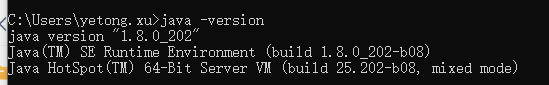
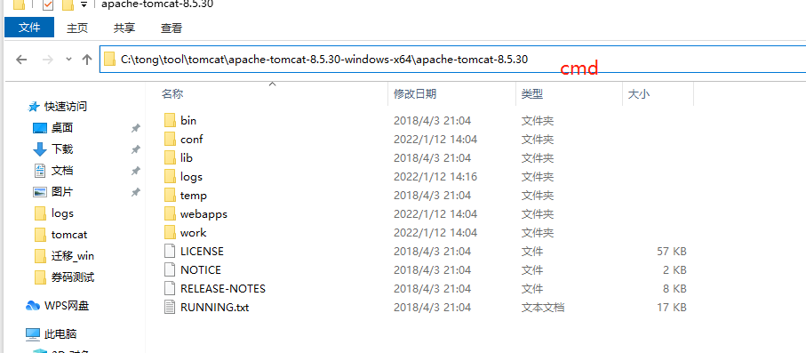
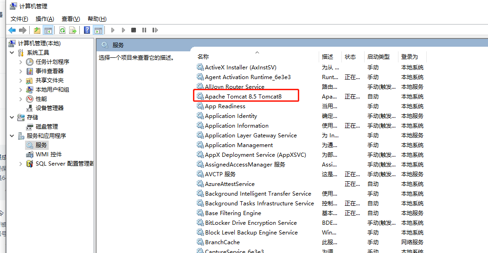
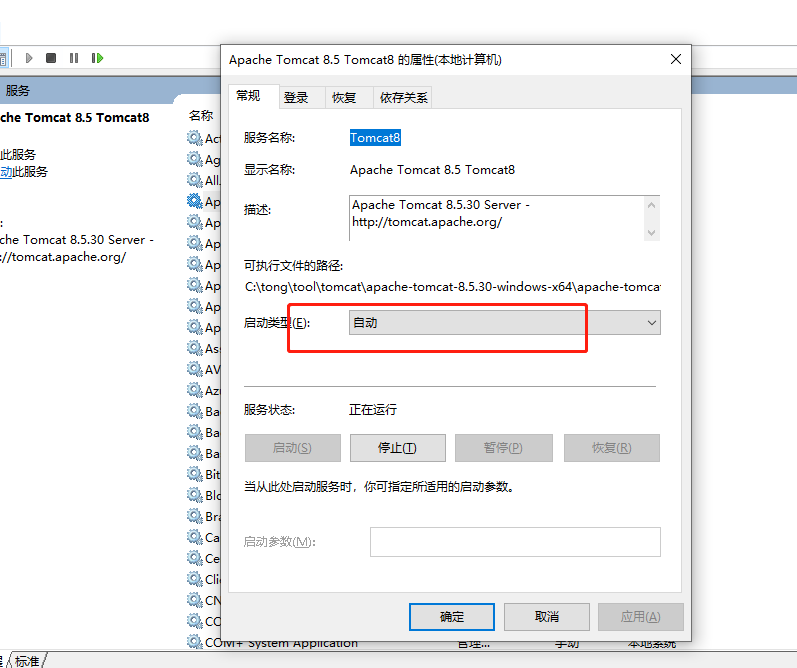
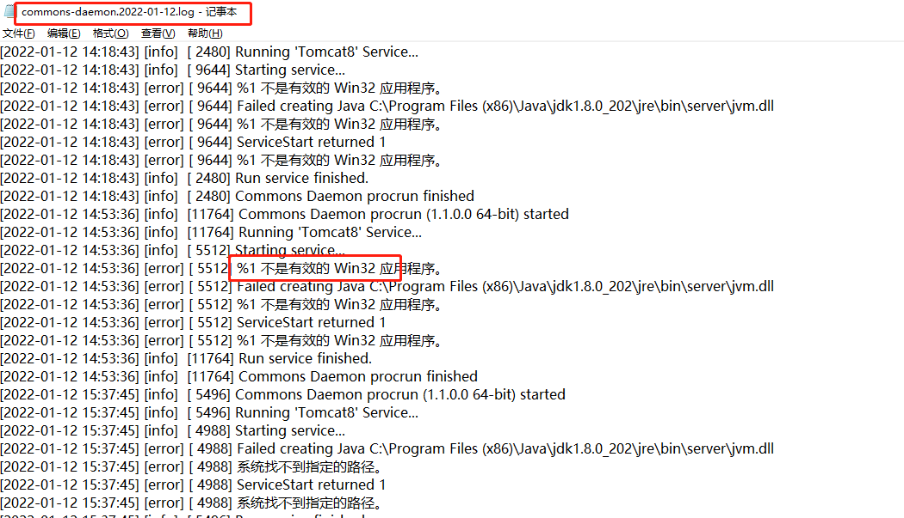

# tomcat

## 基础
### 目录结构
> ```
> - bin
>   |_ startup.sh (或 startup.bat)   // 启动 Tomcat 服务器的脚本
>   |_ shutdown.sh (或 shutdown.bat) // 停止 Tomcat 服务器的脚本
> 
> - conf
>   |_ server.xml                     // 主要配置文件，定义端口、连接器、虚拟主机等
>   |_ web.xml                        // Web 应用程序的部署描述符，定义 Servlet、过滤器等
>   |_ catalina.properties            // Tomcat 的全局属性配置文件
>   |_ context.xml                    // 为特定的 Web 应用程序定义上下文配置
> 
> - lib
>   |_ catalina.jar                   // Tomcat 核心类库
>   |_ servlet-api.jar                // Servlet API 类库
>   |_ jsp-api.jar                    // JSP API 类库
>   |_ 其他库文件
> 
> - logs
>   |_ catalina.out                   // 服务器的标准输出日志
>   |_ catalina.log                   // 主要的 Tomcat 日志文件
>   |_ localhost.log                  // 本地主机上的部署日志
>   |_ 其他日志文件
> 
> - temp
>   |_ 运行时生成的临时文件
>   
> - webapps
>   |_ ROOT                          // 默认的根应用程序目录
>   |_ examples                      // 示例应用程序
>   |_ manager                       // 管理应用程序，用于管理和监控 Tomcat
>   |_ host-manager                  // 虚拟主机管理应用程序
> 
> - work                            // 存放运行时生成的工作文件
> 
>```

### 下载地址
<http://archive.apache.org/dist/tomcat/tomcat-8/v8.5.30/bin/>


## 部署
### tomcat部署成window服务
1、jdk版本要保证是64位，(不是64位没有64-bit)
>

2、tomcat要保证是64位并且是window版本
> 比如apache-tomcat-8.5.30-windows-x64,其他版本没有service.bat\
> cmd进入这个目录，执行
> ```java
> //把tomcat放入window服务
> service.bat install -- 也可以这么写，后面指定服务名 service.bat install tomcat8
> //把tomcat移除window服务
> service.bat uninstall
> ```
> 

3、改成自动，开机就会自动启动了
> 
> 

4、其他
> tomcat下log这个可以查看为啥没启动成功
> 


## 常见问题
### 版本问题
> 请求URL需要对大括号处理,8版本以后tomcat 不支持大括号，7好像不支持 还不确定

### 编码 (todo)
> 1、不同tomcat版本默认编码不一样\
> tomcat 修改编码  URIEncoding="UTF-8"\
> 不同版本存在不生效问题\
> **URIEncoding**：上面的意思是说URL编码如果未被指定，将使用默认（缺省的）ISO-8859-1 编码\
> **useBodyEncodingForURI**：useBodyEncodingForURI默认值是"false",如果修改成"true",那么程序中设置（request设置编码）何种编码方式，URL就以何种编码解码。
> ```java
>     <Connector port="8080"  protocol="HTTP/1.1" connectionTimeout="20000" redirectPort="8443" URIEncoding="UTF-8" useBodyEncodingForURI="false" />
> ```
> 2、后端修改编码低版本支持修改，高版本修改会不生效并且有默认值，用流的方式返回可以设置编码
> 注意：**Servlet 会自动将这里的流关闭**。
> ```java
>     byte[] data = (byte[])downloadResp.getBody();
>     OutputStream stream = response.getOutputStream();
>     response.setContentType("text/plain");break;
>     stream.write(data);
>     stream.flush();
>     stream.close();
> ```

### war包直接放到webapp下面不一定能访问到接口
> 解决方法：\
> 项目在intellij idea里配置tomcat可以启动访问, 打成war包丢到tomcat webapps下能启动却访问不了相关的接口\
> ​    这个问题是因为idea会默认将项目以ROOT为目录的文件\
> ​    而丢到tomcat的webapps下面则是解压成你项目名称为目录的文件，和ROOT是同级的\
> ​    可以有以下几种解决方案\
> ​    一：将你的war名称改成作为ROOT.war\
> ​    二：在tomcat的server.xml文件的Host标签内配置\
> ​    三：用tomcat发布时，将前端请求的路径加上你的项目名称