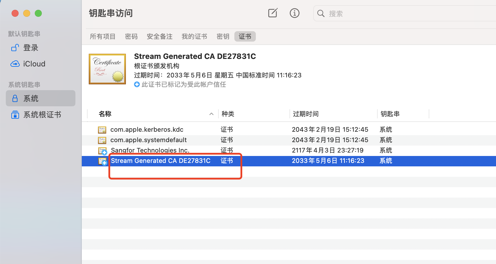
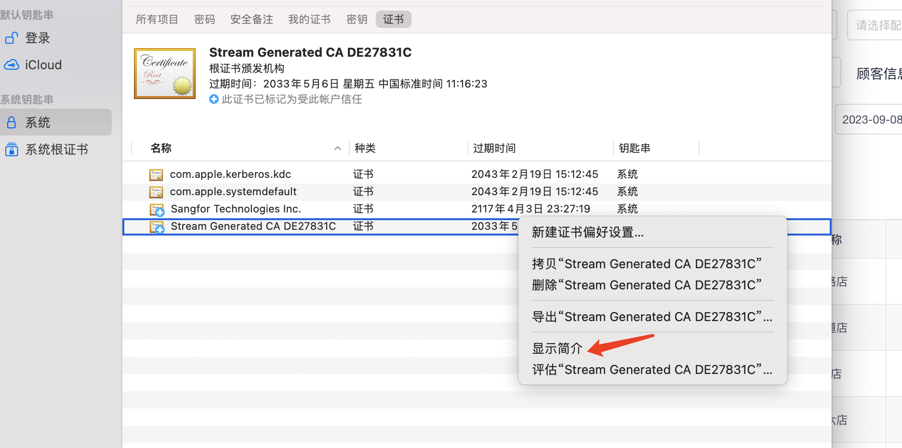
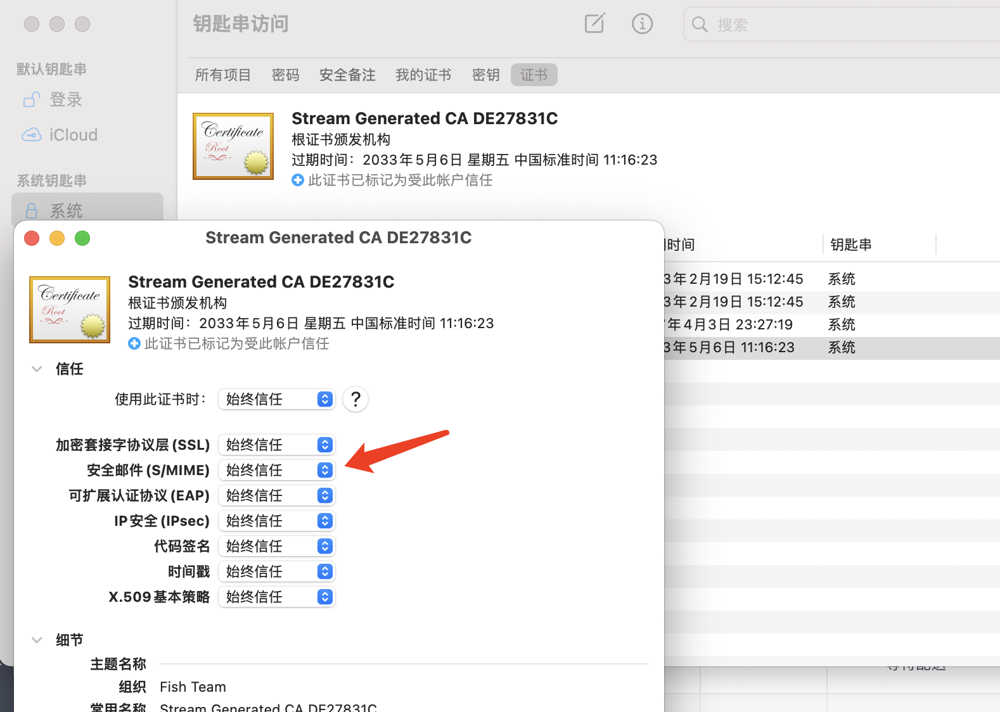
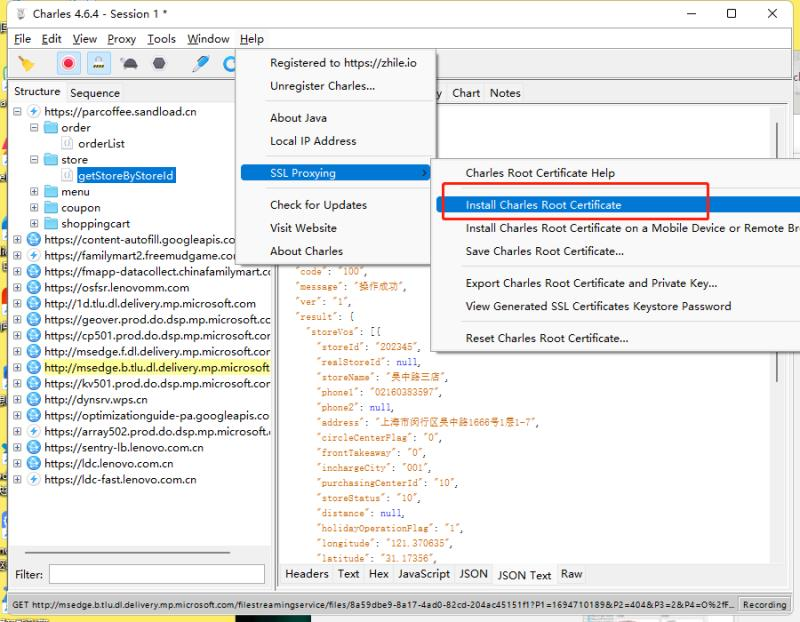
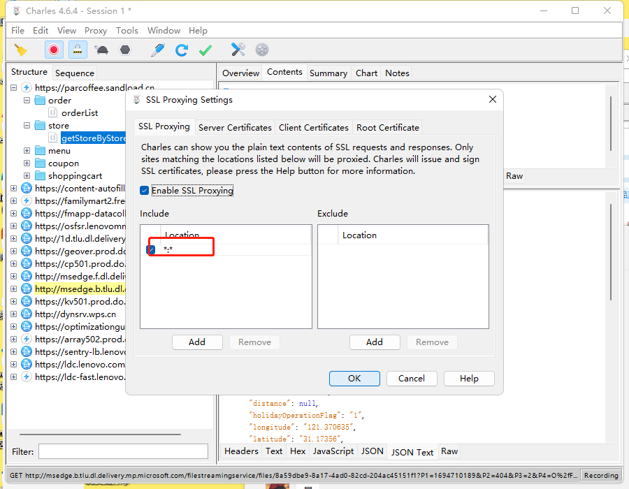
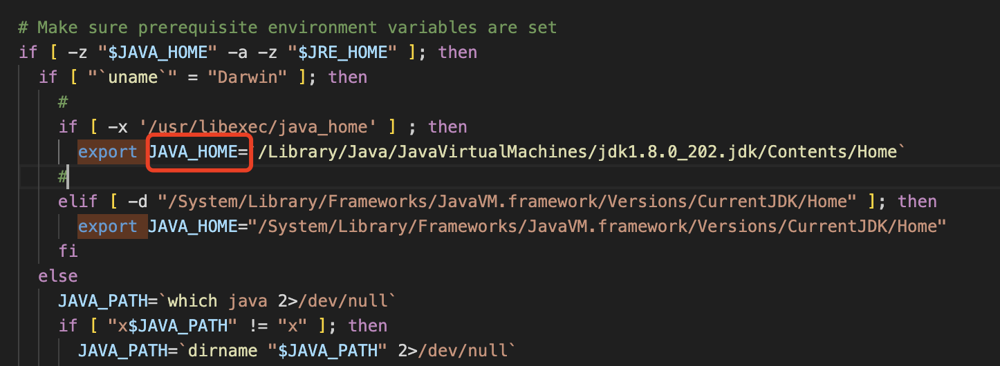

# 工具
## 常用链接
图标 <https://www.iconfont.cn/>

## 抓包
### mac
#### stream
抓https需要信任证书
> 
> 
> 

### window
#### charles
抓https需要信任证书
> 
> 


### whistle
抓包工具


## jmeter
### 基本
#### 配置
执行线程太多内存不足时\
修改bin目录下MaxMetaspaceSize=1024m\
"${HEAP:="-Xms1g -Xmx1g -XX:MaxMetaspaceSize=1024m"}"\
修改jdk地址\
export JAVA_HOME=`/Library/Java/JavaVirtualMachines/jdk1.8.0_202.jdk/Contents/Home`


#### 名词
> HTTP请求默认值
> 
> HTTP信息头管理器
> 
> 线程组
> 
> HTTP请求
> 
> 正则表达式提取器
> 
> 同步定时器
> 
> 常数吞吐量定时器
> 
> if逻辑控制器
> 
> foreach逻辑控制器
> 
> 计数器函数
> 
> 随机数函数
> 
> 时间函数
> 
> 公共参数（线程组公共参数）
> 
> 响应断言
> 
> 大小断言
> 
> 持续时间断言
> 
> beanshell取样器
> 
> 查看结果树
> 
> 聚合报告


### 测试场景

弱压力测试\
半小时内1000个用户访问，平均响应时间3000ms内，错误率0

高并发测试\
100个用户同一时间访问，平均响应时间3000ms内，错误率0

高频率测试\
2个用户20QPS(20次每秒)，持续访问10秒，平均响应时间3000ms内，错误率0

### 常用命令
生成图形化报告命令\
jmeter -n -t 脚本文件 -l 日志文件 -e -o 目录


## Excel
### VLOOKUP公式
=VLOOKUP(B2,[订单金额原始.xlsx]Sheet1!$A$1:$B$14677,2,0)

## 梯子
梯子才能打开的梯子
```
https://tapfog.com/#/register?code=OFg4DNOD
https://tapfog.net/#/register?code=OFg4DNOD

https://govvyy8.xyz，注册后添加推荐码便可长期免费使用：6971061815959617536

```
不用梯子的梯子
```
bitznet 

akkcloud
菜果云

https://xn--4gq62f52gdss.click/#/register?code=AabJ4OHb
```

模糊图片处理清晰
Upscayl


## openAi
https://qihao.tishi.top/?invite=HbmEJZ


## 常用正则表达式

```
匹配A 不匹配B 

^(?!.*B).*A.*
```


